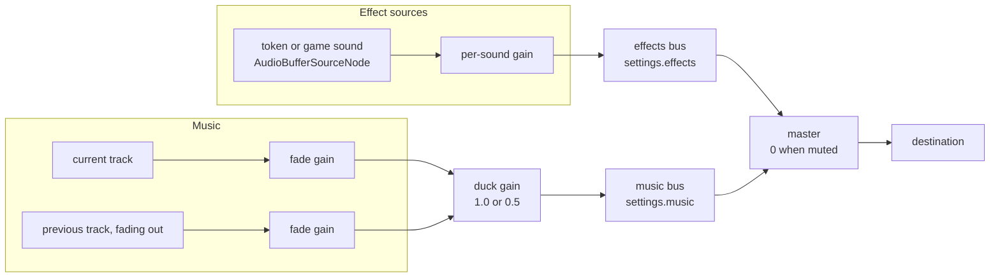
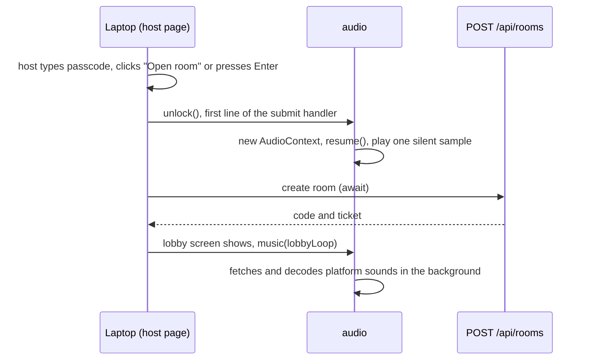

# Audio

This is the design for sound on the TV and haptics on phones: which audio engine the host uses, how games ask for sounds, how music loops, ducks and crossfades, where the browser's autoplay lock gets opened during a game night, what the volume settings store, how phones buzz, and where the platform's CC0 sounds and lobby music come from.

**For the owner.** Read [Decisions at a glance](#decisions-at-a-glance) and [Open questions for the owner](#open-questions-for-the-owner). That takes about 10 minutes.

**For agents.** Everything after the owner sections is binding for CC-7.2 to CC-7.6 and for every game that plays sound. [platform.md](platform.md), [session-flow.md](session-flow.md), [motion.md](motion.md), [security.md](security.md), [platform-screens.md](../design/platform-screens.md), README.md, [TECH_STACK.md](../TECH_STACK.md) and [HOUSE_STYLE.md](../HOUSE_STYLE.md) still apply, and this doc doesn't repeat them. Where this doc, platform.md and a story disagree, stop and flag it. [Conflicts found while writing this doc](#conflicts-with-stories-and-other-docs) lists the ones already known.

Status: draft for owner approval (CC-7.1).

---

## Contents

- [Decisions at a glance](#decisions-at-a-glance)
- [Open questions for the owner](#open-questions-for-the-owner)
- [Words used in this doc](#words-used-in-this-doc)
- [Engine](#engine)
- [Sound tokens and sound banks](#sound-tokens-and-sound-banks)
- [Mixer: buses, volume and ducking](#mixer-buses-volume-and-ducking)
- [Music loops and crossfades](#music-loops-and-crossfades)
- [Unlocking audio: the autoplay rule](#unlocking-audio-the-autoplay-rule)
- [Loading, formats and size](#loading-formats-and-size)
- [Host settings](#host-settings)
- [Phone haptics](#phone-haptics)
- [Wiring the existing games](#wiring-the-existing-games)
- [CC0 sources for platform sounds and lobby music](#cc0-sources-for-platform-sounds-and-lobby-music)
- [Testing](#testing)
- [Conflicts with stories and other docs](#conflicts-with-stories-and-other-docs)
- [Which story builds what](#which-story-builds-what)
- [Sources](#sources)

---

## Decisions at a glance

Approving this doc approves these.

| # | Decision | In plain words |
|---|---|---|
| 1 | Plain Web Audio API, no library | `@couchcade/audio` is about 300 lines over the browser's own `AudioContext`, with no third-party dependencies and an estimated 3 KB gzip. The host platform JS is at 413.1 KB of its 450 KB budget, so 37 KB is left. howler.js would take 8 KB of that and hasn't had a release since September 2023. |
| 2 | Phaser stays silent | Phaser keeps `audio: { noAudio: true }`. The lobby, menu and results are Vue screens, so Phaser's sound manager can't be the one mixer. The page has exactly one `AudioContext`. |
| 3 | Games play tokens and sound refs, never file paths | Platform moments use the six house style tokens: `press`, `ui`, `scene`, `your-turn`, `celebrate`, `foul`. A game declares its own sounds once in `src/host/sounds.ts` and plays them by name. Only that file knows a URL. |
| 4 | Every sound names its visual | Each sound definition has a required `visual` field saying what the TV shows at the same moment. The type won't compile without it. That is how the epic's "every sound has a visual counterpart" is checked. |
| 5 | Three volume controls: mute, music, effects | Stored per laptop in `localStorage`. Mute silences everything at once. |
| 6 | Music ducks to 50% under callouts and stingers | Music drops to half gain in 50 ms when a callout shows or a `celebrate`, `your-turn` or `foul` sound plays, and comes back over 300 ms after the last one ends. `press` and `ui` never duck. |
| 7 | One music track at a time, with an 800 ms crossfade | The lobby loop fades out when a game starts, the game's own loop fades in when its spec says, and the lobby loop comes back on the results screen. Loops are gapless because they play from decoded buffers with exact loop points. |
| 8 | The passcode submit opens the audio lock | Browsers won't play sound until someone clicks or presses a key. The host already clicks "Open room" or presses Enter on the passcode screen, so that handler unlocks audio before anything else. |
| 9 | After a TV refresh, "Click for sound" | A refreshed TV rejoins without the passcode, so nobody has clicked yet. The TV shows a small quiet chip until someone clicks or presses a key on the laptop. The game runs normally meanwhile. |
| 10 | OGG Vorbis only | Every new sound ships as `.ogg`, like most files in the two existing games. Chrome, Edge, Firefox and Safari 18.4 or newer decode it. Older Safari plays no sound, and the game still works because every sound has a visual. |
| 11 | Platform audio budget: 500 KB | All of `apps/host/public/audio/` stays under 500 KB: the six token sounds at 150 KB together at most, and a lobby loop of 16 to 24 seconds at 350 KB at most. |
| 12 | Phones stay silent and buzz on Android only | HOUSE_STYLE already says all sound plays on the TV. `haptic(token)` in `@couchcade/ui/haptics` calls `navigator.vibrate` where it exists. iPhones and Firefox for Android have no Vibration API, so there it does nothing. |
| 13 | Late sounds are dropped, never queued | A sound effect asked for before audio is unlocked, or before its file has loaded, doesn't play later. A DRAW sting a second late is worse than none. Music is the exception: a loop starts as soon as its file is ready. |
| 14 | No music during TV lag calibration | Players tap along to a steady flash. Music at a different tempo would pull them off the beat. |
| 15 | CC0 sounds from Freesound, Kenney and OpenGameArt | A primary and a backup for each of the six tokens, and a 130 BPM chiptune loop from OpenGameArt for the lobby, each with its licence checked on the source page. See [CC0 sources](#cc0-sources-for-platform-sounds-and-lobby-music). |

---

## Open questions for the owner

Each has a recommendation. Approving the doc without comment takes all of them.

1. **Is lobby music on by default?** Recommended: yes, at music 60% and effects 80%. A silent lobby feels broken on a TV, and the first click already unlocked audio. The host can mute it in one click, and the laptop remembers. The other option is music off until the host turns it on, which is quieter for late-night parties but means most hosts never hear it.
2. **Can the VIP change the volume from their phone?** Recommended: no, only on the laptop (a "Sound" button on the TV lobby and the `M` key for mute). The person at the laptop is the one who hears the TV. A phone control adds a protocol message and a way for any VIP to blast the room. The other option is a mute toggle on the VIP's lobby screen.
3. **Is Safari older than 18.4 silent acceptable on the host?** Recommended: yes. The host laptop almost always runs Chrome, because casting to a Chromecast needs it, and Safari 18.4 shipped in March 2025. An AAC copy of every sound would double the audio files each game ships and each sourcing story encodes, for browsers a host rarely uses. The other option is `.m4a` copies next to every `.ogg`.
4. **Does the TV show a "Click for sound" chip after a refresh?** Recommended: yes, a quiet Chalk chip in the bottom-left safe area, gone after the first click or key press. It isn't in the approved screens yet, so CC-7.4 adds it. The other option is staying silent until the next click with no hint, which looks like a bug.

---

## Words used in this doc

| Word | Meaning |
|---|---|
| Token | One of the six house style motion tokens used as a sound name: `press`, `ui`, `scene`, `your-turn`, `celebrate`, `foul`. The platform owns their sounds. |
| Sound bank | A set of sound definitions one owner declares with `defineSounds`: the platform tokens, or one game's sounds. |
| Sound ref | A typed handle to one sound in a bank, such as `quickDrawSounds.refs.drawSting`. Games pass refs to `play`, never URLs. |
| Bus | A gain node that a group of sounds flows through: `music` or `effects`. Both flow into `master`. |
| Ducking | Turning the music bus down while something important plays, then back up. |
| Stinger | A short sound that ducks the music: a callout, `celebrate`, `your-turn`, `foul`, or a game sound marked `duck: true`. |
| Unlock | Starting the page's `AudioContext` inside a click or key press, which browsers require before any sound plays. |
| Cue | A moment a game scene emits for sound, such as Quick Draw's `quick-draw:cue` events. A game's `sounds.ts` turns cues into `play` calls. |
| Haptic | A phone vibration pattern for a token, played with `navigator.vibrate`. |

---

## Engine

### Options compared

The host platform JS measured 413.1 KB gzip of its 450 KB budget on 17 September 2026 (`pnpm budgets` on main after CC-11.4), so there are 37 KB left for everything CC-4 to CC-9 still adds.

| Option | Size (gzip) | Licence and upkeep | Fit | Verdict |
|---|---|---|---|---|
| Plain Web Audio API in `@couchcade/audio` | About 3 KB (estimate, our code only) | Browser standard | Gain nodes give us buses and ducking directly. `AudioBufferSourceNode` has exact `loopStart` and `loopEnd`. Works on Vue screens and Phaser scenes alike. | **Chosen** |
| howler.js 2.2.4 | 7.9 KB core, 9.7 KB with spatial audio (measured from the npm build) | MIT. Last release 2.2.4 on 19 September 2023. Since then the repository only had README and backers edits, and has 417 open issues and pull requests. | Wraps Web Audio with an HTML5 Audio fallback we don't need, since every host browser has Web Audio. It has per-sound volume and fades but no buses, so ducking means fading every music sound by hand. | Rejected: pays 8 KB for a fallback we don't use, and isn't actively maintained |
| Phaser 4 sound manager | 0 KB extra (already in the Phaser chunk) | MIT, maintained | Lives inside the Phaser game, while the lobby, menu and results are Vue. `@couchcade/audio` is a core package and may not import `phaser` (platform.md import rule 1). | Rejected: wrong layer. Phaser keeps `noAudio: true`. |
| Tone.js 15.1.22 | 79 KB (measured from the npm build) | MIT, maintained | A music synthesis framework. We only play files. | Rejected: more than double the remaining budget |
| `<audio>` elements | 0 KB | Browser standard | Looping an `<audio>` element leaves an audible gap in most browsers, it can't mix buses, and each element is unlocked separately. | Rejected for music and effects |

### Rules

1. `@couchcade/audio` (tier 2 core, `packages/audio`) has no third-party dependencies. From the workspace it may import tier 1 and utils only (platform.md import rule 1). `SoundToken` uses the HOUSE_STYLE spelling (`your-turn`), the same as protocol's `CueToken`. Theme's `motion` object spells that key `yourTurn`, so a unit test checks there is exactly one sound token per `motion` key.
2. It creates at most one `AudioContext` per page, with `latencyHint: "interactive"`, and only inside `unlock()`. Importing the package never touches the audio hardware.
3. The package exports a factory, `createAudio({ createContext })`, for tests, and a shared instance, `audio`, that the host app and game scenes import. The TV page has one speaker, so one shared instance is the honest model.
4. Where `AudioContext` doesn't exist, or constructing it throws, `audio.state` is `"unsupported"` and every call is a silent no-op. Sound never throws into game code.
5. `apps/controller` and every `games/*/src/controller/` never import `@couchcade/audio` (platform.md import rule 5 and 7, already enforced by dependency-cruiser).
6. No audio-to-video lag compensation. When the TV speaker plays the sound, sound and picture both carry the TV's lag. When the laptop speaker plays it, sound leads the picture by the display lag, but everyone in the room hears the same speaker, so no player gains from it.

### API (CC-7.2 builds this)

```ts
// packages/audio/src/index.ts
export const soundTokens = ["press", "ui", "scene", "your-turn", "celebrate", "foul"] as const;
export type SoundToken = (typeof soundTokens)[number];

export interface SoundDef {
  src: string;                        // URL from a Vite `?url` import or the app's public folder
  bus: "effects" | "music";
  visual: string;                     // what the TV shows at the same moment, for review and tests
  gain?: number;                      // 0 to 1, default 1, to level a loud file
  duck?: boolean;                     // effects only: this sound is a stinger
  loop?: true | { startS: number; endS: number }; // music, or a looping effect like wind
}

export function defineSounds<const K extends string>(
  owner: string,                      // "platform" or the game id
  defs: Record<K, SoundDef>,
): SoundBank<K>;                      // bank.refs.drawSting is a SoundRef

export interface Audio {
  readonly state: "locked" | "running" | "unsupported";
  onStateChange(listener: (state: Audio["state"]) => void): () => void;

  unlock(): void;                     // call synchronously in a click or keydown handler
  setTokens(bank: SoundBank<SoundToken>): void; // the host app registers the platform files
  load(bank: SoundBank<string>): Promise<void>; // never rejects; a file that fails stays silent
  unload(bank: SoundBank<string>): void;        // stops that bank's sounds and frees its buffers

  play(sound: SoundToken | SoundRef, options?: { gain?: number }): SoundHandle; // handle.stop(fadeMs?)
  music(track: SoundRef | null, options?: { fadeMs?: number }): void;          // null fades to silence
  duck(options?: { holdMs?: number; level?: number }): () => void;             // returns release
  setVolumes(volumes: { muted: boolean; music: number; effects: number }): void;
}

export const audio: Audio;
```

`@couchcade/stage` imports `audio` (kit may import core) so that `Callout.play()` ducks the music for its hold time. Game scenes import `audio` and their own `sounds.ts`.

---

## Sound tokens and sound banks

### Platform tokens

The six tokens come from the HOUSE_STYLE motion table, so a motion and its sound always share a name. CC-7.3 sources one file per token into `apps/host/public/audio/`. CC-7.4 registers them from `apps/host/src/audio/` with `audio.setTokens(defineSounds("platform", { ... }))`, using `import.meta.env.BASE_URL + "audio/<token>.ogg"`.

| Token | Sound (HOUSE_STYLE) | Ducks music | Visual counterpart | Platform uses (CC-7.4) |
|---|---|---|---|---|
| `press` | Wood-block tock | No | The button sinks (`depth-pressed`) | Clicks on laptop buttons, the menu countdown ticks, a VIP card pick |
| `ui` | Soft pop | No | The element bounces in (`ui` motion) | A player joins the lobby, a menu card gets the focus ring |
| `scene` | Whoosh | No | The wipe transition | Every phase change on the TV |
| `your-turn` | Referee whistle | Yes | The active chip lifts 8 px with a Sunny outline, squash and stretch | Games with turns, when the turn changes |
| `celebrate` | Three rising notes and a crowd | Yes | A callout pops in with a 4 px shake (a fade in reduced motion) | The results screen appears, a game's big moment |
| `foul` | Low buzz | Yes | Horizontal wobble and a FOUL! callout | A game's foul |

Rules:

1. No new platform tokens without a HOUSE_STYLE change first. A joining player uses `ui` and a countdown tick uses `press`, not new tokens. CC-7.2 criterion 1 ("every motion token") stays exact.
2. A game plays a token when its moment matches the token's meaning. A game sound that overlaps a token (a game-specific cheer) replaces the token for that moment, never plays on top of it.

### Game sound banks

A game declares its sounds in `games/<id>/src/host/sounds.ts`. That file is the only place URLs appear. It also maps the game's cues to sounds.

```ts
// games/quick-draw/src/host/sounds.ts (shape only, see "Wiring the existing games")
import { audio, defineSounds } from "@couchcade/audio";
import drawSting from "../../assets/sounds/draw-sting.ogg?url";
import windLoop from "../../assets/sounds/wind-loop.ogg?url";
import type { QuickDrawCue } from "./cues.ts";

export const quickDrawSounds = defineSounds("quick-draw", {
  drawSting: { src: drawSting, bus: "effects", duck: true, visual: "DRAW! callout on its first frame" },
  wind: { src: windLoop, bus: "effects", loop: true, gain: 0.6, visual: "Tumbleweed and blowing dust" },
});

export function playCueSound(cue: QuickDrawCue): void {
  if (cue.type === "draw") audio.play(quickDrawSounds.refs.drawSting);
  if (cue.type === "foul") audio.play("foul");
}
```

Rules:

1. The scene subscribes once: `this.events.on(quickDrawCueEvent, playCueSound)`. Scenes never call `play` with a string other than a token. The name is `playCueSound`, not `playCue`, because the controllers' haptics helpers are called `playCue` today (see [Phone haptics](#phone-haptics) rule 8).
2. `?url` imports make Vite hash and emit the files into the game's host chunk assets. Phones never load them, because `src/controller/` can't import `src/host/`.
3. Sound ids inside a bank are camelCase. The bank owner is the game id, so two games' `wind` sounds never collide.
4. The scene starts loading its bank in `create()` with `void audio.load(bank)` and calls `audio.unload(bank)` on its `shutdown` event. The game contract doesn't change, since the runtime never needs to know a game's sounds. Unloading also stops the wind loop if a game ends mid-standoff.

---

## Mixer: buses, volume and ducking



### Volume

1. Settings store volumes as whole steps from 0 to 10. The gain is `(step / 10) ** 2`, so each step sounds about as big as the last one. Step 6 is gain 0.36 and step 8 is 0.64.
2. Mute sets `master` to 0 with a 30 ms ramp. Unmuting restores it. Mute doesn't pause music, so the loop is still in time when the host unmutes.
3. Volume changes ramp over 30 ms, so dragging a slider doesn't click.

### Ducking

1. HOUSE_STYLE says music ducks by 50% during callouts. The duck gain goes to 0.5 (about -6 dB) with `setTargetAtTime` and a 50 ms ramp.
2. Stingers duck automatically for their buffer length. `Callout.play()` in `@couchcade/stage` ducks for the callout's entrance plus its hold. A game can duck by hand for a phase with `const release = audio.duck({ level })`, as Target Range does for "music quieter during `open`".
3. Ducks are counted. The music comes back up only when the last duck is released, over 300 ms.
4. A duck that lasts longer than 10 seconds releases on its own and logs a dev warning, so a forgotten release never leaves the music quiet for the whole night.

### Voices

1. At most 16 effect sounds play at once. A seventeenth is dropped, not queued. Eight Quick Draw pops in a row fit easily.
2. The same sound ref started twice within 30 ms plays once. That stops a skipped frame from doubling a sound. Two Target Range arrows landing on the same frame make one thud, which sounds the same.

---

## Music loops and crossfades

### What a loop file must be

| Rule | Value | Why |
|---|---|---|
| Style | Chiptune, bright, major key | HOUSE_STYLE "Music" |
| Tempo | 110 to 130 BPM, measured (for example with `aubio tempo`) | HOUSE_STYLE "Music" |
| Length | 16 to 24 seconds, cut on bar lines (at 120 BPM that is 8 to 12 bars) | Short enough for the size budget, long enough not to nag. Target Range's 16 s loop at 118.7 BPM is the model. |
| Size | 350 KB or less as OGG Vorbis | [Size budget](#size-budget) |
| Seam | The last sample flows into the first. Cut at the track's own repeat point, as CC-11.5 did. | A clean loop needs no crossfade inside the file. |

### Playback

1. Music plays from a decoded `AudioBuffer` through an `AudioBufferSourceNode` with `loop = true`. That loops without the gap `<audio>` elements leave.
2. A track may set `loop: { startS, endS }` to skip a lead-in or encoder padding at either end. Without it the whole buffer loops.
3. `audio.music(track)` crossfades from the current track over 800 ms with an equal-power curve. The old source stops once its fade ends.
4. `audio.music(sameTrack)` while it's already playing does nothing. `audio.music(null, { fadeMs })` fades to silence.
5. A new track always starts from its beginning.
6. Decoded music is memory, not download size: a 24 s stereo loop at 44.1 kHz takes about 8.5 MB. At most two tracks (the lobby loop and the current game's) are decoded at once.

### What plays when

The platform owns music outside `playing`. The game owns it inside.

| Phase (session-flow.md) | Music | Built by |
|---|---|---|
| `lobby` | Lobby loop | CC-7.4 |
| `menu` | Lobby loop continues | CC-7.4 |
| `calibration` | Fades out over 400 ms, back to the lobby loop when done or skipped | CC-7.4 |
| `motion-check` | Lobby loop continues | CC-7.4 |
| `playing` | The runtime fades the lobby loop out when the scene starts. The game calls `audio.music(itsLoop)` when its spec says, or leaves silence. | CC-7.4, each game's sound wiring |
| `results` | `celebrate` as the screen appears, then the lobby loop fades back in | CC-7.4 |
| Host away (TV reloading) | Nothing, the page is reloading | None |

A deploy disconnects the sockets and the TV reconnects without reloading its page (platform.md decision 17, session-flow.md "Host refresh and deploy recovery" rule 6), so music keeps playing and audio stays unlocked through a deploy.

---

## Unlocking audio: the autoplay rule

### What browsers do

- Chrome creates an `AudioContext` in the `suspended` state until the page has had a user gesture, and `resume()` works after that gesture ([Chrome autoplay policy](https://developer.chrome.com/blog/autoplay)). Chrome can also let a site with a high Media Engagement Index autoplay, but we can't count on that.
- The HTML standard counts `keydown` (except Escape), `mousedown`, mouse `pointerdown`, touch `pointerup` and `touchend` as activation ([HTML standard](https://html.spec.whatwg.org/multipage/interaction.html#activation-triggering-input-event)). Enter in a form and a click on a button both count.
- Safari and Firefox apply the same kind of rule to Web Audio ([MDN autoplay guide](https://developer.mozilla.org/en-US/docs/Web/Media/Guides/Autoplay)). Calling `resume()` inside the event handler, before any `await`, keeps the call inside the gesture in every engine, so we never depend on how long an engine remembers a gesture.
- Phone taps don't count. A tap on a phone is a gesture on the phone's page, not on the TV's.

### Where the gesture happens in a game night



Rules:

1. `PasscodeScreen.vue`'s `submit` calls `audio.unlock()` as its first statement, before `busy` changes and before the `await`. A wrong passcode still unlocks audio. That's harmless.
2. `unlock()` is idempotent and synchronous. It creates the context if needed, calls `resume()` without awaiting it, and starts a one-sample silent buffer, an old WebKit workaround that costs nothing elsewhere.
3. The host app also adds one capturing `pointerdown` and `keydown` listener on `document` that calls `unlock()` while `audio.state` is `locked`. Any click or key press on the laptop then unlocks, including "Check TV lag".
4. **TV refresh.** The host rejoins from `sessionStorage` without the passcode screen (session-flow.md), so the page has no gesture. `audio.state` stays `locked` and the TV shows a quiet Chalk chip "Click for sound" in the bottom-left safe area. It hides the moment `state` becomes `running`. The game runs without sound in the meantime. CC-7.4 builds the chip ([open question 4](#open-questions-for-the-owner)).
5. If the context later reports `suspended` or `interrupted` (Safari does this when another app takes the audio device), `state` goes back to `locked` and the chip shows again.
6. Hiding the tab doesn't suspend audio. A tab cast to a Chromecast is often a background tab, and it must keep playing.

---

## Loading, formats and size

### Format

1. Every new sound file is OGG Vorbis (`.ogg`). WAV is allowed only for files under 100 KB that already ship (`crow-caw.wav` is the exception at 210 KB, see [Conflicts](#conflicts-with-stories-and-other-docs) item 6).
2. Decoding uses `fetch` plus `decodeAudioData`. Same-origin `fetch` is already allowed by the CSP's `connect-src 'self'`, and no `<audio>` element is ever created, so the CSP needs no `media-src`.
3. Safari decodes Ogg Vorbis from version 18.4. Versions 14.1 to 18.3 only decode Vorbis inside WebM ([caniuse](https://caniuse.com/ogg-vorbis)). On those, `load` marks every sound silent, logs one dev warning, and the night goes on without sound ([open question 3](#open-questions-for-the-owner)).

### When files load

1. Platform sounds load right after `unlock()`, in the background. Nothing waits for them. The first `ui` pop of the night may be skipped if a player joins in the first second.
2. A game's bank starts loading when its scene's `create()` runs (see [Game sound banks](#game-sound-banks) rule 4). Nothing waits for it. An effect asked for before its file is decoded is dropped (decision 13), and plays normally from its next `play` call.
3. Music is the one exception to dropping. `audio.music(track)` on a track that isn't decoded yet remembers it and starts it once it is, if it is still the track asked for. A loop that starts a second late sounds fine, while a round with no music at all doesn't.
4. `decodeAudioData` needs an `AudioContext`, and the context only exists after `unlock()`. A bank loaded while audio is still locked (a refreshed TV) fetches its files and decodes them at unlock.
5. A bank's files load in parallel. A file that fails to fetch or decode stays silent and logs one dev warning with its URL.
6. `unload` frees a bank's buffers, so a game played twice in a row fetches its files again. The browser's HTTP cache serves them, and only decoding repeats.

### Size budget

| What | Budget | Today |
|---|---|---|
| `apps/host/public/audio/`, all platform sounds and the lobby loop | 500 KB | Nothing yet (CC-7.3) |
| The six token sounds together | 150 KB. A short one (`press`, `ui`) should stay near 10 KB, which leaves room for the crowd in `celebrate`. | |
| Lobby loop | 350 KB | |
| A game's assets, sprites and sounds together (README) | 1.5 MB | Quick Draw about 520 KB of sound, Target Range about 740 KB |
| `@couchcade/audio` code in the host platform JS | Counted in the 450 KB total | Estimated 3 KB |

CC-7.3 checks the platform folder by hand and records the total in its notes. A size check in `tooling/budgets` for audio folders is a follow-up only if a later story gets close to the limit.

---

## Host settings

CC-7.6 builds these in `apps/host/src/settings/`. CC-7.4 applies them to `audio`.

| Setting | Type | Default | Applies to |
|---|---|---|---|
| `muted` | boolean | `false` | `master` gain |
| `music` | 0 to 10 | 6 | Music bus |
| `effects` | 0 to 10 | 8 | Effects bus |
| `reducedMotion` | boolean | The laptop's `prefers-reduced-motion` | `HostSceneData.reducedMotion` and stage components. It doesn't change sound. |

Rules:

1. One `localStorage` key, `couchcade:host-settings`, holding a JSON object with a `v: 1` field. A missing, unreadable or older value falls back to the defaults. Access is wrapped in `try`, because `localStorage` can throw in private windows.
2. Settings belong to the laptop, not the room. Phones never see or change them ([open question 2](#open-questions-for-the-owner)).
3. The TV lobby has a quiet "Sound" button that opens a settings panel (mute toggle, two sliders, reduced motion toggle). The `M` key toggles mute on any TV screen, except while a text field has focus, so typing a passcode with an "m" in it doesn't mute. Both are laptop controls, so they also unlock audio.
4. There is no reduced-audio preference. No browser exposes a media query for it. Mute and the two volumes cover it. Reduced motion never silences a sound, because sound is how a player who looks away notices a moment.

---

## Phone haptics

CC-7.5 builds `@couchcade/ui/haptics` (`packages/ui/src/haptics/`).

```ts
import type { CueToken } from "@couchcade/protocol"; // "press" | "your-turn" | "celebrate" | "foul"

export const hapticPatterns: Record<CueToken, number | number[]> = {
  press: 10,                     // 10 ms tick
  "your-turn": [40, 40, 40],     // two 40 ms pulses
  celebrate: 120,                // one 120 ms pulse
  foul: [50, 50, 50, 50, 50],    // three short pulses
};

export function canVibrate(): boolean;
export function haptic(token: CueToken): void; // navigator.vibrate(pattern) when it exists, else nothing
```

Rules:

1. `haptic` checks `typeof navigator.vibrate === "function"` and wraps the call in `try`. It never throws and returns nothing, so no caller can branch on whether the phone buzzed.
2. Where it works: Chrome for Android and Samsung Internet. Where it does nothing: Safari on iPhone (every version up to 26.6) and Firefox for Android ([caniuse](https://caniuse.com/vibration)). HOUSE_STYLE already treats haptics as a bonus.
3. `navigator.vibrate` needs sticky user activation ([MDN](https://developer.mozilla.org/en-US/docs/Web/API/Navigator/vibrate)). A phone that joined by tapping "Join" has it. A phone that reloaded and rejoined from `sessionStorage` doesn't buzz until the player taps once. That's accepted.
4. `ui` and `scene` have no haptic, as in HOUSE_STYLE, which is why `CueToken` has only four values.
5. Two triggers only: the `cue` field of a `controller:state` view (played once per new view, as Quick Draw's controller does today) and a local `press` on the big action's `pointerdown`. Games don't call `navigator.vibrate` themselves.
6. No haptics toggle on the phone. Phones in silent or Do Not Disturb mode may not vibrate anyway, and a player who dislikes it can turn vibration off in Android settings.
7. `prefers-reduced-motion` doesn't turn haptics off. A buzz isn't motion on screen.
8. The two game copies (`games/quick-draw/src/controller/haptics.ts` and `games/target-range/src/controller/haptics.ts`, the CC-11.3 follow-up) have the same patterns and each exports `playCue(token)`. They are deleted, their `Controller.vue` files call `haptic` from `@couchcade/ui/haptics` instead, and Quick Draw's `test/controller/haptics.test.ts` moves to `packages/ui`. The package's `./*` export already maps `@couchcade/ui/haptics` to `src/haptics/index.ts`, and `ui` adds `@couchcade/protocol` (tier 1) for `CueToken`. See [Conflicts](#conflicts-with-stories-and-other-docs) item 2.

---

## Wiring the existing games

Both scenes already emit cues, and nothing listens yet ([Conflicts](#conflicts-with-stories-and-other-docs) item 3). These tables, taken from each game's spec and its `CREDITS.md`, are what the wiring stories build in `src/host/sounds.ts`.

### Quick Draw (`quick-draw:cue` from `games/quick-draw/src/host/cues.ts`)

| Cue | Sound | Visual already in the scene |
|---|---|---|
| `round` | `audio.music(loop)` (the loop file is still missing, see item 4) | Round chip lifts, tumbleweed rolls |
| `standoff` | `audio.music(null, { fadeMs: 150 })`, then `wind` (looping effect) | Bottom panel "Wait for it…", blowing dust |
| `fake`, kind `word` | `fakeSting`, `duck: true` | Look-alike callout |
| `fake`, kind `crow` | `crowCaw` | Crow flies in |
| `fake`, kind `glint` | `glintTing` | Popgun sparkle |
| `draw` | Stop `wind`, play `drawSting`, `duck: true` | DRAW! callout on its first frame |
| `foul` | Token `foul` | FOUL! over the Pip |
| `result` | `popgunPop` once per id in `pops`, 120 ms apart, with `dustThud` under the dust puff, then token `celebrate` if `winners` isn't empty | BANG! flags in reaction order, dust puff, winner callout |
| `over` | `roundWin` jingle, then the runtime moves to `results` | Match winner shown |

`intro-tick.ogg` ships but no moment in the spec's Sound row uses it. The wiring story leaves it unplayed, or removes it and its credit line.

### Target Range (`target-range:cue` from `games/target-range/src/host/cues.ts`)

| Cue | Sound | Visual already in the scene |
|---|---|---|
| `round` | `audio.music(gameMusicLoop)` and `roundStart` jingle. From round 2, `wind` (looping effect) too. | Round title in the bottom panel, wind flag |
| `open` | `audio.duck({ level: 0.5 })`, released on `reveal` | Clock appears, bottom panel "Arrow 2 of 3, wind 2 to the right" |
| `draw` | `drawCreak`, at most one playing at a time | Crosshair appears |
| `shoot` | `releaseTwang`, then `arrowWhoosh` | Arrow flies |
| `land` | `arrowThudStraw` when `points` is above 0, else `arrowThudFence` | Arrow stub |
| `tick` | `clockTick` | Clock number for the last 3 seconds |
| `reveal` | Release the duck. `bullseyeDing` and token `celebrate` when `bullseye` is true. | Results under the scoreboard chips, BULLSEYE! callout |
| `roundEnd` | Stop `wind`, music back at full level | Bottom panel "Noor leads with 12" |
| `over` | `matchEnd` jingle, then the runtime moves to `results` | Bottom panel "Noor wins with 30" |

---

## CC0 sources for platform sounds and lobby music

CC-7.3 picks from this shortlist. Every licence below was read on its source page on 17 September 2026: Kenney pack pages say "Creative Commons CC0", Freesound pages link "Creative Commons 0" to the [CC0 1.0 deed](https://creativecommons.org/publicdomain/zero/1.0/), and the OpenGameArt pages list CC0 as their only licence. Lengths, pitch and tempo were measured with `ffprobe` and `aubio` on the downloaded files and Freesound's previews. Nobody has listened to them on a TV yet, so CC-7.3 listens before it commits a file and uses the backup when the primary sounds wrong.

### Rules for CC-7.3

1. CC0 only. Pixabay, Mixkit and Sonniss have their own licences and are never used. A multi-licensed upload is taken under CC0 and credited that way, as Target Range does.
2. Every file is cut, faded, levelled and encoded to OGG Vorbis with `ffmpeg` (the same tools CC-11.5 used), and named `<token>.ogg` or `lobby-loop.ogg`.
3. `celebrate` is two CC0 sources mixed into one file: the three rising notes, then the crowd under the last note. Its credit line names both.
4. Freesound needs a free account to download an original file, and its high-quality OGG preview needs none. Either is the same CC0 work, and a preview is good enough for a sound this short. That costs nothing, so the €0 rule holds.
5. `apps/host/CREDITS.md` gets one row per file with author, source URL and licence ([Conflicts](#conflicts-with-stories-and-other-docs) item 1).

### Token sounds

| Token | Primary | Backup | Notes |
|---|---|---|---|
| `press` (wood-block tock) | [Wood block hit](https://freesound.org/people/thomasjaunism/sounds/218460/), thomasjaunism, [CC0](https://creativecommons.org/publicdomain/zero/1.0/). WAV, 0.28 s. | [wood block.wav](https://freesound.org/people/calaudio/sounds/53403/), calaudio, [CC0](https://creativecommons.org/publicdomain/zero/1.0/). WAV, 0.43 s, trim to 0.2 s. | A real wood block with a sharp attack. Kenney's `impactWood_light_000` is more of a thud. |
| `ui` (soft pop) | [cartoon pop or drip](https://freesound.org/people/AlaskaRobotics/sounds/221091/), AlaskaRobotics, [CC0](https://creativecommons.org/publicdomain/zero/1.0/). WAV, 0.14 s. | [Interface Sounds](https://kenney.nl/assets/interface-sounds) `drop_002.ogg`, Kenney, [CC0](https://kenney.nl/assets/interface-sounds). 6 KB, 0.19 s. | The backup pack already ships in both games. |
| `scene` (whoosh) | [Whoosh](https://freesound.org/people/qubodup/sounds/60013/), qubodup, [CC0](https://creativecommons.org/publicdomain/zero/1.0/). FLAC, 0.43 s. | [Transition whoosh sound.wav](https://freesound.org/people/SKsemi/sounds/432922/), SKsemi, [CC0](https://creativecommons.org/publicdomain/zero/1.0/). WAV, 0.49 s. | The primary peaks at 50 ms and is gone by 0.4 s, the length of the `scene` wipe. |
| `your-turn` (referee whistle) | [Referee whistle sound.wav](https://freesound.org/people/Rosa-Orenes256/sounds/538422/), Rosa-Orenes256, [CC0](https://creativecommons.org/publicdomain/zero/1.0/). WAV, 0.54 s. | [Referee whistle blow, gymnasium.wav](https://freesound.org/people/SpliceSound/sounds/218318/), SpliceSound, [CC0](https://creativecommons.org/publicdomain/zero/1.0/). WAV, 3.3 s, cut at 0.7 s with a fade. | One dry blast. Lower its level: a whistle is shrill on TV speakers. |
| `celebrate`, notes | [Digital Audio](https://kenney.nl/assets/digital-audio) `threeTone2.ogg`, Kenney, [CC0](https://kenney.nl/assets/digital-audio). Keep the first run, 0 to 0.4 s. | [Triple Ping Notification](https://freesound.org/people/PiesHelpfulOven/sounds/842513/), PiesHelpfulOven, [CC0](https://creativecommons.org/publicdomain/zero/1.0/). WAV, 0.97 s, three rising notes. | The Freesound upload is the closer match, but its description reads as machine-written, so its origin is less certain than Kenney's. |
| `celebrate`, crowd | [Short Crowd Cheer 2.flac](https://freesound.org/people/qubodup/sounds/182572/), qubodup, [CC0](https://creativecommons.org/publicdomain/zero/1.0/). 7.7 s, cut to about 1.5 s with a fade. | [Crowd.Yay.Applause.25ppl.Short.wav](https://freesound.org/people/jessepash/sounds/139972/), jessepash, [CC0](https://creativecommons.org/publicdomain/zero/1.0/). 7.4 s. | Both are loud from the start, so a short cut still sounds like a crowd. |
| `foul` (low buzz) | [Wrong Buzzer](https://freesound.org/people/KevinVG207/sounds/331912/), KevinVG207, [CC0](https://creativecommons.org/publicdomain/zero/1.0/). WAV, 0.49 s, about 100 Hz falling to 70 Hz. | [buzzer.wav](https://freesound.org/people/hypocore/sounds/164090/), hypocore, [CC0](https://creativecommons.org/publicdomain/zero/1.0/). WAV, 1.5 s at about 159 Hz, trim to 0.5 s. | The primary is mastered very loud and needs its level lowered. Laptop speakers barely play 70 Hz, so check it on the laptop too. |

### Lobby loop

| | Track | Measured | Cut |
|---|---|---|---|
| Primary | "Adventure Begins Loop" (`03 HoliznaCC0 - Adventure Begins Loop.ogg`) from [Happy Chiptunes (Collection)](https://opengameart.org/content/happy-chiptunes-collection), Holizna, [CC0](https://creativecommons.org/publicdomain/zero/1.0/) | 130 BPM, major, 59 s, made to loop | 12 bars, 22.1 s, about 265 to 310 KB |
| Backup | [Welcome to the Item Shop](https://opengameart.org/content/welcome-to-the-item-shop), congusbongus, [CC0](https://creativecommons.org/publicdomain/zero/1.0/) | 115 BPM, major, 127 s, not labelled as a loop | 8 bars, 16.7 s, about 200 to 270 KB, bars picked by ear |

The primary is tuned about a quarter tone away from A440. That doesn't matter on its own, since nothing plays in tune with the lobby loop. Both differ from the games' loops: Target Range uses Summer Park (Scribe) and Quick Draw's shortlist has Chiploop (iamoneabe).

### Rejected

- Pop 01 (LilMati, Freesound): CC0, but its page says it's made from another user's sound, so its origin is unclear.
- Swishes Sound Pack (artisticdude, OpenGameArt): CC0, but every swish is 0.2 s or shorter, too short for a 400 ms wipe.
- CC0 OpenGameArt loops that miss the music rules: Sunny Day and Invincibility (Zane Little Music, 105 and 150 BPM), Head in the Sand (congusbongus, 150 BPM), Simple Gameboy Music (Trinity Paradox, minor key), SubspaceAudio's 12 Music Loops (140 to 180 BPM, action style).

---

## Testing

1. **`@couchcade/audio` unit tests (CC-7.2).** `createAudio` takes a fake `AudioContext` that records gain ramps, source starts, stops and loop points. Tests cover: every token plays after `setTokens`; `play` before `unlock` or before load is dropped; `music` on a track still loading starts once it decodes, unless another track was asked for meanwhile; a stinger sets the duck gain to 0.5 and two overlapping ducks release only after the second; mute sets `master` to 0; `music` crossfades and ignores the same track; `unsupported` when there is no `AudioContext`; a failed decode stays silent.
2. **Type test.** A `SoundDef` without `visual` doesn't compile (`// @ts-expect-error` in a test file).
3. **Host tests (CC-7.4).** `PasscodeScreen` calls `unlock` before its `openRoom` promise starts. The "Click for sound" chip shows for `locked` and hides for `running`. The phase-to-music table above, with a fake `audio`.
4. **Settings tests (CC-7.6).** Defaults, a corrupt `localStorage` value, a throwing `localStorage`, and round-tripping all four settings.
5. **Haptics tests (CC-7.5).** Each token's pattern, the missing `navigator.vibrate` path, and a throwing `navigator.vibrate`. The Quick Draw tests already show the shape.
6. **E2E.** Playwright's Chromium has Web Audio, but nothing asserts on sound. The E2E tests only check that no console error appears with audio enabled.
7. **Manual check.** Before CC-7.4 is Done, play one Quick Draw round on the laptop with HDMI to a TV and listen for the crossfade, the duck under DRAW! and a clean lobby loop seam.

---

## Conflicts with stories and other docs

Found while writing this doc. None changes a decision the owner already approved.

| # | Where | Conflict | Resolution in this doc | Action |
|---|---|---|---|---|
| 1 | CC-7.3 criterion 2 | "`apps/host/CREDITS.md` ... passes the credits check", but `tooling/assets/src/credits.ts` only reads `games/*/CREDITS.md` | The credits check also validates `apps/*/CREDITS.md`. Platform entries are collected into a "Platform" section of `docs/CREDITS.md`. | Add `tooling/assets/src/` and `docs/CREDITS.md` to CC-7.3's References with `backlog-plan` amend mode |
| 2 | CC-7.5 References | Only `packages/ui/src/haptics/`, but two games carry copies of the haptics code (CC-11.3 follow-up) | [Phone haptics](#phone-haptics) rule 8: delete the copies and import from `@couchcade/ui/haptics` | Add both `games/*/src/controller/haptics.ts` files, their tests and the two `Controller.vue` files to CC-7.5, or a small follow-up story after it |
| 3 | CC-10 and CC-11 | No story plays Quick Draw's or Target Range's sounds. CC-10.5 and CC-11.5 added files only, and the CC-10.4 and CC-11.4 scenes emit cues that nothing hears. | [Wiring the existing games](#wiring-the-existing-games) gives the mapping | New stories "Wire Quick Draw sounds" (after CC-7.2) and "Wire Target Range sounds" (after CC-7.2; its scene, CC-11.4, is merged), each owning `games/<id>/src/host/sounds.ts` and the scene's subscription |
| 4 | Quick Draw spec, "Music loop in `intro` and `result`" | CC-10.5 left the loop out: Chiploop is a 2-minute file with no trimming tool at hand. CC-11.5 later installed `ffmpeg` and `aubio`. | Same rules as any loop: 16 to 24 s, 110 to 130 BPM, 350 KB at most | The Quick Draw wiring story trims Chiploop or picks another CC0 loop and credits it |
| 5 | CC-7.4 criterion 2 and CC-7.6 criterion 1 | CC-7.4 says "muting via settings", but CC-7.6's settings list only music volume, effects volume and reduced motion | [Host settings](#host-settings) adds `muted` | Add "muted" to CC-7.6 criterion 1 |
| 6 | Game asset format | `crow-caw.wav` (210 KB), `release-twang.wav` (97 KB) and `arrow-whoosh.wav` (66 KB) ship as WAV | Allowed, since they decode everywhere. New files are OGG. | The Quick Draw wiring story may re-encode `crow-caw.wav` to OGG and update its credit line |
| 7 | CC-7.2 criterion 2 | "Music ducks by 50% during callouts" needs `Callout` in `@couchcade/stage` to call `audio.duck`, outside CC-7.2's References | `Callout.play()` ducks for its entrance plus hold | Add `packages/stage/src/callout/` to CC-7.2's References |
| 8 | CC-7.4 References | Unlocking needs one line in `apps/host/src/screens/passcode/PasscodeScreen.vue`, the chip needs a spot on the TV screens, and the runtime fade needs `apps/host/src/runtime/stage.ts` | [Unlocking audio](#unlocking-audio-the-autoplay-rule) rules 1 to 4 | Add those paths to CC-7.4. The chip isn't in the approved screens ([open question 4](#open-questions-for-the-owner)). |
| 9 | CC-7.6 | No approved design for the settings panel | Reuse the approved panel, quiet button and toggle styles from `@couchcade/ui` | CC-7.6 shows a screenshot in its PR for a one-line owner OK |
| 10 | Epic CC-7 description | "chiptune loops mapped to the house style motion tokens" | Effects map to the motion tokens. Music loops map to phases and games, not tokens. | None. This doc is the reading. |

---

## Which story builds what

| Area | Story |
|---|---|
| This doc and the source shortlist | CC-7.1 |
| `@couchcade/audio`: engine, tokens, banks, mixer, ducking, music, unlock | CC-7.2 |
| Platform token files, lobby loop, `apps/host/CREDITS.md` | CC-7.3 |
| Host wiring: token registration, passcode unlock, "Click for sound" chip, phase music, `Callout` duck hookup if not in CC-7.2 | CC-7.4 |
| `@couchcade/ui/haptics` and removing the game copies | CC-7.5 |
| Host settings: mute, volumes, reduced motion, `M` key | CC-7.6 |
| Quick Draw and Target Range sound wiring, Quick Draw loop | New stories ([Conflicts](#conflicts-with-stories-and-other-docs) items 3 and 4) |
| Every later game's sounds | That game's art and sounds story (`CC-<n>.5`) sources files, and its scene story plays them through `sounds.ts` |

---

## Sources

Checked on 17 September 2026.

- Chrome autoplay policy, Web Audio section: https://developer.chrome.com/blog/autoplay
- MDN autoplay guide for media and Web Audio: https://developer.mozilla.org/en-US/docs/Web/Media/Guides/Autoplay
- HTML standard, activation-triggering input events: https://html.spec.whatwg.org/multipage/interaction.html#activation-triggering-input-event
- MDN `AudioBufferSourceNode.loopEnd`: https://developer.mozilla.org/en-US/docs/Web/API/AudioBufferSourceNode/loopEnd
- caniuse, Ogg Vorbis (Safari notes): https://caniuse.com/ogg-vorbis
- caniuse, Vibration API: https://caniuse.com/vibration
- MDN `Navigator.vibrate` (sticky activation): https://developer.mozilla.org/en-US/docs/Web/API/Navigator/vibrate
- howler.js repository (licence, releases, issues): https://github.com/goldfire/howler.js
- howler.js 2.2.4 build measured from https://cdn.jsdelivr.net/npm/howler@2.2.4/dist/howler.core.min.js
- Tone.js 15.1.22 build measured from https://cdn.jsdelivr.net/npm/tone@15.1.22/build/Tone.js
- CC0 1.0 deed: https://creativecommons.org/publicdomain/zero/1.0/
- Each CC0 sound and loop source page is linked in [CC0 sources](#cc0-sources-for-platform-sounds-and-lobby-music).
