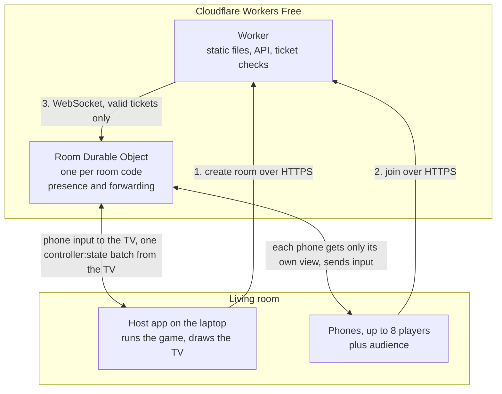
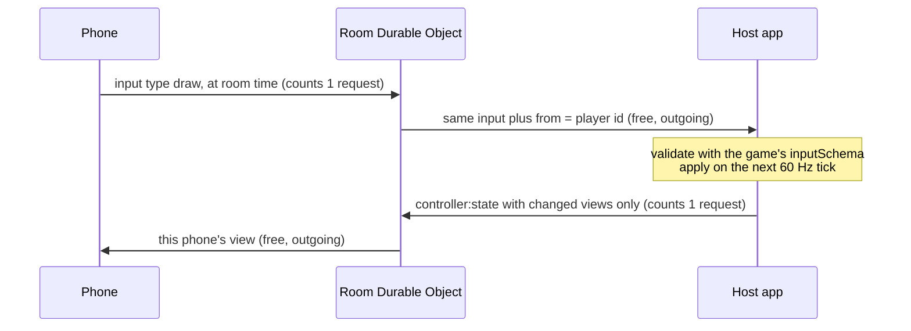
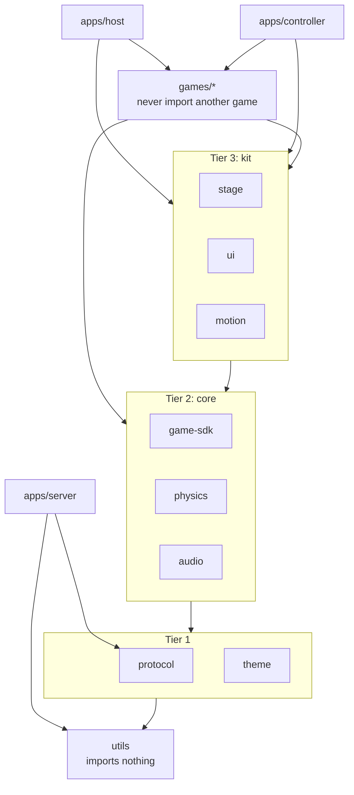
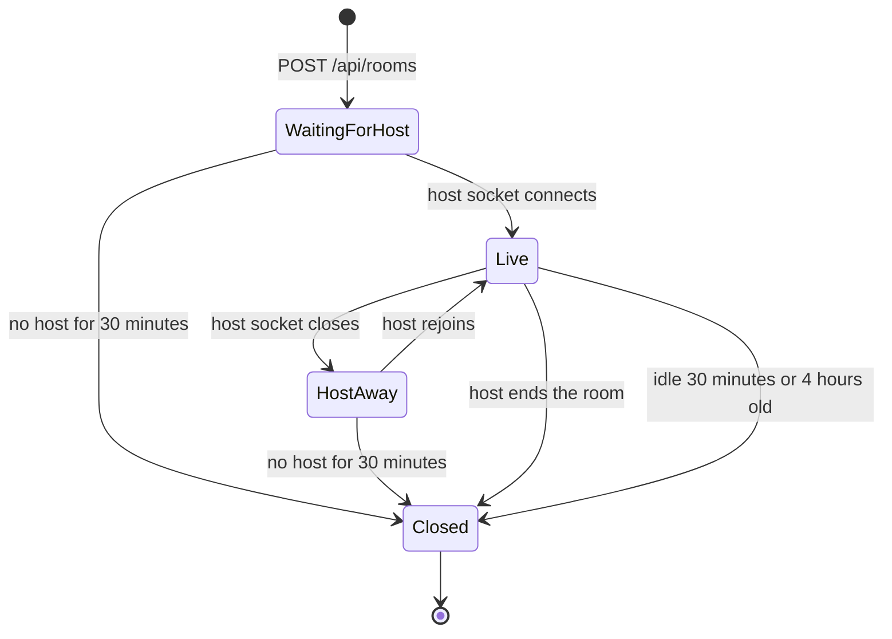
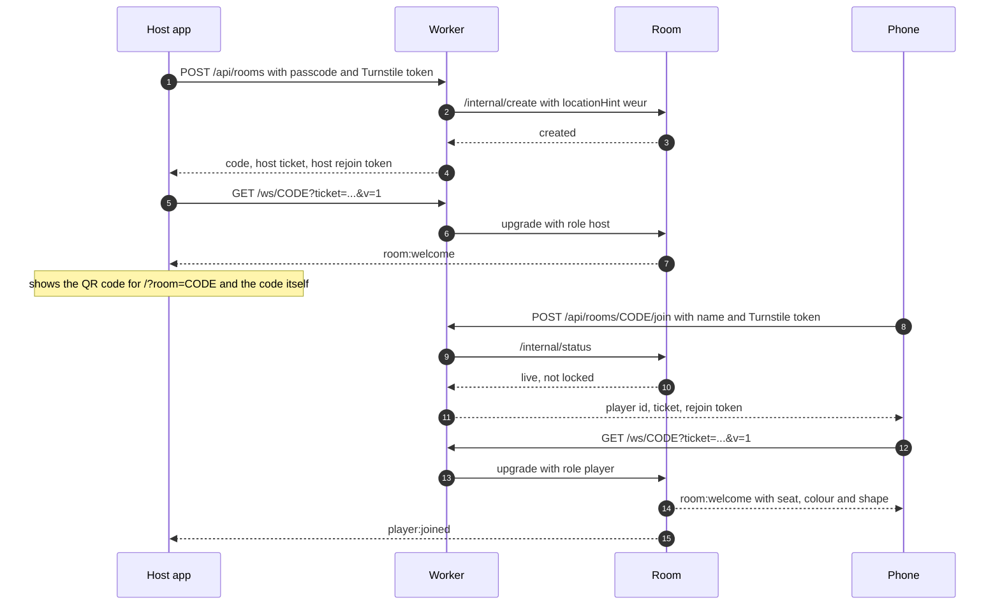
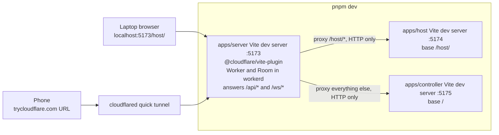
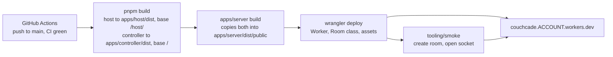

# Platform architecture

This is the design every platform and game story builds on. It covers how the TV, the phones and Cloudflare talk to each other, which package owns what, what a game has to provide, and the rules that keep Couchcade at €0.

**For the owner.** Read [Decisions at a glance](#decisions-at-a-glance) and [Open decisions for the owner](#open-decisions-for-the-owner). That is about 15 minutes. Everything after that is the detail the stories build against.

**For agents.** The sections after the open decisions are binding. Where this doc and a story disagree, stop and flag it. README.md, [TECH_STACK.md](../TECH_STACK.md) and [HOUSE_STYLE.md](../HOUSE_STYLE.md) still apply. This doc adds detail and doesn't repeat them.

Status: draft for owner approval (CC-1.1). Written 16 September 2026.

---

## Contents

- [Decisions at a glance](#decisions-at-a-glance)
- [Open decisions for the owner](#open-decisions-for-the-owner)
- [Words used in this doc](#words-used-in-this-doc)
- [How traffic flows](#how-traffic-flows)
- [Package map and dependency direction](#package-map-and-dependency-direction)
- [Relay: the Worker and the Room Durable Object](#relay-the-worker-and-the-room-durable-object)
- [Protocol: envelope and message catalogue](#protocol-envelope-and-message-catalogue)
- [Room lifecycle and join flow](#room-lifecycle-and-join-flow)
- [Game contract and auto-discovery registry](#game-contract-and-auto-discovery-registry)
- [Clock sync](#clock-sync)
- [Local development and deploy topology](#local-development-and-deploy-topology)
- [Free-tier budget rules](#free-tier-budget-rules)
- [Repo conventions](#repo-conventions)
- [Which story builds what](#which-story-builds-what)

---

## Decisions at a glance

These are settled by the README, TECH_STACK, the CC-1.3 spike or this doc. Approving the doc approves them.

| # | Decision | In plain words |
|---|---|---|
| 1 | The host screen runs the game | All rules, physics and scoring run in the laptop browser that drives the TV. Cloudflare only passes messages along. |
| 2 | One Durable Object per room | Each 4-letter room code gets its own small server on Cloudflare. It knows who is connected and forwards messages. It knows nothing about games. |
| 3 | Phones are thin controllers | The host tells each phone what to show. The phone sends back what the player did. Phones never talk to each other. |
| 4 | One Worker serves everything | The same Cloudflare Worker serves the phone app at `/`, the TV app at `/host/`, the API at `/api/` and the sockets at `/ws/`. One origin, one deploy. |
| 5 | Create rooms with a passcode, join freely | Only someone with the host passcode can open a room. Players scan a QR code or type the code, pick a name and play. No accounts. |
| 6 | Short signed tickets for every socket | The API hands out a ticket that is valid for 60 seconds and only for one room and one role. The Worker checks it before the room is ever called. |
| 7 | Rejoin as the same player | A phone that locks its screen or loses Wi-Fi gets its seat, colour and score back if it returns within 2 minutes. A refreshed TV recovers from the last round snapshot. |
| 8 | JSON messages, 1 KB max | Every message is a small JSON object with a type and a payload, checked against a schema on both ends. |
| 9 | Games plug in by folder | A game is a package in `games/<id>`. The host and phone apps find it on their own. Nobody edits a central list. |
| 10 | Game rules are pure functions | Same players, same seed and same inputs always give the same result. That makes games testable, replayable and recoverable. |
| 11 | Layered packages, checked in CI | Code only imports "downwards" (apps, then games, then shared packages, then `utils`). A CI check fails the build otherwise. |
| 12 | Local dev uses the Cloudflare Vite plugin | Decided by spike CC-1.3: the real Worker and room run inside the Vite dev server. No second server process. |
| 13 | Deploy from GitHub Actions on merge | Every merge to `main` builds, deploys to `workers.dev` and runs a smoke test that creates a room. |
| 14 | Plan for the worst case on the free tier | Until CC-1.4 measures it, we assume every incoming message costs one of the 100,000 daily Durable Object requests. The budget section shows how long a game night lasts under that assumption. |

---

## Open decisions for the owner

These are real choices the docs and stories leave open. Each has a recommendation. The rest of this doc is written as if the recommendation is accepted. Changing one only changes the sections it names.

### 1. Which clock is "host time"?

Timing games (Quick Draw, Strike Night, Dinger Derby) compare when each player tapped. Phones and the TV need one shared clock for that.

| Option | How it works | Cost per sync sample | Accuracy |
|---|---|---|---|
| **A. Room clock (recommended)** | The room on Cloudflare answers clock pings with its own time. The TV and every phone sync to that same clock. | 1 request | Best: one network hop per sample |
| B. TV clock | Phones ping the TV through the room, the TV answers. | 2 requests | Worse: two hops add jitter |

Recommendation: **A**. Half the cost and more accurate. Games never notice the difference, because the SDK converts everything to game time for them. Affects [Clock sync](#clock-sync) and the `clock:*` messages.

### 2. What happens when someone joins while a game is running?

Stories cover the 9th player (audience) but not a 3rd player arriving in the middle of a 2-player game.

| Option | What the new player sees |
|---|---|
| **A. Take a seat, play from the next game (recommended)** | They get their colour and Pip straight away and wait on a "Next game soon" screen. The running game is untouched. |
| B. Watch until the next game | They join as audience and are moved to a seat between games. |
| C. Joining is closed during games | The phone says "A game is running. Try again in a minute." |

Recommendation: **A**. It feels friendliest at a party and needs no extra relay logic. The TV lobby can show them right away. Affects [Room lifecycle](#room-lifecycle-and-join-flow) and CC-3.1.

### 3. Deploys during a game night

Agent PRs merge on their own, and every merge deploys. A deploy disconnects every open socket. Phones and the TV reconnect and the room restores from the last round snapshot, but the current round is lost.

| Option | Effect |
|---|---|
| **A. Deploy freeze switch (recommended)** | A GitHub repository variable `DEPLOY_FREEZE`. When it is `true`, merges still land but the deploy job skips. You flip it before a game night and back afterwards. |
| B. Deploy on every merge, no switch | Simplest. A merge at 21:00 on a Saturday interrupts the round in progress. |
| C. Deploy once a day at a fixed time | No interruptions at night, but a fix takes up to a day to go live and the epic's "merges deploy automatically" becomes "merges deploy daily". |

Recommendation: **A**. Costs nothing, keeps automatic deploys, and puts you in control on game nights. Affects CC-1.18.

---

## Words used in this doc

| Word | Meaning |
|---|---|
| Host | The TV app (`apps/host`), running in a laptop browser shown on the TV. |
| Phone, controller | The phone app (`apps/controller`). "Controller" also means a game's phone UI. |
| Relay | The Worker plus the Room Durable Object (`apps/server`). |
| Room | One Room Durable Object, named by its 4-letter code. |
| Player | A phone with a seat (slot 0 to 7, one colour and shape each). |
| Audience | A phone without a seat, the 9th joiner and later. |
| VIP | The connected player who joined first. Picks games and starts them. |
| Ticket | A signed token, valid 60 seconds, that allows one WebSocket connection. |
| Rejoin token | A signed token kept in `sessionStorage` that swaps for a fresh ticket after a disconnect. |
| Room time | The room's clock, in milliseconds since the Unix epoch. All devices sync to it. |
| Game time | Milliseconds since the current game started, counted in fixed ticks by the host. Game rules only see game time. |
| Request | One unit of the Durable Object free budget of 100,000 per day. |

---

## How traffic flows

Both the TV and the phones connect outwards to Cloudflare. Nothing connects to the laptop or to a phone, so any network works, including a phone on 4G.



One tap, end to end:



What costs budget is a message arriving at the room. What leaves the room is free. That asymmetry shapes most of the [budget rules](#free-tier-budget-rules).

---

## Package map and dependency direction

### Packages

| Package | Folder | Tier | Owns | Built by |
|---|---|---|---|---|
| `@couchcade/utils` | `packages/utils` | 0 base | Room codes, seeded RNG, math, easing, timing, name normalisation, Pip part ranges and `randomPip` | CC-1.7, CC-2.4, CC-6.2 |
| `@couchcade/protocol` | `packages/protocol` | 1 | Envelope, every message schema, API request and response schemas, `encode`/`decode` with the 1 KB cap, close codes, `PlayerInfo` and `PipProfile` types | CC-1.8 |
| `@couchcade/theme` | `packages/theme` | 1 | Design tokens, CSS variables, Phaser colours, scene palettes, fonts | CC-4.2, CC-4.3 |
| `@couchcade/game-sdk` | `packages/game-sdk` | 2 core | Game contract, `defineGame`, registry, clock sync, input batching, rewind, party engine, `testing/` kit | CC-1.13, CC-1.14, CC-3.6, CC-3.7, CC-8.2 |
| `@couchcade/physics` | `packages/physics` | 2 core | Fixed-step Planck.js wrapper | CC-3.9 |
| `@couchcade/audio` | `packages/audio` | 2 core | Sound tokens, music loops, ducking | CC-7.2 |
| `@couchcade/stage` | `packages/stage` | 3 kit | `StageScene`, scoreboard, callouts, room code panel, World Pips, object pools (Phaser, TV only) | CC-4.6, CC-6.4 |
| `@couchcade/ui` | `packages/ui` | 3 kit | Vue components, touch controls (nipplejs), Interface Pips, haptics (phone and menus) | CC-4.4, CC-4.5, CC-6.3, CC-7.5 |
| `@couchcade/motion` | `packages/motion` | 3 kit | Sensor adapter, permission flow, calibration, gestures, touch fallbacks | CC-5.x |
| `@couchcade/config` | `packages/config` | tooling | tsconfig bases and Vite/Vitest presets. Imported only by config files, never by `src/`. | CC-1.5 |
| `@couchcade/game-<id>` | `games/<id>` | games | One game each | CC-10 to CC-23 |
| `@couchcade/host` | `apps/host` | apps | TV app: passcode, lobby, menu, results, calibration, game runtime | CC-1.11, CC-1.15, CC-3.x, CC-4.7 |
| `@couchcade/controller` | `apps/controller` | apps | Phone app: join, lobby, game controller runtime, motion permission | CC-1.12, CC-1.16, CC-3.x, CC-4.8 |
| `@couchcade/server` | `apps/server` | apps | Worker, Room Durable Object, API, security | CC-1.9, CC-1.10, CC-2.x |

`tooling/*` (check-style, check-deps, budgets, assets, smoke, create-game) and `e2e/` may import packages. Nothing imports them.

### Dependency direction

An arrow means "may import". Imports may skip tiers downwards. They never point up, and packages in the same tier never import each other.



This refines the README line `apps → games → stage / ui / game-sdk / motion → theme / protocol → utils` and the CC-1.19 rule set, which puts audio and physics in the same middle band. The split into core and kit answers two questions the stories raise:

- `motion` sends aim and tilt through the batching helper in `game-sdk` (CC-5.5, CC-5.7). Kit may import core, so that's allowed.
- `stage` needs game-sdk types and `audio` for callouts. Also kit to core.

### Import rules

dependency-cruiser enforces all of these in `pnpm check:deps` (CC-1.19).

1. The tiers above. `utils` has no dependencies at all, not even npm packages.
2. Games never import other games. Anything two games need moves into a package.
3. Nothing imports from `apps/*`, `tooling/*` or `e2e/`.
4. `apps/server` imports only `protocol`, `utils` and its own npm dependencies. The relay never sees game code, `game-sdk`, `theme` or UI.
5. `apps/controller` never imports `phaser`, `stage`, `physics` or `audio`. That keeps the phone bundle within 80 KB.
6. `apps/host` never imports a game's `src/controller/`, and the controller app never imports a game's `src/host/`. Both reach game code only through the game's `src/index.ts` and its lazy loaders.
7. Inside a game:
   - `src/shared/` imports only `utils`, `protocol`, `game-sdk` (types and pure helpers) and `physics`. No `phaser`, `vue`, DOM or timers.
   - `src/host/` may import `shared/`, `stage`, `audio`, `physics`, `theme`, `game-sdk` and `phaser`. Never `vue`, `ui` or `motion`.
   - `src/controller/` may import `shared/`, `ui`, `motion`, `theme`, `game-sdk` and `vue`. Never `phaser`, `stage`, `audio` or `physics`.
   - `src/index.ts` imports only `shared/` and `game-sdk`. It reaches `host/` and `controller/` only through dynamic `import()`.
8. The registry glob lives in the apps, not in `game-sdk`. A package can't reach up into `games/`. See [Registry](#auto-discovery-registry).

---

## Relay: the Worker and the Room Durable Object

`apps/server` is one Worker with one Durable Object class, `Room`, built on partyserver 0.5.x. Its job is small on purpose: check who may connect, keep track of who is in the room, and forward messages. It never runs game rules.

### Layout

```
apps/server/
├── wrangler.jsonc         # Worker, assets, Room binding, rate limit bindings, observability
├── src/worker.ts          # Routing: /api/*, /ws/:code, everything else is static assets
├── src/api/               # POST /api/rooms, /join, /rejoin (CC-1.10)
├── src/room/room.ts       # class Room extends Server (CC-1.9)
├── src/room/*.ts          # flood.ts, moderation.ts, reconnect.ts, snapshot.ts, audience.ts
├── src/security/          # tickets.ts, turnstile.ts, rate-limits.ts, names.ts, headers.ts
└── test/                  # @cloudflare/vitest-plugin tests
```

### Worker routing

| Path | Handler | Reaches the room? |
|---|---|---|
| `POST /api/rooms` | Create a room | Yes, once per attempt |
| `POST /api/rooms/:code/join` | Issue a player ticket | Yes, one status check |
| `POST /api/rooms/:code/rejoin` | Swap a rejoin token for a fresh ticket | No |
| `GET /ws/:code?ticket=…&v=1` | WebSocket upgrade | Yes, if every check passes |
| Anything else | Static assets (controller at `/`, host at `/host/`) | No, and the Worker doesn't run either |

`wrangler.jsonc` sets `assets.run_worker_first` to `["/api/*", "/ws/*"]`, so static file requests never invoke the Worker.

Before a `/ws/:code` upgrade reaches the room, the Worker checks, in this order, and answers with an HTTP error on failure:

1. `Upgrade: websocket` header and `GET`. Else 400.
2. `Origin` equals the request's own origin. Else 403.
3. `v` is a protocol version the server supports (today only `1`). Else 426.
4. Rate limit for the IP (CC-2.3). Else 429.
5. The ticket signature is valid, not expired, and its room matches `:code`. Else 401.

Then the Worker strips any incoming `x-cc-*` headers, sets `x-cc-role`, `x-cc-player-id` and `x-cc-name` from the ticket, and forwards the request:

```ts
const id = env.Room.idFromName(code);
const stub = env.Room.get(id, { locationHint: "weur" });
return stub.fetch(request);
```

Don't use partyserver's `getServerByName` on this path. It makes an extra RPC call before the fetch, which is a second request per connection. Don't use `routePartykitRequest` either: our URLs are `/ws/:code`, not `/parties/room/:code`. The API reaches the room the same way, with `stub.fetch()` on internal paths (`/internal/create`, `/internal/status`) handled in `onRequest`. The room isn't reachable from the internet, so it trusts the `x-cc-*` headers.

Tickets go in the query string. Don't put them in `Sec-WebSocket-Protocol`: partyserver doesn't echo that header, and CC-1.3 showed the handshake then fails with 1006.

### Hibernation rules

The room must be asleep whenever nobody is sending anything. These rules are tested in CC-1.9.

1. `static options = { hibernate: true }`. partyserver then accepts sockets with `ctx.acceptWebSocket()`.
2. No `setTimeout`, `setInterval` or long-running promises anywhere in `src/room/`. A test greps for them. Timers use one Durable Object alarm through `onAlarm()`.
3. Treat memory as wiped between any two events. Per-socket data (role, player id, name, slot, flood bucket) lives in `connection.setState()`, which is `serializeAttachment()` underneath. Keep it under 1 KB (the hard limit is 16 KB). Room data lives in SQLite through `this.sql`.
4. Keep-alive is answered without waking the room: `ctx.setWebSocketAutoResponse(new WebSocketRequestResponsePair("ping", "pong"))`, set once in the `Room` constructor. Clients send the raw text `ping` every 25 seconds and reconnect if no `pong` arrives within 10 seconds.
5. No storage write per message. The room writes only on create, join, leave, profile change, kick, lock, phase change and snapshot. Track "last activity" in socket state, not in storage.
6. `onMessage` stays trivial: size check, parse, role check, forward. No game logic, no loops over history, no logging per message.
7. On wake, rebuild what you need from `this.getConnections()` and SQLite. Tag connections with `getConnectionTags()` as `host` or `phone` so the room finds the host without scanning. Tags are fixed at connect, so seat and audience status live in connection state, not in tags.

### Room storage

| Table | Rows | Written when |
|---|---|---|
| `meta` | 1: code, created_at, locked, phase, host_seen_at | Create, lock, phase change, host leaves |
| `players` | 1 per player ever seated: id, name, slot, profile, joined_at, left_at, kicked, revoked | Join, leave, profile change, kick, flood revocation |
| `snapshot` | 0 or 1: round, data, saved_at | `room:snapshot`, once per round |

When the room closes, it calls `ctx.storage.deleteAll()` and deletes its alarm. Nothing survives a closed room.

### What the room does with each message

1. Raw `ping` never reaches the handler (auto-response).
2. A frame over 1 KB is dropped and counts against the flood bucket.
3. A frame that isn't valid JSON or doesn't match the envelope is dropped.
4. A type the sender's role may not send is dropped. See the "From" column in the [catalogue](#message-catalogue).
5. Messages for the relay itself (`clock:ping`, `room:*`, `player:profile`, `player:leave`) are handled in the room.
6. Messages from a player to the host get `from` set to the player's id and go only to the host. Audience phones can't send `input`.
7. `controller:state` from the host is split: each targeted phone receives only its own view.

Flood protection (CC-2.5) is a token bucket per socket, 20 messages per second with a burst of 40, kept in socket state. Violators are closed with code 4008 and their rejoin token is revoked.

---

## Protocol: envelope and message catalogue

`@couchcade/protocol` defines every message below as a `zod/mini` schema with a TypeScript type. CC-1.8 builds the whole catalogue at once, so later stories use messages and never add them. If a story needs a new message, it amends this doc first.

### Envelope

Every WebSocket frame, except the raw keep-alive `ping` and `pong`, is UTF-8 JSON text with this shape:

```ts
type Envelope<T extends MessageType = MessageType> = {
  t: T;               // message type, for example "input" or "controller:state"
  d: PayloadOf<T>;    // payload object, schema per type
  from?: PlayerId;    // set by the relay on player -> host messages; the relay overwrites any value a client sends
};
```

- **Size.** `encode()` throws if the encoded frame is over 1,024 bytes. `decode()` rejects frames over 1,024 bytes before parsing. Typical frames are under 100 bytes.
- **Validation.** Both ends validate with the schema for `t`. Invalid messages are dropped silently. The host also validates `input.d` against the running game's `inputSchema`.
- **Version.** The protocol version is not in every frame. It is the `v` query parameter on the WebSocket URL, checked by the Worker. Breaking changes bump it.
- **Names.** Types are `area:verb-or-noun` in kebab case. `input` is the one exception, kept short because it is the most frequent message.
- **Ids.** `PlayerId` is 8 characters from the room code alphabet. Room codes are 4 uppercase letters without `I` and `O`.
- **Times.** Every timestamp in a message is room time, an integer in milliseconds. See [Clock sync](#clock-sync).

### Shared types

```ts
type PipProfile = { skin: number; hair: number; hairColour: number }; // ranges from @couchcade/utils pips, refined by CC-6.1

type PlayerInfo = {
  id: PlayerId;
  name: string;          // 1–12 characters, already normalised by the server
  slot: number | null;   // 0–7 picks colour and shape; null means audience
  profile: PipProfile;
  joinedAt: number;      // room time; the VIP is the connected player with the lowest joinedAt
  connected: boolean;
};

type ControllerView = {
  screen: string;        // a platform screen name, or a screen the game defines
  data: JsonValue;       // whatever that screen needs
  cue?: CueToken;        // optional one-shot haptic cue: "press" | "your-turn" | "celebrate" | "foul"
};

type RoomPhase = "lobby" | "menu" | "calibration" | "motion-check" | "playing" | "results" | "party";
```

Platform screen names (when `gameId` is `null`): `lobby`, `waiting`, `menu`, `vip-choosing`, `calibration`, `motion-permission`, `results`, `party-standings`, `audience`, `next-game`.

### Message catalogue

"From" is who may send it. The room drops anything else. Every message that arrives at the room costs budget, so the "Costs a request" column says whether that happens.

**Presence and room state**

| Type | From → to | Payload `d` | Costs a request | Story |
|---|---|---|---|---|
| `room:welcome` | relay → the connecting socket | Host: `{ role: "host", code, phase, locked }`, followed by one `player:joined` per known player and the stored `room:snapshot` if there is one. Splitting it keeps every frame under 1 KB, and outgoing frames are free. Phone: `{ role: "player" \| "audience", code, phase, you: PlayerInfo }` | No | CC-1.9 |
| `room:host` | relay → all phones | `{ connected: boolean }` so phones can show "Waiting for the TV" | No | CC-1.9 |
| `player:joined` | relay → host | `{ player: PlayerInfo }` | No | CC-1.9 |
| `player:left` | relay → host | `{ id, reason: "disconnected" \| "left" \| "kicked" \| "expired" }`. `disconnected` keeps the seat for 2 minutes, `expired` frees it. | No | CC-1.9, CC-3.4 |
| `player:reconnected` | relay → host | `{ id }` | No | CC-3.4 |
| `player:promoted` | relay → host and that phone | `{ id, slot }` when an audience member takes a free seat | No | CC-3.10 |
| `player:profile` | phone → relay → host | `{ profile: PipProfile }`. The relay stores it and forwards it with `from`. | Yes | CC-6.5 |
| `player:leave` | phone → relay | `{}` when the player taps "Leave room". The seat is freed at once. | Yes | CC-3.4 |

**Game traffic**

| Type | From → to | Payload `d` | Costs a request | Story |
|---|---|---|---|---|
| `input` | player → host | `{ type: string, payload?: JsonValue, at: number }`. `at` is when the player acted, in room time. The relay adds `from`. | Yes | CC-1.9, CC-1.16 |
| `controller:state` | host → relay | `{ gameId: string \| null, views: Array<{ to: "all" \| "players" \| "audience" \| PlayerId[], view: ControllerView }> }` | Yes | CC-1.15 |
| `controller:state` | relay → one phone | `{ gameId: string \| null, view: ControllerView }` | No | CC-1.9 |
| `ui:action` | player → host | `{ action: "start" \| "pick-game" \| "play-again" \| "back-to-menu" \| "skip-calibration" \| "ready", value?: string }` | Yes | CC-1.15, CC-3.2, CC-3.3 |
| `calibration:tap` | player → host | `{ at: number }` | Yes | CC-3.8 |
| `motion:status` | player → host | `{ status: "granted" \| "denied" \| "unsupported" }` | Yes | CC-5.10 |

For `controller:state` from the host, the relay picks one view per phone. An entry that lists the phone's id wins. Otherwise the first matching group entry (`players` or `audience`, then `all`) is used. Phones without a matching entry get nothing. The host only sends entries whose view changed since the last send.

**Moderation and lifecycle**

| Type | From → to | Payload `d` | Costs a request | Story |
|---|---|---|---|---|
| `room:kick` | host → relay | `{ id }`. The relay closes that phone with 4003 and marks it kicked. | Yes | CC-2.6 |
| `room:lock` | host → relay | `{ locked: boolean }`. New joins get 423 while locked. | Yes | CC-2.6 |
| `room:phase` | host → relay | `{ phase: RoomPhase }`. Stored, sent in `room:welcome`, and used to promote audience only outside `playing`. | Yes | CC-1.15, CC-3.10 |
| `room:snapshot` | host → relay, and relay → host after `room:welcome` | `{ round: number, gameId: string \| null, data: JsonValue }`, once at the end of each round. The relay stores it, replacing the previous one, and sends it back when the host rejoins. | Yes | CC-3.5 |
| `room:end` | host → relay | `{}`. The room closes every socket with 4004 and deletes itself. | Yes | CC-1.11 |

**Clock** (see [Clock sync](#clock-sync))

| Type | From → to | Payload `d` | Costs a request | Story |
|---|---|---|---|---|
| `clock:ping` | host or phone → relay | `{ id: number, t0: number }`. `t0` is the sender's local clock. | Yes | CC-1.14 |
| `clock:pong` | relay → sender | `{ id: number, t0: number, t1: number }`. `t1` is room time when the relay received the ping. | No | CC-1.14 |

The README's `ping` and `pong` for the dev overlay are these clock samples. The overlay reads round-trip time from them and sends nothing extra.

### Close codes

| Code | Meaning | Client reconnects? |
|---|---|---|
| 1000, 1001, 1006, 1011, 1012 | Normal close, deploy, network loss, server restart | Yes, with a fresh ticket |
| 4003 | Kicked | No. Show "Kicked". |
| 4004 | Room closed or expired | No. Show the join screen. |
| 4008 | Flooding | No |
| 4009 | Replaced by a newer connection for the same player or host | No (the newer tab wins) |
| 4011 | Seat expired: rejoined more than 2 minutes after disconnecting | No. Show the join screen with the code filled in. |

### HTTP API

Bodies and responses are JSON, with schemas in `@couchcade/protocol`. Every error body is `{ error: string }` with a code the apps map to referee-voice copy.

| Endpoint | Body | Success | Errors |
|---|---|---|---|
| `POST /api/rooms` | `{ passcode, turnstile }` | 201 `{ code, ticket, rejoinToken }` | 401 wrong passcode, 403 Turnstile, 429 |
| `POST /api/rooms/:code/join` | `{ name, turnstile, profile? }` | 200 `{ playerId, name, ticket, rejoinToken }` | 400 name, 403 Turnstile, 404 no room or TV away, 423 locked, 429 |
| `POST /api/rooms/:code/rejoin` | `{ rejoinToken }` | 200 `{ ticket }` | 401 invalid token, 429 |

Turnstile (CC-2.2), rate limits (CC-2.3) and name rules (CC-2.4) plug into these endpoints. Security details live in `docs/architecture/security.md` (CC-2.1).

---

## Room lifecycle and join flow

### Room states

The relay tracks only these states. Game phases (lobby, menu, playing, results) belong to the host and reach the relay as `room:phase`.



- **Joining** works only in `Live`. In `WaitingForHost` and `HostAway` the join API returns 404, so room codes are only valid while the TV is connected.
- **HostAway** keeps every player connected. Phones get `room:host { connected: false }` and show "Waiting for the TV".
- **Idle** means no message other than keep-alive and clock pings for 30 minutes.
- **Closed** closes all sockets with 4004 and deletes all storage. One alarm covers all three deadlines. When it fires, the room checks them and either closes or sets the alarm again.

### Joining



Step by step:

1. **Create.** The Worker checks the passcode and Turnstile, picks a code with `roomCode()` from `@couchcade/utils`, and calls `/internal/create`. If that room is already active, it picks another code, up to 5 attempts.
2. **Show.** The host connects, then shows a QR code for `https://<origin>/?room=CODE` and the code in the room code panel.
3. **Join.** The phone opens `/?room=CODE` with the code filled in, or the player types it. The player enters a name. The Worker normalises and checks the name, checks Turnstile, asks the room for its status, creates a player id and returns a ticket and a rejoin token.
4. **Seat.** On connect the room gives the player the lowest free slot (0 to 7). When all 8 slots are taken or reserved for a disconnected player, the phone joins with `slot: null` as audience.
5. **Late join.** A player who joins during `playing` gets a seat and waits on the `next-game` screen. Games only receive players at `init`. (This is open decision 2.)
6. **VIP.** The connected player with the lowest `joinedAt` is the VIP. When the VIP leaves, the next one takes over. The host decides this, not the relay.

### Tickets and rejoin tokens

Both are signed by the Worker with HMAC-SHA-256 using `TICKET_SIGNING_SECRET`. Format: `base64url(JSON payload) + "." + base64url(signature)`.

| Token | Payload | Lifetime | Checked by |
|---|---|---|---|
| Ticket | `{ k: "ticket", r: code, role: "host" \| "player", pid, name, exp }` | 60 seconds | Worker, on upgrade |
| Rejoin token | `{ k: "rejoin", r: code, role, pid, name, iat }` | Life of the room | Worker (signature), then the room (kicked, revoked, 2-minute seat window) |

The host's player id is the fixed value `host`. Clients keep `{ code, playerId, rejoinToken }` in `sessionStorage` under `couchcade:session`.

### Reconnects

Phones and the host use partysocket with `basePath: "ws/CODE"` and an async `query` function. Before every connect and reconnect, that function calls `/rejoin` for a fresh 60-second ticket. The first connect uses the ticket from `/join` or `/api/rooms`.

- **Phone locks or loses the network.** The socket closes. The room marks the player disconnected and sends `player:left { reason: "disconnected" }`. The seat, colour and score stay reserved for 2 minutes. When the phone comes back, the room sends `player:reconnected` and the host re-sends that phone's current view. After 2 minutes the room sends `player:left { reason: "expired" }` and frees the seat. A later rejoin closes with 4011.
- **Two tabs for one player.** The newest connection wins. The older one closes with 4009.
- **TV refresh or deploy.** The host rejoins with its rejoin token. After `room:welcome` the relay sends a `player:joined` for every known player and the last `room:snapshot`. The host runtime restores the game at the start of the next round (CC-3.5).
- **Kicked or flooding.** The room marks the player id kicked or revoked, so the rejoin token stops working.

---

## Game contract and auto-discovery registry

### Game package layout

```
games/<id>/
├── package.json        # "name": "@couchcade/game-<id>", "type": "module", "private": true
├── src/index.ts        # export default defineGame({ ... }); nothing else
├── src/shared/         # rules, state, input schema, view: pure functions
├── src/host/           # Phaser scene, extends StageScene
├── src/controller/     # Vue component(s), built from @couchcade/ui
├── assets/             # sprites and sounds, on palette
├── test/               # rules tests, testGameContract, one recorded replay
└── CREDITS.md          # one entry per CC0 asset
```

Outside the package, each game also owns `docs/games/<id>.md` (spec), `packages/theme/src/scenes/<id>.ts` (scene palette) and `e2e/games/<id>.spec.ts` (bot match).

### The contract

`@couchcade/game-sdk/contract` exports this. It extends the README version with what CC-1.15, CC-3.x and CC-8 need: `view` for the phone, `outcome` for results and party points, an input context for timing, and optional hooks for leaving players and snapshots.

```ts
import type { ZodMiniType } from "zod/mini";
import type { Component } from "vue";              // type-only, erased at build
import type { Scene } from "phaser";               // type-only, erased at build
import type { PlayerInfo, ControllerView, JsonValue } from "@couchcade/protocol";
import type { ScenePaletteId } from "@couchcade/theme";

export type Player = PlayerInfo;

export type GameInput = { type: string; payload?: JsonValue };

export interface InputContext {
  atMs: number;          // game time when the player acted (clock-synced, clamped to at most 500 ms in the past)
  nowMs: number;         // game time of the tick that applies the input
  displayLagMs: number;  // calibrated TV lag (CC-3.8), 0 if not calibrated
}

export interface Outcome {
  placements: Array<{ playerId: string; place: number; score?: number }>; // place starts at 1; ties share a place
}

export interface HostSceneData<TState> {
  getState(): TState;    // the latest state; the scene reads it every frame and never changes it
  players: readonly Player[];
  displayLagMs: number;
  reducedMotion: boolean;
}

export interface ControllerProps<TView, TInput extends GameInput> {
  screen: string;
  data: TView;
  player: Player;
  send(input: TInput, eventTimeStamp?: number): void; // stamps `at` in room time
}

export interface CouchcadeGame<
  TInput extends GameInput = GameInput,
  TState = unknown,
  TView extends JsonValue = JsonValue,
> {
  id: string;                          // kebab-case, equal to the folder name games/<id>
  title: string;                       // sentence case, shown in menus
  players: { min: number; max: number }; // 1 <= min <= max <= 8
  realtime: boolean;                   // true: onTick runs and inputs stream through the batching helper
  needsMotion: boolean;                // true: the motion permission step runs before the game
  scene: ScenePaletteId;               // "desert", "alley", ...
  inputSchema: ZodMiniType<TInput>;    // every input is validated before onPlayerInput

  init(players: readonly Player[], seed: number): TState;
  onPlayerInput(state: TState, player: Player, input: TInput, ctx: InputContext): TState;
  onTick?(state: TState, dtMs: number): TState;               // fixed 60 Hz step, dtMs is always 1000 / 60
  onPlayerLeft?(state: TState, player: Player): TState;       // a seat expired mid-game
  view(state: TState, player: Player): ControllerView & { data: TView };
  outcome(state: TState): Outcome | null;                     // null while the game is running

  snapshot?(state: TState): JsonValue;                        // at the end of a round, 1 KB max (CC-3.5)
  restore?(players: readonly Player[], seed: number, snapshot: JsonValue): TState;

  hostScene: () => Promise<new () => Scene>;                 // () => import("./host/scene").then((m) => m.default)
  controller: () => Promise<Component>;                      // () => import("./controller/Controller.vue").then((m) => m.default)
}

export function defineGame<TInput extends GameInput, TState, TView extends JsonValue>(
  game: CouchcadeGame<TInput, TState, TView>,
): CouchcadeGame<TInput, TState, TView>;
```

Rules for game code:

1. `init`, `onPlayerInput`, `onTick`, `onPlayerLeft`, `view`, `outcome`, `snapshot` and `restore` are pure. They return new state and never mutate their arguments.
2. `TState` is plain JSON-compatible data: objects, arrays, numbers, strings, booleans, null. No classes, `Map`, `Set` or functions. This is what makes replay, rewind and snapshots work. `testGameContract` checks it with a JSON round trip.
3. Randomness comes from `createRng(seed)` in `@couchcade/utils`. The RNG state lives inside `TState`, so a replay from the same state draws the same numbers.
4. Time only arrives as `dtMs` and `InputContext`. `Math.random`, `Date.now` and `new Date` are banned in `src/shared/` (Oxlint and `check:style`).
5. Physics games keep the Planck.js world as a cache rebuilt from `TState`. `@couchcade/physics` provides that (CC-3.9).
6. `view` returns only what changes on the phone between turns: whose turn, what to press, a score. Never positions per frame. The host sends a view only when it changed.

### How the host runs a game (CC-1.15)

1. The VIP sends `ui:action { action: "start" }`, or `pick-game` once the menu exists (CC-3.2).
2. The host creates a seed, calls `init(seatedPlayers, seed)`, sends `room:phase { phase: "playing" }` and starts the scene with `HostSceneData`.
3. Every tick at a fixed 60 Hz step: apply queued inputs in arrival order, call `onTick` if `realtime`, then check `outcome`.
4. Inputs that fail `inputSchema` are dropped. Inputs from audience never arrive, because the relay drops them.
5. After each tick the host computes `view` for every seated player, diffs against what it last sent, and sends at most one `controller:state` with the changed entries. If the changed entries don't fit in 1 KB, it splits them over several messages, which costs extra requests, and logs a dev warning.
6. When `outcome` returns placements, the host shows results (CC-3.3), sends `room:phase`, and returns host and phones to the lobby or menu.

### How the phone shows a controller (CC-1.16)

1. `controller:state` with `gameId: null` shows a platform screen.
2. With a `gameId`, the phone lazy-loads that game's `index.ts`, then its `controller()` component, and passes `ControllerProps`.
3. Every input goes through one `send` helper. It stamps `at` with `toHostTime(event.timeStamp)`, encodes and sends. Real-time games wrap it in the batching helper (CC-3.6).
4. An unknown `gameId` shows "That game isn't on this phone yet. Reload the page." in the referee voice.

### Auto-discovery registry

`@couchcade/game-sdk/registry` builds the registry. The apps own the `import.meta.glob` call, because a package may not import from `games/` and Vite resolves a glob relative to the file that contains it.

```ts
// apps/host/src/runtime/games.ts: eager, the host needs every title and player count for the menu
import { createRegistry } from "@couchcade/game-sdk/registry";
export const registry = createRegistry(
  import.meta.glob("../../../../games/*/src/index.ts", { eager: true, import: "default" }),
);

// apps/controller/src/runtime/games.ts: lazy, the phone loads one game when it starts
import { createLazyRegistry } from "@couchcade/game-sdk/registry";
export const registry = createLazyRegistry(
  import.meta.glob("../../../../games/*/src/index.ts", { import: "default" }),
);
```

- `createRegistry` checks that ids are unique and match the folder name, and sorts games by title.
- The phone never loads game code up front. The VIP's game list arrives in the `menu` view from the host. That keeps 14 games out of the phone's initial 80 KB.
- `index.ts` only imports `shared/` and `defineGame`. Its `hostScene` and `controller` loaders are dynamic imports, so Phaser never reaches a phone and Vue controllers never reach the TV bundle.
- Apps don't list games in `package.json`. The glob finds them, and each game's own dependencies resolve from its folder.
- The CC-1.13 tests call `createRegistry` with a glob over `packages/game-sdk/testing/fixtures/`.

### Contract test kit

`@couchcade/game-sdk/testing` exports:

- `testGameContract(game)`: a Vitest suite that checks a kebab-case unique id, `1 <= min <= max <= 8`, that `init` with the same seed gives deep-equal state, that `onPlayerInput` and `onTick` don't mutate their input and are repeatable, that state survives a JSON round trip, and that `view` returns a valid `ControllerView` for every player.
- `createFakeRoom(game, { players, seed })`: runs a game headless with a manual tick clock.
- `replay(game, recording)`: plays a recording and returns the final state. A recording is `{ gameId, seed, players, events: [{ tick, playerId, input, atMs }] }` stored as JSON in the game's `test/`.

---

## Clock sync

Phones judge timing locally ("tap the moment DRAW appears") and the host decides who was first. That only works if every device converts its own timestamps to one clock. This section assumes open decision 1 goes to option A, the room clock.

### How it works (CC-1.14)

1. Each device measures local time as `performance.timeOrigin + performance.now()`.
2. It sends `clock:ping { id, t0 }`. The room replies `clock:pong { id, t0, t1 }`, where `t1` is the room's `Date.now()` on receipt. The device notes the arrival time `t3`.
3. For each sample, round trip `rtt = t3 - t0` and offset `offset = t1 - (t0 + t3) / 2`.
4. On connect and on every reconnect, the device takes 5 samples 200 ms apart. It discards samples with `rtt` above median + 1 standard deviation and uses the median offset of the rest.
5. After that, it takes 1 sample every 30 seconds into a rolling window of the last 8 samples and applies the same filter.
6. `toHostTime(localTimestamp)` returns `localTimestamp + offset`, which is room time. The name stays `toHostTime` because the host uses the same clock. Target error: under 15 ms with asymmetric latency, proven by a unit test.

### From room time to game time

- The host syncs to the room clock like any phone and records the room time at which the game started.
- For each input, the host runtime computes `atMs = input.at - gameStartRoomTime`, clamped to `[nowMs - 500, nowMs]`, and passes it in `InputContext`.
- `displayLagMs` comes from the TV calibration screen (CC-3.8), stored in `localStorage` on the host. Games that judge reactions to something on screen subtract it.
- Real-time games that need an input applied at the moment it happened use the rewind helper (CC-3.7). It keeps 200 ms of state history and rewinds at most 150 ms.

If open decision 1 goes to option B, the TV answers `clock:ping` through the relay instead. The phone math stays the same, and each sample costs 2 requests.

---

## Local development and deploy topology

### Decision from CC-1.3

**Local development runs the Worker and the Room Durable Object inside the Vite dev server with `@cloudflare/vite-plugin`.** We don't run `wrangler dev` behind a Vite proxy.

Evidence from the spike (`spikes/dev-websocket/`, `@cloudflare/vite-plugin` 1.54.9, Vite 8.3.0, wrangler 4.131.2, partyserver 0.5.10): a host and a phone exchanged 200, 2,000 and 10,000 messages in order through a hibernating SQLite-backed room, and two headless Chrome pages exchanged 200 messages. `wrangler dev` behind a Vite proxy also worked but adds a second process for no gain. The open issue workers-sdk#15654 only breaks other WebSocket servers mounted on the Vite dev server, not sockets the Worker accepts.

Gotchas from the spike that are now rules:

1. Mount no other WebSocket server on the Vite dev server that runs the plugin. No Vite DevTools, no dev-only WebSocket plugins.
2. No WebSocket subprotocols. Tickets go in the query string.
3. An upgrade to a path the Worker doesn't route closes with 1006, not a 404. A 1006 in development usually means a wrong URL.
4. Editing Worker code hot-reloads it without closing open sockets. Reconnect after changing the room code before testing.
5. Use `@cloudflare/workers-types` v5.
6. `pnpm-workspace.yaml` needs `allowBuilds: { esbuild: true, workerd: true }`.
7. The plugin path is about 3 times slower per message than bare `wrangler dev`. Don't benchmark relay latency locally.
8. Local Durable Object state lives in `.wrangler/state/`, which is gitignored.

### Development topology



- `pnpm dev` starts three Vite dev servers. Browsers only ever talk to `:5173`, so development has one origin like production and the `Origin` check needs no exceptions.
- `apps/server/vite.config.ts` runs the Cloudflare plugin with `apps/server/wrangler.jsonc`. The Worker answers `/api/*` and `/ws/*`. A Vite proxy forwards `/host/*` to `:5174` and all other paths to `:5175`, over plain HTTP.
- Each front-end's HMR socket connects straight to its own port (`server.hmr.clientPort`), so no extra WebSocket runs through `:5173` (gotcha 1).
- Phones test through `npx cloudflared tunnel --url http://localhost:5173`, which gives HTTPS for motion sensors.
- E2E tests (CC-1.17) run Playwright against `http://localhost:5173` in CI.
- Secrets come from `apps/server/.dev.vars`, copied from `.dev.vars.example`, never committed.

The spike proved the plugin with a single app. The proxy ordering between the plugin and Vite's proxy is not proven yet. CC-1.9 sets up the server dev server, and CC-1.11 and CC-1.12 add their apps behind it. If the proxy doesn't work, the fallback is: each front-end dev server proxies `/api` and `/ws` (HTTP and WebSocket) to `:5173`, and `.dev.vars` sets `DEV_ALLOWED_ORIGINS` for the `Origin` check. That fallback puts the WebSocket proxy on a server without the plugin, which is the combination CC-1.3 proved works.

### Production topology



- `wrangler.jsonc` in `apps/server`: `main: "src/worker.ts"`, `assets: { directory: "./dist/public", not_found_handling: "single-page-application", run_worker_first: ["/api/*", "/ws/*"] }`, the `Room` binding with a `new_sqlite_classes` migration, rate limit bindings (CC-2.3), `observability.head_sampling_rate` below 1, and `account_id`.
- The Vite plugin runs only while serving (`apply: "serve"`). Deploys bundle the Worker with wrangler. The smoke test covers that difference.
- The host app has no client-side routes under `/host/`, so the single-page fallback, which serves the controller's `index.html`, never catches a host URL.
- Security headers for static files come from a `_headers` file generated at build from `src/security/headers.ts`, so static requests still skip the Worker. CC-2.1 and CC-2.7 can revise this.
- There are no preview deploys. Cloudflare doesn't create preview URLs for Workers with Durable Objects.
- `.github/workflows/deploy.yml` runs after CI succeeds on `main`, skips when the `DEPLOY_FREEZE` variable is `true` (open decision 3), deploys with `cloudflare/wrangler-action`, then runs `tooling/smoke/`. A failing smoke test fails the workflow.

---

## Free-tier budget rules

Couchcade runs on the Workers Free plan and must cost €0. When a daily limit is reached, requests fail until 00:00 UTC (02:00 in the Netherlands in summer). Nothing is ever charged. The limits themselves are in [TECH_STACK.md](../TECH_STACK.md#verified-free-limits).

### The assumption we plan with

Until CC-1.4 measures it on a real deploy, **every WebSocket message that arrives at a Room Durable Object counts as one request against the 100,000 per day**. So do keep-alive frames answered by auto-response, every upgrade that reaches a room, and every Worker call into a room. Messages the room sends out are free.

If CC-1.4 shows that 20 incoming messages count as one request on Free, the message-driven numbers below shrink twenty-fold. The rules stay the same.

### The number to confirm

Per-phone input cap during real-time play: **R = 15 messages per second** (to be confirmed by CC-1.4).

That line is the one to update when CC-1.4 reports. The batching helper (CC-3.6) reads R from one constant in `@couchcade/game-sdk/input`. The TECH_STACK fallback, if the 1:1 count is confirmed, is R = 5.

### Cost of each activity

| Activity | Requests |
|---|---|
| Create a room | 1 per code attempt |
| Join | 1 status check + 1 upgrade |
| Rejoin after a disconnect | 1 upgrade (the rejoin API doesn't reach the room) |
| Keep-alive `ping`, every 25 s per device | 144 per device per hour |
| Clock sync: 5 samples on connect, then 1 every 30 s | 5 per connect + 120 per device per hour |
| Turn-based input, about 1 action every 5 s per phone | about 720 per phone per hour |
| Host `controller:state`, only on change | about 1,800 per hour turn-based (0.5 per second), 7,200 during real-time play (2 per second) |
| Real-time input at the cap | 3,600 × R per phone per hour |
| Profile edits, kick, lock, phase, snapshot | a handful per game |

### How long the daily budget lasts

These numbers are for one room, host plus phones, and assume real-time phones send at the cap the whole time. That overstates real play, because phones send only when the input changes.

| Scenario | R = 15 | R = 5 | R = 2 |
|---|---|---|---|
| 4 phones, turn-based games only (about 6,000 per hour, R doesn't apply) | about 16 hours | about 16 hours | about 16 hours |
| 4 phones, real-time the whole time | 27 minutes | 74 minutes | 2 hours 40 minutes |
| 8 phones, real-time the whole time | 14 minutes | 39 minutes | 89 minutes |
| 4 phones, 3-hour night, 30% real-time | over the limit | about 85,000, fits | about 46,000, fits |

So with the conservative count, a 15 messages per second cap doesn't fit a real-time-heavy night, and R = 5 fits one 3-hour night. CC-1.4 decides which column applies.

### Rules

1. Accept sockets with the Hibernation API (partyserver `hibernate: true`). No `setTimeout` or `setInterval` in the room. Use alarms.
2. Reject bad requests in the Worker (origin, ticket, rate limit, Turnstile, name) before any room is called.
3. Address rooms with `env.Room.get(idFromName(code), { locationHint: "weur" })` and `stub.fetch()`. Never `getServerByName` on a hot path, because it adds a request.
4. Phones send input only when it changes, at most R messages per second, through the batching helper. Release and fire events flush immediately.
5. The host sends at most one `controller:state` per tick, containing only views that changed. Views never carry per-frame data.
6. Answer keep-alive with `setWebSocketAutoResponse()`. Clock samples double as the dev overlay's round-trip time, so the overlay adds no messages.
7. No storage write per message. Snapshot once per round, never per frame.
8. Phones send `player:profile` once when the player closes the customiser, not on every change.
9. Static files never run the Worker (`run_worker_first` only for `/api/*` and `/ws/*`).
10. Close rooms after 30 minutes idle, 30 minutes without the TV, or 4 hours total.
11. Keep Workers Logs sampled (`head_sampling_rate` below 1) and never log per message.
12. When the limit is hit anyway, the apps show the "quota reached" screen from CC-9.4. We don't count requests ourselves. That would cost requests.

---

## Repo conventions

### Root scripts are defined once

CC-1.5 writes every root script in `package.json`: `dev`, `check`, `test`, `e2e`, `build`, `deploy`, `check:style`, `check:deps`, `budgets`, `create-game`, `assets:recolour` and `trace:record`. Scripts for tools that don't exist yet are placeholders that exit 0. Later stories replace what a placeholder runs, inside `tooling/<tool>/`, and never add or rename root scripts. That keeps parallel stories from colliding on the root `package.json`.

Packages use the same script names where they apply (`dev`, `typecheck`, `test`, `build`), and root scripts run them with `pnpm -r`. Deploy runs as `pnpm run deploy`, because `pnpm deploy` is a built-in pnpm command.

### Wildcard subpath exports

Every internal package exposes its modules with one wildcard pattern, so adding a module never edits `package.json`:

```json
{
  "name": "@couchcade/game-sdk",
  "type": "module",
  "private": true,
  "sideEffects": false,
  "exports": {
    ".": "./src/index.ts",
    "./*": "./src/*/index.ts",
    "./testing": "./testing/index.ts"
  }
}
```

- Each public module is a folder with an `index.ts`: `src/clock/index.ts` is imported as `@couchcade/game-sdk/clock`.
- Exports point at TypeScript source. Internal packages have no build step and no `dist`.
- `./testing` exists only in `game-sdk`. Other packages have just `.` and `./*`.
- Dependency versions come from the `pnpm-workspace.yaml` catalog (`"catalog:"`), never from a version in a package.

### Lockfile conflicts

Never hand-merge `pnpm-lock.yaml`. When two branches both change dependencies:

1. Rebase the branch onto `main`. For a branch that is already pushed, merge `main` into it instead, so nobody's history is rewritten.
2. Take `main`'s lockfile. During a rebase that is `git checkout --ours pnpm-lock.yaml`. During a merge it is `git checkout --theirs pnpm-lock.yaml`.
3. Run `pnpm install` to regenerate the lockfile with both sides' changes, then run `pnpm check` and `pnpm test`.
4. Commit the regenerated lockfile with the resolution.

### Per-game credits and scene palettes

- Every game has `games/<id>/CREDITS.md` with one entry per CC0 asset: asset, author, source URL and licence. Platform assets are credited the same way in the app that ships them, for example `apps/host/CREDITS.md`. The credits check validates them and collects game entries into `docs/CREDITS.md` (CC-4.9).
- Every game has its scene palette in its own file, `packages/theme/src/scenes/<game-id>.ts`, which exports the scene id (for example `desert`) and at most 16 colours including the core palette. `@couchcade/theme` registers every file in that folder with `import.meta.glob`, so adding a game never edits a shared palette list. Scene palettes need review, as HOUSE_STYLE requires.

### Other conventions

- **Names.** Packages are `@couchcade/<name>`, games `@couchcade/game-<id>`. Game ids, folders and file names are kebab-case. Vue components are PascalCase `.vue` files.
- **Where docs go.** Architecture in `docs/architecture/<topic>.md`, game specs in `docs/games/<id>.md`, playtests in `docs/playtests/<id>.md`, designs in `docs/design/`.
- **Where tests go.** Unit tests in each package's `test/`. E2E in `e2e/platform/*.spec.ts` and `e2e/games/<id>.spec.ts`. The test bar is the README's: unit tests for logic and one bot match per game, no coverage thresholds.
- **Shared config.** tsconfig bases and Vite/Vitest presets come from `packages/config`. Lint and format rules live only in the root `.oxlintrc.json` and `.oxfmtrc.json`.
- **Branches and commits.** One branch per story, named by the story's `Branch:` line. Commits reference the story id.
- **Copy.** English only, sentence case, referee voice (HOUSE_STYLE).
- **Secrets.** Never commit `.dev.vars` or any `.env*` file. Production secrets are set with `wrangler secret put`.
- **Changing this doc.** A story that needs to change the protocol, the contract, the package tiers or a budget rule amends this doc in its own PR first and says so in the PR description.

---

## Which story builds what

| Area | Stories |
|---|---|
| Monorepo, root scripts, shared config | CC-1.5, CC-1.6 |
| `utils`, `protocol` | CC-1.7, CC-1.8 |
| Relay, API, tickets | CC-1.9, CC-1.10, then CC-2.2 to CC-2.7 |
| Host and phone shells | CC-1.11, CC-1.12 |
| Game contract, registry, test kit | CC-1.13 |
| Clock sync | CC-1.14, then CC-3.7 and CC-3.8 |
| Game runtime on host and phone | CC-1.15, CC-1.16 |
| E2E harness, deploy, import boundaries | CC-1.17, CC-1.18, CC-1.19 |
| CC-1.4 budget measurement | Updates the R line in [Free-tier budget rules](#free-tier-budget-rules) |
| Session flow, reconnect, recovery, audience | CC-3.1 to CC-3.11 |
| Theme, UI kit, stage, assets, style checks | CC-4.x |
| Motion | CC-5.x |
| Pips, sound, party mode, polish | CC-6.x, CC-7.x, CC-8.x, CC-9.x |
