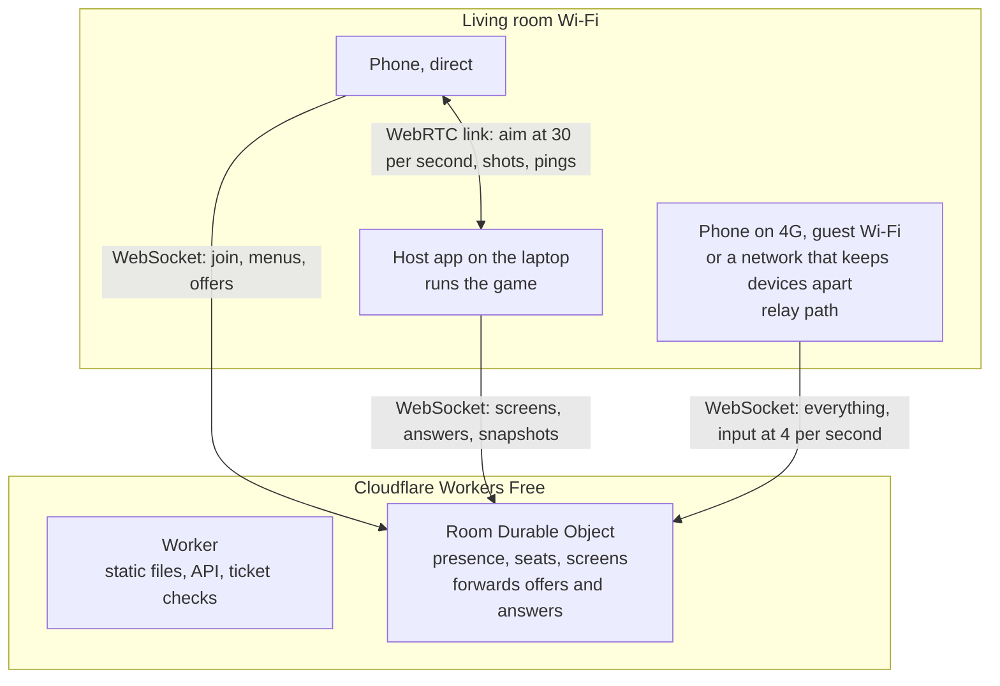
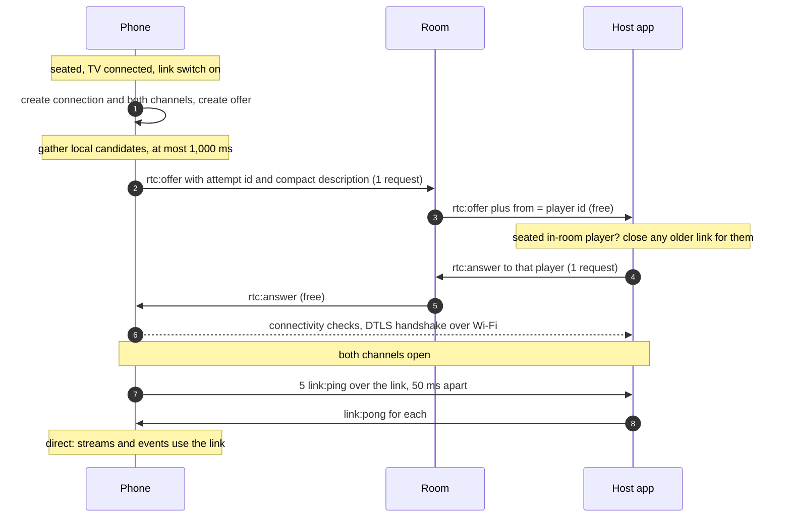
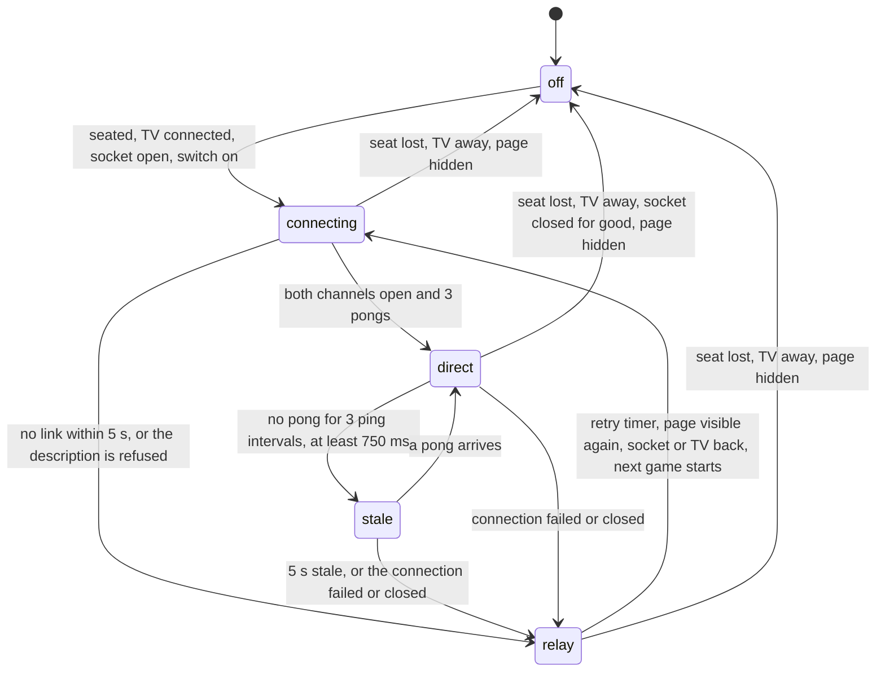
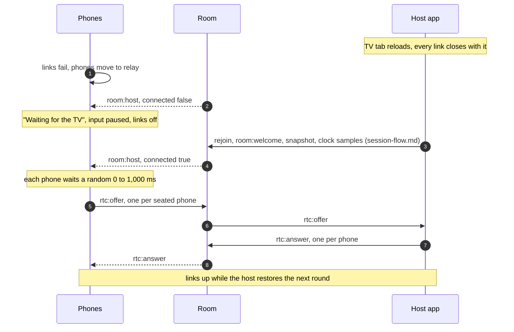

# Real-time link

This is the design for a direct connection between each phone and the TV laptop, so aiming, steering and other fast input no longer travel through Cloudflare. The room on Cloudflare only introduces the two devices. It answers the Target Range playtest of 17 September 2026: "The input is too laggy and there should be more events. The crosshair is often off." It applies to every future real-time game, not only Target Range.

**For the owner.** Read [Decisions at a glance](#decisions-at-a-glance), [Why it feels laggy today](#why-it-feels-laggy-today) and [Owner answers (2026-09-17)](#owner-answers-2026-09-17). That takes about 15 minutes. The rest is detail for the stories.

**For agents.** Everything after the owner sections is binding for the stories in [Implementation stories](#implementation-stories). [platform.md](platform.md), [security.md](security.md), [session-flow.md](session-flow.md) and [motion.md](motion.md) stay binding until the amendment story changes them. This doc doesn't edit them. [Found while writing this doc](#found-while-writing-this-doc) lists every place they change. Where this doc and an approved doc disagree before that story lands, the approved doc wins.

Status: approved by the owner on 17 September 2026 (CC-3.12), with the [owner answers](#owner-answers-2026-09-17) of the same day. The owner chose no STUN server instead of the recommended Cloudflare STUN, so the link only uses local candidates.

---

## Contents

- [Decisions at a glance](#decisions-at-a-glance)
- [Owner decisions (2026-09-17)](#owner-decisions-2026-09-17)
- [Why it feels laggy today](#why-it-feels-laggy-today)
- [Owner answers (2026-09-17)](#owner-answers-2026-09-17)
- [Words used in this doc](#words-used-in-this-doc)
- [Goals and non-goals](#goals-and-non-goals)
- [Topology and authority](#topology-and-authority)
- [Signalling](#signalling)
- [Channels, messages and rates](#channels-messages-and-rates)
- [Budget and flood rules](#budget-and-flood-rules)
- [Security and privacy](#security-and-privacy)
- [Browser support](#browser-support)
- [Connection lifecycle](#connection-lifecycle)
- [Clock and latency measurement](#clock-and-latency-measurement)
- [Fallback detection and smoothing](#fallback-detection-and-smoothing)
- [The phone decides its own shot](#the-phone-decides-its-own-shot)
- [Game SDK API sketch](#game-sdk-api-sketch)
- [Tuning Target Range's aim speed](#tuning-target-ranges-aim-speed)
- [Testing](#testing)
- [Rollout](#rollout)
- [Risks](#risks)
- [Found while writing this doc](#found-while-writing-this-doc)
- [Implementation stories](#implementation-stories)
- [Sources](#sources)

---

## Decisions at a glance

The owner approved these on 17 September 2026. Rows 1, 8, 9, 10 and 14 are the [owner decisions](#owner-decisions-2026-09-17) the design started from. Rows 3, 5, 7, 14 and 15 were settled by the [owner answers](#owner-answers-2026-09-17) the same day.

| # | Decision | In plain words |
|---|---|---|
| 1 | Phones talk straight to the TV laptop (owner) | Each seated phone opens a WebRTC data channel to the laptop that runs the game. On the same Wi-Fi a message takes a few milliseconds and costs nothing. |
| 2 | The room only introduces them | The phone sends one "offer" and the TV one "answer" through the room on Cloudflare. That's 2 requests per phone per connection. After that the room isn't involved in input. |
| 3 | Authority doesn't move, and the link carries input only (owner) | The room keeps joins, seats, presence, kicks, phases and snapshots. The TV keeps the game rules and scoring. Menus, turn-based input and phone screens stay on today's path. |
| 4 | Two channels per phone | A fast channel that may lose a message, for aim and tilt, where only the newest value matters. A reliable channel for shots, throws and taps, which must arrive exactly once. |
| 5 | Streams at 30 messages a second, 60 when a game asks (owner) | Aim and tilt go out 30 times a second by default instead of 4. A game may ask for 60. |
| 6 | Link traffic is free, and the relay caps don't change | Nothing on the link reaches Cloudflare. The 4 per second phone cap stays for the relay path, because a night where every link fails must still fit the free budget. |
| 7 | No STUN and no TURN server (owner) | The link only uses the local names the phone and the laptop find on the same Wi-Fi. Nothing about the link leaves the house. Phones on 4G, on guest Wi-Fi or on a network that keeps devices apart use today's path. No paid relay, no card. |
| 8 | If the link fails, today's path takes over (owner) | Input goes through the room again at 4 messages a second. The phone packs its movement between messages, and the TV smooths and briefly predicts the crosshair instead of lagging a quarter second behind. |
| 9 | The phone decides its own shot (owner) | A shot carries the aim and power the phone had when the player let go. The TV scores exactly that, so the arrow lands where the player aimed, whichever path it took. |
| 10 | One capability for every game (owner) | Games use one input channel from the game SDK. They never know or care whether the link or the relay carried a message. |
| 11 | Only seated players get a link | The room only forwards an offer from a seated player's ticketed socket, and the TV only answers players it knows. Audience phones get no link. |
| 12 | The TV protects itself | Per-phone limits on the link. A phone that floods it is cut off the link and falls back to the relay, where the existing flood rules apply. |
| 13 | The room clock stays the clock | Every input still carries room time. The link measures latency and refines each phone's clock, so while it is up phones skip their 30-second clock samples to the room. |
| 14 | Same aim speed in every direction (owner) | Today the crosshair moves a third faster sideways than up and down. Target Range moves 6 world pixels per degree both ways, the touch pad 1.5 world pixels per CSS pixel both ways, and aim is sent with 3 decimals. There's no per-player setting. |
| 15 | Behind a switch until proven (owner) | A spike measures the link on the owner's iPhone and laptop first. The link ships switched off. It turns on by default after the spike, the E2E tests and the owner's replay of Target Range, with `?link=0` as the escape hatch. |

---

## Owner decisions (2026-09-17)

The owner set these after the Target Range playtest. This doc designs within them.

1. **Direct phone-to-TV link.** A WebRTC data channel between each phone and the host, with the room Durable Object only doing signalling over the existing WebSocket. Real-time input such as aim goes over the link at 30 to 60 messages a second. It must stay at €0: no paid TURN, free tiers only.
2. **Fallback to today's path.** If the link can't connect, input uses the relay at 4 messages a second, with smoothing and prediction on the TV. The phone sends its movement between messages.
3. **The phone decides its own shot.** The aim at release travels with the shot, so the arrow lands where the player aimed.
4. **Generic.** A platform capability in the game SDK, for every future game.
5. **Aim speed: "Just tune the default."** No per-player setting. This doc says how to tune Target Range's default.

---

## Why it feels laggy today

From the approved docs and the code on `main`. The network numbers are estimates until the [latency spike](#implementation-stories) (CC-3.13) measures them on real devices.

### Where the time goes

| Step | Relay path today | Direct link |
|---|---|---|
| Phone samples aim | every 66 ms (15 per second) | every 16 ms (about 60 per second, the sensor rate) |
| Wait for a send slot | 0 to 250 ms, 125 on average (budget rule 4) | 0 to 33 ms at 30 per second |
| Network, phone to TV | Wi-Fi, internet to Cloudflare in Amsterdam, the room, back to the laptop: estimated 30 to 100 ms | Wi-Fi only: estimated 2 to 15 ms |
| TV plays aim back behind the clock | 250 ms (`AIM_PLAYBACK_DELAY_MS`) | 25 to 120 ms, from measured jitter |
| TV draws a frame | up to 16 ms | up to 16 ms |
| **Crosshair behind the hand** | **about 350 to 650 ms** | **about 50 to 150 ms** |

TV display lag (often 20 to 100 ms, more when casting) adds to both columns. The link removes most of the rest.

### Why the crosshair looks "off"

1. **The shot is fair, but the crosshair is old.** Target Range already judges a shot on the phone's aim at release (target-range.md, Fairness rule 1). The crosshair on the TV shows the aim of about half a second earlier. A player who moves while releasing sees the arrow land somewhere the crosshair never was.
2. **Letting go twitches the phone.** Lifting the thumb off the draw button tips the phone a little. The shot takes that twitch. The crosshair shows it half a second later, if at all.
3. **The crosshair stalls, then jumps.** `aimAt` plays the track 250 ms behind. A relay message arrives up to 250 ms after the previous one plus network time, so the newest sample is often older than the playback point. `aimAt` then holds the last sample, and moves again when the late message lands.
4. **Aim is rounded to 2 decimals.** 0.01 of yaw is 2 world pixels. The far target's 10 ring has a radius of 2.4 px, so the crosshair can only stand in about 2 or 3 spots inside it.
5. **Sideways moves faster than up and down.** ±25° of yaw maps to ±200 px, 8 px per degree. ±15° of pitch maps to ±90 px, 6 px per degree. That's the "too fast or too slow" feeling: it's both, depending on direction. The touch pad has the same imbalance: 2 world px per CSS px sideways and 1.2 up and down.

The link fixes 1 and 3 on the same Wi-Fi. Rule 2 and 3 of [The phone decides its own shot](#the-phone-decides-its-own-shot) fix 1 and 2 on both paths. [Tuning Target Range's aim speed](#tuning-target-ranges-aim-speed) fixes 4 and 5.

---

## Owner answers (2026-09-17)

The draft asked six questions. The owner approved the doc on 17 September 2026 with these answers. Where an answer differs from the draft's recommendation, the doc follows the answer.

1. **No STUN server (not the recommendation).** Connections use `iceServers: []`: only local host candidates, which browsers name with random mDNS names. Nothing about the link leaves the house. The draft recommended Cloudflare's free STUN server. Phones connect directly only on the same Wi-Fi as the laptop, and only when the network lets them find each other by local name. Everything else uses the relay path. See [Who connects directly](#who-connects-directly).
2. **No TURN server.** Phones that can't connect directly use today's path. Cloudflare's TURN has a free allowance of 1,000 GB a month but is a pay-as-you-go product at $0.05 per GB after that, and Metered's Open Relay needs an account with a new third party. **Adding STUN or TURN later** stays a noted future option only. It needs a spike result showing it's needed and a new owner decision.
3. **Streams at 30 per second by default, 60 when a game asks** (as recommended).
4. **The link carries input only** (as recommended). Phone screens (`controller:state`) stay on the relay. Screens and instant feedback over the link are a follow-up idea in [Found while writing](#found-while-writing-this-doc), not part of this design.
5. **Target Range aim speed: 6 world pixels per degree in both directions** (as recommended): ±33° sideways and ±15° up and down. The touch pad moves 1.5 world pixels per CSS pixel in both directions, and aim is sent with 3 decimals.
6. **Rollout as recommended.** The link stays behind a switch until the spike, the E2E tests and the owner's replay of Target Range pass. Then it's on by default, with `?link=0` as the escape hatch.

---

## Words used in this doc

Words from [platform.md](platform.md#words-used-in-this-doc) and [motion.md](motion.md#words-used-in-this-doc) keep their meaning.

| Word | Meaning |
|---|---|
| Link | One WebRTC peer connection between one phone and the host, with its two data channels. |
| Direct | A phone whose link is up. Its real-time input goes over the link. |
| Relay path | Today's path: phone to room to host over the WebSockets. |
| Stream | A continuous value where only the newest matters: aim, tilt. |
| Event | A discrete action that must arrive once: shoot, throw, dash, lower. |
| Signalling | The offer and answer that set up a link, carried by the room. |
| ICE candidate | An address a device might be reached on. Here only a local one: an mDNS name, or an address learned during the connection checks (peer-reflexive). |
| mDNS name | A random `….local` name browsers use instead of a device's local IP address, so web pages don't learn it. |
| STUN | A server that tells a device its public address. Not used (owner answer 1). |
| TURN | A server that relays all link traffic when devices can't reach each other. Costs bandwidth. Not used. |
| Playback delay | How far behind the room clock the TV draws a stream, so it can move smoothly between samples. |

---

## Goals and non-goals

### Goals

1. Aim and tilt reach the TV in tens of milliseconds on the same Wi-Fi, at 30 to 60 updates a second.
2. What the TV shows and what the TV scores agree: a shot lands where the crosshair was.
3. When the link can't connect or breaks, the game keeps working on the relay path within a second, with a smooth crosshair.
4. €0: no STUN, no TURN, no new service, and the daily budget still fits when every link fails.
5. One SDK capability. A game written for the link works on the relay path without a line of extra code.
6. No new data kept, no server contacted outside the house for the link, and nothing that lets one phone reach another phone.

### Non-goals

1. **Phone to phone.** Phones never connect to each other.
2. **Moving authority.** The room stays the authority for the room, the host for the game. No game rules run on phones.
3. **Replacing the WebSocket.** Every device keeps its socket to the room for joining, presence, screens, menus, turn-based input, snapshots and clock sync.
4. **Screens over the link.** `controller:state` stays on the relay (owner answer 4). A possible follow-up, see [Found while writing](#found-while-writing-this-doc).
5. **Internet play.** The link is for phones on the same Wi-Fi as the TV. Phones elsewhere, or on 4G, use the relay path, as today.
6. **Audio or video.** Data channels only. No camera or microphone permission is ever asked.
7. **Raising the relay caps.** The 4 and 1.5 per second caps stay until the 20:1 billing ratio is confirmed (platform.md).
8. **A per-player aim speed setting** (owner decision 5).
9. **STUN or TURN.** No server helps a link connect (owner answers 1 and 2). Adding one later needs a spike result that shows it's needed and a new owner decision.

---

## Topology and authority



### Who decides what

| Area | Authority | Path |
|---|---|---|
| Room create, join, seats, audience, kick, lock, close | Room | WebSocket, unchanged |
| Presence, reconnect window, host away | Room | WebSocket, unchanged |
| Phases, menu, results, VIP | Host | WebSocket, unchanged |
| Game state, rules, scoring, outcome | Host | Inputs from either path |
| The values inside a player's input (aim at release, power, swing speed, `at`) | That player's phone | Link when direct, relay otherwise |
| Phone screens (`controller:state`) | Host | WebSocket, unchanged |
| Snapshots and recovery | Host, stored by the room | WebSocket, unchanged |
| Room time | Room | WebSocket, refined over the link |
| Who may open a link | Room (forwards only seated players) and host (answers only in-room players) | WebSocket |

### Who connects directly

With no STUN server (owner answer 1), a phone and the laptop can only reach each other by their local addresses. Each side offers a host candidate with a random mDNS name. The connection works when at least one side resolves the other's name on the local network. The other side then learns the real local address from the incoming connection checks, a peer-reflexive candidate ([IETF draft](https://www.ietf.org/archive/id/draft-ietf-mmusic-mdns-ice-candidates-03.html)). mDNS uses multicast, which some networks block ([BlogGeek.me](https://bloggeek.me/psa-mdns-and-local-ice-candidates-are-coming/)).

| Where the phone is | Expected path |
|---|---|
| Same home Wi-Fi as the laptop, ordinary router | Direct |
| Laptop on Ethernet, phone on the Wi-Fi of the same router | Usually direct. **Unverified**, the spike checks it if possible. |
| Same Wi-Fi, but a mesh or router that blocks multicast | Relay |
| Guest Wi-Fi, or any network with client isolation (devices can't see each other) | Relay |
| 4G or 5G | Relay |
| A VPN on the phone or the laptop | Relay |
| Android Chrome on the same Wi-Fi | **Unverified**: direct if the laptop resolves the phone's name or the phone resolves the laptop's. The spike measures it. |

The mDNS draft's own field test saw a small drop in connections when both sides used mDNS names, and more connections leaning on STUN ([IETF draft](https://www.ietf.org/archive/id/draft-ietf-mmusic-mdns-ice-candidates-03.html)). Those numbers come from WebRTC traffic across the internet, not from a phone next to a laptop at home, so they don't predict our rate. The spike measures how often a no-STUN link connects on the owner's Wi-Fi. Every phone that doesn't connect plays exactly as it does today, with the better smoothing.

The phone's authority over its own input values isn't new. Platform.md already trusts `at` within 500 ms, and motion.md already sends the aim with the shot. The host still checks the phase, the volley, the player and every schema.

---

## Signalling

### Sequence

The phone offers and the host answers. The host never starts a connection and needs no timers, which keeps it simple in a background tab that is being cast.



### Messages

New room messages, for the platform.md catalogue (amendment, see [Found while writing](#found-while-writing-this-doc)):

| Type | From → to | Payload `d` | Costs a request |
|---|---|---|---|
| `rtc:offer` | seated player → relay → host | `{ s: number, desc: LinkDescription }`. The relay adds `from`. | Yes |
| `rtc:answer` | host → relay | `{ to: PlayerId, s: number, desc: LinkDescription }` | Yes |
| `rtc:answer` | relay → that phone | `{ s: number, desc: LinkDescription }` | No |

`s` is a random 32-bit attempt id the phone picks per offer. The phone ignores an answer with a different `s`, so a slow answer to an old attempt never breaks a new one.

### Compact descriptions

A full WebRTC session description with candidates is often over 1 KB, and the room drops anything over 1 KB before parsing (platform.md, security.md). Raising the cap for two message types would need parsing first, which weakens a security rule. So both sides send only the parts that differ per connection, and rebuild the session description from a fixed template:

```ts
type LinkCandidate = [
  foundation: string,
  priority: number,
  address: string,         // an mDNS name ("<uuid>.local"), or an IP address if a browser shows one
  port: number,
  type: "host",            // no STUN, so no other type is ever gathered
];

type LinkDescription = {
  u: string;               // ICE username fragment
  p: string;               // ICE password
  f: string;               // SHA-256 DTLS certificate fingerprint, 32 bytes as base64url (43 characters)
  c: LinkCandidate[];      // UDP, component 1, at most 6
};
```

Rules:

1. The template is one `m=application 9 UDP/DTLS/SCTP webrtc-datachannel` section with `a=mid:0`, `a=sctp-port:5000` and `a=max-message-size:65536`. The offer uses `a=setup:actpass`, the answer `a=setup:active`.
2. Only UDP host candidates travel. TCP candidates are dropped, and the list stops at 6. With `iceServers: []` there are no server-reflexive or relay candidates to send.
3. `raddr` and `rport` are never sent. Browsers already replace them with `0.0.0.0` for privacy.
4. A typical offer is about 350 bytes with its envelope: 1 or 2 host candidates at about 75 bytes each, plus 110 bytes of ufrag, password and fingerprint. A unit test encodes recorded descriptions from Chrome, Safari and Firefox and asserts every frame stays under 1,024 bytes. If the list doesn't fit, the encoder drops candidates from the end.
5. The codec round trip is tested against those recordings. If a browser ever refuses a rebuilt description, that phone uses the relay path and the dev console says why. Nothing breaks.
6. Candidates are gathered in one go, not trickled one by one. Trickling would cost 1 request per candidate.

### What signalling costs

| Situation | Requests |
|---|---|
| One phone connects | 2 (offer and answer) |
| A night of 8 phones with a few screen locks each, about 5 attempts per phone | about 80 |
| TV refresh or deploy with 8 phones | 16 |
| Worst case per phone per hour, at the [retry limits](#connection-lifecycle) | 20 |

That's under 1% of the platform reserve of 20,000.

### What the room does

`apps/server` stays a relay that knows nothing about games or WebRTC:

1. `rtc:offer` from a player with a seat goes to the host with `from`. From an audience phone or the host it's dropped. It counts against the flood bucket like any message.
2. `rtc:answer` from the host goes to the connected phone named in `to`, with `to` removed. An unknown or disconnected `to` is dropped.
3. The room never parses `desc` beyond the schema, never stores it and never logs it.

---

## Channels, messages and rates

### Channels

Both channels are created on both sides before the offer, with `negotiated: true` and fixed ids, so they open together without an extra handshake ([MDN](https://developer.mozilla.org/en-US/docs/Web/API/WebRTC_API/Using_data_channels)).

| Channel | Id | Settings | Carries |
|---|---|---|---|
| `cc-stream` | 0 | `ordered: false`, `maxRetransmits: 0` | Stream inputs, `link:ping`, `link:pong` |
| `cc-events` | 1 | reliable and ordered (the defaults) | Event inputs |

On `cc-stream` a lost message is never resent. The next one, a moment later, carries a newer value anyway. On `cc-events` a lost packet is resent, so a shot is never lost while the link stays up.

Connection settings: `iceServers: []` (owner answer 1), `iceTransportPolicy: "all"`, `bundlePolicy: "max-bundle"`, `iceCandidatePoolSize: 0`. No certificate is stored between visits.

### Link messages

Link frames are JSON text in the platform envelope, validated by `@couchcade/protocol` schemas, with the same 1 KB cap. They never reach the room.

| Type | Channel | From → to | Payload `d` |
|---|---|---|---|
| `input` | `cc-stream` | phone → host | `{ type, payload, at, n }`. `n` counts up per phone per link, so the host drops a stream message older than one it already applied. |
| `input` | `cc-events` | phone → host | `{ type, payload?, at, e }`. `e` counts up per phone per page load and is the same on both paths, so the host applies an event once even if it arrives twice. |
| `link:ping` | `cc-stream` | phone → host | `{ id, t0 }`, phone local time |
| `link:pong` | `cc-stream` | host → phone | `{ id, t0, t1, t2, r }`: host receive and send times on its local clock, and `r`, the host's current room clock offset |

The host sets the sender from the link the frame arrived on. A link frame has no `from`, and one that carries it is dropped.

### Rates

| What | Direct | Relay path |
|---|---|---|
| Streams (aim, tilt) | 30 per second per stream type, or 60 when the game's controller asks. Latest value wins. A value equal to the last one sent isn't sent. | Unchanged: at most 4 input messages per second per phone, 250 ms apart. Each message packs up to 8 samples taken since the previous one. |
| Events | At once, on `cc-events` | Unchanged: at once if 250 ms passed, else at the 250 ms mark |
| Pings | Every 250 ms during `playing` in a real-time game, every 1,000 ms otherwise | None. Relay clock samples as today. |
| Congestion | A stream value is skipped while `cc-stream`'s `bufferedAmount` is over 4 KB. Events are never skipped. | n/a |

At 60 per second, 8 phones send about 480 messages of about 100 bytes a second, with headers about 70 KB a second. A home Wi-Fi carries that without noticing.

---

## Budget and flood rules

### What changes

1. **Link traffic costs 0 requests.** It never reaches Cloudflare.
2. **The relay caps don't change.** Phones stay at 4 per second on the relay path and the host at 1.5. A night where every link fails, such as at a friend's house with guest Wi-Fi that isolates devices, must still fit. That's today's plan, so it fits.
3. **Signalling is new** and lives in the 20,000 reserve: 2 requests per connection attempt, at most 20 per phone per hour.
4. **Clock samples drop while direct.** A direct phone skips its 30-second relay clock sample (see [Clock](#clock-and-latency-measurement)). That saves up to 120 requests per phone per hour, more than signalling adds.
5. **The room's flood bucket doesn't change.** 20 per second, burst 40, per socket. A direct phone sends almost nothing to the room.
6. **The TV gets its own limits on the link** (below).

### The design night, three ways

8 phones, 2 hours, 30% real-time, the host at its cap all night. Real-time input and host broadcasts only, from platform.md's arithmetic.

| Case | Phone real-time input | Host `controller:state` | Signalling and clock | Of the 80,000 for real-time |
|---|---|---|---|---|
| Today, or every link fails | 69,120 | 10,800 | clock as today | 79,920 |
| 6 phones direct, 2 on relay | 17,280 | 10,800 | about +80 signalling, −1,440 clock | 28,080 |
| Every phone direct | 0 | 10,800 | about +80 signalling, −1,920 clock | 10,800 |

The budget stops being the limit for real-time games at home. It doesn't become a licence to spend: nothing may assume the link is up. With no STUN server (owner answer 1) the first row is the one to expect at other people's houses, on guest Wi-Fi and on 4G, and it fits today.

### TV-side limits on the link

Built in `@couchcade/game-sdk/link` and applied by the host runtime, per phone:

| Limit | Value | When exceeded |
|---|---|---|
| `cc-stream` messages | token bucket, 130 per second, burst 40: two streams at 60 plus pings | Dropped and counted |
| `cc-events` messages | token bucket, 20 per second, burst 20 | Dropped and counted |
| Frame size | 1,024 bytes | Dropped and counted |
| Binary frame, bad JSON, failed schema, a `from` field | | Dropped and counted |
| Dropped frames | more than 100 in 10 seconds | The host closes that phone's link and ignores its offers for 60 seconds. The phone plays on the relay path, under the room's flood rules. |

The buckets refill from arrival times, with no timer. A cut-off phone isn't kicked: flooding the link costs nothing but TV CPU, and the relay path already has revocation.

### Proposed amendments to platform.md's budget rules

For CC-3.14. Not applied by this doc.

- Decision 14: "Phones send at most 4 messages per second **on the relay path**… Real-time input over the direct link (realtime-link.md) costs nothing."
- Budget rule 4: "Phones send input **on the relay path** only when it changes… **Over the direct link, streams go at 30 or 60 per second and events at once (realtime-link.md).**"
- New budget rule 14: "Nothing may depend on the link being up. The caps are sized for a night where every phone uses the relay path."
- New budget rule 15: "Signalling is one `rtc:offer` and one `rtc:answer` per attempt, gathered in one go, never trickled. At most 10 attempts per phone per hour."
- Cost table: add "Link signalling: 2 per attempt" and "Clock sync while direct: 5 per connect, no periodic samples".

---

## Security and privacy

### Threats and defences

These extend [security.md](security.md#threats-defences-and-tests). The amendment story adds them to its threat table.

| Threat | Defences | Test |
|---|---|---|
| **A stranger opens a link to the TV** | A link only starts from an offer the room forwarded from a ticketed, seated player socket. The host answers only offers whose `from` is an in-game or seated player of this room. The DTLS certificate fingerprint travels inside that authenticated offer, so the connection that finishes the handshake is the one the player offered. There is no other way in: the host never listens for offers from anywhere else. | Relay drops `rtc:offer` from audience and host sockets. Host ignores an offer from an unknown id. |
| **A player pretends to be another player on the link** | The host takes the sender from which link a frame arrived on. A frame with `from` is dropped. | Unit test in the link core. |
| **Two tabs or an old attempt** | A new offer for the same player closes the older link, like 4009 on the socket. Answers carry the attempt id `s`. | Unit test. |
| **Kicked, expired or leaving player keeps a link** | On `player:left` with `kicked`, `expired` or `left`, the host closes that link at once. On `disconnected` it keeps it for the 2-minute window, so a Cloudflare deploy doesn't stop play. | Host runtime test. |
| **Flooding the TV over the link** | [TV-side limits](#tv-side-limits-on-the-link). | Unit test feeds 1,000 frames and asserts drops and the cut-off. |
| **Eavesdropping or tampering** | Every data channel is encrypted with DTLS ([MDN](https://developer.mozilla.org/en-US/docs/Web/API/WebRTC_API/Using_data_channels)). Signalling runs over the existing HTTPS WebSocket. | Browser built-in. |
| **Cheating with aim or timing** | Out of scope, as in security.md: a friend with a modified phone could already send any aim over the relay. The host still checks phase, volley, ranges and clamps `at` to 500 ms. | Existing game rule tests. |
| **Oversized or malformed signalling** | The 1 KB cap and schemas, before and after the relay. | Protocol fixtures. |

### Privacy

The README promises no cookies, no analytics, and IPs only in memory. The link keeps that. Here is who learns what:

| Who | Learns | Compared with today |
|---|---|---|
| The host laptop's browser | The phone's local address on the home Wi-Fi, from the connection checks | New. The host is trusted (security.md), and a direct link can't work without it. |
| The room on Cloudflare | The candidates it forwards: random mDNS names, no addresses | It already sees the public address of every socket |
| Any server outside the house | Nothing. With `iceServers: []` the link contacts no server at all. | New in our favour |
| Other phones | Nothing | Unchanged |

Rules:

1. Browsers hide local addresses behind random mDNS names unless a page has camera or microphone permission ([IETF draft](https://www.ietf.org/archive/id/draft-ietf-mmusic-mdns-ice-candidates-03.html), [BlogGeek.me](https://bloggeek.me/psa-mdns-and-local-ice-candidates-are-coming/)). Couchcade never asks for either, so candidates carry names, not local IPs.
2. Candidates, descriptions and link statistics are never stored, logged, sent to analytics or shown on the TV. Log lines about the link carry only the state and an error code. The amendment adds this to security.md's privacy rules.
3. The dev readout shows the path and round-trip time, never an address.
4. No new third party, and no server at all. With no STUN and no TURN the link only talks to the other device in the room (owner answers 1 and 2).
5. CSP: the README's policy has no `webrtc` directive, so browsers allow data channels. `connect-src` doesn't govern ICE. CSP Level 3 defines a `webrtc` directive ([spec](https://w3c.github.io/webappsec-csp/)). CC-2.7's header test gains one assertion that the policy never sets `webrtc 'block'`.

---

## Browser support

RTCPeerConnection and data channels are in every browser Couchcade supports ([caniuse](https://caniuse.com/rtcpeerconnection)). Rows marked **unverified** are checked by the spike or the named story.

| Device | Role | Support | Notes |
|---|---|---|---|
| iPhone, Safari and every iOS browser (WebKit) | Phone | Since iOS 11 | The link closes when the screen locks or the player switches apps, like the socket. The phone offers again when it's visible. **Unverified:** whether iCloud Private Relay or Low Power Mode changes candidates or latency, and whether any local network prompt appears. The spike checks all three. |
| Android, Chrome | Phone | Yes | **Unverified:** whether Chrome on Android resolves the laptop's mDNS name. It's enough that one side resolves the other: the side that receives the checks learns the address from them. If neither does, that phone uses the relay path. The spike checks it when a guest has an Android phone. |
| Desktop Chrome | Host | Yes | The usual host, because casting to a Chromecast needs it. A cast tab is often in the background, where Chrome slows timers. The host side is event-driven: it answers offers and pings when they arrive and runs no link timers. |
| Desktop Safari | Host | Since 11 | Same rules. |
| Desktop Firefox | Host | Since 22 | Same rules. |
| Chromecast | Not a host | n/a | A Chromecast only shows the laptop's tab. The link ends at the laptop. Casting adds display lag, which the TV lag check already measures. |
| Playwright Chromium | E2E | Yes | Both pages run on one machine. Headless Chromium may need the launch flag that turns off mDNS names for loopback to connect. The E2E story decides. |
| Playwright WebKit | E2E | **Unverified** | If the WebKit build lacks WebRTC, the WebKit project asserts the relay path instead. |

A browser without `RTCPeerConnection` uses the relay path with no message sent.

---

## Connection lifecycle

### Link states on the phone



- In `direct` everything real-time goes over the link. In `stale` and `relay` it goes over the relay path at once, so the player never waits for the link to decide.
- **Retry limits.** After a failed attempt the phone waits 10 s, then 30 s, then 90 s, then only retries on a trigger: the page becoming visible, the socket or the TV coming back, or a new game starting. At most 10 attempts per phone per hour.
- **The host ignores** a second offer from the same player within 5 seconds, and every offer from a player it cut off in the last 60 seconds.

### Join

1. `room:welcome` with a seat, and the TV connected: the phone moves to `connecting` and sends `rtc:offer`.
2. Audience phones stay `off`. `player:promoted` starts a link.
3. The link comes up in the lobby, well before a game starts, so the first volley is already direct.

### Phone reconnect

Session-flow.md's reconnect flow stays. On top of it:

1. The page is hidden or the screen locks: the phone closes its link and goes `off`. iOS would suspend it anyway.
2. The page is visible and the socket is back after `room:welcome`: the phone offers again with a new `s`. The host replaces the old link.
3. While a phone has no link and no socket, its input stream drops everything pending, as today (session-flow.md, phone rule 6).

### Host refresh and recovery



The host answers offers at any point after `room:welcome`, including while it restores. The random wait spreads 8 offers over a second, well inside the host socket's flood bucket.

### Deploys

A deploy closes every socket but not the links, which never touch Cloudflare. Direct phones keep sending input to the host during the few seconds the sockets reconnect. Screens pause until the host's socket is back, as today.

### A phone switches networks

1. The phone leaves the Wi-Fi for 4G. Its local candidates are gone, pongs stop, and within 750 ms during a game the phone is `stale` and sends over the relay path.
2. The socket reconnects on 4G (partysocket). After `room:welcome` the phone offers again with its new local candidates.
3. On 4G those candidates are useless to the laptop, so the attempt fails after 5 seconds and the phone stays on the relay path. That's expected with no STUN and no TURN (owner answers 1 and 2).
4. When the phone rejoins the Wi-Fi, the next trigger offers again.

The phone doesn't call `restartIce()` ([MDN](https://developer.mozilla.org/en-US/docs/Web/API/RTCPeerConnection/restartIce)). A fresh connection costs the same 2 requests and one code path is easier to test.

### Kicks, leaving and expiry

The host closes the link at once on `player:left` with `kicked`, `left` or `expired`, and on `room:end`. `disconnected` keeps it, see [Deploys](#deploys).

---

## Clock and latency measurement

### Room time stays the clock

Every input keeps `at` in room time, and the host keeps clamping it to the last 500 ms (platform.md). Game rules see nothing new.

### Refining a phone's clock over the link

Each `link:ping` and `link:pong` gives four timestamps, like NTP: `t0` phone send, `t1` host receive, `t2` host send, `t3` phone receive.

- Round trip: `rtt = (t3 − t0) − (t2 − t1)`.
- Phone to host offset: `offsetPH = ((t1 − t0) + (t2 − t3)) / 2`.
- Phone to room: `offset = offsetPH + r`, where `r` is the host's own room clock offset sent in the pong.

The room clock module (CC-1.14) uses the same filter as today: the last 8 samples, drop samples with `rtt` above median plus 1 standard deviation, take the median. While direct:

1. The phone uses the link offset for `toHostTime`.
2. It skips its periodic relay clock sample. The 5 samples on connect stay, so a phone has room time before its link is up.
3. Error: half the link's round-trip asymmetry, a few milliseconds on Wi-Fi, plus the host's own room offset error. That second part is the same for every phone, so it can't favour anyone.

On `stale` or `relay` the phone takes its next relay sample at once and returns to the 30-second rhythm.

### What we measure

| Measure | How | Where it shows |
|---|---|---|
| Path | Link state | Dev readout on the phone and the TV |
| Link round trip, p50 and p90 | The last 20 pongs | Dev readout, spike results |
| Jitter | p90 minus p50 of the round trip | Sets the playback delay |
| Loss | Pings without a pong, per 100 | Dev readout, spike results |
| Candidate pair | `getStats()`: whether the chosen pair is host or peer-reflexive | Spike results only, never addresses |
| Input age on the TV | Room time when the host applies an input minus its `at`, p50 and p90 per phone | Dev readout, spike results |
| Crosshair behind the hand | A 240 fps video of the phone and the TV together | Spike, by hand |

`RTCIceCandidatePairStats.currentRoundTripTime` isn't in every browser ([MDN](https://developer.mozilla.org/en-US/docs/Web/API/RTCIceCandidatePairStats/currentRoundTripTime)), so our own pings are the measure. The dev readout is the one platform.md calls the dev overlay. It's hidden unless `?dev=1` is in the URL.

---

## Fallback detection and smoothing

### Detecting a failed link

| Signal | Reaction |
|---|---|
| No `RTCPeerConnection` | `relay`, no offer sent |
| No answer, or channels not open, 5 s after the offer | `relay`, retry later |
| Rebuilding a description throws | `relay`, retry later |
| No pong for 3 ping intervals (750 ms during a real-time game, 3 s otherwise) | `stale`: send over the relay path now |
| `connectionState` becomes `failed` or `closed`, or a channel closes | `relay` at once |
| `stale` for 5 s | `relay` |

### Switching without losing a shot

1. **Direct to relay.** Pending stream values go to the relay input stream. Every event sent over the link in the last 500 ms is sent again over the relay path with the same `e`, at most 4. The host applies each `e` once. It remembers the last 64 per player.
2. **Relay to direct.** New values go over the link. A relay message already on its way still arrives. Stream samples are keyed by their time, so a sample that arrives twice changes nothing.
3. Games never see a switch.

### Smoothing on the relay path

At 4 messages a second the TV can't show a fresh sample every frame. Today it waits 250 ms and still stalls ([Why the crosshair looks off](#why-the-crosshair-looks-off), item 3). The new playback, in `@couchcade/game-sdk/input`, works for any stream of numbers:

1. **The phone sends its movement.** The phone samples every 33 ms. Each relay message carries the newest sample as its payload and packs the earlier ones since the previous message in `more`, at most 7, oldest first, as `[dtMs, payload]`. With 8 aim samples that's about 400 bytes, under 1 KB.
2. **The TV draws slightly in the past.** It draws the stream at `now − D`. On the relay path `D` starts at 180 ms. The spike and a replay test tune it between 120 and 280 ms.
3. **Between samples, interpolate.** Linear between the two samples around `now − D`. After a gap longer than two sample intervals (the phone was still), hold the older sample until one interval before the newer one, as `aimAt` does today.
4. **Past the newest sample, predict briefly.** When a message is late, continue from the newest sample with the velocity of the last three samples, easing out: `value = last + v × τ × (1 − e^(−dt / τ))` with `τ = 60 ms`, for at most 100 ms, clamped to −1 to 1. Then hold.
5. **Correct without jumping.** When the drawn value and the value the samples now say differ, the drawn value moves towards the right one with `shown += (target − shown) × (1 − e^(−frameMs / 50))`. It catches up within about 150 ms and never snaps.
6. **An event with an aim snaps the crosshair.** When a shot arrives, the TV moves that player's crosshair to the shot's aim over 60 ms, and the arrow starts from there. See [The phone decides its own shot](#the-phone-decides-its-own-shot).

### Smoothing on the direct path

The same code with different numbers: `D = clamp(1000 / hz + 2 × jitter, 25, 120)` from the phone's measured link jitter. Prediction is on but rarely needed. At 30 per second on a quiet Wi-Fi, `D` is about 40 to 50 ms.

The host picks `D` per player. Scenes read it from `HostSceneData` (see the [API sketch](#game-sdk-api-sketch)). Game rules never read it, so replays stay exact.

### Proving it

A unit test replays recorded aim traces (motion.md, CC-5.9) through a fake network at 4 per second with 30 to 100 ms delay, 20 ms jitter and 2% loss. It measures the distance between the drawn crosshair and the true aim `D` earlier, in world pixels, and asserts: p90 error under 6 px, no overshoot beyond 4 px after the phone stops, no frame where the crosshair stands still for more than 150 ms while the true aim moves. The same test with direct-path settings asserts p90 error under 2 px.

---

## The phone decides its own shot

Owner decision 3, for every game that fires something.

1. **The event carries the deciding values.** A shot, throw or swing carries every value from the phone that decides where it goes: aim, power, swing speed, spin. The host rules use those values and never look them up from the stream. This is motion.md's "Fitting the input budget" rule 3, made a platform rule.
2. **The aim in the shot is the aim the TV was shown.** The controller reads it from `input.last("aim")`, the newest value it gave the stream, not from a fresh sensor reading at release. The shot therefore matches the crosshair the player was following, and the twitch of lifting a thumb (about the last 30 ms) doesn't move it. Games that want the exact release moment may read the detector instead. Target Range uses `last`.
3. **The TV shows the truth at once.** When a shot arrives, the crosshair snaps to its aim over 60 ms and the arrow leaves from there. On the direct path that's a few pixels. On the relay path it can be more, and it's still honest.
4. **The host still validates.** Phase, volley, player, schema ranges and the `at` clamp all apply. A shot outside the volley is still `late`.
5. **Timing still comes from `at`.** The phone stamps `at` from the event time and the host judges timing on room time, as today.

What stays on the host: wind, drop, the landing point, the score and the outcome. The phone decides what the player did, and the host decides what that did in the game.

---

## Game SDK API sketch

A sketch for the SDK stories, not a final signature. Names follow `@couchcade/game-sdk`.

### Where the code lives

| Piece | Package | Why there |
|---|---|---|
| Compact description codec, link clock maths, token buckets, event de-duplication, the link state machine, a fake link for tests | `@couchcade/game-sdk/link` (new, tier 2 core) | Pure and shared by both apps. No DOM. |
| Stream playback with prediction (`addSample`, `playAt`), relay packing | `@couchcade/game-sdk/input` | Next to the input stream and `aimAt`, which it generalises |
| `rtc:offer`, `rtc:answer`, `link:ping`, `link:pong` schemas, `input.d.n`, `input.d.e`, `input.d.more` | `@couchcade/protocol` | Every message lives there (platform.md) |
| `RTCPeerConnection` wiring on the phone | `apps/controller/src/runtime/link.ts` | Browser API, app tier |
| `RTCPeerConnection` wiring and limits on the host | `apps/host/src/runtime/links.ts` | Browser API, app tier |
| Relay forwarding | `apps/server/src/room/rtc.ts` | The relay |

### Controller side

```ts
// @couchcade/game-sdk/contract
export interface CouchcadeController {
  id: string;
  component: () => Promise<Component>;
  /** Input types sent with `input.stream`. Default 30 per second; 60 when a game needs it. */
  streams?: Readonly<Record<string, { hz?: 30 | 60 }>>;
}

export interface ControllerProps<TView, TInput extends GameInput, TMotion = ControllerMotion> {
  screen: string;
  data: TView;
  player: Player;
  /** Turn-based and one-off input. Unchanged. */
  send(input: TInput, eventTimeStamp?: number): void;
  /** Real-time input over the link when direct, the relay path otherwise. */
  input: InputChannel<TInput>;
  motion?: TMotion;
}

export interface InputChannel<TInput extends GameInput> {
  /** A continuous value, one sample. Direct: sent at the stream's rate. Relay: packed, 4 per second. */
  stream(input: TInput, eventTimeStamp?: number): void;
  /** A discrete event. Direct: reliable channel at once. Relay: the input stream's fire rules. */
  fire(input: TInput, eventTimeStamp?: number): void;
  /** The newest value given to `stream` for this type, or null. */
  last<K extends TInput["type"]>(type: K): Extract<TInput, { type: K }> | null;
  /** Drops pending values (volley closed, TV away). */
  clear(): void;
  /** For dev readouts and tests. Games never branch on it. */
  readonly path: "direct" | "relay" | "off";
}
```

`createAimSender` in `@couchcade/motion` calls `input.stream` once per sample instead of packing samples itself. The tilt sender, not built yet (CC-5.7), does the same. The packing moves into the relay side of the channel, so every stream gets it.

### Host side

Game rules don't change shape. The host runtime unpacks a relay message's `more` samples into one input per sample, each with its own `atMs`, so `onPlayerInput` sees the same sequence of single samples on both paths. That keeps replays identical whichever path a match used.

```ts
// @couchcade/game-sdk/contract
export interface HostSceneData<TState> {
  // ...unchanged fields
  /** Per in-game player: which path their input takes and how far behind to draw their streams. */
  link(playerId: string): { path: "direct" | "relay"; rttMs: number | null; playbackDelayMs: number };
}

// @couchcade/game-sdk/input
export type Sample<V extends readonly number[]> = readonly [atMs: number, ...values: V];
export type SampleTrack<V extends readonly number[]> = readonly Sample<V>[];

/** Adds one sample in game time. Pure, JSON-safe, keeps the newest `maxPoints` (default 64). */
export function addSample<V extends readonly number[]>(
  track: SampleTrack<V>, atMs: number, values: V, maxPoints?: number,
): SampleTrack<V>;

/** The value to draw at `nowMs`: interpolated, briefly predicted, never snapping. */
export function createPlayback<V extends readonly number[]>(options?: {
  predictMs?: number; // 100
  tauMs?: number;     // 60
  catchUpMs?: number; // 50
}): {
  at(track: SampleTrack<V>, nowMs: number, delayMs: number, frameMs: number): V | null;
  snap(values: V, overMs?: number): void; // a shot arrived: go there over 60 ms
};
```

`aimAt` stays as a thin wrapper until Target Range moves over.

### A game using it

```ts
// games/target-range/src/controller/index.ts
export default defineController({
  id: "target-range",
  component: () => import("./Controller.vue").then((m) => m.default),
  streams: { aim: { hz: 30 } },
});

// In the controller: every aim sample goes out, the shot uses what the TV was shown.
aim.on((reading) => input.stream({ type: "aim", payload: { yaw: reading.yaw, pitch: reading.pitch } }, reading.t));
const shown = input.last("aim")?.payload ?? { yaw: 0, pitch: 0 };
input.fire({ type: "shoot", payload: { volley, aim: shown, power } }, event.timeStamp);
```

Target Range's `aim` input becomes one sample `{ yaw, pitch }` with 3 decimals instead of the packed array.

---

## Tuning Target Range's aim speed

Owner decision 5: one default, no setting. The numbers today:

| | Degrees for the full range | World px for the full range | Speed |
|---|---|---|---|
| Yaw (sideways) | ±25° (`AIM_YAW_RANGE_DEG`) | ±200 px (`yawPx`) | 8 px per degree |
| Pitch (up and down) | ±15° (`AIM_PITCH_RANGE_DEG`) | ±90 px (`pitchPx`) | 6 px per degree |
| Touch pad, sideways | 200 CSS px of drag | 400 px | 2 px per CSS px |
| Touch pad, up and down | 150 CSS px of drag | 180 px | 1.2 px per CSS px |

### The change

1. Add one constant to `games/target-range/src/shared/constants.ts`: `aimPxPerDegree = 6` (owner answer 5).
2. Derive the ranges from it: `yawRangeDeg = yawPx / aimPxPerDegree` (33.3°) and `pitchRangeDeg = pitchPx / aimPxPerDegree` (15°). Pass both to `createAimDetector({ yawRangeDeg, pitchRangeDeg })` in `games/target-range/src/controller/aim.ts`. The motion package defaults stay as they are for other games.
3. Keep `yawPx` and `pitchPx`, so the arrow flight formulas and scoring don't change.
4. Touch pad: the same idea, `padPxPerCssPx = 1.5` in both directions, so 267 CSS px of drag for the whole sideways range and 120 for up and down. Pass them to `createAimDrag`.
5. Send aim with 3 decimals. 0.001 of yaw is 0.2 world px.

### Checking the number once

Before the replay, with the trace recorder (CC-5.9) on the owner's iPhone:

1. Record three traces: holding the phone on a spot on the TV for 5 seconds, sweeping slowly from the left edge of the target zone to the right, and drawing and releasing 5 times.
2. A test in `games/target-range/test/` plays each trace through the tracker, detector and gain and reports:
   - **Wobble while holding:** p90 distance from the mean crosshair position. Target: at most 3 px, between the far 10 ring (2.4 px) and the near 10 ring (3.6 px), so a steady hand can win a 10 without it being free.
   - **Reach:** degrees of turn from home to the edge of the target zone (±80 px sideways). Target: 10° to 20°, a wrist turn and not an arm swing.
   - **Release twitch:** aim change in the last 50 ms before release. Reported only, for rule 2 of [The phone decides its own shot](#the-phone-decides-its-own-shot).
3. The owner set 6. If the wobble is over 3 px or the reach over 20°, the story records the numbers and asks the owner before changing the value.
4. Record the traces, the numbers and the final value in the Target Range tuning story's notes. One number, one PR, then the owner replays.

At 6 px per degree the far 10 ring is 0.4° across its radius and the target zone edge is 13° from home.

---

## Testing

| Layer | What | Where |
|---|---|---|
| Unit, link core | Description codec round trip against recorded Chrome, Safari and Firefox descriptions, every frame under 1 KB. Clock maths with asymmetric delays. Token buckets. Event de-duplication. The state machine with fake timers: timeouts, `stale`, retry limits, switching both ways without a lost or doubled event. | `packages/game-sdk/test/link/` |
| Unit, playback | The recorded-trace replay through a fake network from [Proving it](#proving-it). Packing and unpacking of relay samples. | `packages/game-sdk/test/input/` |
| Fake network | `createFakeLink({ delayMs, jitterMs, loss, dropAfterMs })` in `@couchcade/game-sdk/testing`: a pair of in-memory channels with the same interface as the browser wiring, driven by fake timers. Used by the unit tests and by component tests of both apps. | `packages/game-sdk/testing/` |
| Relay | `rtc:offer` from a seated player reaches only the host with `from`. Audience and host offers are dropped. `rtc:answer` reaches only its `to`. Oversized frames are dropped and counted by the flood bucket. | `apps/server/test/rtc.test.ts` |
| Host runtime | Link frames from a cut-off phone are ignored. A kicked player's link closes. Relay `more` samples reach `onPlayerInput` as single samples with the right `atMs`. | `apps/host` tests |
| E2E | Two browser contexts, one TV and one phone, in Chromium: the phone reaches `direct` (read through a test hook), a Target Range bot match completes with aim over the link, and the relay socket carries no `input` during the volley. A second spec cuts the link through the test hook: the phone is on relay within 1 second and the match still completes. A third reloads the TV: the phone's link comes back after `room:host { connected: true }`. In WebKit: direct if Playwright's WebKit has WebRTC, otherwise the specs assert the relay path. | `e2e/platform/realtime-link.spec.ts` |
| Real devices | The latency spike and the owner replay | [Stories](#proposed-implementation-stories) |

Playwright can't slow down a data channel with its network emulation, which only covers HTTP. Delay, jitter and loss are tested with the fake link, and E2E proves the real browser wiring and the switch.

---

## Rollout

1. **Spike** on the owner's iPhone and laptop. Go or no-go on real numbers. A no-go ends here with today's path plus the relay smoothing and aim tuning, which help anyway.
2. **Amend the approved docs** (platform.md, security.md, session-flow.md, motion.md, TECH_STACK.md, target-range.md), as platform.md requires before a protocol change.
3. **Protocol and relay.** The new messages exist, nothing sends them yet.
4. **SDK core and playback**, fully unit-tested with the fake link.
5. **Both apps wire the link behind a switch.** Off in production, on in development. `?link=1` turns it on and `?link=0` off for one page load on any device.
6. **Input channel in the contract**, the motion senders move to `input.stream`, relay packing moves into the channel.
7. **Target Range moves over** with the aim tuning, the crosshair snap and single-sample aim.
8. **E2E specs.**
9. **Owner replay** of Target Range with `?link=1` on every phone. Feedback becomes stories.
10. **Switch on in production.** `VITE_REALTIME_LINK` defaults to on. `?link=0` stays as the escape hatch, and setting the variable off in `deploy.yml` turns the link off for everyone on the next deploy.
11. **Later:** skip relay clock samples while direct. Screens over the link, STUN or TURN each need a new owner decision.

---

## Risks

| Risk | Likelihood | Effect | Mitigation |
|---|---|---|---|
| Guest Wi-Fi or a mesh network isolates devices from each other | Medium, at other people's houses | No link, today's path | Relay smoothing makes today's path better too. The dev readout shows why. |
| Neither side resolves the other's mDNS name, because the network blocks multicast | Medium, and unmeasured until the spike | No link for those phones | One side resolving is enough, thanks to peer-reflexive candidates. Otherwise the relay path, which is today's behaviour. Adding STUN would help and needs a new owner decision. |
| A browser update refuses rebuilt descriptions | Low | No link | E2E catches it in CI, relay path, `?link=0`, deploy switch |
| iOS Safari changes how links survive locks or Private Relay | Low | More reconnects | Offers are cheap and limited, relay path |
| Retry loops use the budget | Low | Requests | 10 attempts per phone per hour, host-side 5-second and 60-second ignores |
| Direct and relay players get a different crosshair feel | Medium on mixed nights | Relay players see a slower crosshair | Scores use the phone's own values on both paths, so it doesn't change results |
| Laptop CPU with 8 phones at 60 per second | Low | Frame drops | 480 small JSON frames a second is little. The E2E budget test watches frame time. |
| Two paths double the test surface | Certain | Maintenance | One `InputChannel`, the fake link, games never branch |
| Playwright WebKit has no WebRTC | Unknown | Less E2E coverage | WebKit asserts the relay path. Real iPhone coverage comes from the spike and the replay. |
| Privacy: the host learns phone addresses | Certain when direct | The phone's local address on the host's browser | Host is trusted, nothing stored or logged, nothing leaves the house |
| No STUN means fewer phones connect directly than with one | Unknown until the spike | More phones on the relay path | The relay path is today's behaviour with better smoothing. The spike measures the rate, and adding STUN stays an owner decision. |

---

## Found while writing this doc

None of these is changed by this doc. CC-3.14 makes the doc changes. The others belong to the stories named in the last column.

| # | Where | Finding | Action |
|---|---|---|---|
| 1 | target-range.md, "Arrow flight"; `packages/motion/src/gestures/aim.ts` | Yaw is 8 px per degree and pitch 6, so the crosshair moves a third faster sideways. The touch pad is 2 and 1.2 px per CSS px. | CC-11.9 |
| 2 | `createAimOutput` in `packages/motion/src/gestures/aim.ts` | Aim is rounded to 2 decimals, 2 world px sideways, against a far 10 ring of 2.4 px | CC-3.21 |
| 3 | `aimAt` in `packages/game-sdk/src/input/aim-playback.ts` | With a 250 ms playback delay and messages up to 250 ms apart plus network time, the newest sample is often older than the playback point, so the crosshair holds and then jumps | CC-3.17 |
| 4 | target-range.md, Fairness rule 1; `games/target-range/src/controller/aim.ts` | The shot uses `aim()` at `pointerup`, which includes the release twitch, while the TV shows aim from about half a second earlier | `input.last("aim")` and the crosshair snap (CC-3.21, CC-11.9) |
| 5 | platform.md, "How traffic flows" | "Nothing connects to the laptop or to a phone, so any network works" is no longer true for direct phones | CC-3.14 |
| 6 | platform.md, decision 14, budget rules 4 and 6, message catalogue, cost table, clock sync step 5 | Relay-only wording, new messages, clock samples while direct | CC-3.14, with the [proposed text](#proposed-amendments-to-platformmds-budget-rules) |
| 7 | TECH_STACK.md, "Peer-to-peer WebRTC" row and the fallback line in the budget section | Calls WebRTC "a later option". It's now the design. | CC-3.14 |
| 8 | session-flow.md, "Real-time input batching" rules 5 to 7 | Every input goes through a 4 per second stream, and button mashing is sent as a count | Rules apply to the relay path. `InputChannel` wraps the stream. CC-3.14. |
| 9 | motion.md, decisions 12 and 16, "Aim" sending rules, "Fitting the input budget" rules 1 and 4 | 4 per second, 250 ms trail, packing in the gesture sender, at most 4 samples | Direct rates, packing moves into the channel, up to 8 samples on the relay. CC-3.14. |
| 10 | security.md, threat table and "Privacy and logs" | No rows for links, and "IPs only as rate-limit keys in memory" doesn't cover candidates passing through | The [threat rows](#threats-and-defences) and privacy rule 2. CC-3.14. |
| 11 | README CSP and CC-2.7 header tests | CSP Level 3 has a `webrtc` directive that could block links if anyone adds it | One header test assertion. CC-3.15. |
| 12 | target-range.md, "Budget check" and crosshair readability rule 5 | Assumes 4 messages a second and a 250 ms trail | CC-3.14 |
| 13 | platform.md, clock sync | Direct phones can skip periodic relay clock samples, saving up to 120 requests per phone per hour | CC-3.23 |
| 14 | CC-5.7 (tilt, To Do) | Its criteria send tilt through the 4 per second input stream with `set` | Done on 2026-09-17: CC-5.7 now depends on CC-3.18 and its criterion 2 says `input.stream` |
| 15 | This doc, owner answer 4 | Phone screens and instant feedback could also travel over the link, saving up to 10,800 host requests a night and buzzing the moment an arrow lands | A follow-up idea only. It needs a new owner decision, not a story yet. |
| 16 | This doc, owner answers 1 and 2 | With no STUN and no TURN, a phone that can't find the laptop by its local name plays on the relay path | Accepted. CC-3.13 measures how often that happens, and adding STUN needs a new owner decision. |
| 17 | platform.md, "Reconnects", deploys | Links survive a deploy, so direct phones keep playing while sockets reconnect | Noted in CC-3.14. No code. |

---

## Implementation stories

Created on 17 September 2026 with this doc's approval, on epic CC-3 except CC-11.9. Every story sits after CC-3.12.

| Id | Story | References | Depends on |
|---|---|---|---|
| CC-3.13 | **Spike: measure the no-STUN direct link on an iPhone and a laptop.** A throwaway page in `spikes/realtime-link/`: a TV page and a phone page with `iceServers: []`, signalling through the local Vite dev server, reached from the phone over a `cloudflared` quick tunnel. Records whether it connects, the connect time, the candidate pair type, link round trip p50 and p90 at 30 and 60 per second for 60 seconds, loss, and compact and full description sizes. Runs on the same Wi-Fi, on 4G, with iCloud Private Relay on, in Low Power Mode, and on an Android phone when one is there. Go or no-go with numbers, including how often a no-STUN link connects. | `spikes/realtime-link/` | CC-3.12 |
| CC-3.14 | **Amend the approved architecture docs for the real-time link.** platform.md, security.md, session-flow.md, motion.md, TECH_STACK.md and target-range.md, from [Found while writing](#found-while-writing-this-doc) rows 5 to 12 and the proposed budget text. | `docs/architecture/platform.md`, `docs/architecture/security.md`, `docs/architecture/session-flow.md`, `docs/architecture/motion.md`, `docs/TECH_STACK.md`, `docs/games/target-range.md` | CC-3.13 |
| CC-3.15 | **Relay WebRTC signalling messages through the room.** `rtc:offer`, `rtc:answer`, `link:ping`, `link:pong`, `input.d` fields `n`, `e` and `more`, relay forwarding with role and seat checks, the CSP header assertion. | `packages/protocol/src/messages/`, `apps/server/src/room/rtc.ts`, `apps/server/src/room/room.ts`, `apps/server/test/rtc.test.ts`, `apps/server/test/headers.test.ts` | CC-3.14 |
| CC-3.16 | **Build the WebRTC link core in `@couchcade/game-sdk/link`.** Description codec with recorded fixtures, link clock maths, token buckets, event de-duplication, the state machine, `createFakeLink`. | `packages/game-sdk/src/link/`, `packages/game-sdk/test/link/`, `packages/game-sdk/testing/fake-link.ts`, `packages/game-sdk/testing/index.ts` | CC-3.14 |
| CC-3.17 | **Add stream playback with prediction to `@couchcade/game-sdk/input`.** `addSample`, `createPlayback`, the trace replay test, `aimAt` as a wrapper. | `packages/game-sdk/src/input/playback.ts`, `packages/game-sdk/src/input/aim-playback.ts`, `packages/game-sdk/src/input/index.ts`, `packages/game-sdk/test/input/playback.test.ts` | CC-3.14, CC-3.16 |
| CC-3.18 | **Add the `InputChannel` to the game contract.** `InputChannel`, `CouchcadeController.streams`, `HostSceneData.link`, relay packing of up to 8 samples in the input stream. | `packages/game-sdk/src/contract/index.ts`, `packages/game-sdk/src/input/channel.ts`, `packages/game-sdk/src/input/stream.ts`, `packages/game-sdk/src/input/index.ts`, `packages/game-sdk/test/input/channel.test.ts` | CC-3.16, CC-3.17 |
| CC-3.19 | **Connect phones to the host over the WebRTC link in the controller runtime.** Browser wiring, lifecycle, retries, the switch and `?link=`, the phone dev readout, passing `input` to controllers. | `apps/controller/src/runtime/link.ts`, `apps/controller/src/runtime/controller.ts`, `apps/controller/src/runtime/send.ts`, `apps/controller/src/runtime/GameController.vue`, `apps/controller/test/runtime/link.test.ts` | CC-3.15, CC-3.16, CC-3.18 |
| CC-3.20 | **Accept phone links on the host with TV-side limits.** Answering, closing on leave and kick, limits and cut-off, unpacking relay samples, per-player playback delay, the TV dev readout. | `apps/host/src/runtime/links.ts`, `apps/host/src/runtime/game-runner.ts`, `apps/host/src/runtime/host-runtime.ts`, `apps/host/test/runtime/links.test.ts` | CC-3.15, CC-3.16, CC-3.17, CC-3.18 |
| CC-3.21 | **Send aim samples through the input channel from `createAimSender`.** `createAimSender` calls `input.stream` per sample, with 3 decimals. | `packages/motion/src/gestures/aim.ts`, `packages/motion/test/aim/` | CC-3.18 |
| CC-11.9 | **Move Target Range aim to the input channel at 6 px per degree.** Single-sample aim input, `streams: { aim: { hz: 30 } }`, shot from `input.last("aim")`, crosshair snap and per-player playback delay in the scene, `aimPxPerDegree` and the pad gain with the trace check from [Tuning](#tuning-target-ranges-aim-speed). | `games/target-range/src/`, `games/target-range/test/`, `e2e/games/target-range.spec.ts` | CC-3.17, CC-3.18, CC-3.21 |
| CC-3.22 | **Add E2E tests for the direct link and the relay fallback.** The three specs from [Testing](#testing), with the test hook. | `e2e/platform/realtime-link.spec.ts`, `e2e/src/link.ts` | CC-3.19, CC-3.20, CC-11.9 |
| CC-3.23 | **Skip periodic relay clock samples while a phone is on the direct link.** Link offsets in the room clock, relay sample on `stale`. | `packages/game-sdk/src/clock/room-clock.ts`, `packages/game-sdk/test/clock/room-clock.test.ts`, `apps/controller/src/runtime/link.ts` | CC-3.16, CC-3.19 |
| CC-3.24 | **Owner replay: Target Range on the direct link, then switch the link on.** Replay with `?link=1`, record it, then default `VITE_REALTIME_LINK` to on. | `docs/playtests/target-range.md`, `apps/controller/src/runtime/link-switch.ts`, `apps/host/src/runtime/link-switch.ts` | CC-3.22, CC-11.7, CC-3.19, CC-3.20 |

CC-3.15 and CC-3.16 can run in parallel after CC-3.14, then CC-3.17, then CC-3.18, then CC-3.19, CC-3.20 and CC-3.21 in parallel. Stories that share files always carry the dependency edge that orders them: CC-3.17 before CC-3.18 (`input/index.ts`), CC-3.19 before CC-3.23 and CC-3.24, CC-3.20 before CC-3.24, and CC-11.7 before CC-3.24 (the playtest doc).

### The spike, step by step for the owner

About 20 minutes with the iPhone and the laptop on the same Wi-Fi.

1. In the repo on the laptop: `pnpm install`, then `pnpm --dir spikes/realtime-link dev`.
2. In a second terminal: `npx cloudflared tunnel --url http://localhost:5199`. It prints an `https://….trycloudflare.com` address.
3. On the laptop, open that address with `/tv` at the end. On the iPhone, open it with `/phone`.
4. Tap "Start" on the iPhone and move the phone around for 60 seconds. The TV page shows the path, the round trip and a dot that follows the phone.
5. Tap "Copy results" on the iPhone and paste them into the chat.
6. Repeat with Wi-Fi off on the iPhone (4G), where the link is expected to fail and the page should say so within 5 seconds, then with iCloud Private Relay on, and then in Low Power Mode.
7. If a guest has an Android phone on the same Wi-Fi, run steps 3 to 5 on it too.
8. Optional: film the phone screen and the TV together with a second phone in slow motion, so the story can count frames between the two dots.

---

## Sources

Checked on 17 September 2026. Browser behaviour changes, so check again before relying on a detail marked unverified.

**WebRTC**
- `createDataChannel()` options, `ordered`, `maxRetransmits`, `negotiated`: https://developer.mozilla.org/en-US/docs/Web/API/RTCPeerConnection/createDataChannel
- Using data channels: DTLS encryption, message sizes, negotiated channels: https://developer.mozilla.org/en-US/docs/Web/API/WebRTC_API/Using_data_channels
- `RTCSctpTransport.maxMessageSize`: https://developer.mozilla.org/en-US/docs/Web/API/RTCSctpTransport/maxMessageSize
- `restartIce()`: https://developer.mozilla.org/en-US/docs/Web/API/RTCPeerConnection/restartIce
- `currentRoundTripTime` and its limited support: https://developer.mozilla.org/en-US/docs/Web/API/RTCIceCandidatePairStats/currentRoundTripTime
- IP address exposure in candidates: https://developer.mozilla.org/en-US/docs/Web/API/RTCIceCandidate/address
- WebRTC 1.0 spec (`iceTransportPolicy`, `bufferedAmount`, `iceCandidatePoolSize`): https://w3c.github.io/webrtc-pc/
- webrtc.org data channels guide: https://webrtc.org/getting-started/data-channels
- mDNS ICE candidates draft, including unresolvable names and peer-reflexive candidates: https://www.ietf.org/archive/id/draft-ietf-mmusic-mdns-ice-candidates-03.html
- mDNS in Chrome, Edge, Firefox and Safari, and networks that block multicast: https://bloggeek.me/psa-mdns-and-local-ice-candidates-are-coming/
- Browser support: https://caniuse.com/rtcpeerconnection
- CSP Level 3, `webrtc` directive: https://w3c.github.io/webappsec-csp/

**STUN and TURN (researched, neither is used)**
- Cloudflare Realtime TURN, which also lists the STUN address `stun.cloudflare.com:3478`: https://developers.cloudflare.com/realtime/turn/
- TURN free tier of 1,000 GB and 48-hour credentials: https://developers.cloudflare.com/realtime/turn/faq/
- Realtime pricing, $0.05 per GB after the free tier: https://developers.cloudflare.com/realtime/pricing/
- TURN credentials need an API token and a TURN key: https://developers.cloudflare.com/realtime/turn/generate-credentials/
- Metered Open Relay, 20 GB a month with an account: https://www.metered.ca/tools/openrelay/

**Cloudflare budget**
- Durable Objects pricing, incoming WebSocket messages and the 20:1 ratio: https://developers.cloudflare.com/durable-objects/platform/pricing/

**Couchcade**
- [platform.md](platform.md), [security.md](security.md), [session-flow.md](session-flow.md), [motion.md](motion.md), [target-range.md](../games/target-range.md), [TECH_STACK.md](../TECH_STACK.md)
