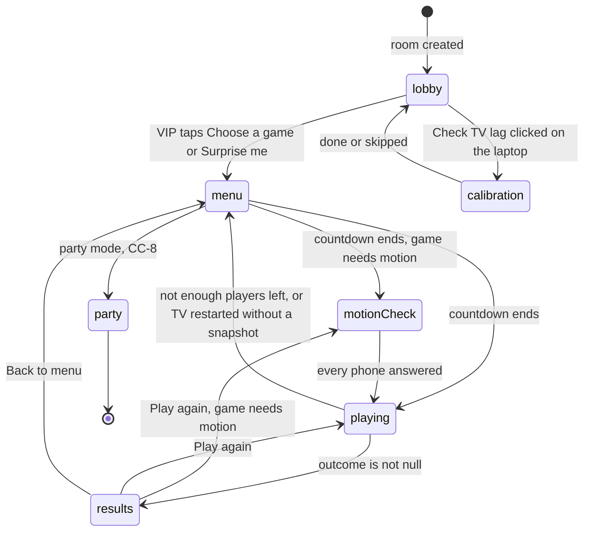
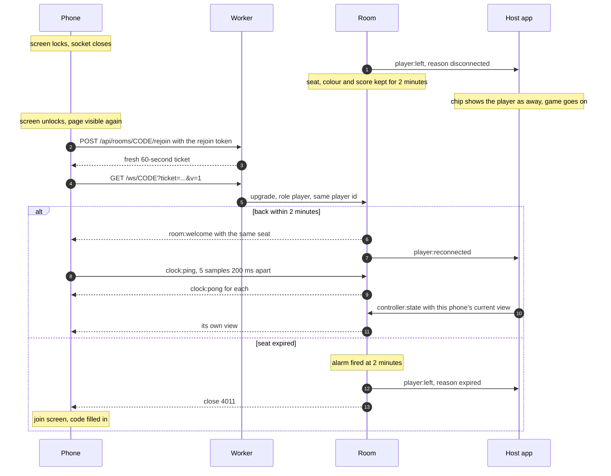
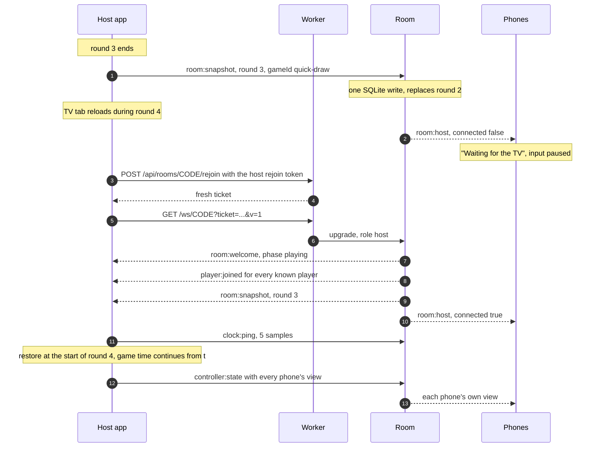

# Session flow and SDK extensions

This is the design for everything around a game: the menu, results, late joiners and audience, phones that drop, a TV that refreshes, and the SDK helpers that real-time games share (input batching, rewind, TV lag calibration, physics and the create-game template). The CC-3 stories build it, and CC-8 party mode plugs into it.

**For the owner.** Read [Decisions at a glance](#decisions-at-a-glance) and [Open decisions for the owner](#open-decisions-for-the-owner). That takes about 15 minutes. The rest is detail for the stories.

**For agents.** Everything after the owner sections is binding for CC-3.2 to CC-3.11, like [platform.md](platform.md) and [security.md](security.md). This doc doesn't repeat them. It adds what they leave open. Where this doc, platform.md, security.md and a story disagree, stop and flag it. [Conflicts found while writing this doc](#conflicts-found-while-writing-this-doc) lists the ones already known.

Status: draft, waiting for owner approval (CC-3.1). The doc is written as if every open decision goes the recommended way.

---

## Contents

- [Decisions at a glance](#decisions-at-a-glance)
- [Open decisions for the owner](#open-decisions-for-the-owner)
- [Words used in this doc](#words-used-in-this-doc)
- [The night, phase by phase](#the-night-phase-by-phase)
- [Game menu](#game-menu)
- [Results](#results)
- [Late joiners and audience](#late-joiners-and-audience)
- [Phone reconnect](#phone-reconnect)
- [Host refresh and deploy recovery](#host-refresh-and-deploy-recovery)
- [Real-time input batching](#real-time-input-batching)
- [Lag compensation with rewind](#lag-compensation-with-rewind)
- [TV lag calibration](#tv-lag-calibration)
- [Physics package](#physics-package)
- [Create-game template](#create-game-template)
- [Where party mode plugs in](#where-party-mode-plugs-in)
- [Budget check](#budget-check)
- [Conflicts found while writing this doc](#conflicts-found-while-writing-this-doc)
- [Which story builds what](#which-story-builds-what)

---

## Decisions at a glance

Approving this doc approves these. Rows 2, 8 and 13 depend on the [open decisions](#open-decisions-for-the-owner) and show the recommended answer.

| # | Decision | In plain words |
|---|---|---|
| 1 | Lobby, menu, game, results, menu | The lobby only comes before the first game. After results the VIP picks "Play again" or "Back to menu". Nothing moves on by itself. |
| 2 | The VIP picks on their phone, then a 3-second countdown | Tapping a game puts the Sunny focus ring on its TV card and starts a countdown. The VIP can tap another game or cancel before it runs out. (Open decision 2) |
| 3 | Games that don't fit are greyed out | A game whose player count doesn't fit the seated players is grey on the TV and on the VIP's phone and can't be picked. A seat kept for a dropped phone still counts. |
| 4 | "Surprise me" picks a fitting game | A random game that fits the player count, never the game just played if another one fits. |
| 5 | Results show one game only | The TV shows that game's placements. Running totals across games belong to party mode (CC-8). |
| 6 | Audience fills free seats between games | The longest-waiting audience member gets the next free seat, automatically, but never while a game runs. Late joiners and promoted audience play from the next game, as the owner decided. |
| 7 | Dropped phones come back on their own | The phone shows "Connection lost" and reconnects as the same player within the 2-minute window from platform.md. Its current view comes back from the TV. |
| 8 | Games aren't told about short drops | A game only hears about a player when their seat expires. Turn-based games use a turn timer so nobody waits for a locked phone. (Open decision 3) |
| 9 | Phones stay awake during games | The screen wake lock from CC-5.10 is held on the menu and during every game, not only motion games. Fewer locked screens means fewer drops. |
| 10 | A refreshed TV resumes at the next round | Games with `snapshot` and `restore` continue at the start of the next round with scores kept. Games without them end and the room goes back to the menu. Phones show "Waiting for the TV" and send nothing meanwhile. |
| 11 | Phones send at most 4 inputs per second | The CC-1.4 measurement set this, so the 15 per second fallback doesn't apply. Only changes are sent, presses go out before stream updates, and button mashing is sent as a count. |
| 12 | Rewind up to 150 ms, as a pure wrapper | Real-time games wrap their rules with `withRewind`. It needs no change to the game contract or the host runtime. |
| 13 | TV lag is measured by tapping along to a steady flash | That measures the TV's delay without anyone's reaction time, so games can subtract it. Measured on demand from the lobby and remembered per laptop. (Open decision 1) |
| 14 | Physics is a pure step over plain numbers | The Planck.js world is rebuilt from game state on every step. The same inputs give the same positions in the same browser engine. |
| 15 | `pnpm create-game` makes a small working game | It fills `games/<id>` only and prints a checklist for the spec, the scene palette and the E2E test. |
| 16 | Planck must never reach phones | Found while writing this doc: the phone loads a game's `index.ts`, which pulls in physics through the rules. Phones get a controller-only entry instead. See [Conflicts](#conflicts-found-while-writing-this-doc). |

---

## Open decisions for the owner

These are the product choices this doc can't settle alone. Each has a recommendation, and the rest of the doc assumes it.

### 1. How the TV lag check measures lag

CC-3.8 says "players tap when a flash appears". That measures reaction time plus TV lag, about 250 ms plus the lag, and the Quick Draw spec already found that games can't subtract such a number without turning real reactions into fouls.

| Option | What players do | Result |
|---|---|---|
| **A. Tap along to a steady flash (recommended)** | The flash repeats on a steady beat. Players tap in time with it, not after it. 3 practice flashes, then 5 that count. About 6 seconds. | Measures the TV's delay without reaction time, the way rhythm games calibrate by hand. Games can subtract it. Tapping along has a small bias of its own, in the tens of milliseconds. The approved calibration screen stays as drawn. |
| B. React to a random flash, as CC-3.8 reads now | Tap as soon as the flash appears, 5 times | The value is mostly reaction time. No game can use it. Only worth building if we never subtract lag. |
| C. React on the phone, then on the TV, and subtract | 5 flashes on the phone, then 5 on the TV | Removes reaction time too, but takes twice as long and needs a phone screen that isn't in the approved canvas. |

If A is approved, CC-3.8 criterion 1 is reworded to "Players tap along to 5 flashes on a steady beat" through `backlog-plan`.

### 2. What happens when the VIP taps a game

| Option | Flow | Cost |
|---|---|---|
| **A. 3-second countdown the VIP can change (recommended)** | The TV moves the Sunny focus ring to the card and counts down "Starting in 3". Tapping another game moves the ring and restarts the count. "Back" cancels. | 1 request per tap. Uses the existing `pick-game` and `back-to-menu` actions. |
| B. Start on tap | The game starts at once | Cheapest, but a mis-tap starts the wrong game and the ring on the TV is never seen. |
| C. Highlight, then "Start game" | Every tap moves the ring on the TV. A second button starts. | Needs a new `ui:action` value, so a protocol change, and two taps every time. |

### 3. A player's phone drops during their turn

| Option | What happens | Cost |
|---|---|---|
| **A. Turn timer in the game (recommended)** | Every turn-based game spec sets a turn timer and what happens when it runs out, for example a skipped turn or a weak automatic throw. A player who unlocks their phone in time just carries on. | No platform change. Every turn-based spec has to define the timer. |
| B. The platform pauses the game | The TV shows "Waiting for Sam" until the phone returns or the seat expires, up to 2 minutes | Needs a new optional contract hook for short drops. Everyone waits for the player who went to the kitchen. |

---

## Words used in this doc

Words from [platform.md](platform.md#words-used-in-this-doc) keep their meaning.

| Word | Meaning |
|---|---|
| Seated players | Players with a slot, connected or inside their 2-minute window. The game menu counts them, and `init` receives them. |
| In-game players | The seated players a running game received at `init`. Late joiners and promoted audience aren't in-game until the next game. |
| Round | Whatever a game calls a round. The host runtime notices a round ended when the game's `snapshot` value changes. |
| Send slot | The moment a phone may send its next `input`: at least 250 ms after the previous one. |
| Display lag | Time from the host drawing a frame to the TV showing it, in milliseconds. |

---

## The night, phase by phase

The host owns the phase and tells the relay with `room:phase` (platform.md). This is the full set of transitions.



`motionCheck` is the `motion-check` phase. The motion step itself belongs to CC-5.10.

### What each device shows

Screen names are the platform screen names from platform.md. "Local" means the phone decides without a `controller:state`.

| Phase | TV | VIP phone | Other in-game players | Seated, not in this game | Audience |
|---|---|---|---|---|---|
| `lobby` | Join and lobby | `lobby` (VIP artboard) | `lobby` | `lobby` | `audience` |
| `menu` | Game menu | `menu` | `vip-choosing` | `vip-choosing` | `audience` |
| `calibration` | TV lag calibration | `calibration` | `calibration` | `calibration` | `audience` |
| `motion-check` | Game title card | `motion-permission` | `motion-permission` | `next-game` | `audience` |
| `playing` | Game scene | Game controller | Game controller | `next-game` | `audience` |
| `results` | Results | `results` with "Play again" and "Back to menu" | `results` with their placement | `next-game` | `audience` |
| Host away | Nothing, it's reloading | Local "Waiting for the TV" | Local | Local | Local |

`waiting` is the plain "Watch the TV" screen. The host sends it during the menu countdown to everyone except the VIP and while a game loads its scene.

### Rules

1. Only the host changes the phase. Every change is one `room:phase` message.
2. `ui:action` `start`, `pick-game`, `play-again`, `back-to-menu` and `skip-calibration` count only from the current VIP (security.md). The host ignores them from anyone else.
3. The VIP is the platform's VIP: the connected player with the lowest `joinedAt`. When the VIP changes, the host sends the VIP views to the new VIP on the next send window. A countdown keeps running.
4. A game ends early when its in-game players drop below `players.min` and it has no `onPlayerLeft`. The host goes to `menu` and the TV says "Not enough players left for <title>". Games with `onPlayerLeft` decide for themselves, like Quick Draw does.
5. CC-1.15 criterion 5 ("return to the lobby") is replaced by `results` once CC-3.3 lands.

---

## Game menu

Built by CC-3.2 in `apps/host/src/screens/menu/` and `apps/controller/src/screens/menu/`. The TV card design is the approved Game menu artboard in [platform-screens.md](../design/platform-screens.md#game-menu).

### Flow

1. The VIP taps "Choose a game" on the lobby screen. The phone sends `ui:action { action: "start" }` and the host moves to `menu`.
2. The host builds the list from its eager registry, sorted by title. A game fits when `players.min <= seated players <= players.max`.
3. The VIP gets the `menu` view. Everyone else in-game or seated gets `vip-choosing` with the VIP's name.
4. The VIP taps a fitting game. The phone sends `ui:action { action: "pick-game", value: "<id>" }`.
5. The host checks that the sender is the VIP, the id exists and the game fits. Otherwise it ignores the message.
6. The host sets `picked` and `startsAt = now + 3000` in room time. The TV puts the Sunny focus ring and 8 px lift on the card and shows "Starting in 3". The VIP view shows the same countdown, computed locally from `startsAt`.
7. Another `pick-game` restarts the countdown on the new game. `ui:action { action: "back-to-menu" }` during the countdown cancels it.
8. When the countdown ends, the host checks the fit again. If the game still fits, it moves to `motion-check` (games with `needsMotion`) or `playing`. If not, it cancels and the card turns grey.

"Surprise me" in the lobby sends `pick-game` without a value. The host moves to `menu`, picks a random fitting game, avoiding the last game played when another fits, and continues at step 6, so the countdown still lets the VIP change their mind.

### Menu view

The phone has no game code, so the view carries what the VIP needs to draw the list:

```ts
type MenuView = {
  games: Array<[id: string, title: string, flags: number]>; // flags bit 0: fits, bit 1: needs motion
  picked: string | null;
  startsAt: number | null; // room time
};
```

- The TV shows player counts. The phone list shows only title, grey state and a motion tag.
- About 35 bytes per game. With 14 games the frame is under 700 bytes. CC-3.2 adds a unit test that 24 games with 16-character titles still encode under 1 KB. Past that, paging is a follow-up story.
- Game titles are at most 16 characters. `createRegistry` should reject longer ones (see [Conflicts](#conflicts-found-while-writing-this-doc)).
- The host re-sends the menu view when the seated count changes the grey state.

---

## Results

Built by CC-3.3 in `apps/host/src/screens/results/` and `apps/controller/src/screens/results/`, from the approved Results artboard and the "after a game" waiting artboards.

1. When `outcome(state)` returns placements, the host stops the game loop, keeps the last frame of the scene for the wipe, and moves to `results`.
2. The TV shows the tag "<title> · final standings", a title "<name> wins!", the podium for places 1 to 3 and a chip per in-game player with place and `score` when the game gives one. Shared first place reads "Noor and Sam win!". With three or more winners it reads "It's a tie!".
3. Each in-game player's phone gets `results` with `{ place, of, score }`. `place` is shown as "1st", "2nd" and so on.
4. The VIP view adds "Play again" and "Back to menu". "Play again" is disabled with the hint "<title> needs 2 to 8 players" when the game no longer fits.
5. `play-again` starts the same game with a new seed and the seated players at that moment, late joiners and promoted audience included. `back-to-menu` goes to `menu`.
6. There's no timer. The results stay until the VIP chooses, and the room's 30-minute idle rule still applies.
7. Placements aren't stored. A TV refresh during `results` goes to `menu`.

---

## Late joiners and audience

Built by CC-3.10 in `apps/server/src/room/audience.ts`, `apps/server/src/room/room.ts` and `apps/controller/src/screens/audience/`. Seating, the 16-phone cap and the late-join rule are in platform.md and security.md. This section adds promotion and screens.

### Promotion

1. A seat frees when a player sends `player:leave`, their seat expires, or they're kicked or revoked.
2. When the phase isn't `playing`, the room gives a free seat to the audience member with the lowest `joinedAt` at once: lowest free slot, one `players` row write, `player:promoted { id, slot }` to the host and that phone.
3. During `playing`, freed seats stay empty. When `room:phase` moves to anything else, the room promotes into every free seat in `joinedAt` order.
4. A promoted player is seated but not in-game. They see `next-game` until the next game starts, or `vip-choosing` in the menu.
5. Audience members can't be VIP, don't count for the menu's fit, can't send `input` or `calibration:tap` (the relay drops them), and never see the motion step.

### Screens

- Audience phones show the approved "Watching" artboard with their Pip on a plain Sky circle. The `audience` view data is `{ position }`, their place in line, shown as "You're next" or "3rd in line". The host re-sends it when the line changes.
- The TV lobby and menu show "5/8" players and, when there is an audience, "2 watching" next to it.
- The 17th phone gets `409 room-full` and the approved "Room is full" screen (security.md).

---

## Phone reconnect

Built by CC-3.4 in `apps/server/src/room/reconnect.ts`, `apps/server/src/room/room.ts` and `apps/controller/src/runtime/reconnect.ts`, with the E2E test in `e2e/platform/rejoin.spec.ts`. Tokens, the 2-minute window, close codes and the host's `player:reconnected` handling are in [platform.md](platform.md#reconnects). This section adds what the phone and the host do around them.



### On the phone

1. When the page becomes visible and the socket isn't open, reconnect at once instead of waiting for partysocket's backoff.
2. Show the approved "Connection lost" screen only after 1 second without a socket, so a quick reconnect doesn't flash it. Keep the last view underneath and show it again on reconnect until the host's view arrives.
3. After `room:welcome`, the clock module resyncs (CC-1.14). Controllers that judge timing wait for the first sample, as Quick Draw does.
4. On close 4011, clear `couchcade:session` and open the join screen with the code filled in. The name is filled in too when the Pip customiser stored it in `localStorage` (CC-6.5).
5. "Leave room" sends `player:leave`, clears the session and opens the join screen.
6. While disconnected, the input stream drops everything pending. Nothing is sent late.
7. The screen wake lock (CC-5.10) is held from the menu until results on every game. The browser releases it when the page is hidden, and the phone takes it again when the page is visible.

### On the host

1. On `player:left { reason: "disconnected" }`, the scoreboard chip and lobby card show the player as away. The game isn't told.
2. On `player:reconnected`, the host forgets the last view it sent that phone, so the next send window includes it. It costs no extra message when other views change in the same window.
3. On `player:left { reason: "expired" }`, the host calls `onPlayerLeft` if that player is in-game, and removes them from the lobby and menu counts.
4. Turn-based games don't wait for a dropped player. Their spec sets a turn timer (open decision 3).

---

## Host refresh and deploy recovery

Built by CC-3.5 in `apps/server/src/room/snapshot.ts`, `apps/server/src/room/room.ts` and `apps/host/src/runtime/recovery.ts`, with the E2E test in `e2e/platform/host-recovery.spec.ts`. The `room:snapshot` message, the host rejoin and "resume at the start of the next round" are in platform.md. This section decides when snapshots are sent, what they hold, and what the host does with them.

### When the host sends a snapshot

1. When a game starts, the host sends `room:snapshot { round: 0, gameId, data }` right after `init`. For a game without `snapshot`, `data` is `null`. This replaces any snapshot left over from an earlier game, so a refresh never restores the wrong one.
2. Every 30 ticks (twice a second) the host calls `snapshot(state)` and serialises it. When the string differs from the last one sent, it sends a new `room:snapshot` with `round` one higher.
3. At most one snapshot every 5 seconds. A change inside that window waits, and the latest value wins. A game that ends before the window closes sends nothing more.
4. A game's `snapshot` must return a value that only changes when a round ends: points, round number and the RNG state at the start of the next round. Never positions or timers. The CC-3.5 E2E test also checks that Quick Draw sends one snapshot per round.

### What a snapshot holds

```ts
type SnapshotData = {
  p: string[];      // in-game player ids, in init order
  t: number;        // game time when the snapshot was taken
  g: JsonValue;     // the game's own snapshot(state)
  party?: JsonValue; // reserved for party mode progress (CC-8.1)
};
```

platform.md's 1 KB cap is for the whole frame. The envelope, `p` for 8 players, `t` and the space reserved for `party` take about 400 bytes, so **a game's `snapshot` must stay under 600 bytes serialised**. Quick Draw's is under 300. The host runtime logs a dev error and skips a snapshot that's too big.

### Recovery



What the host does after `room:welcome`, by the stored phase:

| Stored phase | Host goes to |
|---|---|
| `playing`, snapshot `gameId` is a registered game with `restore`, and `data` isn't `null` | `playing`. It calls `restore(seatedPlayers, newSeed, data.g)`, continues game time from `data.t`, treats `data.p` as the in-game players, and calls `onPlayerLeft` for any of them no longer seated. |
| `playing` in any other case | `menu`, with the TV line "The TV restarted, so that game ended" |
| `lobby` | `lobby` |
| `menu`, `motion-check` or `results` | `menu`. A running countdown is lost. |
| `calibration` | `lobby`. The old lag value stays. |

Rules:

1. The host waits for its 5 clock samples before it resumes, so `atMs` stays right for the first inputs.
2. After restoring, the host sends a view to every seated phone, not only changed ones. That's one or two `controller:state` messages.
3. Phones never send `input` while `room:host` says the TV is away. The relay would drop it and it would still cost a request.
4. The seed passed to `restore` is new. The RNG state lives in the game's snapshot, so the next round is still reproducible from the snapshot.
5. Late joiners who arrived during the reload are seated but not in `data.p`, so they stay on `next-game`.
6. A deploy is the same flow for every device at once. Each device waits a random 0 to 2 seconds before its first reconnect attempt, so 9 devices don't hit the rejoin and upgrade limits in the same instant. Phones may reconnect before the TV. They get `room:host { connected: false }` until it's back.
7. Closing the TV tab loses `sessionStorage`, so the host starts over with the passcode and a new room. The old room closes after 30 minutes without a TV. That's accepted.

---

## Real-time input batching

Built by CC-3.6 in `packages/game-sdk/src/input/`.

### Rates

CC-1.4 measured 1 request per incoming message on a real deploy, so the rates come from that measurement and not from the 15 per second fallback. The numbers and the arithmetic are in [platform.md](platform.md#the-caps). These constants live in `@couchcade/game-sdk/input`:

| Constant | Value | Read by |
|---|---|---|
| `PHONE_INPUT_MAX_PER_SECOND` | 4 | CC-3.6 input stream |
| `PHONE_INPUT_MIN_GAP_MS` | 250 | CC-3.6 input stream |
| `HOST_STATE_MAX_PER_SECOND` | 1.5 | CC-1.15 host runtime |
| `HOST_STATE_MIN_GAP_MS` | 667 | CC-1.15 host runtime |

If the follow-up billing check shows the 20:1 ratio on Free, the phone values become 15 and 67 ms in one PR that amends platform.md first. Nothing else changes.

### API

```ts
export interface InputStream<TInput extends GameInput> {
  set(input: TInput, eventTimeStamp?: number): void;  // a continuous value: latest per input type wins
  fire(input: TInput, eventTimeStamp?: number): void; // a discrete event: queued, never merged
  clear(): void;                                      // drop everything pending (disconnect, TV away)
  dispose(): void;
}

export function createInputStream<TInput extends GameInput>(
  send: (input: TInput, eventTimeStamp?: number) => void, // CC-1.16's send helper, which stamps `at`
  options?: { minGapMs?: number; maxQueue?: number },
): InputStream<TInput>;
```

### Rules

1. The stream only decides when to call `send`. `send` stamps `at` from the event time, so waiting for a slot never changes when the player acted.
2. A send slot opens 250 ms after the previous send. When a slot is open at the moment `set` or `fire` is called, the input goes out in the same task, inside the 16 ms "tap to message sent" budget.
3. `set` does nothing when the value equals the last value sent for that input type (JSON deep equal). Otherwise it replaces any pending value of that type and keeps the latest event time.
4. `fire` queues the event. Queued events go out oldest first and always before pending `set` values. When several `set` types are pending, the one that changed longest ago goes first.
5. The queue holds at most 8 events. A ninth is dropped with a dev warning. Button mashing (Pixel Derby) goes through `set` with a running tap count, never one `fire` per tap.
6. A game that needs the aim at the moment of firing puts the aim in the fire payload. A pending aim `set` still goes out later.
7. Every `input` from every game goes through a stream, turn-based games included, because platform.md's cap applies to all phones. Turn-based controllers just call `fire`. `ui:action` and `calibration:tap` are human-paced one-offs and skip it.
8. One timer, set only while something is pending. The phone may use `setTimeout`. Only the room may not.
9. Unit tests use fake timers to prove at most 4 sends in any 1,000 ms, 250 ms spacing, no send for unchanged values, priority of `fire` over `set`, and `clear`.

With a steady stream of `set` updates a `fire` waits 125 ms on average and 250 ms at most. Add the network and many events arrive more than 150 ms after the player acted, so the rewind below can only partly correct them. Every phone has the same cap, so it's equally unfair to everyone. Game specs should prefer controls where 250 ms granularity doesn't matter: hold and release instead of rapid steering taps.

---

## Lag compensation with rewind

Built by CC-3.7 in `packages/game-sdk/src/rewind/`.

### Design

`withRewind` wraps a real-time game's `init`, `onPlayerInput` and `onTick` and returns pure functions with the same signatures. The wrapped state carries its own short history. That means no change to the game contract, the host runtime, replays or the contract test.

```ts
export type RewindOptions = {
  historyMs?: number;          // 200 (12 ticks)
  maxRewindMs?: number;        // 150 (9 ticks)
  subtractDisplayLag?: boolean; // false
};

type RecordedInput = { player: Player; input: GameInput; ctx: InputContext; seq: number };

export type Rewound<TState> = {
  now: TState;                 // state after tick - 1
  tick: number;                // the next tick to run
  pending: RecordedInput[];    // on-time inputs for `tick`
  history: Array<{ tick: number; before: TState; inputs: RecordedInput[] }>; // the last 12 ticks run
  dirtyFrom: number | null;    // earliest tick that received a late input
  seq: number;                 // arrival counter
};

export function withRewind<TInput extends GameInput, TState>(
  rules: Pick<CouchcadeGame<TInput, TState>, "init" | "onPlayerInput" | "onTick">,
  options?: RewindOptions,
): {
  init: CouchcadeGame<TInput, Rewound<TState>>["init"];
  onPlayerInput: CouchcadeGame<TInput, Rewound<TState>>["onPlayerInput"];
  onTick: NonNullable<CouchcadeGame<TInput, Rewound<TState>>["onTick"]>;
  unwrap(state: Rewound<TState>): TState;
};
```

A game's `view`, `outcome` and `snapshot` call `unwrap(state)` first. `snapshot` never stores the history, and `restore` wraps a fresh history.

### Rules

1. **Target tick.** `target = floor((ctx.atMs - lag) / (1000 / 60))`, where `lag` is `ctx.displayLagMs` when `subtractDisplayLag` is on and 0 otherwise. It's clamped to `[tick - 9, tick]`. Inputs older than 150 ms apply at the oldest tick the helper can reach. They're never dropped.
2. **Record, then re-simulate once.** `onPlayerInput` never simulates. It gives the input the next `seq`. An on-time input (target equals `tick`) goes into `pending`. A late one goes into the history entry of its target tick and lowers `dirtyFrom`. `onTick` first re-simulates when `dirtyFrom` is set: it starts from that entry's `before`, and for each tick up to `tick - 1` it stores the new `before`, applies that tick's inputs in `seq` order with the game's own `onPlayerInput`, then calls the game's own `onTick`. Then it runs `tick` the same way with `pending`, and adds it to the history. Several late inputs in one tick cost one re-simulation.
3. **History.** 12 entries. Pure game functions return new objects, so entries share structure and cost little memory.
4. **Determinism.** The same inputs in the same arrival order give the same state. Replays record arrival order, so they reproduce rewinds exactly.
5. **Proof.** A unit test applies an input on time at tick k, and again as a late input arriving at tick k + 5 with `atMs` inside tick k. `unwrap` of both states after tick k + 5 must be deep-equal.
6. **Cost.** A rewind re-runs up to 10 `onTick` calls in one frame. Games that use rewind keep `onTick` under 1 ms on the 5-year-old laptop from the README budgets.
7. **On the TV.** A rewind can move things the TV already showed by up to 150 ms of motion. Scenes ease corrected positions over 100 ms instead of jumping. More than 150 ms would visibly rewrite what the whole couch just saw, which is why the cap stays there.
8. **Display lag.** `subtractDisplayLag: true` is only for games where players react to something moving on the TV (Duck Season, Bandeja). The total rewind stays capped at 150 ms. Quick Draw doesn't use rewind at all: it judges `atMs` directly.

---

## TV lag calibration

Built by CC-3.8 in `apps/host/src/screens/calibration/` and `packages/game-sdk/src/clock/display-lag.ts`, from the approved TV lag calibration artboard.

### Flow

1. The host clicks "Check TV lag" on the TV lobby. The host moves to `calibration`. Every player's phone shows `calibration`: a big action "Tap with the flash" and the hint "Tap in time, not after".
2. The TV shows the Turf flash panel for 150 ms on a steady 750 ms beat. The first 3 flashes are practice and marked as such. The next 5 count, shown as "1/5" to "5/5".
3. Each tap sends `calibration:tap { at }` with `at` from the tap's `event.timeStamp` in room time.
4. For each flash the host records `flashAt`, the room time of the animation frame that first drew it.
5. The host matches each tap to the nearest counting flash within 375 ms (half a beat) and takes `at - flashAt`. The last tap chip shows it in ms.
6. Per player: the median of their matched taps, if they have at least 3. Room value: the median of the players' medians, clamped to 0 to 400 ms.
7. With no player at 3 matched taps, the TV says "Let's try that again" and offers "Try again" and "Skip". The old value stays.
8. "Skip" on the TV, or `ui:action { action: "skip-calibration" }` from the VIP, returns to `lobby` without changing the value.

### Storage and use

- The host stores `{ ms, measuredAt }` in `localStorage` under `couchcade:display-lag`. It belongs to the laptop and TV pair, so it stays across rooms and nights.
- `getDisplayLagMs(storage)` in `@couchcade/game-sdk/clock` returns the value, or 0 if none is stored or the entry is broken. The host runtime puts it in `InputContext.displayLagMs` and `HostSceneData.displayLagMs`.
- The lobby's "Check TV lag" button shows the current value, for example "TV lag 80 ms".
- Calibration is never forced before a game. Only game specs that subtract lag mention it in their intro. The game night guide (CC-9.5) tells the host to run it once per TV.
- Quick Draw keeps ignoring display lag, as its spec says. With this method, subtracting it there becomes an option for a later story, not a requirement.

---

## Physics package

Built by CC-3.9 in `packages/physics/`, a tier 2 core package on Planck.js.

### API

```ts
export type BodyState = { id: string; x: number; y: number; vx: number; vy: number; a: number; w: number }; // metres, radians
export type Push = { id: string; fx: number; fy: number }; // force for this step, in newtons

export type WorldSpec = {
  gravity: [number, number];
  walls: WallSpec[];                 // static, from game constants
  bodies: Record<string, BodySpec>;  // shape, density, friction, restitution, damping per body id
};

export function stepWorld(
  spec: WorldSpec,
  bodies: readonly BodyState[],
  pushes: readonly Push[],
): { bodies: BodyState[]; contacts: Array<[string, string]> };

export function circleBody(options: { radius: number; density?: number; friction?: number; restitution?: number; damping?: number }): BodySpec;
export function wallLoop(points: Array<[number, number]>, options?: { friction?: number; restitution?: number }): WallSpec;
export function wallSegment(from: [number, number], to: [number, number], options?: { friction?: number; restitution?: number }): WallSpec;
```

### Rules

1. **Pure.** `stepWorld` is a pure function over plain numbers. `TState` holds only `BodyState` arrays. Static geometry and body specs are game constants, never state.
2. **Fixed step.** Every call steps exactly 1/60 s with 8 velocity and 3 position iterations. There's no variable step.
3. **Rebuilt every step.** The package creates a Planck world from `spec` and `bodies` on every call, adds bodies sorted by `id`, turns warm starting and sleeping off, steps once and reads the bodies back. A cached world is allowed later only with a test that proves bit-identical results to rebuilding. Rebuilding also makes rewind and restore free.
4. **Contacts** come from the step result as pairs of ids touching after the step. Games never use Planck callbacks, because they don't survive a rebuild.
5. **Friction** on a top-down floor (Bumper Sumo) is linear and angular damping on the body. Fixture friction and restitution apply to body and wall contacts.
6. **Scale.** 1 metre is 16 world pixels, so the 480×270 world is 30 × 16.875 metres. Scenes convert. Rules never use pixels.
7. **Determinism scope.** The same inputs give the same positions in the same JavaScript engine. CI replays run in Node and the host usually runs in Chrome, both V8. A Safari host is consistent with itself, which is all rewind and restore need. Don't compare positions across engines.
8. **Numbers.** Never round positions in state. A JSON round trip keeps a double exactly.
9. **Trade-off.** Without warm starting, stacked bodies jitter a little more. Couchcade's physics games push balls and pucks around, not towers, so that's fine.
10. **Tests.** The same inputs over 600 steps give deep-equal bodies across two runs. A run that JSON round-trips its state every step ends deep-equal to one that doesn't. Helpers for circles, walls and damping each have a test.
11. **Bundle.** Planck may only ever reach the host bundle. See [Conflicts](#conflicts-found-while-writing-this-doc), item 1.

---

## Create-game template

Built by CC-3.11 in `tooling/create-game/`, run as `pnpm create-game <id> "<Title>"`.

### Checks before writing anything

- `id` matches `^[a-z][a-z0-9-]{1,23}$` and `games/<id>` doesn't exist.
- `Title` is sentence case and at most 16 characters (menu view size).

### What it generates

The template lives in `tooling/create-game/template/` with `__ID__` and `__TITLE__` placeholders. It's never under `games/`, so the registry never finds it.

```
games/<id>/
├── package.json            # @couchcade/game-<id>, typecheck and test scripts, workspace:* and catalog: dependencies
├── tsconfig.json           # extends the @couchcade/config base
├── vitest.config.ts        # the shared test preset
├── src/index.ts            # defineGame with lazy hostScene and controller loaders
├── src/shared/input.ts     # inputSchema: one "tap" input
├── src/shared/rules.ts     # init, onPlayerInput, view, outcome, snapshot, restore
├── src/host/scene.ts       # a scene that draws the scores
├── src/controller/Controller.vue  # one big action that sends "tap"
├── assets/.gitkeep
├── test/contract.test.ts   # testGameContract(game)
├── test/rules.test.ts      # first to 5 taps wins
└── CREDITS.md              # heading, no entries
```

- The starter game is "first to 5 taps wins": 1 to 8 players, `realtime: false`, `needsMotion: false`. It's small enough to delete in a minute and complete enough to show every contract part, snapshot and restore included.
- `scene` is set to `"desert"` as a placeholder, because a new scene palette needs review. The checklist says to replace it.
- The host scene extends `StageScene` and the controller uses the UI kit's big action once CC-4.6 and CC-4.4 have landed. Until then the template uses a plain Phaser scene and a plain button. CC-4.10's style checks flag them.
- After writing, the script runs `pnpm install` so the workspace links the package, then prints:

```
Created games/<id>. Before this game can merge:
1. Write the spec in docs/games/<id>.md
2. Add the scene palette in packages/theme/src/scenes/<id>.ts (needs review) and set `scene`
3. Add the bot match in e2e/games/<id>.spec.ts
4. Credit every CC0 asset in games/<id>/CREDITS.md
```

- A test in `tooling/create-game/` generates a game into a temporary folder inside the workspace, runs its typecheck and tests, and deletes it.

---

## Where party mode plugs in

CC-8.1 designs party mode. This doc only fixes where it connects, so CC-8 doesn't have to reopen the session flow.

1. **Next game.** In party mode the next game comes from the playlist (CC-8.2) instead of the menu. Playlists use the same fit rule as the menu.
2. **After results.** The results screen stays. The VIP's "Play again" and "Back to menu" are replaced by the party flow and the `party-standings` screen.
3. **Points** come only from `Outcome.placements`.
4. **Recovery.** Party progress rides in `SnapshotData.party`, which has about 200 bytes reserved. CC-8.1 decides what goes in it.
5. **Late joiners and audience** follow this doc. CC-8.1 decides whether a player who joins mid-party gets standings points.

---

## Budget check

Every message that reaches the room costs 1 request (platform.md). These are the session costs on top of the games themselves.

| Activity | Requests |
|---|---|
| Lobby to a running game: `start`, `room:phase` menu, `pick-game`, `room:phase` playing, start snapshot, 2 `controller:state` | about 7, plus 1 per changed pick |
| Results and back: `room:phase`, `controller:state`, VIP choice | about 3 |
| Snapshot per round | 1 |
| Phone reconnect: upgrade, close, 5 clock samples, maybe 1 extra `controller:state` | about 8 |
| TV refresh: close, upgrade, 5 clock samples, 1 or 2 `controller:state`, maybe `room:phase` | about 10 |
| Deploy with a TV and 8 phones | about 65 |
| Calibration with 8 players: 8 taps each, 2 `room:phase`, 2 `controller:state` | about 70 |
| One audience phone idle for an hour: keep-alive and clock | about 264 |

A night of 15 games adds about 200 requests of session flow. A full audience of 8 phones for 2 hours adds about 4,200. The platform reserve of 20,000 already spends about 13,000, so a full audience still fits the design night, with about 2,800 to spare.

---

## Conflicts found while writing this doc

These need a change outside this doc. Approving the doc approves the proposed fix, and the named story makes it.

1. **Planck would reach phones.** platform.md lets `src/shared/` import `physics`, and the phone lazy-loads a game's `src/index.ts`, which imports `shared/`. A physics game would ship Planck.js (tens of KB gzipped) to phones and break the 25 KB per-game controller budget. Fix: phones glob `games/*/src/controller/index.ts`, which exports `{ id, component: () => import("./Controller.vue") }`. dependency-cruiser forbids anything under `src/controller/` from reaching `planck`, `@couchcade/physics` or `phaser`, including through `shared/`. Quick Draw has no physics, so CC-1.16 can ship as specified. The platform.md amendment is best made before CC-1.16 builds the phone registry, and at the latest in CC-3.9's PR.
2. **CC-3.6 criterion 2** says release and fire events "flush immediately". platform.md budget rule 4 says at once only if 250 ms have passed, otherwise at the 250 ms mark. platform.md wins, and CC-3.6 builds rule 2 of [Real-time input batching](#real-time-input-batching).
3. **CC-3.8 criterion 1** ("tap when a flash appears") changes to tapping along to a steady beat if open decision 1 goes to A.
4. **Snapshot size.** platform.md says a game snapshot is "1 KB max". The whole frame is 1 KB, so a game's part is 600 bytes. CC-3.5 enforces it in the host runtime. CC-1.13's `testGameContract` should check it once CC-3.5 lands.
5. **Title length.** `createRegistry` (CC-1.13) should reject titles over 16 characters, so the menu view fits.
6. **README.** "Creating a game" still says to copy `games/quick-draw`, and the network budget still says 15 messages per second. CC-3.11 updates the first and a README pass updates the second to 4 per second.

---

## Which story builds what

| Area | Story |
|---|---|
| Menu, fit rule, countdown, "Surprise me" | CC-3.2 |
| Results, "Play again", "Back to menu" | CC-3.3 |
| Phone reconnect, "Connection lost", host handling of drops | CC-3.4 |
| Snapshot timing and format, host recovery | CC-3.5 |
| Input stream and rate constants | CC-3.6 |
| `withRewind` | CC-3.7 |
| TV lag calibration, `getDisplayLagMs` | CC-3.8 |
| `@couchcade/physics` | CC-3.9 |
| Audience promotion and screens | CC-3.10 |
| `pnpm create-game` | CC-3.11 |
| Wake lock | CC-5.10 |
| Party mode rules | CC-8.1 |
| Phone controller entry (conflict 1) | CC-1.16 or CC-3.9 |
