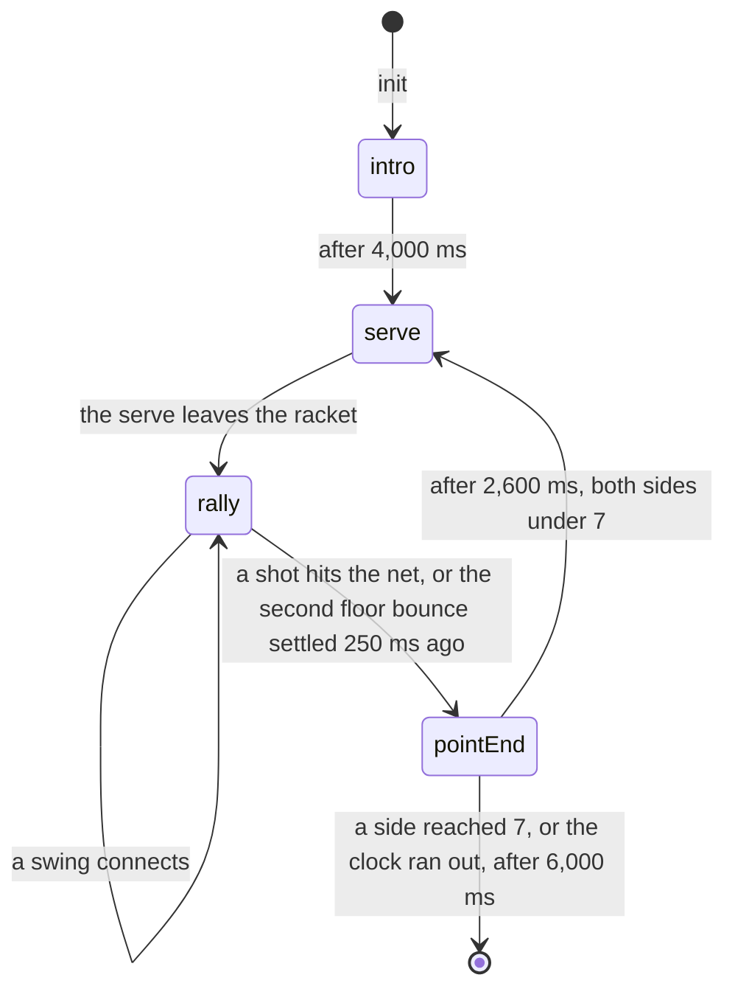

# Bandeja 🎾

**Watch the ball. Swing left or swing right, at exactly the right moment.**

Couchcade's rally game. Two teams face each other across a glass-walled padel court and the ball never
stops: it clips the back wall and comes racing back. Nobody runs. Your player stands their ground and
covers the patch of court around them. All you do is swing your arm the instant the ball reaches you, and
which way you swing is where the ball goes. Hit it clean and it screams past them off the back glass; hit
it late and it flops into the net. 2 to 4 players, first side to 7 points, about 3 minutes.

**For the owner.** Approved 2026-09-21 — see [Owner decisions](#owner-decisions-2026-09-21) at the end.

**For agents.** Everything below is binding for CC-23.2 to CC-23.8.
[platform.md](../architecture/platform.md), [motion.md](../architecture/motion.md),
[session-flow.md](../architecture/session-flow.md), [HOUSE_STYLE.md](../HOUSE_STYLE.md) and
[platform-screens.md](../design/platform-screens.md) still apply. Where this spec and a story disagree,
stop and flag it.

Status: **approved** (CC-23.1). The five decisions in [Owner decisions](#owner-decisions-2026-09-21) were
settled by the owner on 2026-09-21 — the first four before this spec was written, the fifth (3-player
matches) alongside its approval — and the spec follows them.

---

## Contents

- [At a glance](#at-a-glance)
- [Inspiration](#inspiration)
- [Rules and scoring](#rules-and-scoring)
- [Point flow and timings](#point-flow-and-timings)
- [Court, ball and walls](#court-ball-and-walls)
- [Swing timing and shots](#swing-timing-and-shots)
- [Phone controller](#phone-controller)
- [Input message schema](#input-message-schema)
- [TV scene](#tv-scene)
- [Fairness](#fairness)
- [Edge cases](#edge-cases)
- [Budget check](#budget-check)
- [Platform modules reused](#platform-modules-reused)
- [Scene palette: padel](#scene-palette-padel)
- [CC0 asset shortlist](#cc0-asset-shortlist)
- [Found while writing this spec](#found-while-writing-this-spec)
- [Owner decisions (2026-09-21)](#owner-decisions-2026-09-21)

---

## At a glance

| | |
|---|---|
| Pitch | A floodlit padel court in a cage of glass and mesh. Two teams, one ball, long rallies that bounce off the back wall and stay alive. Everyone plays at once. |
| Players | 2 to 4. 2 is singles, 4 is doubles. 3 is doubles with one slot played by the game ([rule 2](#rules-and-scoring), and [finding 1](#found-while-writing-this-spec)). |
| Phone | Swing your arm left or right as the ball reaches your player. A leftward swing (a right-hander's forehand) sends the ball to the left of the TV, a rightward swing (a backhand) to the right. Phones without a gyroscope, or players who pick touch, tap the left or right half of the pad instead. |
| TV | A 480×270 padel court seen from behind and above, net across the middle, glass back walls. A ring closes on your player just before the ball arrives: swing when it snaps shut. |
| Match | First side to 7 points wins outright. About 2.6 minutes for singles, 3.3 for doubles, and never longer than 6. |
| Scoring | One point per rally won. No 15/30/40, no games, no deuce ([owner decision 3](#owner-decisions-2026-09-21)). |
| Movement | Nobody moves in v1. Each player holds a fixed home spot and covers a circle around it. Automatic movement and a proper CPU partner arrive with **CC-23.8**; this spec is the phase before that, not a version missing a feature. |
| Skill | Timing, and only timing. A swing inside ±60 ms of the ball is a clean drive; ±140 ms is a loose ball that sits up for them; ±240 ms is a mishit that usually finds the net. Which way you swing places it. |
| Fairness | The swing's `peakAt` is judged against the ball's arrival with the TV's own display lag subtracted (CC-3.8), so a laggy TV never costs you a point. |
| Cost | About 165 requests for a typical 4-player match, about 2,000 if all four players swing flat out the whole time. |
| Assets | CC0 sounds from Kenney and OpenGameArt, recoloured to the new `padel` palette. The court, cage, net, rackets and ball are drawn from scratch. |

---

## Inspiration

Bandeja copies how these games play, not their names, characters or art.

| Game | What we take from it | Source |
|---|---|---|
| *Wii Sports*, "Tennis" (Nintendo, 2006) | The whole shape of it: you swing, the game moves your player. "In tennis, player movement is controlled by the game's AI, while the swinging of the racket is controlled by the player." Players "use the motion sensor capabilities of the Wii Remote to control the player's dominant arm and/or the appropriate sports equipment it wields." | [Wikipedia](https://en.wikipedia.org/wiki/Wii_Sports) |
| *Wii Sports*, "Tennis" control detail | Shots come out of *how* you swing, not out of a menu: "Swing horizontally for a regular topspin shot", "swing from high to low for a slice shot (which may often hit the net)", "lob by moving the remote from low to high". Serving is "flicking the controller up and then down", and "Timing the hit at the apex of the toss may result in a power serve". Timing rewarded, never a separate button. | [Wikibooks](https://en.wikibooks.org/wiki/Wii_Sports/Tennis) |
| *Nintendo Switch Sports* (Nintendo, 2022) | Proof the formula still lands: Tennis is one of the sports that returned from *Wii Sports*, and "Tennis was reviewed as an impressively polished sport". The article says nothing about its doubles or CPU handling, so nothing here is claimed from it. | [Wikipedia](https://en.wikipedia.org/wiki/Nintendo_Switch_Sports) |
| Padel | The court and the walls. "20 metres (65 ft 7 in) long (side wall)", "10 metres (32 ft 10 in) wide (back wall)", a net "88 centimetres (35 in) in height at the centre and 92 centimetres (36 in) at the ends". "Glass panels are usually used for the back walls and the adjacent corner side sections, while metal mesh panels constitute the remainder of the sides." And the rule that makes padel padel: "You may hit the ball into the walls on your side (but not the fences) as long as the ricochet ball then lands in your opponents' court without fault." Also "Doubles is the most common format" and "Serves are hit underarm after a bounce; the ball is hit at or below waist level." | [Wikipedia: Padel](https://en.wikipedia.org/wiki/Padel) |
| The *bandeja* itself | The game's name. Wikipedia's padel vocabulary defines it as "An overhand shot hit with spin rather than power towards the back of the court." It is **not** in this spec. See [owner decision 4](#owner-decisions-2026-09-21). The game is named after the shot it will one day have. | [Wikipedia: Padel](https://en.wikipedia.org/wiki/Padel) |

What we don't take, and why:

- **Tennis scoring.** Padel "uses the tennis scoring system with an optional exception of a 'golden point'". Friends on a couch can't follow 15/30/40/deuce, and a full set would run 20 minutes. A race to 7 points instead ([owner decision 3](#owner-decisions-2026-09-21)).
- **A serve you perform.** The ball is served into play by the game ([owner decision 2](#owner-decisions-2026-09-21)). *Wii Sports* makes serving a second, different gesture; one gesture is easier to teach across a room.
- **Shot types from the swing's vertical plane.** *Wii Sports* gets topspin, slice and lob out of swinging horizontally, high-to-low or low-to-high. `@couchcade/motion`'s `Swing` measures direction in the **horizontal** plane only (motion.md, [Swing](../architecture/motion.md#swing-cc-54)), and the tap fallback could never express a vertical plane at all. So Bandeja gets its lift from **timing quality** instead: a clean hit drives low and deep, a loose one floats short. Same outcome, one number, and touch players get it too.
- **The padel rule that your shot must bounce on the floor before it may touch their wall.** A real rule, and a real fault. Casual players don't know it, and with static players there is little you can do about it. Left for v2 ([finding 8](#found-while-writing-this-spec)).
- **Out of bounds over the walls.** Real cages are 3 to 4 m high and a ball can leave over the top. In v1 the cage is closed, so every mishit stays in play and gets rallied instead of ending the point quietly ([Court, ball and walls](#court-ball-and-walls)).
- **Movement.** Deferred to CC-23.8, exactly as *Wii Sports* itself handles it: the game moves you.

Research on the timing model:

- **The TV is the clock, not the phone.** Everything a player reacts to happens on the TV, so the host has to judge the swing against what the player *saw*, not what was true. `@couchcade/game-sdk/rewind` already covers this: `withRewind({ subtractDisplayLag: true })` files an input at the tick `ceil((atMs − displayLagMs) / tickMs)`, "for games where players react to something moving on the TV". Its own doc comment names Duck Season **and Bandeja** as the two users. Strike Night explicitly does not need it, because nothing moves while a bowler lines up. Bandeja is the opposite case, and it is the whole reason the game needs CC-3.8's beat-tap calibration.
- **Look-ahead beats a closed form.** The ball bounces off two kinds of wall and off the floor, so there is no formula for "when does it reach this player". The rules already step `@couchcade/physics` at 60 Hz, so they step a throwaway copy forward up to 2.5 s (150 steps, about 3 ms of CPU) whenever the ball's path changes, and record each player's arrival moment. CC-23.8's acceptance criterion 3 asks for exactly this, "unit tests cover landing prediction", so the look-ahead is built once in CC-23.2 and CC-23.8 reuses it to drive movement.
- **Planck is 2D, a rally is not.** The ball's plan view (`x`, `y`) is a Planck body, so wall bounces and continuous collision come for free. Its height (`z`) is plain ballistic arithmetic in the rules. Keeping height out of Planck means the net can be a wall that only exists while the ball is low enough to hit it, rebuilt from state every step the way Strike Night rebuilds a falling pin's spec.

---

## Rules and scoring

1. **Players.** 2 to 4 seated players (`players: { min: 2, max: 4 }`). The game gets them at `init` and nobody joins mid-match. There is no solo mode: Bandeja needs an opponent.
2. **Sides and slots.** Seats fill the four slots in seat order: `a-left`, `b-left`, `a-right`, `b-right`. **Left and right are the TV's left and right, for every player on both sides**. See [Swing timing and shots](#swing-timing-and-shots).

   | Players | Format | Slots |
   |---|---|---|
   | 2 | Singles, 1 v 1 | `a-solo` and `b-solo`, one per side, standing in the middle with a wider reach |
   | 3 | Doubles, 2 v 2, one slot played by the game | `a-left`, `b-left`, `a-right` are people; `b-right` **auto-returns** ([rule 10](#rules-and-scoring)) |
   | 4 | Doubles, 2 v 2 | all four slots are people |

   The owner approved this rule on 2026-09-21 ([owner decision 4](#owner-decisions-2026-09-21)); see [finding 1](#found-while-writing-this-spec) for the alternatives it beat.
3. **Home spots and reach.** Nobody moves in v1. Each slot stands on a fixed spot and can play any ball whose plan position is within `REACH` metres of it and whose height is between 0 and 2.4 m.

   | Slot | Home (x, y) | Reach |
   |---|---|---|
   | `a-left` | (2.6, 6.4) | 2.4 m |
   | `a-right` | (7.4, 6.4) | 2.4 m |
   | `b-left` | (2.6, 13.6) | 2.4 m |
   | `b-right` | (7.4, 13.6) | 2.4 m |
   | `a-solo` | (5.0, 6.0) | 3.6 m |
   | `b-solo` | (5.0, 14.0) | 3.6 m |

   Two doubles slots with 2.4 m of reach cover x from 0.2 to 9.8 at their own depth and thin out fast in front of and behind them, so placing the ball short or deep is how points are won. A singles player alone on a 10 m court gets 3.6 m instead, which covers the width at their depth but leaves the same short and deep gaps. **Movement and a real CPU partner are CC-23.8's job.** This is the phasing the epic intends: CC-23.2 builds the rules on fixed spots, CC-23.8 lifts them off those spots.
4. **Serving.** Every point is served into play by the game, never by a player ([owner decision 2](#owner-decisions-2026-09-21)). Side A serves point 1, then the serve alternates every point; within a side the serving slot alternates too. The ball starts at the serving slot's home spot at waist height (0.9 m) and is hit underarm, as padel serves are, diagonally into the receiving side. The aim point is the diagonal slot's home spot, jittered by up to ±0.7 m across and ±0.5 m along the court from `createRng(seed)`, so serves vary but a replay reproduces them exactly. The serve counts as shot 1 of the rally, and it always lands inside the receiver's reach, so there are no aces.
5. **Hitting.** Any player may swing at any time. There is no turn, and swinging when the ball is nowhere near you costs nothing but a 400 ms cooldown. A swing connects when the ball is live, on the swinger's own side of the net, inside their reach at the moment they acted, and within 240 ms of that player's arrival moment. Everything else is a whiff. See [Swing timing and shots](#swing-timing-and-shots).
6. **Losing a point.** A rally ends in exactly two ways:

   | | What happens | Point to |
   |---|---|---|
   | **Net** | A shot's height at the moment it crosses `y = 10` is below the net there | the other side |
   | **Double bounce** | The ball touches the floor twice on one side without being hit | the other side |

   There is no "out". The cage is closed in v1, so a wild shot rattles around the glass and stays in play. That is deliberate: it turns a bad swing into a longer rally instead of a silent point.
7. **Winning.** First side to **7 points** wins the match outright ([owner decision 3](#owner-decisions-2026-09-21)). One point per rally, no advantage, no games, no sets. 7 is the tuning constant `TARGET_POINTS`; see [Point flow and timings](#point-flow-and-timings) for why it is 7.
8. **Match clock.** A match is capped at 6 minutes (`MATCH_MAX_MS`). When the cap passes at the end of a point, the side ahead wins. If the sides are level, the next point wins it.
9. **The squeeze.** A rally that reaches 30 shots shrinks every player's reach by 10% per further 6 shots, floor 0.8 m. It has never been needed in the model below; it exists so a rally cannot run forever, and it is the only part of the game that changes a player's reach mid-point.
10. **Auto-return.** A slot auto-returns when it is the empty slot in a 3-player match, or when a player is **away**: their last 3 arrival moments passed with no swing within 240 ms of any of them. An auto-returning slot hits every ball it can reach at the `ok` grade, straight down the middle (`aim` 0, `speed` 0.5). Any accepted swing clears away at once. This is a stand-in, not an opponent: it has no movement, no difficulty, and no aim. **CC-23.8 replaces it** with the real CPU. A dropped phone therefore never hands the match away, which is the same promise Strike Night's auto-roll makes.
11. **Match end.** When a side reaches 7, when the match clock runs out, or when no seated players remain on one side.
12. **Placements** (`outcome`). Both players on the winning side share place 1, both on the losing side share place 3 (1, 1, 3, 3), and in singles it is 1 and 2. `score` is the player's own side's points.
13. **Players leaving.** When a seat expires (`onPlayerLeft`), their slot starts auto-returning for the rest of the match, so their partner is not left alone. If a whole side empties, the match ends with placements.
14. **Randomness.** Only the serve jitter, and only from `createRng(seed)`. Physics, timing grades and auto-return are all deterministic, so replays and restores are exact.

## Point flow and timings



| Phase | Length | TV | Phone |
|---|---|---|---|
| `intro` | 4,000 ms | The empty court, floodlights coming up. Title chip "Bandeja · first to 7". Bottom panel: "Swing when the ring closes". | Everyone gets `bj-play` with the safety hint. |
| `serve` | 900 ms | The server bounces the ball and hits it underarm. The receiver's ring starts closing. | Unchanged. |
| `rally` | Until the point ends. Typically 11 s, at most the squeeze. | The ball flies, bounces, rebounds off the glass. Rings close on whoever can reach it. A shot counter chip counts the rally. | Unchanged. The big action stays live the whole point. |
| `pointEnd` | 2,600 ms, 6,000 ms after the last point | `POINT!`, `NET!` or `WINNER!` over the court. The scoreboard ticks. | One `bj-play` batch with the new score and the last point's result. |

**How long a shot takes.** A clean drive leaves the racket at 14 m/s and lands about 11.8 m away after
0.85 s. The defender either volleys it out of the air on the way through, or lets it pass, bounce, come off
the back glass and return, which adds about 0.8 s. Averaged over both, **a shot is about 1.8 s**.

**How long a point takes.** Singles has fewer rackets on court, so more balls go through and rallies are
shorter; a slot that auto-returns is predictable and gets passed sooner.

| Players | Shots per rally | Rally | Plus 2.6 s between points | Points in a 7-x match | Typical match | Longest realistic |
|---|---|---|---|---|---|---|
| 2 (singles) | about 6 | 10.8 s | 13.4 s | 11 typical, 13 at 7–6 | **about 2.6 min** | about 3.1 min |
| 3 (one auto slot) | about 7 | 12.6 s | 15.2 s | 11 to 13 | **about 3.0 min** | about 3.5 min |
| 4 (doubles) | about 8 | 14.4 s | 17.0 s | 11 to 13 | **about 3.3 min** | about 3.9 min |

Add 4 s of intro and 6 s of match end to every row. The 6-minute cap in [rule 8](#rules-and-scoring) is
about 55% above the longest realistic 4-player match, so it only ever catches a pathological match.

**Why 7.** The shipped games run about 1 minute (Quick Draw), about 2 minutes (Target Range) and 4 to 14
minutes (Strike Night). Bandeja is a motion game with a permission step in front of it, so it needs to be
worth standing up for; doubles at 7 points lands at 3.3 to 3.9 minutes, in the middle of that range and
the same ballpark as a single Strike Night player's game. 5 points would put doubles at 2.4 minutes, less
than the motion step deserves. 9 points would push a 4-player match to 4.2 to 4.8 minutes and a bad one
into the 6-minute cap. `TARGET_POINTS` is a single constant, and **CC-23.7's playtest is the right place
to raise it to 9 if real rallies turn out shorter than this model**. Singles at 2.6 minutes is the row
with the least headroom.

---

## Court, ball and walls

The rules own the physics: `onTick` steps `@couchcade/physics` during `serve` and `rally`, and `TState`
holds the ball's `BodyState` plus its height, as the game contract (rule 5) and session-flow.md's
[physics rules](../architecture/session-flow.md#physics-package) say. Planck never reaches phones
(session-flow.md owner decision 4). Units are metres. Every number below is a named constant CC-23.2 may
tune once.

### The plan view

`x` runs across the court, 0 at the TV's left wall to 10 at the right. `y` runs along it, 0 at side A's
back wall to 20 at side B's. The net is at `y = 10`. Side A defends `y < 10` and hits towards `+y`; side B
defends `y > 10` and hits towards `−y`.

| Part | Spec | Why |
|---|---|---|
| Ball | `circleBody({ radius: 0.033, density: 16.4, friction: 0.2, restitution: 0.9, damping: floorFriction(6000), bullet: true })`, 56 g | A padel ball is 6.35 to 6.77 cm across. At 14 m/s it crosses 3.5 ball widths per step, so it must be a bullet or it tunnels through the glass. The 6 s half-life is air drag. |
| Back glass | `wallSegment([0, 0], [10, 0])` and `wallSegment([0, 20], [10, 20])`, restitution 0.85 | "Glass panels are usually used for the back walls" |
| Corner glass | The side walls for `y` in 0–4 and 16–20, restitution 0.85 | "…and the adjacent corner side sections" |
| Side mesh | The side walls for `y` in 4–16, restitution 0.55 | "metal mesh panels constitute the remainder of the sides". Mesh gives, so it kills a rebound |
| Net | `wallSegment([0, 10], [10, 10])`, restitution 0.1, **in the spec only while the ball's height is below the net there** | The world spec is rebuilt from state every step, as Strike Night rebuilds a falling pin's, so this stays pure |
| Net height | `netHeight(x) = 0.88 + 0.04 × abs(x − 5) / 5` | "88 centimetres in height at the centre and 92 centimetres at the ends" |

There is no ceiling and no top to the walls: the cage is closed, so the ball can never leave
([rule 6](#rules-and-scoring)).

### Height

Height (`z`, metres, 0 is the floor) is not a Planck value. Each step the rules do
`vz −= 9.81 × dt` and `z += vz × dt`, then:

1. **Floor bounce.** When `z` would go below 0: `z = 0`, `vz = −vz × 0.75`, and the plan speed drops to
   85% (turf grabs). The bounce is counted for the side the ball's `y` is on. The **second** floor bounce
   on one side ends the point 250 ms later ([Fairness](#fairness) rule 3).
2. **Net.** When the ball's `y` crosses 10, its `z` at the crossing is compared with `netHeight(x)` plus
   the ball's radius. Below it, the shot hit the net: the ball drops dead on the hitter's side and the
   point goes to the other side. It is not a special case in the rules. The net is a Planck wall whenever
   the ball is low enough, so a ball that clips the tape also bounces back realistically.
3. **Wall bounces keep their height.** A glass or mesh rebound turns the ball in plan and damps its plan
   speed. `z` and `vz` carry straight through. A real ball loses a little height off a wall; this
   simplification keeps wall rallies alive, which is the point of having walls.

### Look-ahead

The ball's path changes at the serve, at a connected swing, at a wall bounce and at a floor bounce. Each
time, the rules run `predict(state)`: a copy of the world stepped forward up to 2.5 s at the same 60 Hz, recording for each
slot the first window in which the ball is inside that slot's reach with `z` in 0 to 2.4, and the moment
inside that window at which the ball's plan distance to the slot's home spot is smallest. That moment is
the slot's **arrival moment**, `arriveAt`, and there is at most one per slot per shot. A slot with no
arrival moment cannot touch this shot at all.

`predict` costs 150 steps of one body, about 3 ms, a handful of times per rally. It is a pure function of
state, so it is also what CC-23.8 will use to move players and drive the CPU, which is why it belongs in
`games/bandeja/src/shared/` from CC-23.2 and not inside CC-23.8's `ai/` folder.

### Worked numbers

These are the model the timings and the scoring target are built on. CC-23.2 keeps them as unit tests with
ranges, the way Strike Night keeps its prototype targets.

| Shot | From | Result |
|---|---|---|
| Clean drive, `a-right` at (7.4, 6.4), contact at 0.8 m, aim 0 | 14 m/s, lift 3.2 m/s | Crosses the net 0.26 s later at 1.30 m, well clear. Lands 11.83 m away at `y = 18.2`, 1.8 m short of the back glass. |
| The same drive, through `b-right`'s reach | | Enters the reach circle at `y = 11.2`, 0.34 s in and 1.32 m up. Closest approach, which is `arriveAt`, is at `y = 13.6`, 0.51 s in and 1.15 m up. It leaves the circle at `y = 16.0` still 0.69 m up. Volleyable for 0.34 s. |
| The same drive, left alone | | Bounces at 18.2, comes off the back glass at 20, and is back inside `b-right`'s reach at `y = 12.5` before it touches the floor again. That is 0.78 s of extra time, and the whole reason padel has walls. |
| Loose (`ok`) return, contact at 0.7 m | 11.2 m/s, lift 2.6 m/s | Crosses the net at 1.03 m. Lands at `y = 14.5`, right on top of the defender. A gift. |
| Mishit off a low ball, contact at 0.8 m | 7 m/s, lift 1.4 m/s | Reaches the net line 0.51 s later at 0.22 m, against a net 0.89 m high there. **Into the net.** |
| Mishit off a high ball, contact at 1.8 m | 7 m/s, lift 1.4 m/s | Clears the net at 1.22 m but lands at `y = 11.8`, a sitter just over the net. |

The two mishit rows are the model behaving well without a special case: shank a low ball and you find the
net, shank a high one and you float it up for them.

---

## Swing timing and shots

### The grade

When a swing is accepted, the rules have two numbers. `actedMs = ctx.atMs − ctx.displayLagMs` is the
room-clock moment the player acted, with the TV's own lag removed ([Fairness](#fairness) rule 1).
`arriveAt` is the swinging slot's arrival moment for the shot in flight. The **timing error** is `error = actedMs − arriveAt`, signed: negative
is early, positive is late.

| Size of `error` | Grade | Plan speed | Lift | Aim scatter |
|---|---|---|---|---|
| ≤ 60 ms | `clean` | 14.0 m/s | 3.2 m/s | none |
| ≤ 140 ms | `ok` | 11.2 m/s | 2.6 m/s | ±4° |
| ≤ 240 ms | `mishit` | 7.0 m/s | 1.4 m/s | ±11° |
| more, no `arriveAt`, ball on the wrong side of the net, or `z` above 2.6 at contact | `whiff` | none | none | none |

A whiff changes nothing but the phone's 400 ms cooldown. Scatter is a deterministic function of `error`,
not a random draw. Its size grows across the band,
`scatter = maxScatter × (abs(error) − bandStart) / (bandEnd − bandStart)`, and its sign follows the sign of
`error`, so swinging early pulls the ball one way and swinging late pulls it the other. The same swing
always gives the same ball ([Fairness](#fairness) rule 4).

**Where the ball is hit from.** The contact point is the ball's position at `actedMs`, recomputed from the
shot's own launch state rather than read off a tick, so it is exact whatever the lag
([Fairness](#fairness) rule 2). At the edge of the mishit window that is up to 2.9 m from the ideal
point. A stretch, and it plays like one.

### Speed and the tap fallback

Plan speed is multiplied by `0.85 + 0.30 × speed` from the swing, so a swing can move the pace by ±15% and
no more. That is deliberate: a tap emits a fixed `speed` of 0.7 (motion.md,
[Swing](../architecture/motion.md#swing-cc-54)), which lands at 1.06, just above the middle of the range.
A touch player is never behind a motion player on pace, and a motion player still gets something back for
swinging hard. **Timing carries the game; strength is decoration.**

### Aim, forehand and backhand

`angle` from the swing becomes a lateral aim: `aim = clamp(angle, −60, 60) / 60`, and the ball leaves at
`θ = 22° × aim` from straight down the court. A tap on the left half of the pad gives `angle` −60 and a tap
on the right half +60, so a tap is always full aim, one way or the other. Over a clean drive's 11.8 m of
flight, full aim moves the ball 4.8 m sideways, half the width of the court, which is enough to place it
past a defender.

**Left and right mean the TV's left and right, for every player.** Everyone in the room is looking at one
screen, and side B's players face the camera, so a player-relative mapping would mirror for half the room
and for half the tap pad. A leftward swing sends the ball to the left of the TV whichever side you are on.

That is still the forehand and the backhand motion.md describes: "A right-hander's forehand crosses the
body to the left (negative) and a backhand to the right (positive)". The two names are the two directions.
Which **stroke the TV animates** is chosen separately, from which side of the player's body the ball is
on, so a player reaching to their right always plays a backhand on screen whichever way they aimed. The
phone says "Left or right"; the spec and the TV say forehand and backhand. CC-23.7's playtest is the check
on whether that reads.

---

## Phone controller

`needsMotion: true`. Before the match the platform runs the approved motion step (CC-5.10): "Tap to enable
motion", one second of holding still, the portrait lock or iPhone hint, the wake lock and tap to resume.
Phones that deny motion, have no gyroscope (owner decision 5 in motion.md) or pick "Use touch instead" get
the tap pad, and the TV shows the touch icon from CC-5.10. The game treats both the same.

Every phone has controls for the whole match. There is no watching screen: everyone may swing at any time
([rule 5](#rules-and-scoring)).

### Motion controls

- **Hold.** Portrait, like holding a racket, facing the TV. The first `bj-play` of the match carries
  "Room to swing? Go for it" (motion.md [Safety](../architecture/motion.md#safety) rule 3).
- **No grip button.** The detector is `createSwingDetector({ emitOn: "peak", minPeak: 320 })`. The
  controller calls `swing.mark({ type: "grip-down", t })` when a point starts and
  `swing.mark({ type: "grip-up", t })` when it ends, with no pointer involved. Grip-down captures the
  phone's heading as forward, so every swing in one rally shares a reference and a player who turned to
  talk gets re-referenced at the next point.
- **`minPeak` is raised to 320 deg/s**, from the 240 default that motion.md marks "game may tune". Bandeja
  listens for three minutes with no button in front of it, so a phone waved while talking would otherwise
  become a swing. 320 is still well under a deliberate swing's several hundred. CC-23.3 checks it against
  CC-5.9 traces.
- **Sending.** On each `Swing` the controller calls
  `fire({ type: "swing", payload: { point, speed, angle } }, localPeakT)`, so the input's `at` is the
  moment of the peak. `spin` and `peakAt` stay on the phone: v1 has no spin
  ([owner decision 4](#owner-decisions-2026-09-21)) and `at` already carries the peak.
- **Cooldown.** The detector's own 400 ms `emitOn: "peak"` cooldown is the send rate limit: at most 2.5
  messages a second, inside the platform's 4.

### Touch controls

- **Tap pad.** The big action becomes the pad, labelled "Tap left or right". `createSwingTap({ pad })` from
  `@couchcade/motion/fallbacks` reads it, with `pad` a function so a resized pad still splits in half.
- A tap emits `{ speed: 0.7, angle: −60 or 60, spin: 0, peakAt }` at the `pointerdown` time, with the same
  400 ms cooldown. Left half is −60, right half is 60.
- **Why tap, not swipe.** The CC-23 epic names a tap fallback, and motion.md's own wording is "for Dinger
  Derby and Bandeja, where timing is the whole game". A swipe would put 60 px of finger travel between the
  moment the player decides and the moment `peakAt` is stamped, in a game whose clean window is ±60 ms. A
  tap stamps the decision itself. Bandeja throws away nothing by tapping, because it uses neither spin nor
  fine-grained speed.

### Screens

| Screen | Big action | Status line | Hint | Cue |
|---|---|---|---|---|
| `bj-play`, motion, first point | Disabled, "Swing your arm" | "Bandeja · first to 7" | "Room to swing? Go for it" | `your-turn` |
| `bj-play`, motion | Disabled, "Swing your arm" | "3 – 2 · your serve" or "3 – 2" | "Watch the ring on the TV" | none |
| `bj-play`, touch | Sunny pad, "Tap left or right" | as above | "Tap as the ring closes" | none |
| swung (local, 400 ms) | Pressed / flashed | unchanged | unchanged | `press` |
| `bj-play` after a point | as above | "Point! 4 – 2", "Their point · 3 – 3" or "Net · 3 – 3" | "Watch the ring on the TV" | `celebrate` on a point won |
| `bj-end` | Chalk, "Watch the TV" | "You won 7 – 4" or "They won 7 – 4" | "Nice rallies" | `celebrate` on a win |

- Every line stays under 40 characters.
- **The phone is never the timing cue.** A `controller:state` batch takes far too long to arrive to be
  swung against, so the phone's status line is score and context only, and the TV's closing ring is the
  cue. The host sends views at the start of the match, once per `pointEnd`, and at match end. During a
  rally the phone shows nothing new at all, which is exactly right: you should be looking at the TV.
- In motion mode the big action is the Disabled state, as Strike Night's "Ball away!" is, because there is
  nothing to press. Tapping it in motion mode does nothing in v1
  ([finding 7](#found-while-writing-this-spec)).
- View data (`TView`), well under 1 KB:

```ts
type BandejaView = {
  side: "a" | "b";
  slot: "left" | "right" | "solo";
  scores: [a: number, b: number];
  target: number;                  // always 7
  point: number;                   // the point about to be played, echoed in swing
  partner: string | null;          // null in singles; "" when the slot auto-returns
  opponents: string[];             // 1 or 2 names
  serving: boolean;                // this player's side serves this point
  last: {                          // the point just finished, null before point 1
    won: boolean;
    reason: "net" | "double-bounce" | "squeeze";
  } | null;
};
```

## Input message schema

One input type, through one CC-3.6 input channel. A swing is a discrete event, so it goes out with `fire`
(motion.md "Fitting the input budget", rule 2) with the swing's peak as `eventTimeStamp`.

```ts
import { z } from "zod/mini";

const point = z.int().check(z.gte(1), z.lte(99));

export const inputSchema = z.discriminatedUnion("type", [
  // One swing from createSwingDetector or createSwingTap, without spin or peakAt.
  z.object({
    type: z.literal("swing"),
    payload: z.object({
      point,
      speed: z.number().check(z.gte(0), z.lte(1)),
      angle: z.int().check(z.gte(-180), z.lte(180)),
    }),
  }),
]);
export type BandejaInput = z.infer<typeof inputSchema>;
```

`point` counts points from 1. A match reaches at most 13 points and the cap is 99, which a 6-minute match
cannot exceed. A swing stamped with an old `point` is dropped, so a message that crawls in after the point
ended can never score.

On the wire, with `at` added by the send helper and `from` by the relay:

```json
{ "t": "input", "d": { "type": "swing", "payload": { "point": 5, "speed": 0.7, "angle": -60 }, "at": 1789571234567 } }
```

About 100 bytes, well inside the 1 KB cap.

What `onPlayerInput` does:

| Input | Accepted when | Effect |
|---|---|---|
| `swing` | Phase `serve` or `rally`, `payload.point` is the current point, the player holds a slot | Clears away. Grades it ([Swing timing and shots](#swing-timing-and-shots)). On `clean`, `ok` or `mishit` the ball is relaunched from the contact point and `predict` reruns. On `whiff`, nothing. |

Anything else is ignored. Two swings that connect at the same tick apply in arrival order: the first hits
the ball, and the second finds it already gone and whiffs. In doubles that is the "yours!" moment, and it
is deterministic.

---

## TV scene

| | |
|---|---|
| World | 480×270, integer scaled, pixel art. A floodlit padel court in a glass-and-mesh cage, seen from behind and above side A, with an evening sky over the far wall. |
| Scene palette | `padel`, new. See [Scene palette: padel](#scene-palette-padel). |
| Projection | Orthographic with a squashed depth, so a 20 m court fits without perspective distorting the physics: `sx = 240 + (x − 5) × 40`, `sy = 236 − y × 9.2 − z × 14`. The court spans 400 px across and 184 px deep, from `sy` 236 at the near wall to 52 at the far one. 1 m of height is 14 px, so a lob rises visibly. |
| Net | At `y = 10`, `sy` 144, drawn 12 px tall, which is 0.88 m at the height scale, with Chalk tape and a `#5B6479` band. |
| Cage | The far glass is a 22 px Glass band above `sy` 52 with an Ink frame, not its true 4 m: at 14 px per metre a real 4 m wall would eat the scoreboard. The side walls are 12 px bands at `sx` 28–40 and 440–452, Glass at the corners and a Frame mesh hatch in the middle 12 m. The near back wall is behind the camera and not drawn. |
| Ball | An 8×8 Sunny sprite with an Ink outline. That is 0.2 m, three times life size, because a real padel ball is 2.6 px across at this scale and would be invisible. Under it, always on the floor at `sy = 236 − y × 9.2`, an 8×4 Ink-20% shadow ellipse. **The shadow is how height reads**, and it is not optional. |
| Players | World Pips on their home spots, 16×24, feet at `sy = 236 − y × 9.2`. That is 0.4 m wide and 1.7 m tall at the two scales, which is life size. Side A's Pips face away, side B's face the couch; the Pip spec has no back view, so side A uses the same front view as Target Range and Strike Night do. |
| Rackets | A 6×10 prop in the Pip's hand, swung through 3 frames on a connect. The stroke is forehand or backhand by which side of the body the ball is on, never by the swing's direction ([Swing timing and shots](#swing-timing-and-shots)). |
| Swing ring | A 3 px Chalk ring around the slot whose arrival moment is next, shrinking from 3× to 1× its Pip over the 280 ms before `arriveAt` and snapping Sunny at it. This is the game's only timing cue, and it is drawn from the same state the host judges against, so the player and the host agree by construction. In doubles two rings can close at once; both slots may swing. |
| Overlays | From `@couchcade/stage`: scoreboard with a chip per player grouped by side, the round counter chip showing the rally's shot count, callouts, room code panel. The bottom instruction panel follows Quick Draw's game-local panel until the stage package has one. |
| Callouts | `POINT!` when a rally ends, `NET!` when a shot found the net, `WINNER!` when a clean drive went through a gap nobody could reach, `MATCH!` at the end. Nothing ever names the player who missed. |
| Expressions | On `pointEnd` the winning side's Pips look happy and the losing side's neutral. Nobody looks sad. |
| Motion | Smooth ball movement, 3-frame racket swings, a 2 px squash on the Pip at contact. `POINT!` and `MATCH!` use the `celebrate` token with its 4 px shake, `NET!` the `ui` pop. Reduced motion: no shake, no squash, callouts appear without scaling. **The swing ring still shrinks**, because it is information, not decoration. |
| Sound | Music loop, ducked during a rally. A racket pock on every connect, pitched by grade: bright for `clean`, dull for `mishit`. A turf thud on a floor bounce, a glass ping on the back and corner glass, a mesh rattle on the sides, a net flub on a net fault. A crowd swell on `POINT!`, a jingle at `MATCH!`. Every sound has a visual cue: the racket, the shadow meeting the floor, the wall that flashed, the net, the callout. |

### Readability from the couch

Bandeja follows the CC-4.11 rule in platform.md,
[TV rendering](../architecture/platform.md#tv-rendering-cc-411): pixel-art world at 480×270, text and
overlays at the TV's own resolution.

1. **No text in the world.** Names, scores, the shot counter and callouts are overlay text in 1080p
   overlay pixels. No sprite has letters or digits baked in.
2. **Room code on screen all match.** The scene calls `addRoomCode` with `roomCode` and `joinUrl` from
   `HostSceneData`, bottom right, with the instruction panel to its left, as Quick Draw does (CC-10.9).
3. **Who can hit it.** The closing ring, plus the slot's player shape (`drawPlayerShape`, 9×9) floating
   over its Pip. Colour is never the only cue.
4. **One ball, one focus.** There is only ever one ball. The rings are the only other moving overlay, and
   they only exist in the 280 ms before an arrival.
5. **Height is legible.** The shadow, the ring and the net's 12 px band give three independent reads of how
   high the ball is. The highest a ball gets in normal play is about 1.4 m, so it floats about 20 px above
   its shadow at the top of its arc and sits on it when it lands.
6. **Clear space.** The court's far edge sits at `sy` 52, below the scoreboard's 14% (38 px). The near edge
   at 236 leaves 34 px for the bottom panel. That is tight, and CC-23.4 should check it at 1080p before the
   panel's final height is set.
7. **Scoreboard by side.** Player chips are grouped into two blocks with the side's points between them, so
   a glance reads "4 – 2", not four separate numbers.

---

## Fairness

1. **The TV's lag is subtracted, not ignored.** Players react to the ball on the TV, which is behind the
   host by `displayLagMs` from CC-3.8's beat-tap calibration. The rules judge every swing on
   `ctx.atMs − ctx.displayLagMs`, and the game wraps its rules in
   `withRewind({ subtractDisplayLag: true })` (CC-3.7), whose own documentation names Bandeja as a user.
   A slow TV costs nothing.
2. **Network lag is already gone.** `peakAt` is room time, stamped from the swing's peak and carried as
   the input's `at` through `toHostTime` (platform.md). A message that took 200 ms to arrive is still
   judged at the moment the arm moved. The contact point is recomputed from the shot's launch state at
   that moment rather than read off whichever tick the message landed on, so lag cannot move the ball
   either.
3. **A point is never awarded too early.** The rules wait `POINT_SETTLE_MS` (250 ms) after the second floor
   bounce before ending the rally, and rewind reaches 150 ms back on top of that, so an ordinary late
   swing still saves the point. A swing later than that is dropped. By then the player watched the ball
   bounce twice, so it is fair on both sides.
4. **No luck in a rally.** The serve's lateral jitter is the only random value in the game, it comes from
   `createRng(seed)`, and it is drawn before the point rather than during it. Grades, scatter, physics and
   auto-return are all deterministic, so the same swings always give the same match. The replay test in
   CC-23.2 checks a whole recorded match.
5. **Both sides get the same court.** The court is symmetric about the net, both sides get the same reach
   and the same windows, and the serve alternates every point.
6. **Touch versus motion.** A tap stamps the player's decision with less delay than an arm swing does, so
   touch is, if anything, slightly better at timing, and it gives up nothing, because Bandeja uses neither
   spin nor fine-grained speed. A tap's fixed `speed` 0.7 lands at 1.06 on the pace multiplier, just above
   the middle. That is the right way round for a party game: the player with the older phone is not the
   player who loses.
7. **Everyone may swing at everything.** There is no turn to miss and no "it wasn't my ball". A swing at a
   ball you cannot reach costs a 400 ms cooldown and nothing else.
8. **Known limit.** The swing angle on real phones is not verified yet (motion.md,
   [Testing with recorded traces](../architecture/motion.md#testing-with-recorded-traces)), and Bandeja
   needs only its **sign**, not its value, because `aim` saturates at ±60°. That is a much weaker
   requirement than Strike Night's ±1.5° steering. CC-23.3 records one forehand and one backhand trace per
   platform; if the sign turns out unreliable, the motion mode falls back to the tap pad with no redesign.

## Edge cases

| Case | What happens |
|---|---|
| A phone locks or drops mid-match | No swings arrive. After 3 arrival moments pass untouched the slot auto-returns ([rule 10](#rules-and-scoring)), so their partner keeps playing and the match never stalls. The seat is kept for 2 minutes. On rejoin the phone gets its current view and "Tap to resume" restarts the sensors; the next swing clears away. |
| 3 players | `b-right` auto-returns for the whole match. See [finding 1](#found-while-writing-this-spec). |
| Seat expires mid-match | `onPlayerLeft` turns the slot into an auto-returning one. If a whole side empties, the match ends with placements. |
| Both partners swing at the same ball | Inputs apply in arrival order at their tick. The first connects, the second whiffs. |
| A swing arrives after the point ended | `payload.point` no longer matches, so it is dropped. |
| A ball nobody can reach | It bounces twice and the point is awarded. That is a `WINNER!`. |
| A ball that rattles between the side walls | It stays in play until it bounces twice on one side. The mesh's 0.55 restitution kills a sideways rebound in two or three hits. |
| A shot that clips the net tape | The net is a Planck wall whenever the ball is low enough, so the ball bounces back and lands on the hitter's side: a net fault, the same as any other. |
| A ball above 2.6 m when a player swings | A whiff. It sailed over them. This is the lob that timing accidentally produces, and it is a legitimate way to lose a point. |
| A rally that will not end | The squeeze ([rule 9](#rules-and-scoring)) shrinks every reach from shot 30. |
| The match clock runs out | At the end of the current point the side ahead wins. Level, and the next point decides it. |
| Late joiner | Gets a seat and waits on the platform `next-game` screen. They play from the next match. |
| Audience | Sees the platform `audience` screen and cannot send input. |
| Motion stops mid-match (no samples for 2 s) | CC-5.10 switches the player to touch. The tap pad appears on the next view; until then their slot auto-returns after 3 missed arrivals. |
| Page rotates on an iPhone without orientation lock | Motion maths uses the device frame (motion.md flow rule 8). The big action stays centred. |
| TV refresh or deploy mid-point | The point in progress is lost. `snapshot` stores `{ pts, srv, slots }`: the two scores, which side serves next, and each player's slot, about 120 bytes, no positions (session-flow.md snapshot rule 4). `restore` resumes by serving the next point. |
| A swing while the ball is on the other side of the net | A whiff. You cannot poach across the net, as in real padel. |
| A player swings continuously | The detector's 400 ms cooldown caps them at 2.5 messages a second, and off-ball swings do nothing. See [Budget check](#budget-check). |

---

## Budget check

Caps from [platform.md](../architecture/platform.md#the-caps): phones at most 4 messages per second, host
`controller:state` at most 1.5 per second. Every message that reaches the room costs 1 request.

**Per point.** A 4-player rally is about 8 shots. Each shot draws a swing from the player it reached and
usually one hopeful swing from a partner: about 12 phone messages per point. The host sends 1
`controller:state` batch per `pointEnd`.

| Per match, 4 players, 11 points, 197 s | Typical | Every phone swinging flat out |
|---|---|---|
| Phone input | 11 × 12 = 132 | 4 phones × 2.5/s × 197 s = 1,970 |
| `controller:state`: 1 at the start, 1 per `pointEnd`, 1 at the end | 13 | 13 |
| `room:snapshot`: 1 at the start + 1 per point | 12 | 12 |
| `room:phase` in and out | 2 | 2 |
| `motion:status`: 1 per phone | 4 | 4 |
| **Total** | **163 in 3.3 min** | **2,001** |

| Check | Bandeja | Cap | Fits |
|---|---|---|---|
| Messages per phone | The swing detector's 400 ms cooldown is a hard 2.5 per second, and off-ball swings are the only way to reach it. | 4 per second | Yes, by the gesture's own cooldown |
| Host `controller:state` | 13 in 197 s, about 0.07 per second. Batches are at least 2.6 s apart, because they only fire at `pointEnd`. | 1.5 per second, 667 ms apart | Yes, by a wide margin |
| One hour of only Bandeja, 4 players, typical | 3,600 / 234 s (match plus menu) ≈ 15 matches × 163 = about 2,450 | platform.md plans 4 × 720 + 1,800 = 4,680 per hour for 4 phones in turn-based games | Yes, under half |
| One hour, worst case: four players swinging flat out all match | 15 × 2,001 = about 30,000 | One real-time phone for an hour is 14,400; platform.md's 4-phone real-time hour is about 64,000 | Yes, under half |

`realtime` is `true`: `onTick` drives the ball, the look-ahead and the match clock. For the budget Bandeja
is a real-time game, unlike Strike Night. But its input is event-shaped rather than a stream, so it costs
far less than a streaming real-time game.

---

## Platform modules reused

Bandeja adds no new platform code. Anything missing below belongs to the owning story, not to this game.

| Module | Used for | Story |
|---|---|---|
| `@couchcade/game-sdk/contract` | `defineGame`, `defineGameMeta`, `defineController`, `InputContext.atMs` and `.displayLagMs`, `outcome`, `snapshot`/`restore`, `onPlayerLeft`, `HostSceneData.roomCode` | CC-1.13 |
| `@couchcade/game-sdk/clock` | `toHostTime` inside `send`, the synced check before the first swing counts | CC-1.14 |
| `@couchcade/game-sdk/input` | `createInputStream`: `swing` with `fire` and the swing's peak as `eventTimeStamp` | CC-3.6 |
| `@couchcade/game-sdk/rewind` | `withRewind({ subtractDisplayLag: true })`, so a swing lands on the tick the player acted in as they saw it | CC-3.7 |
| TV lag (`displayLagMs`) | The beat-tap calibration Bandeja subtracts from every swing | CC-3.8 |
| `@couchcade/game-sdk/testing` | `testGameContract`, `createFakeRoom`, `replay` with one recorded match | CC-1.13 |
| `@couchcade/physics` | `stepWorld`, `circleBody` (the ball, a bullet), `wallSegment` (glass, mesh, the net), `floorFriction` (air drag), contacts for sound cues. Host and rules only. | CC-3.9 |
| `@couchcade/motion/calibration` | `createPoseTracker` from the motion step's calibration | CC-5.3 |
| `@couchcade/motion/gestures` | `createSwingDetector({ emitOn: "peak", minPeak: 320 })` | CC-5.4 |
| `@couchcade/motion/fallbacks` | `createSwingTap({ pad })` for the tap pad | CC-5.4 |
| Controller motion step | Permission, calibration, `motion:status`, touch icon, wake lock, tap to resume, portrait lock and iPhone hint, fake adapter for E2E | CC-5.2, CC-5.10, CC-1.17 |
| `@couchcade/protocol` | `PlayerInfo`, `ControllerView`, `JsonValue` types | CC-1.8 |
| `@couchcade/ui` | Big action (Sunny, Disabled and Chalk states), player chip, `press` haptic | CC-4.4, CC-7.5 |
| `@couchcade/stage` | `StageScene` with world and overlay cameras, scoreboard, round counter, callouts, room code panel, `drawPlayerShape`, `worldToOverlay`, World Pips | CC-4.6, CC-4.11, CC-6.4 |
| `@couchcade/audio` | `celebrate` and `your-turn` tokens, music ducking | CC-7.2 |
| `@couchcade/theme` | the new `padel` scene palette, motion tokens | CC-4.2 |
| `@couchcade/utils` | `createRng(seed)` for the serve's lateral jitter, and nothing else | CC-1.7 |

The phone loads only `games/bandeja/src/controller/index.ts`. It imports `@couchcade/motion`, never
`@couchcade/physics`, and dependency-cruiser checks that.

---

## Scene palette: padel

New, added by CC-23.5 as `packages/theme/src/scenes/bandeja.ts`:

```ts
import type { ScenePalette } from "../tokens.ts";

/** Bandeja: a floodlit padel court behind glass and mesh. */
export default {
  id: "padel",
  colors: ["#3F8FB0", "#2A6180", "#A9DCEC", "#5B6479"],
} satisfies ScenePalette;
```

| Colour | Hex | Used for |
|---|---|---|
| Court | `#3F8FB0` | The blue turf inside the lines |
| Deep | `#2A6180` | Service boxes, the shaded strip under each wall, the net band's shadow |
| Glass | `#A9DCEC` | The back walls and the corner side panels |
| Frame | `#5B6479` | Mesh side panels, posts, the net tape's band, floodlight poles |

The rest comes from the core colours: Chalk court lines and the swing ring, the Sunny ball and floodlights,
Sky for the evening above the far wall, Turf for the grass outside the cage, Ink outlines. With the 6 core
colours that is 10 of the 16 allowed. Signal is not used as decoration. Player colours only appear through
`@couchcade/stage` drawing and World Pips, never in the game's own sprites. `padel` does not collide with
`alley`, `desert`, `range` or `track`.

---

## CC0 asset shortlist

Every sprite is recoloured with `pnpm assets:recolour <input> padel` and credited in
`games/bandeja/CREDITS.md` (CC-23.5). Sprite frames sit on the 8 px world grid. The CC0 deed:
[creativecommons.org/publicdomain/zero/1.0](https://creativecommons.org/publicdomain/zero/1.0/).

**Read this before citing the table.** The OpenGameArt rows below were fetched and their CC0 licence read
off the source page on 21 September 2026. **The Kenney rows were not.** Every `kenney.nl` URL failed to
fetch from this environment on 21 September 2026 with a TLS error ("self signed certificate in certificate
chain"), including the site root, which is a proxy problem here and not a statement about Kenney's site.
Those rows are carried over from [`games/strike-night/CREDITS.md`](../../games/strike-night/CREDITS.md) and
[`games/target-range/CREDITS.md`](../../games/target-range/CREDITS.md), where the same packs were verified
on their source pages **and in the `License.txt` inside each download** on 17 and 18 September 2026.
**CC-23.5 must re-check every Kenney pack's page and its `License.txt` at download time** and correct this
table if anything has changed. Nothing here is claimed as verified that was not.

| Need | Candidate | Author | Licence | Verified |
|---|---|---|---|---|
| Racket on ball, pitched by grade | [Impact Sounds](https://kenney.nl/assets/impact-sounds) `impactBell_heavy_*` and `impactWood_light_*` | Kenney | [CC0](https://kenney.nl/assets/impact-sounds) | Carried over, 18 Sep 2026 |
| Ball on turf, the floor bounce | [Impact Sounds](https://kenney.nl/assets/impact-sounds) `impactSoft_medium_*` | Kenney | [CC0](https://kenney.nl/assets/impact-sounds) | Carried over, 18 Sep 2026 |
| Ball on glass, the back and corner walls | [Impact Sounds](https://kenney.nl/assets/impact-sounds) `impactGlass_light_*`; [Interface Sounds](https://kenney.nl/assets/interface-sounds) `glass_001` as a backup | Kenney | [CC0](https://kenney.nl/assets/impact-sounds) | Carried over, 17–18 Sep 2026 |
| Ball on mesh, the side panels | [Impact Sounds](https://kenney.nl/assets/impact-sounds) `impactMetal_light_*` | Kenney | [CC0](https://kenney.nl/assets/impact-sounds) | Carried over, 18 Sep 2026 |
| Net flub | [Impact Sounds](https://kenney.nl/assets/impact-sounds) `impactSoft_heavy_000`, slowed | Kenney | [CC0](https://kenney.nl/assets/impact-sounds) | Carried over, 18 Sep 2026 |
| Match end jingle, point ding | [Music Jingles](https://kenney.nl/assets/music-jingles) "Hit jingles"; [Interface Sounds](https://kenney.nl/assets/interface-sounds) `bong_001` | Kenney | [CC0](https://kenney.nl/assets/music-jingles) | Carried over, 17–18 Sep 2026 |
| Courtside furniture: benches, planters for outside the cage | [Roguelike Indoors](https://kenney.nl/assets/roguelike-indoors) (Strike Night already ships crops of it) | Kenney | [CC0](https://kenney.nl/assets/roguelike-indoors) | Carried over, 18 Sep 2026 |
| Game music loop | [Summer Park – 8bit tune (loop)](https://opengameart.org/content/summer-park-8bit-tune-loop), already Target Range's loop and a good outdoor-sport fit | Scribe (Daniel Stephens) | [CC0](https://opengameart.org/content/summer-park-8bit-tune-loop) | Fetched 21 Sep 2026 |
| Music backup | [Happy Adventure (Loop)](https://opengameart.org/content/happy-adventure-loop) | TinyWorlds | [CC0](https://opengameart.org/content/happy-adventure-loop) | Fetched 21 Sep 2026 |
| Music second backup | [Funky Menu Loop](https://opengameart.org/content/funky-menu-loop), Strike Night's loop | iamoneabe (Aron Elal) | [CC0](https://opengameart.org/content/funky-menu-loop) | Fetched 21 Sep 2026 |

Drawn from scratch (no CC0 source fits): the court surface with its lines and service boxes, the glass and
mesh cage in both its side and far bands, the net with its tape, the racket prop in 3 swing frames, the ball
and its shadow, the floodlight poles, and the swing ring. As with Strike Night's lane and pins, none of the
CC0 packs checked has pixel art of a padel court, a cage or a racket at this size.

Rejected or unavailable:

- `https://opengameart.org/content/tennis-ball`, `/sports-pack`, `/tennis-court`, `/racket`,
  `/ball-bounce-sound`, `/crowd-ambience`, `/crowd-cheering-sound-effects`: none of these pages exists. No
  dedicated CC0 tennis or padel pixel-art asset was found this session.
- **Crowd ambience is unfilled.** Nothing CC0 was found for it. The `celebrate` token in
  `@couchcade/audio` already carries a crowd, so CC-23.5 should use that rather than shipping a loop, and
  only hunt for one if the playtest asks.
- Kenney [Sports Pack](https://kenney.nl/assets/sports-pack): Strike Night already rejected it for
  Couchcade's grid: its ball sprites are smooth 18×18, off the 8 px world grid, and it has no court, cage
  or racket.
- Anything under CC-BY or CC-BY-SA: not allowed by HOUSE_STYLE's CC0-only rule.

---

## Found while writing this spec

None of these changes an approved decision. **Finding 1 is the one the owner should read.**

| # | Where | Finding | Action |
|---|---|---|---|
| **1** | **[Rule 2](#rules-and-scoring), 3 players** | **An assumption, not a decision.** The epic says "2–4 (singles or doubles)" and CC-23.8 adds the CPU that fills empty doubles slots. But CC-23.8 lands *after* CC-23.2, so something has to happen with 3 players in between. This spec says the empty slot **auto-returns** from the start of the match, reusing the away-player stand-in ([rule 10](#rules-and-scoring)). Two alternatives were considered and rejected: **(a)** require exactly 2 or 4 players, which means telling a third friend to sit out and needs the lobby to refuse a legal player count; **(b)** 3 players is 2 v 1 with the lone player given a wider reach, which is a third set of home spots and reach values that nothing else in the epic ever uses. The recommendation is low-risk because **CC-23.6 (registration and the E2E test) depends on CC-23.8**, so Bandeja cannot reach the live site before the real CPU exists, and the interim rule only ever affects development. | **Decided.** The owner approved this recommendation alongside the spec on 2026-09-21 ([owner decision 5](#owner-decisions-2026-09-21)). |
| 2 | Screen-relative aim | "Left" and "right" are the TV's, for both sides ([Swing timing and shots](#swing-timing-and-shots)). Side B's players face the camera, so a player-relative mapping would mirror for half the room and half the tap pad. It is the readable choice, but it is a choice. | CC-23.7's playtest is the check. Nothing to change first. |
| 3 | `createSwingDetector` and the grip | The detector only listens between `grip-down` and `grip-up`, and motion.md describes the grip as a button. Bandeja has no grip button: the controller calls `mark()` at the point boundaries instead. `mark()` is a plain function call, so nothing in CC-5.4 changes. | None. Noted so CC-23.3 does not go looking for a button. |
| 4 | `minPeak` 320 | Bandeja listens for three minutes with no button in front of it, so the 240 deg/s default would turn a phone waved in conversation into a swing. motion.md marks `minPeak` "game may tune". | CC-23.3 checks 320 against CC-5.9 traces and tunes it once. |
| 5 | `withRewind` | `packages/game-sdk/src/rewind/with-rewind.ts` already names Bandeja, alongside Duck Season, as a `subtractDisplayLag: true` user. This spec agrees with it. | None. Pleasant confirmation. |
| 6 | CC-23.6's dependencies | CC-23.6 depends on CC-23.8, so the game cannot be registered or E2E-tested until the CPU exists. That is the right order, and it is what makes finding 1 low-risk. It also means **CC-23.8 is not optional polish**. It is on the critical path to the live site. | None. Worth knowing when the epic is scheduled. |
| 7 | Tap in motion mode | A tap pad alongside the motion detector would give every player a guaranteed backup, but motion.md's fallback model is either/or, and running both risks a swing and a stray tap double-firing. | Out of scope for v1. A follow-up story if the playtest asks, with a shared 400 ms send cooldown. |
| 8 | Real padel's wall-before-floor fault | In real padel a shot that reaches the opponent's wall before their floor is a fault. Bandeja ignores it in v1: casual players do not know it, and with static players there is little you can do about it. Same for the ceiling. The cage is closed, so nothing goes out. | Both are v2 ideas, alongside the bandeja shot in [owner decision 4](#owner-decisions-2026-09-21). |
| 9 | Kenney licences | Every `kenney.nl` URL failed to fetch from this environment on 21 September 2026 (TLS error through the proxy). The Kenney rows in the [asset shortlist](#cc0-asset-shortlist) are carried over from the two shipped `CREDITS.md` files, verified 17–18 September 2026. | CC-23.5 re-checks each pack's page and its `License.txt` at download time. |
| 10 | `@couchcade/stage` | Still has no bottom instruction panel or counter chip; Quick Draw, Target Range and Strike Night each built a game-local one (Strike Night finding 2). | CC-23.4 follows that pattern. A shared panel belongs in a stage story. |
| 11 | Near-edge clear space | The court's near edge sits 34 px above the bottom of the 270 px world, which is tight for the instruction panel ([TV scene](#tv-scene) readability rule 6). | CC-23.4 checks it at 1080p and may raise the court by a few pixels. |

---

## Owner decisions (2026-09-21)

The owner settled the first four before this spec was written; the spec above follows them. The fifth
(3-player matches) was decided alongside the spec's approval, choosing the recommendation from
[finding 1](#found-while-writing-this-spec). The spec is **approved**.

1. **The court has walls you can play off.** Bandeja's court is a padel court, with glass back walls,
   corner panels and mesh down the sides, and the ball bounces off them and stays in play, not a plain open tennis
   court. Wikipedia's padel article is the source for the geometry and for the rule: "You may hit the ball
   into the walls on your side (but not the fences) as long as the ricochet ball then lands in your
   opponents' court without fault." This is what makes Bandeja's rallies different from Strike Night's
   straight lane: a ball that beats a defender is not over.
2. **No separate serve step.** Every shot, including the first of a rally, uses the same swing-at-the-right-
   moment mechanic. The ball is served into play by the game, never by a special player input. One gesture
   to teach, and nobody has to learn a second one under pressure. See [rule 4](#rules-and-scoring).
3. **A race to a point total, not tennis scoring.** One point per rally won, first side to the target wins
   the match outright. No 15/30/40, no games, no deuce, no sets. The spec picks **7**, justified in
   [Point flow and timings](#point-flow-and-timings) against the shipped games' session lengths: doubles
   lands at 3.3 to 3.9 minutes, singles at 2.6.
4. **Forehand and backhand only.** v1 has exactly two shots, taken from the swing's direction through
   motion.md's `angle` field, with nothing else to learn. A dedicated **bandeja** is a natural v2 addition once the
   core game is proven, and is **explicitly out of scope for this spec**. That is the overhead defensive
   shot the game is named after, "An overhand shot hit with spin rather than power towards the back of the
   court". So is spin of any kind, which is why `spin` is not in the
   [input schema](#input-message-schema).
5. **3-player matches auto-return the empty slot.** Until CC-23.8 ships the real CPU partner, a 3-player
   match plays the empty doubles slot as the auto-return stand-in from [rule 10](#rules-and-scoring), rather
   than requiring exactly 2 or 4 players or giving the lone third player a wider-reach 2 v 1. See
   [finding 1](#found-while-writing-this-spec) for the alternatives this beat.
