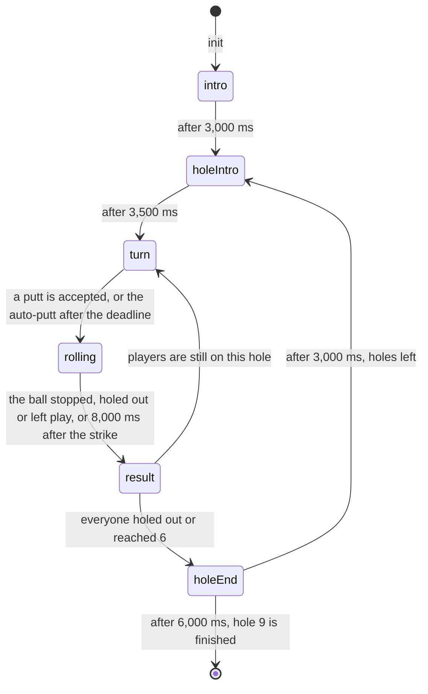

# Putt Club ⛳

**Point the phone where you want the ball to go. Hold to lock the line, then swing like a putter.**

Couchcade's mini-golf round. Nine short holes of carpet inside timber kerbs, one cup, one flag. On your
turn you aim first — turn the phone and a line swings out from your ball across the green — then you hold
the button to lock that line and swing your arm to decide how hard. Bank it off a wall, dodge the pond,
and try not to run past the cup. 1 to 4 players in turns, lowest total wins, about 4 minutes alone and
13 with four.

**For the owner.** Read [At a glance](#at-a-glance) and [Owner decisions](#owner-decisions-2026-09-21) at
the end. That takes about 5 minutes.

**For agents.** Everything below is binding for CC-13.2 to CC-13.8.
[platform.md](../architecture/platform.md), [motion.md](../architecture/motion.md),
[session-flow.md](../architecture/session-flow.md), [realtime-link.md](../architecture/realtime-link.md),
[HOUSE_STYLE.md](../HOUSE_STYLE.md) and [platform-screens.md](../design/platform-screens.md) still apply.
Where this spec and a story disagree, stop and flag it.

Status: **awaiting the owner** (CC-13.1). The four decisions in
[Owner decisions](#owner-decisions-2026-09-21) were settled by the owner on 2026-09-21 *before* this spec
was written, and the spec follows them. Nothing else here is approved yet.

**Not in this spec: the nine holes.** This spec fixes the *shape* of a hole — par, walls, hazards, cup,
capture radius — and the physics every hole obeys. **CC-13.8 designs the nine actual holes** inside that
shape. See [The hole data shape](#the-hole-data-shape).

---

## Contents

- [At a glance](#at-a-glance)
- [Inspiration](#inspiration)
- [Rules and scoring](#rules-and-scoring)
- [Stroke flow and timings](#stroke-flow-and-timings)
- [The green, the ball and the cup](#the-green-the-ball-and-the-cup)
- [The hole data shape](#the-hole-data-shape)
- [Aim, then power](#aim-then-power)
- [Phone controller](#phone-controller)
- [Input message schema](#input-message-schema)
- [TV scene](#tv-scene)
- [Fairness](#fairness)
- [Edge cases](#edge-cases)
- [Budget check](#budget-check)
- [Platform modules reused](#platform-modules-reused)
- [Scene palette: green](#scene-palette-green)
- [CC0 asset shortlist](#cc0-asset-shortlist)
- [Found while writing this spec](#found-while-writing-this-spec)
- [Owner decisions (2026-09-21)](#owner-decisions-2026-09-21)

---

## At a glance

| | |
|---|---|
| Pitch | A club mini-golf course on a Sunday morning. Nine short carpet holes inside timber kerbs, a pond on some of them, one flag at the end. The group takes turns on one green. |
| Players | 1 to 4, taking turns. One player can play alone for a low score. |
| Phone | On your turn, point the phone at the TV and turn it: an aim line swings out from your ball. Hold the big button to lock the line, then swing your arm like a putter — how hard you swing is how far it rolls. Phones without a gyroscope, or players who pick touch, drag a pad to aim and swipe up the button to putt. |
| TV | A 480×270 green seen from above at a shallow angle. Timber kerbs, a cup with a flag, every player's ball on the carpet, and a dashed line from the ball of whoever is putting. |
| Match | 9 holes. Every player plays every hole. About 4.1 minutes alone, 7.1 for two, 10.1 for three, 13.1 for four. |
| Scoring | Count your strokes. Lowest total after 9 holes wins, exactly as real golf ([rule 6](#rules-and-scoring)). Penalty strokes count. |
| Stroke cap | **6 strokes on a hole and you are picked up with a 6** ([owner decision 4](#owner-decisions-2026-09-21)). That is what keeps 4-player matches under 13 minutes. |
| Hazards | The pond and the drop are out of play: **one penalty stroke, and the ball goes back near where it left the carpet** ([owner decision 3](#owner-decisions-2026-09-21), and [rule 8](#rules-and-scoring) for exactly where). |
| Terrain | **Flat.** No slopes, no hills, no elevation. Holes differ by their walls, their hazards and how forgiving the cup is ([owner decision 2](#owner-decisions-2026-09-21)). |
| Turn timer | 15 seconds to putt. When it runs out the game plays a timid putt straight at the cup, so a dropped phone never stalls the green. |
| Skill | The line, and the weight. Aim is a whole separate step before the swing, which no other Couchcade game does. A long putt needs the right weight far more than a perfect line; a short one is all line. |
| Fairness | Nothing moves while you aim, so Wi-Fi and TV lag never change a stroke. The putt carries the line the TV was showing when you locked it. There is no randomness anywhere in the game. |
| Cost | About 1,180 requests for a 4-player match. Only the player on the clock sends anything, so the whole room can never pass one phone's rate. |
| Assets | CC0 sounds from Kenney and OpenGameArt and Kenney's Tiny Town greenery, recoloured to a new `green` palette. The carpet, kerbs, cup, flag, ball and putter are drawn from scratch. |

---

## Inspiration

Putt Club copies how these games play, not their names, characters or art.

| Game | What we take from it | Source |
|---|---|---|
| *Wii Sports*, "Golf" (Nintendo, 2006) | The control, and the order of it: you aim first, then hold a button and swing, and the swing is the power. "By using the left and right directional keys, you can change this" — the aim, before any swing. Then "Hold A, and keep this held. Raise your control like a golf club, and then strike the ball." Power is the swing itself: "The power indicator shows how hard you have hit the ball", and "Careful and sensible use of force results in less power." Overdo it and "it will overshoot". | [Wikibooks](https://en.wikibooks.org/wiki/Wii_Sports/Golf) |
| *Wii Sports* golf, the grip rule | motion.md's own mapping table already reads Nintendo's golf as ours: "Hold A (ZR) and swing. A swing without the button is a practice swing. Swing force is power, and too much overshoots." It maps that row to **Swing, `emitOn: "peak"`, speed as power**, and names Putt Club as the game that uses it. This spec is that row, built. | [motion.md](../architecture/motion.md#how-wii-style-games-map-to-our-gestures) |
| Miniature golf, the real thing | The whole course. "It is played on courses consisting of a series of holes (usually a multiple of 9) similar to those of its parent, but the holes are short (usually less than 10 metres from tee to cup)." And what a hole is made of: "artificial putting surfaces (such as carpet, artificial turf, or concrete), a geometric layout often requiring non-traditional putting lines such as bank shots, and artificial obstacles such as tunnels, tubes, ramps, moving obstacles like windmills, and walls made of concrete, metal, or fiberglass." | [Wikipedia: Miniature golf](https://en.wikipedia.org/wiki/Miniature_golf) |
| Mini-golf scoring | Lowest wins, and the six-stroke mercy rule this spec builds on. "The aim of the game is to score the lowest number of points." "There's a 6-stroke limit per hole. If you reach 6, pick up your ball and mark a 6 on your scorecard." "If your ball goes 'out of bounds,' return it to where it was hit with a 1-shot penalty." | [Wikipedia: Miniature golf](https://en.wikipedia.org/wiki/Miniature_golf), [Rules of mini golf](https://www.puttputtgolf.co.uk/rules-of-mini-golf) |
| Competitive minigolf (WMF) | The six is an international rule, not one arcade's house rule. "You are allowed a maximum of 6 strokes per hole to get the ball into the cup." "If you don't succeed within these 6 strokes, you still mark 6 points on your scorecard." Par comes from the same place: "On most holes, the par is 2 strokes… Some holes also have a par of 3 or even 4 if they are particularly long or challenging." | [One Putt Minigolf](https://mini-golf.shop/en/blogs/news/wie-viele-schlage-sind-beim-minigolf-erlaubt) |
| Golf, for the words | Stroke play and the penalty stroke. "The score achieved for each and every hole of the round or tournament is added to produce the total score, and the player with the lowest score wins in stroke play." "Penalty strokes are incurred in certain situations and are counted towards a player's score as if there were extra swing(s) at the ball." "A one-stroke penalty is assessed if a player elects to take relief when their ball comes to rest within a red or yellow penalty area (Rule 17)." Par is "the predetermined number of strokes that a proficient (scratch, or zero handicap) golfer should require to complete a hole". | [Wikipedia: Golf](https://en.wikipedia.org/wiki/Golf), [Penalty (golf)](https://en.wikipedia.org/wiki/Penalty_(golf)), [Par (score)](https://en.wikipedia.org/wiki/Par_(score)) |

What we don't take, and why:

- **Slopes, ramps and hills.** Real mini-golf leans on them, and Wii golf has "the slope of the land" you
  read before a putt. v1 greens are flat ([owner decision 2](#owner-decisions-2026-09-21)). A slope is a
  per-step `Push` on the ball, which `@couchcade/physics` already supports, so it is a clean v2 addition —
  but it doubles what a player has to read from a 480×270 screen and it doubles CC-13.8's job.
- **Moving obstacles.** Wikipedia's windmill is the icon of the sport. `@couchcade/physics` has only static
  walls and dynamic circles, so a turning sail has no home in the package today
  ([finding 8](#found-while-writing-this-spec)). CC-13.8's holes are static.
- **Clubs, wind and full swings.** Wii golf changes club with up and down and shows "Wind… top left". Putt
  Club is a putter and nothing else, on a flat carpet with no wind. One gesture, one number.
- **Stroke and distance.** Putt-Putt sends an out-of-bounds ball back to where it was hit. Golf's penalty
  area (Rule 17) instead lets you drop near where the ball crossed. The owner picked the penalty-area
  model ([owner decision 3](#owner-decisions-2026-09-21)): it keeps the progress you made, and a friend who
  finds the pond three times in a row is not sent back to the tee three times.
- **The WMF variant of the cap.** In official competition "you must remove your ball from the playing area
  yourself after the 6th stroke and record 7 points." Recording a 7 for six strokes is a rule for referees.
  We take the recreational version: six strokes, score 6.
- **Spin.** A putter has nothing to hook with, and a flat green has nothing for a hook to curve across.
  `spin` is not in the [input schema](#input-message-schema).

Research on the controls:

- **This is the first game that combines two gestures.** Every shipped Couchcade game reads one:
  Target Range reads Aim, Strike Night and Bandeja read Swing. Putt Club reads **Aim then Swing in one
  turn**, which motion.md allows ("Each of our games reads at most two gestures") but nothing has done yet.
  `packages/motion/src/gestures/aim.ts` does not even list Putt Club in its header
  ([finding 5](#found-while-writing-this-spec)).
- **Aiming and swinging cannot overlap.** Swinging the phone is, to an aim detector, an enormous yaw
  change. So the line is **locked** the moment the grip goes down and the aim stream stops right there.
  That is not a workaround: it is exactly Nintendo's order, aim with the D-pad and *then* hold A and swing.
- **The swing's own `angle` is nearly thrown away.** Strike Night scales it by `aimGain = 0.05` because the
  angle is noisy on a real phone (motion.md, [Testing with recorded traces](../architecture/motion.md#testing-with-recorded-traces)).
  Putt Club has a real aim channel, so it does not need the swing's angle at all. It keeps a very small
  amount of it as a **push**, so a crooked swing pushes the ball off the line you locked
  ([Aim, then power](#aim-then-power)), with the same escape hatch Strike Night has: the gain goes to 0
  and the game still works.
- **A putt is a gentle stroke, so the detector's defaults are wrong for it.** `SWING_MIN_PEAK` is
  240 deg/s and `SWING_FULL_PEAK` is 900 deg/s (`packages/motion/src/gestures/swing.ts`), tuned for a
  bowling arm. A tap-in from 30 cm is nowhere near 240 deg/s, and at those defaults it would emit nothing
  at all. Putt Club lowers both ([Motion controls](#motion-controls)). Lowering `fullPeak` also makes the
  game safer: there is less to gain from swinging a phone hard (motion.md
  [Safety](../architecture/motion.md#safety) rule 2).
- **`floorFriction` is the wrong friction for a putt.** It is exponential damping — a half-life — so a
  ball never really stops, it only gets slower forever. A ball rolling on carpet slows at a roughly
  constant rate and stops. The rules apply that as a per-step `Push` instead
  ([The green, the ball and the cup](#the-green-the-ball-and-the-cup), and
  [finding 1](#found-while-writing-this-spec)).

---

## Rules and scoring

1. **Players.** 1 to 4 seated players (`players: { min: 1, max: 4 }`), as the epic says. The game gets them
   at `init` and nobody joins mid-match.
2. **The course.** 9 holes, played in order 1 to 9, exactly as the sport does it: "Play the holes in order,
   starting at hole #1" ([Rules of mini golf](https://www.puttputtgolf.co.uk/rules-of-mini-golf)). The nine
   holes are data, designed by **CC-13.8** inside [The hole data shape](#the-hole-data-shape). Each hole has
   a **par** of 2, 3 or 4. This spec's timings assume a course par near 21 (six par-2 holes and three
   par-3s); CC-13.8 sets the real numbers and this spec does not.
3. **Turns.** Within a hole, players putt one stroke each in seat order, cycling, and a player who has
   finished the hole is skipped. Hole `h` (1-based) starts with seat `(h − 1) mod playerCount`, so the
   honour rotates and nobody is always first. Every player plays every hole.
4. **A stroke.** One turn is one stroke: aim, lock, swing. See [Aim, then power](#aim-then-power) and
   [Stroke flow and timings](#stroke-flow-and-timings).
5. **Turn timer.** Every turn has 15,000 ms from the moment it opens. A `putt` counts if its `atMs` is at or
   before the deadline. If nothing counts by `maxInputAgeMs` (the platform's late-message wait) after the
   deadline, the game plays an **auto-putt**: straight at the cup (`yaw` 0, `angle` 0) at the weight that
   would stop it 20% short of the cup. It counts as a stroke like any other.
6. **Away players.** A player whose last 2 strokes were auto-putts is away. Their next turns get 5,000 ms
   instead of 15,000. Any accepted input from them (`aim`, `line` or `putt`) clears away, and that turn's
   deadline moves to 10,000 ms after the input, never earlier than it was. A dropped phone then costs about
   5.5 seconds a stroke instead of 15.5.
7. **Holing out.** A ball is holed when it reaches the cup slowly enough
   ([The green, the ball and the cup](#the-green-the-ball-and-the-cup)). The player's score for that hole is
   the strokes they played on it, penalties included, and they take no more turns on it.
8. **Hazards and out of bounds** ([owner decision 3](#owner-decisions-2026-09-21)). A ball that enters a
   hazard, or leaves the hole's playable area, is out of play. Then, in this exact order:

   1. The stroke that was played counts, as it always does.
   2. **One penalty stroke is added.** So the attempt costs the player 2.
   3. The ball is **put back near where it left play**, defined operationally as: the point on the stroke's
      own path `0.20 m` (`RESET_BACKOFF`) before the point at which it first stopped being in play, measured
      along the path. If that point is itself not in play, or sits within `0.05 m` (`RESET_CLEARANCE`) of a
      wall or a hazard edge, the rules walk further back along the recorded path in `0.05 m` steps until a
      point passes both tests. If no point on this stroke's path passes, the ball goes back to where it
      stood at the start of the stroke. If even that fails, it goes to the tee.
   4. If the player is now on 6 strokes, [rule 9](#rules-and-scoring) picks them up.

   The rules keep a ring buffer of the ball's last 64 in-play positions during a stroke — about one second
   of rolling, which at full speed is 5 metres of path, far more than the 0.20 m back-off ever needs. It is
   dropped at the end of every stroke and never enters the snapshot.
9. **The 6-stroke cap** ([owner decision 4](#owner-decisions-2026-09-21)). A player who reaches 6 strokes on
   a hole without holing out is **picked up**: they score 6 for that hole and take no more turns on it. The
   6 counts penalty strokes, or it would not be a cap. That is the recreational mini-golf rule: "There's a
   6-stroke limit per hole. If you reach 6, pick up your ball and mark a 6 on your scorecard."
10. **A hole ends** when every player has either holed out or been picked up.
11. **Scoring.** Add up the strokes on all 9 holes. **Lowest total wins**, as in stroke play. The TV and the
    phone also show the total against par, for example "+4", because that is how people talk about a round.
    The best possible round is 9 (nine aces) and the worst is 54 (nine sixes), so a whole match always fits
    in two digits.
12. **Match end.** After hole 9's last ball, or when no seated players remain.
13. **Placements** (`outcome`). Sort by total strokes, **fewest first**. Break ties with more holes at or
    under par, then by a count-back: fewer strokes on hole 9, then 8, then 7, and so on. Players still tied
    share a place. `score` is the stroke total — the only game so far where a smaller `score` is better, which
    is safe because the results screen prints it beside `place` and never sorts by it
    (`apps/host/src/screens/results/results.ts`, and [finding 11](#found-while-writing-this-spec)).
14. **Players leaving.** When a seat expires (`onPlayerLeft`), the player keeps the holes they finished and
    plays no more. A hole in progress records their strokes so far, plus the cap's worth of strokes for the
    holes they never reached, so the scorecard stays comparable. If they were on the clock, the turn passes
    at once; if their ball is rolling, the stroke finishes and counts, then the turn passes.
15. **Randomness.** There is none. The seed is unused, so replays and restores are exact by construction,
    exactly as in Strike Night.

## Stroke flow and timings



| Phase | Length | TV | Phone |
|---|---|---|---|
| `intro` | 3,000 ms | The clubhouse gate and hole 1 behind it. Title chip "Putt Club · 9 holes". Bottom panel: "Aim, lock the line, then swing". | Everyone `pc-watch`. The first putter gets `pc-next`. |
| `holeIntro` | 3,500 ms | The hole slides in whole, the flag plants itself, every ball lands on the tee mat. Round chip: "Hole 4 of 9 · par 2". Bottom panel names the hole, for example "The Elbow". | `pc-watch`, then `pc-next` for whoever starts. |
| `turn` | Until a `putt` is accepted. At most 15,000 ms plus the late wait (5,000 ms for an away player). | The putter's aim line swings out of their ball and locks Sunny when they hold the button. Their chip lifts, "Noor is putting" in the bottom panel. A clock chip counts down the last 5 seconds with a tick each second. | Putter `pc-putt`, next player `pc-next`, everyone else `pc-watch`. |
| `rolling` | From the strike until the ball settles. Typically 1.7 s, at most 8 s. | The ball rolls, knocks off the kerbs, drops in or runs past. | Putter on the local "Putt away!" state, everyone else unchanged. |
| `result` | 900 ms, or 1,800 ms with a callout | The stroke count pops over the ball ("3"). `IN!`, `BIRDIE!` or `HOLE IN ONE!` when earned. A penalty shows as a small Signal "+1" chip over the ball, with no callout and no name. | Putter `pc-result`. |
| `holeEnd` | 3,000 ms, 6,000 ms after hole 9 | Scorecard overlay: every player, every finished hole, the running total against par. Bottom panel: "Noor leads at +1". | Unchanged. The next `turn` batch brings the new totals. |

**How long a stroke takes.** A player takes about 2.5 s to swing the line where they want it and about
1.5 s to lock and swing: **4.0 s of deciding**. A putt rolls for `v / 1.5` seconds
([The green, the ball and the cup](#the-green-the-ball-and-the-cup)); most putts are 1 to 4 metres, so
**1.7 s of rolling**. About a third of strokes end a hole or take a penalty and get the longer result, so
**1.2 s of result**. A stroke is therefore about **6.9 seconds**.

**How many strokes.** On a flat par-2 green with a forgiving cup, this is the distribution the constants
above produce, and the one CC-13.2's tests should keep honest:

| Score on a hole | 1 | 2 | 3 | 4 | 5 | 6 | Mean |
|---|---|---|---|---|---|---|---|
| Share of holes | 12% | 33% | 28% | 15% | 7% | 5% | **2.9** |

2.9 strokes on a par-2.33 course is about **+0.6 a hole, +5 over the round**, so a typical total is 26
against a par of 21. That is where a casual mini-golf round really lands.

**How long a match takes.** Fixed overhead is the 3 s intro, nine 3.5 s hole intros, eight 3 s hole ends
and the 6 s finish: **64.5 s**, whatever the player count.

| Players | Strokes in the match | Strokes × 6.9 s | Plus overhead | Typical match | Wait between your turns | Longest realistic |
|---|---|---|---|---|---|---|
| 1 | 26 | 180 s | 245 s | **about 4.1 min** | none | about 14 min |
| 2 | 52 | 360 s | 425 s | **about 7.1 min** | about 7 s | about 27 min |
| 3 | 78 | 540 s | 605 s | **about 10.1 min** | about 14 s | about 40 min |
| 4 | 104 | 720 s | 785 s | **about 13.1 min** | about 21 s | about 53 min |

"Longest realistic" is every player using the whole 15 s timer on every stroke and averaging 4.5 strokes a
hole (19.2 s a stroke). The **absolute** ceiling is every player hitting the cap on every hole with the
full timer: 216 strokes and about 70 minutes for four players — but any player silent for two strokes drops
to a 5 s timer ([rule 6](#rules-and-scoring)), which pulls that same case down to about 34 minutes.

**Why the cap matters more than it looks.** Without [rule 9](#rules-and-scoring) a player stuck behind a
kerb has no bound at all, and one bad hole could eat the evening. With it, a hole costs at most
`6 × playerCount` strokes and a match at most `54 × playerCount`, so the longest match is a number this
spec can print. That is the whole reason the owner set it.

**How Putt Club sits next to the shipped games.** Quick Draw is about 1 minute, Target Range about 2,
Bandeja 2.6 to 3.9, Strike Night 3.8 to 14. Putt Club's 4.1-to-13.1 minute spread is Strike Night's shape:
a turn-based game whose length is set by how many people are playing. **If CC-13.7's playtest says
4-player matches drag, the knob is `turnTimerMs`, not the hole count** — 9 holes is the epic's shape and
CC-13.8's contract.

---

## The green, the ball and the cup

The rules own the physics: `onTick` steps `@couchcade/physics` during `rolling`, and `TState` holds the
ball's `BodyState`, as the game contract (rule 5) and session-flow.md's
[physics rules](../architecture/session-flow.md#physics-package) say. Planck never reaches phones
(session-flow.md owner decision 4). Units are metres, seconds and kilograms. Every number below is a named
constant CC-13.2 may tune once.

### The world

`x` runs along the hole from the tee end, `y` across it. The green is flat: there is no `z`, no gravity and
no height anywhere in this game ([owner decision 2](#owner-decisions-2026-09-21)). `gravity` is `[0, 0]`,
as in every top-down Couchcade world.

| Part | Spec | Why |
|---|---|---|
| Ball | `circleBody({ radius: 0.0213, density: 32.2, friction: 0.2, restitution: 0.5, damping: 0, bullet: true })`, 45.9 g | A real golf ball is 42.67 mm across and 45.93 g; `density × π r²` gives that mass. At 5 m/s it crosses two ball widths per step, so it must be a bullet. Damping is 0 because friction is not damping here — see below. |
| Kerbs | One `WallSpec` per entry in `hole.walls`: `wallLoop(wall.points, { friction: 0.2, restitution: wall.restitution ?? 0.5 })` for the closed boundary, `wallPath(wall.points, …)` for an interior baffle | `wallLoop`'s own doc in `packages/physics/src/helpers.ts` already says "an arena, a lane or **a putting green**". Mini-golf walls are "concrete, metal, or fiberglass"; 0.5 gives a bank shot that works and costs you something. |
| Wall material | A hole's wall may override `restitution`: 0.15 for a dead felt backboard, 0.8 for a rubber bumper | The course designer's only material knob, and CC-13.8's main way of making holes feel different without slopes |
| Rolling friction | **Not `floorFriction`.** Each step, while the ball is moving, the rules apply `Push { fx, fy } = −m × ROLL_DECEL × v̂` with `ROLL_DECEL = 1.5 m/s²`. When a step's deceleration would reverse the ball, or its speed is under `STOP_SPEED = 0.05 m/s`, the rules set its velocity to zero. | `floorFriction` is exponential damping: it halves the speed every half-life and never reaches zero, so a putt would creep for ten seconds. A ball on carpet slows at a roughly constant rate and stops. See [finding 1](#found-while-writing-this-spec). |
| Cup | Not a body. Each step the rules test the **segment** the ball travelled against a circle of `hole.captureRadius` around `hole.cup` | `@couchcade/physics` has only circles and walls, and no sensors ([finding 8](#found-while-writing-this-spec)). Testing the segment, not the end point, is what stops a fast ball skipping straight over the cup ([finding 2](#found-while-writing-this-spec)). |
| Hazards | Not bodies either. Rectangles and circles in the hole data, tested against the same segment | One rule for water and for a drop; the `kind` only picks the sprite and the sound |

### Weight: what a swing is worth

`speed` from the swing (0 to 1) becomes a launch speed
`v = PUTT_MIN_SPEED + PUTT_SPEED_RANGE × speed` = **0.6 to 5.0 m/s**. With a constant `ROLL_DECEL` of
1.5 m/s², a putt on open carpet rolls `v² / (2 × 1.5)` metres in `v / 1.5` seconds:

| `speed` | Launch | Rolls | Takes |
|---|---|---|---|
| 0.00 | 0.60 m/s | 0.12 m | 0.40 s |
| 0.25 | 1.70 m/s | 0.96 m | 1.13 s |
| 0.50 | 2.80 m/s | 2.61 m | 1.87 s |
| 0.75 | 3.90 m/s | 5.07 m | 2.60 s |
| 1.00 | 5.00 m/s | 8.33 m | 3.33 s |

What that means for a player:

- **Weight is not linear, and that is the game.** Halving the swing quarters the roll. A hole 5 metres away
  needs `speed` 0.75 and a hole 2.6 metres away needs 0.50 — a third less swing for half the distance. Real
  putting feels exactly like this, and it is why the same player who laces a long putt leaves the short one
  a foot short.
- **A bank costs you three quarters of what is left.** A kerb at restitution 0.5 halves the speed of a
  head-on hit, and the remaining roll goes with the square: a quarter. A glancing bank keeps its sideways
  component — only the part of the speed pointing at the wall is halved — so a shallow bank is cheap and a
  steep one is dear. That gradient is CC-13.8's main lever for making a hole hard without a slope.
- **Full power is 8.3 metres**, just over a mini-golf hole's longest sensible length
  ("usually less than 10 metres from tee to cup"). Nobody ever needs to swing harder than the range covers,
  which is the whole point of motion.md [owner decision 3](../architecture/motion.md#owner-decisions-2026-09-16).

### Holing out, and lipping out

Every step, with `p0` the ball's position before the step and `p1` after it, the rules find the closest
approach of the segment `p0 → p1` to `hole.cup`, comparing squared distances so there are no square roots
and replays are exact.

| Closest approach | Speed at that moment | What happens |
|---|---|---|
| Inside `captureRadius` | at most `CAPTURE_SPEED` (1.2 m/s) | **Holed.** The ball leaves the world, the stroke ends, the phone gets `IN!` |
| Inside `captureRadius` | above `CAPTURE_SPEED` | **Lipped out.** Once per pass, the ball's speed drops by `LIP_LOSS` (25%) and it carries on across the cup |
| Outside `captureRadius` | any | Nothing. The ball rolls on |

A ball at 5 m/s covers 8.3 cm in one step, more than a 7 cm capture radius, so testing only `p1` would let
the hardest putts sail straight over an untouched cup. The segment test is not an optimisation, it is the
difference between the game working and not ([finding 2](#found-while-writing-this-spec)).

`CAPTURE_SPEED` is what makes "too much pace" a real mistake, which is the thing every mini-golf player
already understands, and it is the reason the swing is worth learning at all.

### How precise does a line have to be?

With a capture radius `R`, a putt from distance `d` has to be inside `atan(R / d)` of perfect:

| Distance to the cup | Tolerance at `R` = 0.05 (tight) | at 0.07 (standard) | at 0.10 (forgiving) |
|---|---|---|---|
| 0.5 m | 5.7° | 8.0° | 11.3° |
| 1 m | 2.9° | 4.0° | 5.7° |
| 2 m | 1.4° | 2.0° | 2.9° |
| 4 m | 0.7° | 1.0° | 1.4° |
| 8 m | 0.4° | 0.5° | 0.7° |

So a long putt is a **lag** putt: you get it close and tap in, which is real golf and real mini-golf. Short
putts are where the line matters and where the game is winnable. **This table is the single biggest
playtest risk in the spec** — if CC-13.7 finds that nobody can hole anything, the fix is CC-13.8 choosing
bigger `captureRadius` values, not a redesign. It is per-hole data for exactly that reason.

### Worked numbers

CC-13.2 keeps these as unit tests with ranges, the way Strike Night keeps its prototype targets:

| Shot | Result |
|---|---|
| `speed` 0.5, straight at a cup 2.6 m away, `R` 0.07 | Holes. It leaves at 2.80 m/s and reaches the cup at 0.2 m/s, well under `CAPTURE_SPEED`. |
| `speed` 0.8, straight at the same cup | Leaves at 4.12 m/s and reaches the cup at 3.0 m/s. **Lips out**, loses a quarter of its pace, and stops 1.7 m past it. |
| `speed` 0.5 aimed 2° off a cup 2.6 m away | Passes 9 cm to the side, just outside a standard cup. A tap-in follows. |
| `speed` 1.0 straight into a kerb 4 m away | Arrives at 3.6 m/s, comes off at 1.8 m/s and runs 1.1 m back. Total travel 5.1 m, out of the 8.3 m the same putt makes on open carpet. |
| `speed` 0.0, the softest deliberate putt | 12 cm. Enough for a tap-in and not enough to be useless. |
| The auto-putt from 3 m | Aims at the cup, weighted to stop 20% short: 2.4 m of roll, ending 0.6 m from the flag. Never an accidental ace. |

---

## The hole data shape

**CC-13.8 designs the nine holes. This section fixes only what a hole *is*.** Everything CC-13.2 needs to
step a ball, hole it out and price a hazard is here; everything about which walls go where is not.

Holes live in `games/putt-club/src/shared/holes/` (CC-13.8's declared References), one file per hole plus an
index, and are plain data with no imports from `@couchcade/physics` — `shared/constants.ts` in Strike Night
already carries that rule, because the phone controller type-imports the input schema and
`game-controller-never-reaches-physics` in `.dependency-cruiser.cjs` checks that nothing under
`src/controller/` reaches Planck, even transitively.

```ts
/** A point on the green, in metres. */
export type Spot = readonly [x: number, y: number];

export interface HoleWall {
  /** At least two points. A closed `loop` is the hole's boundary; an open path is a baffle inside it. */
  readonly points: readonly Spot[];
  readonly loop: boolean;
  /** Bounciness, 0 to 1. Defaults to `kerbRestitution` (0.5). */
  readonly restitution?: number;
}

export interface HoleHazard {
  /** A pond or a drop. Both are out of play; the kind picks the sprite and the sound. */
  readonly kind: "water" | "pit";
  /** Axis-aligned box, or a circle. */
  readonly shape:
    | { readonly box: readonly [min: Spot, max: Spot] }
    | { readonly circle: Spot; readonly radius: number };
}

export interface Hole {
  /** 1 to 9. */
  readonly id: number;
  /** Overlay text only, under 20 characters: "The Elbow". */
  readonly name: string;
  /** 2, 3 or 4. What a good player should need. */
  readonly par: number;
  /** Where every ball starts the hole. */
  readonly tee: Spot;
  readonly cup: Spot;
  /** Metres. 0.05 (tight) to 0.10 (forgiving). See the tolerance table above. */
  readonly captureRadius: number;
  readonly walls: readonly HoleWall[];
  readonly hazards: readonly HoleHazard[];
  /** The playable box. A ball whose centre leaves it is out of bounds. Also the camera's frame. */
  readonly bounds: readonly [min: Spot, max: Spot];
}
```

Rules every hole obeys, checked by a `validateHole` unit test CC-13.2 writes and CC-13.8 runs over all nine:

1. **Flat.** There is no slope field and there never is one in v1
   ([owner decision 2](#owner-decisions-2026-09-21)).
2. **It fits the screen.** `bounds` is at most **10.8 m along and 7.0 m across**, which is what the TV's
   play area holds at the scene's scale ([TV scene](#tv-scene)). Mini-golf holes are "usually less than 10
   metres from tee to cup", so this is not a tight constraint.
3. **The tee and the cup are in play**: inside `bounds`, outside every hazard, and at least
   `0.10 m` from any wall.
4. **The cup is reachable.** `captureRadius` is 0.05 to 0.10, and the cup is at least
   `captureRadius + 0.10 m` from any wall, so a ball can actually arrive at it.
5. **Walls are legal Planck chains.** At least 2 points for a path and 3 for a loop, and no two consecutive
   points closer than `MIN_EDGE_LENGTH` (0.005 m), which `wallSegment` and friends already throw on.
6. **`par` is 2, 3 or 4**, and the course's nine pars are the course par.
7. **It is completable.** CC-13.8's own acceptance criterion 2 asks for "a test proves every hole is
   completable by a scripted shot sequence". That test replays a recorded `(yaw, speed)` list per hole
   through the real rules and asserts a hole-out inside 6 strokes.

What the shape deliberately does **not** have, and where each one would go if the owner ever wants it:
slope (a per-step `Push`, same mechanism as `ROLL_DECEL`), moving obstacles (a new body kind in
`@couchcade/physics`), tunnels and loops (they need a third dimension, or a teleport rule), and a "carry
your ball" rule for the next hole (mini-golf always re-tees).

---

## Aim, then power

This is the part no other Couchcade game has. A turn is **two gestures in a fixed order**
([owner decision 1](#owner-decisions-2026-09-21)).

### Step 1: the line

- **Zero is the cup.** `yaw = 0` always means *straight at the flag*. The bearing the ball is actually
  putted along is

  ```
  line = bearing(ball → cup) + yaw × AIM_SPAN_DEG
  ```

  with `AIM_SPAN_DEG = 75`. So a player who does nothing at all putts at the cup, and a player who wants a
  bank has ±75° to find it — three quarters of a right angle either way, which reaches any wall on a hole
  that fits [the envelope](#the-hole-data-shape).
- **The detector runs at a gain of 1.** `createAimDetector({ yawRangeDeg: 75 })`, so one degree of phone is
  one degree of line. motion.md's ±25° default is tuned for a crosshair that has to cover a TV; a putter
  head is not a crosshair, and a player turning the phone to point at where they want the ball to go is the
  most literal mapping available. Turning the phone 10° right turns the line 10° right, and no more.
- **Pitch does nothing.** The green is flat, so `pitch` is read, sent (the platform's sender sends both) and
  then ignored by the rules. It is reserved, not used.
- **The recentre cadence is per turn.** motion.md is explicit that this is a per-game choice and belongs
  here: "The real knob is therefore the **cadence** of the zero… the right one is a per-game choice: per
  gesture (Target Range today), per turn or volley…, or only when the player asks", and the approved
  recommendation says to "Leave the zero's cadence to each game spec… and write the chosen cadence into the
  game's own doc." **Putt Club recentres once, when a turn opens, and not again inside that turn.** A turn
  is exactly one putt, so this is Target Range's per-draw cadence applied to a turn-based game — the same
  cadence, in the same place in the loop, and the precedent is
  `createShotAim().startDraw()` calling `source.recentre(t)` in
  `games/target-range/src/controller/aim.ts`.

  Why not the other two. **Per gesture** would mean recentring again at the lock, which would throw away
  the line the player just aimed — nonsense here. **On demand** would let a player compare this putt's line
  to the last one, which sounds attractive until you remember the ball moved between them, so "a bit left
  of last time" means nothing on a green. A turn is the natural unit because the ball is somewhere new at
  the start of each one.
- **Both paths recentre.** motion.md names an inconsistency it wants fixed: "The drag fallback does **not**
  recentre at draw start; only motion does… Whatever cadence the owner picks should apply to both paths,
  and `fallbacks/aim.ts` should follow the game's recentre moments the same way the detector does."
  Putt Club is the first game to do that: when a turn opens, the controller calls `recentre(t)` on
  whichever source is live — `createAimDetector` in motion mode, `createAimDrag` in touch mode. A touch
  player's pad therefore also starts pointing at the cup
  ([finding 4](#found-while-writing-this-spec)).

### Step 2: the lock

Holding the big action **locks the line and stops the aim stream in the same instant**. Everything after
that is power. Nintendo's golf works in this order for the same reason: you cannot aim with the thing you
are swinging.

The locked value is **the aim the TV was showing**, not a fresh sensor reading. Target Range already solved
this (CC-11.10): the controller keeps a short buffer of the samples it actually streamed and replays it
through the same `createPlayback` helper the TV's own drawing uses, `shownDelayMs` behind — 180 ms on the
relay path, about `1000 / hz` on the direct link. So the line that freezes on the TV is the line the putt
is played along, and there is no jump at the lock.

Letting go of the grip without swinging unlocks the line and the player carries on aiming, exactly as
Strike Night lets a bowler grip again.

### Step 3: the swing

The swing carries one number that matters — `speed` — and one that barely does.

| From the swing | Used for |
|---|---|
| `speed` | The launch speed, `0.6 + 4.4 × speed` m/s ([Weight](#weight-what-a-swing-is-worth)) |
| `angle` | A small **push**: `line += clamp(angle, −45, 45) × PUSH_GAIN`, `PUSH_GAIN = 0.04`, so ±1.8° |
| `spin` | Nothing. It is not in the [input schema](#input-message-schema). |
| `peakAt` | Nothing directly: it goes out as the input's `at`, which is what the deadline is judged on |

The push is there so that a crooked swing pushes the ball off the line you picked, which is what a crooked
putting stroke does. It is deliberately tiny: 1.8° is inside the tolerance of a 2 m putt at a standard cup,
so it punishes a wild swing and never ruins a good one. Strike Night sets `aimGain = 0.05` for the same
reason, because the swing's angle is noisy on real phones. **`PUSH_GAIN` at 0 makes the swing pure power
and the game still works**, which is the escape hatch if CC-13.3's traces say the angle cannot be trusted
([Fairness](#fairness) rule 8).

---

## Phone controller

`needsMotion: true`. Before the match the platform runs the approved motion step (CC-5.10): "Tap to enable
motion", the hold-still calibration, the Android portrait lock or the iPhone hint, the wake lock and tap to
resume. Phones that deny motion, have no gyroscope (owner decision 5 in motion.md) or pick "Use touch
instead" get the touch controls, and the TV shows the touch icon from CC-5.10. The game treats both the
same.

Only the player on the clock has controls. Every other phone shows a watch screen and sends nothing.

### Motion controls

- **Hold.** Portrait, top edge pointing at the TV like a remote, one hand on the phone and the other thumb
  on the big action. The first `pc-putt` of the match says "Room to swing? Go for it" (motion.md
  [Safety](../architecture/motion.md#safety) rule 3).
- **Aim.** `createAimDetector({ yawRangeDeg: 75 })` fed by `createPoseTracker`, into `createAimSender` on
  the game's `InputChannel`, exactly as Target Range wires it. The controller calls `recentre(t)` when a
  turn opens and never inside it ([Aim, then power](#aim-then-power)). Aim streams only while the turn is
  open and the line is unlocked; a phone held still sends nothing (`AIM_MIN_STEP`).
- **Lock.** `pointerdown` on the big action locks the line: the controller stops the sender, works out the
  shown aim with `createPlayback`, and sends `set({ type: "line", payload: { turn, locked: true, yaw } })`.
  It also calls `swing.mark({ type: "grip-down", t })`, so the swing detector starts listening from that
  moment and captures the phone's heading as forward for this swing.
- **Swing and putt.** `createSwingDetector({ emitOn: "peak", minPeak: 120, fullPeak: 600, startRate: 70, endRate: 40 })`.
  On the detector's event the controller calls
  `fire({ type: "putt", payload: { turn, yaw, speed, angle } }, localPeakT)` and shows the local "Putt
  away!" state at once. `peakAt` stays on the phone: the input's `at` already carries the same moment.
  `emitOn: "peak"` is motion.md's own choice for Putt Club — the ball leaves at the swing, not when the
  thumb comes off, because a putter has no release.
- **Why `minPeak` and `fullPeak` come down.** The defaults, 240 and 900 deg/s, are a bowler's arm. A
  tap-in from 30 cm is a wrist movement of maybe 150 deg/s and would emit **nothing at all** at 240. 120
  deg/s is under the softest deliberate stroke and safe here because Putt Club, unlike Bandeja, has a grip
  button in front of the detector, so an idle phone is never listened to. 600 deg/s for full power keeps
  the whole 8.3 m range inside a controlled stroke, which motion.md's
  [owner decision 3](../architecture/motion.md#owner-decisions-2026-09-16) explicitly leaves to each game
  and which [Safety](../architecture/motion.md#safety) rule 2 wants. `startRate` and `endRate` come down
  with them or a gentle putt would never be seen to start. **CC-13.3 checks all four against CC-5.9
  traces and tunes them once.**
- **Let go without swinging.** `pointerup` with no swing sends
  `set({ type: "line", payload: { turn, locked: false, yaw } })` and the hint "Swing before you let go".
  The player aims again. `pointercancel` does the same and resets the detector.
- **A practice swing is free.** The detector only listens between grip-down and grip-up, so a player can
  rehearse the stroke with their thumb off the button and nothing is sent. That is Nintendo's practice
  swing, and it costs no code.

### Touch controls

- **Aim pad.** A pad above the big action, `createAimDrag({ yawDragPx: 480 })` from
  `@couchcade/motion/fallbacks`, so 480 CSS px of drag covers the whole ±75°: about 0.31° a pixel. It is
  deliberately slower than motion.md's 200 px default, because 200 px across 150° would be 0.75° a pixel and
  a 2 m putt's whole tolerance would be under three pixels. A quiet "Centre" button calls `recentre()` and
  puts the line back on the flag.
- **The pad follows the game's recentre moments.** When a turn opens, the controller recentres the pad just
  as it recentres the detector. This is the parity motion.md asks for and Target Range does not yet have
  ([finding 4](#found-while-writing-this-spec)).
- **Swipe to putt.** The big action becomes the swipe pad, `createSwingSwipe({ emitOn: "peak" })`. Touching
  it locks the line (the same `line` message), a swipe of at least 60 px up the pad putts, and the finger's
  speed from 300 to 2,400 px/s is `speed`. A shorter or downward swipe unlocks and hints "Swipe further
  up". The swipe pad ignores touches that start on the aim pad. `SwingSwipeOptions` has no `minPeak` — the
  pad's floor is `minSwipePx`, not a rotation rate — so the touch path needs none of the detector's
  retuning, and a 60 px swipe already maps to the bottom of the same 0-to-1 `speed` scale.
- **Why swipe and not tap.** `createSwingTap` emits a fixed `speed` of 0.7 and an angle of ±60 by pad half.
  Fixed power is the one thing a putter cannot have — 0.7 is a 4.4 m putt, every time. The swipe keeps the
  whole power range, which is the only number Putt Club's swing actually carries. (The CC-13 epic says
  "swipe fallback", and this agrees with it.)
- CC-13.3 fits the aim pad, the Centre button and the big action on one screen without scrolling, as
  CC-11.3 did for Target Range.

### Screens

| Screen | Big action | Status line | Hint | Cue |
|---|---|---|---|---|
| `pc-watch` | Chalk, "Watch the TV" | "Noor is putting" | "Hole 4 of 9 · you're +2" | none |
| `pc-next` | Chalk, "Watch the TV" | "You're up next" | "Line it up on the TV" | none |
| `pc-putt`, first turn | Sunny, "Hold to lock the line" | "Hole 1 · par 2 · your turn" | "Room to swing? Go for it" | `your-turn` |
| `pc-putt` | Sunny, "Hold to lock the line" | "Hole 4 · par 2 · stroke 2" | "Point at the TV to aim" | `your-turn` |
| `pc-putt`, touch | as above, aim pad and Centre above | as above | "Drag the pad to aim" | as above |
| locked (local) | Sunny, pressed, "Swing to putt" (touch: "Swipe up to putt") | "Line locked" | "Gently does it" | `press` |
| unlocked too early (local) | Sunny, "Hold to lock the line" | "Swing before you let go" (touch: "Swipe further up") | "Point at the TV to aim" | none |
| putt away (local) | Disabled, "—" | "Putt away!" | "Watch the TV" | `press` |
| `pc-result` | Chalk, "Watch the TV" | "In the hole!", "Two putts to go", "In the water · +1", "Picked up at 6" or "Time's up, we putted for you" | "Hole 4: 3 · you're +2" | `celebrate` on a hole-out at or under par |
| `pc-end` | Chalk, "Watch the TV" | "You finished +4" | "Nice round" | `celebrate` on a win |

- Every line stays under 40 characters. Names are at most 12, so "Noor is putting" is at most 24.
- The locked, unlocked and putt-away states are **local and immediate**, as Target Range's drawing and
  Strike Night's ball-away are. They change the instant a finger moves, before any round trip.
- After a `putt` the big action is off until the next `pc-putt`, so nobody putts twice.
- The big action stays off until the clock module has a sample, as in Quick Draw.
- The host sends views only when they change: one batch when a `turn` opens (the putter's `pc-putt`, the
  next player's `pc-next`, everyone's `pc-watch` with the putter's name and fresh totals) and one when
  `result` starts (the putter's `pc-result`). Each batch is one `controller:state` message.
- View data (`TView`), well under 1 KB:

```ts
type PuttClubView = {
  hole: number;                // 1 to 9
  holes: number;               // always 9
  par: number;                 // this hole's par
  name: string;                // the hole's name, under 20 characters
  turn: number;                // echoed in line and putt
  stroke: number;              // the stroke this player is about to play, 1 to 6
  cap: number;                 // always 6
  total: number;               // strokes played so far this match
  toPar: number;               // total minus the par of the holes this player finished
  putter: string | null;       // whose turn it is now
  first: boolean;              // this player's first turn of the match
  last: {                      // this player's last stroke, null before it
    result: "rolled" | "holed" | "penalty" | "capped";
    strokes: number;           // their strokes on this hole after it
    hole: number | null;       // the hole's final score, once they finished it
    auto: boolean;             // the turn timer putted for them
  } | null;
};
```

## Input message schema

Three input types, all through one `InputChannel` (docs/architecture/realtime-link.md). `aim` and `line` are
continuous values sent with `stream`/`set`. `putt` is an event sent with `fire`, so it goes before any
waiting value, and it **carries the locked line itself** rather than trusting the streamed one to have
arrived (motion.md "Fitting the input budget" rule 3, and Strike Night's `bowl` carrying its own `x`).

```ts
import * as z from "zod/mini";

/** Yaw and pitch, −1 to 1. */
const unit = z.number().check(z.gte(-1), z.lte(1));
/** The stroke a `line` or `putt` belongs to, so a late message never counts for the next one. */
const turn = z.int().check(z.gte(1), z.lte(maxTurns));

export const inputSchema = z.discriminatedUnion("type", [
  // One aim sample from createAimDetector or createAimDrag. Packing into up to 8 samples per
  // message on the relay path is the InputChannel's job, not this schema's. `pitch` is carried
  // because the platform's sender sends it; a flat green ignores it.
  z.object({
    type: z.literal("aim"),
    payload: z.object({ yaw: unit, pitch: unit }),
  }),
  // The line was locked by the grip, or let go again without a swing.
  z.object({
    type: z.literal("line"),
    payload: z.object({ turn, locked: z.boolean(), yaw: unit }),
  }),
  // The swing from createSwingDetector or createSwingSwipe, carrying the line it was locked on.
  z.object({
    type: z.literal("putt"),
    payload: z.object({
      turn,
      yaw: unit,
      speed: z.number().check(z.gte(0), z.lte(1)),
      angle: z.int().check(z.gte(-180), z.lte(180)),
    }),
  }),
]);
export type PuttClubInput = z.infer<typeof inputSchema>;
```

`turn` counts strokes from 1 across the whole match. `maxTurns` is `4 × 9 × 6 = 216`, the cap's own
arithmetic: four players, nine holes, six strokes. There is no `spin`, because a flat green has nothing for
it to do ([owner decision 2](#owner-decisions-2026-09-21)).

On the wire, with `at` added by the send helper and `from` by the relay:

```text
{ "t": "input", "d": { "type": "putt", "payload": { "turn": 17, "yaw": -0.23, "speed": 0.61, "angle": 4 }, "at": 1789571234567 } }
{ "t": "input", "d": { "type": "aim", "payload": { "yaw": -0.231, "pitch": 0.04 }, "at": 1789571234567 } }
```

Both are about 110 bytes, well inside the 1 KB cap and inside motion.md's 150-byte limit for an aim input.

What `onPlayerInput` does:

| Input | Accepted when | Effect |
|---|---|---|
| `aim` | Phase `turn`, the player is the putter, and their line is not locked | Adds the samples to the putter's aim track in `TState`. The TV's line is drawn from it, `shownDelayMs` behind. Clears away. |
| `line` | Phase `turn`, the player is the putter, `payload.turn` is the current turn | Locks or unlocks the TV's line at `payload.yaw`. Clears away. |
| `putt` | Same, and `ctx.atMs` is at or before the deadline | Strikes the ball along `bearing(ball → cup) + yaw × 75° + angle × 0.04` at `0.6 + 4.4 × speed` m/s, and moves to `rolling`. Clears away. |

Anything else is ignored, including a `putt` that arrives after the auto-putt already fired, and any input
whose `payload.turn` is not the current turn.

---

## TV scene

| | |
|---|---|
| World | 480×270, integer scaled, pixel art. One mini-golf hole of green carpet inside timber kerbs, seen from above at a shallow angle, with clipped grass, a hedge and a pine or two outside the kerb. |
| Scene palette | `green`, new. See [Scene palette: green](#scene-palette-green). |
| Projection | A plan view squashed to 70%, so it reads as looking down the hole rather than straight at a map: `sx = 24 + padX + (x − bounds.min.x) × 40`, `sy = 38 + padY + (y − bounds.min.y) × 28`. `padX` and `padY` centre a smaller hole in the play area and are whole pixels, worked out once per hole, so the pixel art never lands on a half pixel. |
| Play area | x 24 to 456 and y 38 to 236: 432 × 198 px, which is **10.8 m along and 7.07 m across**. That is the envelope every hole in CC-13.8 fits ([The hole data shape](#the-hole-data-shape) rule 2). Above it is the scoreboard's 14% (38 px), below it the 34 px instruction panel. |
| Carpet | The area inside the kerbs, `#59D38B`, with 16 px mown stripes in `#2C8E5C` running along the hole. The stripes are the only cue for which way is "along", and they are worth having. |
| Kerbs | 6 px timber bands on `#B8743F` with an Ink outline and a 2 px `#2C8E5C` shadow on the inside edge, drawn along each wall in the hole data. |
| Cup and flag | An Ink mouth **derived from the hole's `captureRadius`**, in exactly three sizes: 5 px for a tight hole, 6 px for a standard one, 8 px for a forgiving one. A cup drawn wider than it catches is a lie the player pays for, so CC-13.4 takes the size from the data and never draws it by eye. A 3×14 Chalk flag pin with a Signal flag stands in it. |
| Ball | A 6×6 Chalk sprite with an Ink outline: 0.15 m at this scale, seven times life size, because a real ball is 1.7 px and would be invisible. **No shadow** — the green is flat and the ball never leaves it. |
| Other balls | The players who are not putting keep their balls on the carpet as Ink-20% ghosts with their player shape (`drawPlayerShape`, 7×7) above. They are **not** obstacles ([finding 10](#found-while-writing-this-spec)). |
| Aim line | A 2 px dashed Chalk line from the putter's ball along the line, 1.5 m (60 px) long, with an arrowhead. Sunny and still once the line is locked. It shows only during `turn` and only for the putter. It shows **direction, never the predicted path**: a line that showed where the ball would end up would delete the game, which is Target Range's [owner decision 3](target-range.md#owner-decisions-2026-09-17) applied here. |
| Players | World Pips, 16×24. The putter stands beside their ball with a 4×12 putter prop, swung through 3 frames on a strike. The Pip spec has no back view, so Pips face the couch as in Target Range and Strike Night. The others wait on the path at the lower left in seat order. |
| Hazards | A pond is `#2E86C8` with a 2 px Chalk rim and two 1 px ripple lines; a pit is Ink with a 2 px `#9AA3B5` lip. Both read as "not carpet" at a glance, which is all they have to do. |
| Overlays | From `@couchcade/stage`: scoreboard with a chip per player showing their total against par, the round counter chip showing "Hole 4/9 · par 2", callouts, room code panel. The bottom instruction panel, the clock chip and the scorecard follow Quick Draw's and Strike Night's game-local pattern until the stage package has them. |
| Callouts | `IN!` on any hole-out, `BIRDIE!` under par, `HOLE IN ONE!` on an ace, `MATCH!` at the end. **No callout for a hazard, a penalty or a pick-up** — those show as a small Signal "+1" or "6" chip over the ball, with a sound, and never name anyone. That is Strike Night's gutter rule. |
| Expressions | On `result`, the putter's Pip looks happy after a hole-out at or under par, surprised after a hazard, and neutral otherwise. Nobody looks sad. |
| Motion | Smooth ball movement, a 3-frame putter swing, a 2 px squash on the Pip at the strike, the flag waving on 3 frames. `HOLE IN ONE!` and `MATCH!` use the `celebrate` token with its 4 px shake, `IN!` and `BIRDIE!` the `ui` pop. Reduced motion: no shake, no squash, callouts appear without scaling. **The aim line and its lock still animate**, because they are information, not decoration. |
| Sound | Music loop, quieter during `rolling`. A putter click on the strike, pitched by `speed`: soft for a tap-in, sharp at full power. A wooden knock on each kerb contact, at most 6 per stroke. A rattle and drop on a hole-out. A splash or a thud on a hazard. A tick per second in the last 5 seconds of the turn timer. A jingle at `HOLE IN ONE!` and at `MATCH!`. Every sound has a visual cue: the putter, the kerb that flashed, the cup, the hazard, the clock, the callout. |

### Readability from the couch

Putt Club follows the CC-4.11 rule in platform.md,
[TV rendering](../architecture/platform.md#tv-rendering-cc-411): pixel-art world at 480×270, text and
overlays at the TV's own resolution.

1. **No text in the world.** Names, stroke counts, totals, the hole name, the clock and callouts are overlay
   text in 1080p overlay pixels. The stroke count over a ball converts its spot with `worldToOverlay`. No
   sprite has letters or digits baked in.
2. **Room code on screen all match.** The scene calls `addRoomCode` with `roomCode` and `joinUrl` from
   `HostSceneData`, bottom right, with the instruction panel to its left, as Quick Draw does (CC-10.9).
3. **Whose turn it is.** The putter's scoreboard chip lifts 8 px with the Sunny outline, their name is in
   the bottom panel, their player shape floats over their Pip, and theirs is the only ball with a line.
   Colour is never the only cue.
4. **Which ball is yours.** Every ball carries its player's shape above it at 7×7, ghosted for the players
   who are not putting. At four players there are four balls on a green about the size of a living room, so
   this is not optional.
5. **The cup never lies.** Its drawn mouth comes from `captureRadius`, in the three sizes above. Players
   learn within one hole that the wide cups are the kind ones.
6. **One focus at a time.** Only one ball ever moves. The aim line exists only during a turn, and only for
   one player.
7. **Clear space.** The play area's 198 px sit between the scoreboard's 38 px and the panel's 34 px. That is
   the same squeeze Bandeja found ([finding 11 there](bandeja.md#found-while-writing-this-spec)), and
   CC-13.4 checks it at 1080p before the panel's final height is set.
8. **Scorecard.** At `holeEnd`, a Chalk panel lists players in seat order: shape, name (`body`), one cell per
   finished hole (`score` size digits) and the total against par. With 4 players and 9 holes it fits inside
   the safe area without shrinking text below `small`.

---

## Fairness

1. **Nothing moves while you aim.** The ball is at rest, the cup does not move and no clock but your own is
   running. So Putt Club **does not use `withRewind`** (CC-3.7) and **ignores `ctx.displayLagMs` on
   purpose**, exactly as Target Range does and for the same reason. A slow TV costs a player nothing.
2. **The putt carries the line you saw.** `putt` holds the `yaw` the controller locked, worked out from the
   samples it actually streamed, replayed `shownDelayMs` behind through the same `createPlayback` the TV
   uses (CC-11.10). The host never looks the aim up from the stream, and a message that took 200 ms to
   arrive is still played along the line the player was looking at.
3. **Room clock for the deadline.** The putt's `at` is the swing's peak through `toHostTime`. The host judges
   it with `ctx.atMs` and waits `maxInputAgeMs` past the deadline for late messages, the most the platform
   lets `atMs` lag.
4. **No luck anywhere.** There is no randomness in Putt Club at all — no wind, no scatter, no seeded roll.
   `stepWorld` is deterministic in one JavaScript engine (session-flow.md physics rule 7), the friction push
   is a formula, the cup test compares squared distances, and the auto-putt is arithmetic. The same swings
   always give the same round, and CC-13.2's replay test checks a whole recorded match.
5. **Every player gets the same course.** Same nine holes, same tees, same cups, same order. The honour
   rotates each hole ([rule 3](#rules-and-scoring)), so nobody is always putting first into an untouched
   green or always last onto a crowded one.
6. **The cap is even-handed.** Six strokes is six strokes for everyone, and a penalty counts toward it for
   everyone.
7. **Touch is not the worse seat.** The drag pad follows the same recentre moments as the detector, so it
   starts pointing at the cup too; the swipe gives the same graded power a swing does; and a pad has **no
   gyroscope drift at all**, which on a game built around sustained aiming is if anything an advantage.
   motion.md's whole CC-5.12 section is about drift eating an aimed shot, and the touch player simply does
   not have that problem. That is the right way round for a party game.
8. **Known limits.**
   - **Line precision.** [How precise does a line have to be?](#how-precise-does-a-line-have-to-be) is the
     spec's biggest open risk. If CC-13.7 finds nobody can hole anything from 3 metres, the fix is CC-13.8
     choosing larger `captureRadius` values — per-hole data, no redesign.
   - **The swing's angle is unverified on real phones** (motion.md,
     [Testing with recorded traces](../architecture/motion.md#testing-with-recorded-traces)). Putt Club
     uses it only for a ±1.8° push, so `PUSH_GAIN` to 0 removes it entirely and the game is unchanged
     except that a crooked swing stops being punished. CC-13.3 records one putting-stroke trace per
     platform.
   - **The lowered `minPeak` is unverified too.** 120 deg/s is a guess at the softest deliberate putting
     stroke. CC-13.3 checks it against CC-5.9 traces before CC-13.7.

## Edge cases

| Case | What happens |
|---|---|
| The putter's phone locks or drops | No input arrives. The auto-putt fires `maxInputAgeMs` after the deadline, straight at the cup and 20% short. After 2 auto-putts the player is away and gets 5 s turns. The seat is kept for 2 minutes. On rejoin the phone gets its current view and "Tap to resume" restarts the sensors; the next input clears away. |
| The phone drops while the line is locked | The TV keeps the locked line until the auto-putt, which ignores it and putts at the cup. An `unlock` that never arrives changes nothing. |
| Seat expires mid-match | `onPlayerLeft` keeps the holes the player finished. A hole in progress records their strokes so far; holes they never reached score the cap, so the scorecard stays comparable. With nobody seated, the match ends with placements. |
| The ball stops on the lip of the cup | It is not holed: the segment test needs the centre inside `captureRadius`. The player taps it in next turn, from a distance where the tolerance is 8° or better. This is the most satisfying way to lose a stroke and it is not a bug. |
| A putt at full power straight over the cup | The segment test catches it, and at 5 m/s it is over `CAPTURE_SPEED`, so it lips out, loses a quarter of its pace and carries on. Pace is punished, which is the point. |
| The ball comes to rest inside a hazard's shape | It never gets the chance: the hazard test runs on the segment, so the ball is out of play the moment its centre crosses the edge, mid-roll. Penalty and reset follow ([rule 8](#rules-and-scoring)). |
| The ball leaves `bounds` | Same rule. Most holes are closed by a `wallLoop`, so this only happens on a hole CC-13.8 leaves deliberately open at an edge. |
| The reset point is itself unplayable | The rules walk back along the stroke's recorded path in 5 cm steps, then fall back to where the ball stood at the start of the stroke, then to the tee ([rule 8](#rules-and-scoring)). There is always an answer. |
| The penalty is the player's 6th stroke | They are picked up at 6 straight away. The penalty counts, or the cap would not be one. |
| A ball rattling between two kerbs forever | It cannot: `ROLL_DECEL` takes 1.5 m/s of speed a second whatever the ball is doing, and every kerb takes half of what is left. `rollingMaxMs` (8,000 ms) is a backstop that has no way to fire. |
| A player holes out on their first stroke | `HOLE IN ONE!`, the `celebrate` cue, and they watch the rest of the hole. |
| One player finishes a hole long before the others | They are skipped in the rotation and see `pc-watch`. At four players that is about 40 seconds of watching typically, and about 100 in the worst case where all three of the others hit the cap. The 6-stroke cap is what bounds it. |
| A `putt` from an earlier turn arrives late | Dropped, because `payload.turn` does not match. |
| A `line` still pending when `putt` goes out | `fire` goes first. The late value arrives during `rolling` and is ignored. |
| Two fingers on the aim pad or the big action | Only the first pointer counts until it lifts, as in Target Range. |
| Motion stops mid-match (no samples for 2 s) | CC-5.10 switches the player to touch. The aim pad appears on their next view; until then their turns auto-putt. |
| The page rotates on an iPhone without orientation lock | Motion maths uses the device frame (motion.md flow rule 8). The pad and the big action stay centred. |
| 1 player | 9 holes, the same rules, about 4 minutes. Results show their total against par. |
| Late joiner | Gets a seat and waits on the platform `next-game` screen. They play from the next match. |
| Audience | Sees the platform `audience` screen and cannot send input. |
| TV refresh or deploy mid-hole | The hole in progress is lost. `snapshot` stores `{ h, str }` at each `holeEnd`: the hole about to be played and each player's finished-hole scores, about 200 bytes for 4 players, no positions (session-flow.md snapshot rule 4). `restore` resumes at the start of hole `h` with every ball on the tee. |

---

## Budget check

Caps from [platform.md](../architecture/platform.md#the-caps): phones at most 4 messages per second, at
least 250 ms apart; host `controller:state` at most 1.5 per second. Every message that reaches the room
costs 1 request. **Only the player on the clock sends anything**, so the whole room's phone traffic is one
phone's.

**Per stroke.** About 2.5 seconds of aiming at the relay cap, minus the samples `AIM_MIN_STEP` skips while
the hand is steady: about 7 `aim` messages. Then 1 `line` to lock, about 0.1 to unlock, and 1 `putt`:
**about 9**. The host sends 2 `controller:state` per stroke, one at `turn` and one at `result`, about
5.8 seconds apart.

| Per match, 9 holes | 2 players, 52 strokes, 425 s | 4 players, 104 strokes, 785 s |
|---|---|---|
| Phone input: 9 per stroke | 468 | 936 |
| `controller:state`: 2 per stroke, plus 1 per hole intro and hole end, plus start and end | 124 | 228 |
| `room:snapshot`: 1 at the start + 1 per hole | 10 | 10 |
| `room:phase` in and out | 2 | 2 |
| `motion:status`: 1 per phone | 2 | 4 |
| **Total** | **about 610 in 7.1 min** | **about 1,180 in 13.1 min** |

| Check | Putt Club | Cap | Fits |
|---|---|---|---|
| Messages per phone | Only the putter streams, and the `InputChannel` caps them at 4 a second on the relay path. A 4-player match averages 936 / 4 / 785 s = 0.3 a second per phone. | 4 per second | Yes, by the channel |
| The whole room | Turn-based, so at most one phone streams at a time. The room can never exceed one phone's real-time rate, **14,400 an hour**, whatever the players do. | — | Yes, by construction |
| Host `controller:state` | 228 in 785 s, about 0.29 a second. Sends inside a turn are about 5.9 s apart. | 1.5 per second, 667 ms apart | Yes, by a wide margin |
| One hour of only Putt Club, 4 players, typical | 3,600 / (785 + 60 s of menu) ≈ 4.3 matches × 1,180 ≈ **5,000** | platform.md plans 4 × 720 + 1,800 = 4,680 an hour for 4 phones in turn-based games | **Just over, and knowingly.** That line models "about 1 action every 5 s per phone" and does not model a streamed aim. Putt Club is a turn-based game *with* a stream, like Double Top. The binding limit is the row below. |
| One hour, worst case: four players aiming for the whole 15 s timer and capping out every hole | 216 strokes at 19.2 s each is 70 minutes. Each stroke costs 15 s of aiming at the cap (60 messages) plus a `line` and a `putt`: 216 × 62 = 13,400, plus 452 `controller:state` and 20 room messages. **About 13,900 in 70 minutes, or about 11,900 an hour.** | One real-time phone for an hour is 14,400; platform.md's 4-phone real-time hour is about 64,000 | Yes, and it is the true ceiling |

`realtime` is `true`: `onTick` drives the ball, the friction push and the turn timer. For the budget Putt
Club is a turn-based game like Strike Night, with one stream on top.

---

## Platform modules reused

Putt Club adds no new platform code. Anything missing below belongs to the owning story, not to this game.

| Module | Used for | Story |
|---|---|---|
| `@couchcade/game-sdk/contract` | `defineGame`, `defineGameMeta`, `defineController`, `InputContext.atMs`, `maxInputAgeMs`, `outcome`, `snapshot`/`restore`, `onPlayerLeft`, `HostSceneData.roomCode` | CC-1.13 |
| `@couchcade/game-sdk/clock` | `toHostTime` inside the send helper, and the synced check before the big action turns on | CC-1.14 |
| `@couchcade/game-sdk/input` | `InputChannel`: `aim` and `line` with `stream`/`set`, `putt` with `fire`; `addSample` and `createPlayback` for the shown-aim buffer and the TV's line | CC-3.6, CC-3.17 |
| `@couchcade/game-sdk/testing` | `testGameContract`, `createFakeRoom`, `replay` with one recorded match | CC-1.13 |
| `@couchcade/physics` | `stepWorld`, `circleBody` (the ball, a bullet), `wallLoop` and `wallPath` (kerbs and baffles), `Push` (rolling friction), contacts for kerb sounds. Host and rules only; `floorFriction` is deliberately **not** used. | CC-3.9 |
| `@couchcade/motion/calibration` | `createPoseTracker` from the motion step's calibration | CC-5.3 |
| `@couchcade/motion/gestures` | `createAimDetector({ yawRangeDeg: 75 })`, `createAimSender`, and `createSwingDetector({ emitOn: "peak", minPeak: 120, fullPeak: 600 })` | CC-5.4, CC-5.5 |
| `@couchcade/motion/fallbacks` | `createAimDrag({ yawDragPx: 480 })` for the aim pad and `createSwingSwipe({ emitOn: "peak" })` for the putt | CC-5.4, CC-5.5 |
| Controller motion step | Permission, calibration, `motion:status`, touch icon, wake lock, tap to resume, portrait lock and iPhone hint, fake adapter for E2E | CC-5.2, CC-5.10, CC-1.17 |
| `@couchcade/protocol` | `PlayerInfo`, `ControllerView`, `CueToken`, `JsonValue` types | CC-1.8 |
| `@couchcade/ui` | Big action (Sunny, pressed, Disabled and Chalk states), the aim pad's pointer plumbing, the quiet Centre button, player chip, `press` haptic | CC-4.4, CC-4.5, CC-7.5 |
| `@couchcade/stage` | `StageScene` with world and overlay cameras, scoreboard, round counter, callouts, room code panel, `drawPlayerShape`, `worldToOverlay`, World Pips | CC-4.6, CC-4.11, CC-6.4 |
| `@couchcade/audio` | `celebrate`, `your-turn` and `ui` tokens, music ducking | CC-7.2 |
| `@couchcade/theme` | the new `green` scene palette, motion tokens | CC-4.2 |
| `@couchcade/utils` | Nothing. There is no randomness in this game ([rule 15](#rules-and-scoring)). | CC-1.7 |

The phone loads only `games/putt-club/src/controller/index.ts`. It imports `@couchcade/motion`, never
`@couchcade/physics`, and `game-controller-never-reaches-physics` in `.dependency-cruiser.cjs` checks that,
including transitively through `shared/`.

---

## Scene palette: green

New, added by CC-13.5 as `packages/theme/src/scenes/putt-club.ts`:

```ts
import type { ScenePalette } from "../tokens.ts";

/** Putt Club: a club mini-golf carpet inside timber kerbs, with a pond and a gravel path. */
export default {
  id: "green",
  colors: ["#59D38B", "#2C8E5C", "#B8743F", "#2E86C8", "#9AA3B5"],
} satisfies ScenePalette;
```

| Colour | Hex | Used for |
|---|---|---|
| Carpet | `#59D38B` | The putting surface |
| Mown | `#2C8E5C` | The mown stripes, the shadow inside each kerb, the inside of the cup |
| Kerb | `#B8743F` | The timber walls and the tee mat's frame. The same brown Strike Night and Target Range already use, which is deliberate: it is the club's woodwork. |
| Water | `#2E86C8` | The pond hazard |
| Gravel | `#9AA3B5` | The path around the green, the cup's rim, the flag pole |

The rest comes from the core colours: Chalk for the ball, the aim line and the flag pin; Sunny for the
locked line; Signal for the flag and the "+1" penalty chip; Turf for the grass outside the kerb; Sky above
it; Ink for every outline. With the 6 core colours that is **11 of the 16 allowed**, leaving CC-13.5 room.
Player colours only appear through `@couchcade/stage` drawing and World Pips, never in the game's own
sprites. `green` does not collide with `alley`, `desert`, `range`, `track` or the `padel` id CC-23.5 is
adding.

---

## CC0 asset shortlist

Every sprite is recoloured with `pnpm assets:recolour <input> green` and credited in
`games/putt-club/CREDITS.md` (CC-13.5). Sprite frames sit on the 8 px world grid. The CC0 deed:
[creativecommons.org/publicdomain/zero/1.0](https://creativecommons.org/publicdomain/zero/1.0/).

**Read this before citing the table.** The OpenGameArt rows below were fetched and their CC0 licence read
off the source page on 21 September 2026. **The `kenney.nl` rows were not.** Every `kenney.nl` URL failed
to fetch from this environment on 21 September 2026 with a TLS error ("self signed certificate in
certificate chain"), which is a proxy problem here and not a statement about Kenney's site — the same
failure Bandeja hit ([bandeja.md finding 9](bandeja.md#found-while-writing-this-spec)). Those rows are
carried over from [`games/target-range/CREDITS.md`](../../games/target-range/CREDITS.md) and
[`games/strike-night/CREDITS.md`](../../games/strike-night/CREDITS.md), where the same packs were verified
on their source pages **and in the `License.txt` inside each download** on 17 and 18 September 2026. One
Kenney pack, Tiny Town, was also confirmed CC0 on its **OpenGameArt mirror** this session, which is a second
independent check for the greenery rows. **CC-13.5 must re-check every Kenney pack's page and its
`License.txt` at download time** and correct this table if anything has changed. Nothing here is claimed as
verified that was not.

| Need | Candidate | Author | Licence | Verified |
|---|---|---|---|---|
| Putter on ball, pitched by `speed` | [Impact Sounds](https://kenney.nl/assets/impact-sounds) `impactWood_light_*` | Kenney | [CC0](https://kenney.nl/assets/impact-sounds) | Carried over, 18 Sep 2026 |
| Ball on a timber kerb | [Impact Sounds](https://kenney.nl/assets/impact-sounds) `impactWood_medium_*` and `impactPlank_medium_000` | Kenney | [CC0](https://kenney.nl/assets/impact-sounds) | Carried over, 17–18 Sep 2026 |
| Ball rattling into the cup | [Impact Sounds](https://kenney.nl/assets/impact-sounds) `impactBell_heavy_000`, then [Interface Sounds](https://kenney.nl/assets/interface-sounds) `bong_001` | Kenney | [CC0](https://kenney.nl/assets/impact-sounds) | Carried over, 17–18 Sep 2026 |
| Splash into the pond | [40 CC0 water / splash / slime SFX](https://opengameart.org/content/40-cc0-water-splash-slime-sfx), the 15 splash files | rubberduck | [CC0](https://opengameart.org/content/40-cc0-water-splash-slime-sfx) | Fetched 21 Sep 2026 |
| Thud into a pit | [Impact Sounds](https://kenney.nl/assets/impact-sounds) `impactSoft_heavy_000`, slowed | Kenney | [CC0](https://kenney.nl/assets/impact-sounds) | Carried over, 18 Sep 2026 |
| Tick in the last 5 seconds | [Interface Sounds](https://kenney.nl/assets/interface-sounds) `tick_001` | Kenney | [CC0](https://kenney.nl/assets/interface-sounds) | Carried over, 17 Sep 2026 |
| Hole-in-one jingle, match end | [Music Jingles](https://kenney.nl/assets/music-jingles) "8-Bit jingles" and "Pizzicato jingles" | Kenney | [CC0](https://kenney.nl/assets/music-jingles) | Carried over, 17 Sep 2026 |
| Grass, hedge, pine and fence outside the kerb | [Tiny Town](https://kenney.nl/assets/tiny-town) — Target Range already ships five crops of it, so no new download is needed | Kenney | [CC0](https://opengameart.org/content/tiny-town) | Carried over 17 Sep 2026, and the OGA mirror fetched 21 Sep 2026 |
| Game music loop | [Summer Park – 8bit tune (loop)](https://opengameart.org/content/summer-park-8bit-tune-loop), already Target Range's loop and the right Sunday-morning fit | Scribe (Daniel Stephens) | [CC0](https://opengameart.org/content/summer-park-8bit-tune-loop) | Fetched 21 Sep 2026 |
| Music backup | [Happy Adventure (Loop)](https://opengameart.org/content/happy-adventure-loop) | TinyWorlds | [CC0](https://opengameart.org/content/happy-adventure-loop) | Fetched 21 Sep 2026 |

Drawn from scratch (no CC0 source fits): the carpet with its mown stripes, the timber kerbs in all four
orientations, the cup in its three capture sizes, the flag and pin, the ball, the putter prop in 3 swing
frames, the aim line and its arrowhead, the pond and pit hazards, the tee mat, and the stroke-count and
"+1" chips. As with Strike Night's lane and Target Range's bow, none of the CC0 packs checked has pixel art
of a mini-golf green at this size.

Rejected or unavailable:

- [`opengameart.org/content/golf-ball`](https://opengameart.org/content/golf-ball) (jpsweber, CC0) **exists
  but is a high-poly 3D model**, useless for a 6×6 pixel sprite. Fetched 21 September 2026.
- `opengameart.org/content/minigolf-pack` and `opengameart.org/content/golf-sound-effects`: neither page
  exists (404, 21 September 2026). **No dedicated CC0 mini-golf pixel-art pack was found this session.**
- Kenney [Sports Pack](https://kenney.nl/assets/sports-pack): Strike Night and Bandeja both rejected it for
  Couchcade's grid — smooth 18×18 ball sprites off the 8 px world grid, and no course or club art.
- Anything under CC-BY or CC-BY-SA: not allowed by HOUSE_STYLE's CC0-only rule.

---

## Found while writing this spec

None of these changes a decision the owner already made. **Findings 1, 2 and 10 are the ones worth
reading.**

| # | Where | Finding | Action |
|---|---|---|---|
| **1** | **[The green](#the-world), rolling friction** | **`floorFriction` is the wrong tool for a putt, and this is the first game to say so.** It is exponential damping: a ball halves its speed every half-life and never stops, so a putt would creep for seconds and `STOP_SPEED` would decide where it ended, not the physics. A ball on carpet slows at a roughly constant rate. Putt Club applies that as a per-step `Push` instead, which is the same mechanism Strike Night uses for its hook, so no package change is needed. | **None for the platform.** CC-13.2 implements it in `shared/physics.ts`. If a third game wants it, `constantFriction(decelMs2)` would be a small addition to `@couchcade/physics`. |
| **2** | **[Holing out](#holing-out-and-lipping-out)** | **The cup can be tunnelled.** At full power the ball moves 8.3 cm in one 60 Hz step, more than a 7 cm capture radius, so a rules check on the ball's position after each step would let the hardest putts pass straight over an untouched cup — a bug that would look like the game cheating. The rules test the whole segment `p0 → p1`. | **None.** Written into [the rules](#holing-out-and-lipping-out); CC-13.2 keeps a unit test that a 5 m/s putt down the middle is holed or lips out, never ignored. |
| 3 | `createSwingDetector` defaults | `SWING_MIN_PEAK` 240 deg/s and `SWING_FULL_PEAK` 900 deg/s are a bowling arm. A tap-in would emit nothing at 240. Putt Club sets 120 and 600, which motion.md marks "game may tune". Lowering `fullPeak` is also the safer choice. | CC-13.3 checks 120, 600, 70 and 40 against CC-5.9 traces and tunes them once, before CC-13.7. |
| **4** | **`createAimDrag` and the recentre cadence** | motion.md's approved CC-5.12 recommendation, point 7, says "Make the touch drag fallback follow the same recentre moments as the motion detector, so decision 6 holds", and names Target Range as the game that does not. **Putt Club is the first game to do it**: both paths recentre when a turn opens. It costs one extra line in the controller. | **None for Putt Club.** Worth a small follow-up story to bring Target Range in line, which motion.md already lists under "What changes for existing games". |
| 5 | `packages/motion/src/gestures/aim.ts` | Its header says Aim is "a stable pointer for Target Range, Double Top and Duck Season". motion.md's mapping table gives Putt Club a Swing row only. Putt Club is the first game to read **two** gestures in one turn, which motion.md allows ("Each of our games reads at most two gestures") but nothing has exercised. | CC-13.3 adds Putt Club to that header line. No behaviour changes. |
| 6 | `PIXELS_PER_METRE` | `@couchcade/physics` says "1 metre is 16 world pixels" and "Scenes convert; rules never use pixels". Putt Club's scene draws at 40 px/m along and 28 across, because a 10 m hole at 16 px/m would be 160 px wide and the ball would be a third of a pixel. Strike Night already deviates (its approach shot is 40 to 50 px/m). | **None.** Noted so CC-13.4 does not read 16 as binding. The constant is a default for scenes, not a rule. |
| 7 | `@couchcade/stage` | Still has no bottom instruction panel, counter chip or scorecard overlay; Quick Draw, Target Range, Strike Night and Bandeja each built game-local ones. | CC-13.4 follows that pattern. A shared panel belongs in a stage story. |
| 8 | `@couchcade/physics` shapes | Only `CircleBodySpec` exists, and there are no sensor fixtures. So the cup and every hazard are rules-level tests, and a **moving obstacle — the windmill mini-golf is famous for — has nowhere to live.** CC-13.8's nine holes are static. | Out of scope for v1. A moving-body kind in `@couchcade/physics` would be the v2 story, and it would unlock slopes' cousin too. |
| 9 | Kenney licences | Every `kenney.nl` URL failed to fetch from this environment on 21 September 2026 (TLS error through the proxy), exactly as Bandeja found. The Kenney rows in the [asset shortlist](#cc0-asset-shortlist) are carried over from the two shipped `CREDITS.md` files; Tiny Town was additionally confirmed CC0 on its OpenGameArt mirror this session. | CC-13.5 re-checks each pack's page and its `License.txt` at download time. |
| **10** | **Other players' balls** | **An assumption, not a decision.** Only the putter's ball is a physics body; the others are drawn as ghosts and cannot be hit. That is the fair reading (nobody loses a stroke to a ball someone else left in the way, and real golf lets a ball in the way be marked and lifted) and it halves the physics. The alternative — four live balls on the green, knocking each other about — is undeniably funnier and would make turn order matter a lot more. **It is the one rule in this spec the owner might enjoy overruling.** | **Recommendation: ghosts for v1.** If the owner prefers live balls, it is a change to CC-13.2's world build and nothing else in this spec moves. |
| 11 | `outcome.score` | Every shipped game puts a higher-is-better number in `score`. Putt Club's is a stroke total, where lower is better. `apps/host/src/screens/results/results.ts` only prints it next to `place`, and `place` comes from the game's own `compare`, so nothing breaks — but it is the first time the platform's `score` means the opposite of what it has meant so far. | **None.** Noted so a future results-screen story does not start sorting by `score`. |
| 12 | Match length at 4 players | 13.1 minutes typical is the second-longest game in the catalogue, behind Strike Night's 14. The 6-stroke cap is what keeps it there, and the turn timer is the only other knob, because 9 holes is the epic's shape and CC-13.8's contract. | CC-13.7's playtest decides whether `turnTimerMs` comes down from 15 s. |
| 13 | `maxTurns` is 216 | 4 players × 9 holes × 6 strokes. It is a much bigger turn counter than Strike Night's 80 or Target Range's 12, and it is the number the input schema's `turn` is bounded by. | **None.** It is arithmetic, not a choice, and it falls straight out of the cap. |

---

## Owner decisions (2026-09-21)

The owner settled all four **before** this spec was written; the spec above follows them and does not
re-open them. The spec itself is **not approved yet**: it awaits the CC-13.1 owner gate.

1. **Aim is a separate step before the swing.** The player first aims a direction line towards the hole, then
   swings for power. This is *not* the "the swing's own angle is the direction" pattern Bandeja and Strike
   Night use. Putt Club is the first Couchcade game to combine the **Aim** gesture (CC-5.5) with the
   **Swing** gesture (CC-5.4) in one turn: aim to set the line, then swing to putt along it. The aim's zero
   is recentred **once per turn**, following Target Range's per-draw precedent
   (`games/target-range/src/controller/aim.ts`), and the touch drag pad follows the same recentre moment as
   the motion detector, which is what motion.md's approved CC-5.12 recommendation asks for. See
   [Aim, then power](#aim-then-power).
2. **Greens are flat for v1.** Holes differ by their layout, their walls and how forgiving the cup is — no
   slope, no elevation, no ramps. CC-13.8 designs the nine real holes inside that flat model. See
   [The hole data shape](#the-hole-data-shape).
3. **A hazard or an out-of-bounds costs one penalty stroke, and the ball goes back near where it left
   play.** That is golf's penalty-area convention (Rule 17) rather than mini-golf's stroke-and-distance
   "return it to where it was hit". [Rule 8](#rules-and-scoring) defines "near where it left play"
   operationally — the point on the stroke's own path 0.20 m before it stopped being in play, walked further
   back until it clears a wall and a hazard — so CC-13.2 has nothing to guess.
4. **A 6-stroke cap per hole.** A player who reaches 6 strokes on a hole holes out automatically and scores
   6. It is the recreational mini-golf rule ("There's a 6-stroke limit per hole. If you reach 6, pick up
   your ball and mark a 6 on your scorecard") and it is what makes match length predictable: at most
   `6 × playerCount` strokes a hole and `54 × playerCount` a match. With it, 4-player rounds land at about
   **13.1 minutes typical** and 53 minutes in the worst realistic case; without it there is no ceiling at
   all. The full arithmetic is in [Stroke flow and timings](#stroke-flow-and-timings).
