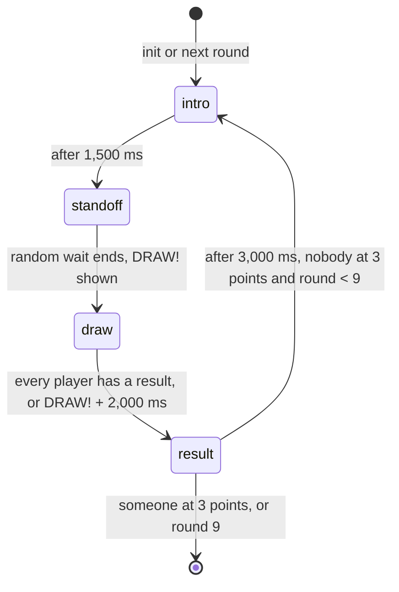

# Quick Draw 🤠

**Wait for DRAW, then tap first. Tap early, or on a fake, and it's a foul.**

The first playable Couchcade game. Everyone stands in a dusty desert street, the TV goes quiet, and the first player to tap their phone after DRAW! wins the round. Sometimes the TV tries to fool you first. A match lasts about a minute.

**For the owner.** Read [At a glance](#at-a-glance), [Owner decisions](#owner-decisions-2026-09-16) and [Fake-outs](#fake-outs). That takes about 5 minutes.

**For agents.** Everything below is binding for CC-10.2 to CC-10.8. [platform.md](../architecture/platform.md), [HOUSE_STYLE.md](../HOUSE_STYLE.md) and [platform-screens.md](../design/platform-screens.md) still apply. Where this spec and a story disagree, stop and flag it.

Status: approved by the owner on 2026-09-16 (CC-10.1), including the fake-out design.

---

## Contents

- [At a glance](#at-a-glance)
- [Owner decisions (2026-09-16)](#owner-decisions-2026-09-16)
- [Inspiration](#inspiration)
- [Rules and scoring](#rules-and-scoring)
- [Round flow and timings](#round-flow-and-timings)
- [Fake-outs](#fake-outs)
- [Phone controller](#phone-controller)
- [Input message schema](#input-message-schema)
- [TV scene](#tv-scene)
- [Fairness](#fairness)
- [Edge cases](#edge-cases)
- [Budget check](#budget-check)
- [Platform modules reused](#platform-modules-reused)
- [CC0 asset shortlist](#cc0-asset-shortlist)

---

## At a glance

| | |
|---|---|
| Pitch | A western standoff with toy popguns. The TV shouts DRAW! at a random moment, and the fastest tap wins the round. |
| Players | 2 to 8. Everyone draws at the same time, so nobody sits out a round. |
| Phone | One big action. It turns red for "Wait for DRAW" and the player taps it without looking. No motion sensors. |
| TV | A 480×270 desert street with the players' Pips facing off, a scoreboard and the DRAW! callout. |
| Round | About 10 seconds: get ready, a random wait, DRAW!, result. |
| Fake-outs | From round 2, most standoffs have 1 or 2 fakes: a look-alike word such as DRIP!, a crow's caw, or a glint off a popgun. |
| Winning | The fastest valid tap scores 1 point. First to 3 points wins. The match stops after 9 rounds at most. |
| Fouls | Tapping before DRAW!, on a fake, or less than 100 ms after DRAW! is a foul. You're out of that round. No point is taken away. |
| Fairness | Each phone stamps its tap with the shared room clock, so Wi-Fi or 4G speed doesn't matter. A fake never comes within 1 second of DRAW!. |
| Cost | About 11 requests per round with 8 players, fakes included. Well within the caps: 0.1 messages per second per phone and about 0.2 per second from the TV. |
| Assets | CC0 packs from Kenney and OpenGameArt, recoloured to the approved desert palette. A few small props are drawn from scratch. |

## Owner decisions (2026-09-16)

1. **Everyone draws at once.** There's no bracket. Every round works the same for 2 to 8 players. The README's "up to 8 as a bracket" needs a follow-up edit to match.
2. **The Pips draw toy cork popguns** that pop out a "BANG!" flag. Nobody gets hit: the losers look surprised and a puff of dust blows past.
3. **Fake-out calls are in the first version.** See [Fake-outs](#fake-outs).

---

## Inspiration

Quick Draw copies how these games play, not their names, characters or art.

| Game | What we take from it | Source |
|---|---|---|
| 1-2-Switch, "Quick Draw" (Nintendo, 2017) | Two players wait for the signal and fire. It shows who was faster and by how much. The "Fake Draw" variant uses decoy words. | [Wikipedia](https://en.wikipedia.org/wiki/1-2-Switch), [Shacknews gameplay video](https://www.shacknews.com/article/98578/nintendo-switch-1-2-switch-quick-draw-gameplay-video) |
| "Samurai Kirby" (*Kirby Super Star*, 1996; *Kirby's Return to Dream Land Deluxe*, 2023) | React to the "!" signal. Early presses are fouls and repeated fouls lose. Times are shown in hundredths of a second. Deluxe has up to 4 players at once and first to a set number of wins. | [WiKirby](https://wikirby.com/wiki/Samurai_Kirby), [StrategyWiki](https://strategywiki.org/wiki/Kirby_Super_Star/Samurai_Kirby) |
| "How the West Was Really Won" (*WarioWare: Smooth Moves*, 2006) | A western DRAW! shown as a word on screen, with no way to fire early. | [Super Mario Wiki](https://www.mariowiki.com/How_the_West_Was_Really_Won) |
| *Wild Gunman* (Nintendo, NES 1984, arcade 1974) | The original "wait for FIRE, then shoot" duel. Firing early loses the duel. | [Wikipedia](https://en.wikipedia.org/wiki/Wild_Gunman) |

*Wii Play* was checked too. None of its [nine minigames](https://en.wikipedia.org/wiki/Wii_Play) is a reaction duel, so it isn't listed.

Research on fair timing:

- Athletics counts any start within 100 ms of the gun as a false start, because humans can't react faster than that. Research found auditory reactions as fast as 80 ms ([World Athletics](https://worldathletics.org/news/news/iaaf-sprint-start-research-project-is-the-100)). Visual reactions are slower, usually 190 to 250 ms, so a 100 ms floor is safe for a visual DRAW!.
- A fair browser reaction test times the tap with the high-resolution clock, not by counting frames. An early tap ends that player's turn with neutral feedback and cancels the pending signal ([DEV: Building a fair reaction time test in the browser](https://dev.to/hitthebuttonio/building-a-fair-reaction-time-test-in-the-browser-2kjm)).
- `Event.timeStamp` is a high-resolution timestamp. Browsers round it to at least 1 ms, which is fine for us ([MDN](https://developer.mozilla.org/en-US/docs/Web/API/Event/timeStamp)).

---

## Rules and scoring

1. **Players.** 2 to 8 seated players (`players: { min: 2, max: 8 }`). The game gets them at `init` and nobody joins mid-match.
2. **Round.** Every round has one DRAW!. Each player gets one tap per round. Only the first `pointerdown` counts.
3. **Reaction time.** `reactionMs = round(atMs - drawAtMs)`, in game time. The TV's display lag is not subtracted in this version. See [Fairness](#fairness).
4. **Tap result.** Every player ends the round with exactly one result:

   | Result | When | Point |
   |---|---|---|
   | `foul` | `reactionMs < 100`. That includes every tap before DRAW! and every tap on a fake. A foul within 1,000 ms after a fake is shown as "fooled". | No |
   | `valid` | `100 <= reactionMs <= 1500` | 1 point if fastest |
   | `slow` | `reactionMs > 1500`, or no tap when the round resolves | No |

5. **Round winner.** The player with the lowest valid `reactionMs` scores 1 point. If several players share the same whole millisecond, they all score. If nobody has a valid tap, nobody scores.
6. **Fouls** cost only the round: no point that round, and points are never taken away. Fakes make fouls common, and a points penalty would drag scores down and make matches drag on. In a duel, a foul already hands the round to the other player if they draw in time. One tap per round also makes spamming pointless.
7. **Match end.** The match ends after the round in which any player reaches **3 points**, or after **round 9**.
8. **Placements** (`outcome`). Sort by points, most first. Break ties with the player's fastest valid reaction in the match, fastest first. Players still tied share a place. `score` is the points total.
9. **Players leaving.** When a seat expires (`onPlayerLeft`), that player keeps their points but can't score again. If fewer than 2 players remain, the match ends at once with the current placements.

## Round flow and timings



| Phase | Length | TV | Phone |
|---|---|---|---|
| `intro` | 1,500 ms | "Round 2" chip lifts, a tumbleweed rolls past, bottom panel: "Tap your phone when the TV shouts DRAW" | Previous result, or "Watch the TV" in round 1. Taps do nothing. |
| `standoff` | Random, 2,000 ms plus a memoryless wait (below). About 3.5 s on average, 8 s at most. | Music stops, wind loop, Pips blink, [fake-outs](#fake-outs) from round 2. Bottom panel: "Wait for it…", or "Only DRAW! counts" from round 2. A player who fouls gets FOUL! over their Pip right away. | Red "Wait for DRAW". A tap is sent at once. |
| `draw` | Until every player has a result, or DRAW! + 2,000 ms | DRAW! callout at full size on its first frame, plus the DRAW sting | Unchanged. A tapped phone shows the disabled state locally. |
| `result` | 3,000 ms | Winner pops their flag, times appear over every Pip ("0.243"), bottom panel: "Noor wins the round" | The player's own result |

**The random wait must not be guessable.** A plain random pick between 2 and 5 seconds lets a player count to 5 and tap, because DRAW! can't come later. Use a memoryless wait instead: after the first 2,000 ms, every 60 Hz tick has a 1 in 90 chance of DRAW!, capped at 8,000 ms in total. The host rolls those ticks ahead when the standoff starts and stores the result as `drawAtMs`, so the fakes can be placed around it. The average extra wait is 1.5 s, and waiting longer never tells a player that DRAW! is close. The chance comes from the seeded RNG in `TState`. It's all integer maths, so replays stay exact.

A round lasts about 10 seconds on average and 15 at most. A 2-player match usually lasts 3 to 5 rounds (30 to 50 s). An 8-player match lasts at most 9 rounds (about 90 s).

## Fake-outs

Owner decision 3, inspired by 1-2-Switch's "Fake Draw". Only the word DRAW! counts. Everything else the TV does during the standoff is a fake.

| Fake | On the TV | Sound |
|---|---|---|
| Look-alike word | A callout in the same style and place as DRAW!, shown for 600 ms: `DRIP!`, `DRUM!`, `DROP!`, `DRY!`, `DREAM!` or `DRIFT!` | A fake sting: a different, shorter jingle that sounds like the DRAW sting |
| Crow | A crow lands on the cactus and flaps once | A crow's caw |
| Glint | The sun glints off one Pip's popgun: a 16×16 sparkle for 300 ms | A short ting |

**How often.** At the start of each standoff, after picking the DRAW! time, the seeded RNG picks the fakes:

- Round 1 never has fakes, so new players learn the plain game first. The bottom panel in round 2's intro says "Watch out for fakes".
- From round 2: no fake in 30% of standoffs, 1 fake in 50% and 2 fakes in 20%.
- Kind: a word in 50% of fakes, the crow in 25% and the glint in 25%. A word isn't used twice in a match until all six have been shown.
- Timing: each fake lands on a random tick at least 1,000 ms after the standoff starts, 1,000 ms before DRAW! and 1,000 ms from any other fake. A fake that doesn't fit is dropped. Fakes never make a standoff longer, so a short standoff simply has fewer.

**Scoring.** A tap on a fake is a tap before DRAW!, so it's a normal foul: out of the round, no point, nothing taken away (rule 6). A foul within 1,000 ms after a fake gets the "fooled" message.

**Fairness.**

- Fakes don't change the clock rules. A tap is judged only against `drawAtMs` in room time, so a fake can't turn a valid tap into a foul or the other way round. The 100 ms floor after DRAW! stays the same.
- The 1,000 ms gap before DRAW! matters. Reactions to a fake take about 200 to 600 ms, so they always land before DRAW! and count as fouls. Without the gap, a fake 50 ms before DRAW! would give a fast time to someone who fell for it.
- Everyone sees the same fake at the same moment on one TV, and the phone never shows fakes, so network speed doesn't help or hurt.
- Fakes are part of `TState` and drawn from the seeded RNG, so replays and snapshots reproduce them exactly.

**Readability.** Every player reads the same TV from the couch:

- Word fakes use the full `callout` size (160 px at 1080p). No fake contains "DRAW", and each differs from it by at least 2 letters or in length.
- There's only one callout on screen at a time. A fake word disappears after 600 ms, and DRAW! stays up until the result.
- The crow and the glint are small world animations, not overlays, so a DRAW! callout is never hidden behind them.
- No full-screen flashes. With reduced motion, the crow appears without flapping and the sparkle doesn't twinkle.
- The TV never speaks. Neither DRAW! nor the fakes have a voice, so no voice recordings are needed and the game still works with the sound off.

**Audio.** Three new sounds: the fake sting, the crow caw and the ting (see the [asset shortlist](#cc0-asset-shortlist)). Each has its own visual. Only the real DRAW sting plays with DRAW!, so players listening instead of watching can be fooled too.

**Budget.** Fakes send nothing. They're animations and sounds on the TV only. Each phone still sends at most 1 tap per round. The phone learns about a foul in the round's result view, so fakes add no `controller:state` messages. See the [budget check](#budget-check).

---

## Phone controller

Touch only: `needsMotion: false`. There is no motion input, so no touch fallback is needed. A "raise your phone to draw" gesture was considered and left out. It would add the iOS motion permission step to the first game, and it's less exact than a tap.

The controller uses the UI kit's big action (CC-4.4) with the approved states from [platform-screens.md](../design/platform-screens.md#big-action). Players watch the TV, so during `standoff` the whole area below the top chip is the hit area, not only the circle. Taps fire on `pointerdown` and are sent with `send(input, event.timeStamp)`.

The phone never shows DRAW!. The TV is the only signal. A phone view goes through the relay and the host's 667 ms send window, so it would arrive late and at a different moment on each phone.

| Screen (`view.screen`) | Big action | Status line | Hint | Cue |
|---|---|---|---|---|
| `qd-watch` | Chalk, "Watch the TV" | "Round 1 · first to 3" | "Tap when the TV shouts DRAW" | none |
| `qd-standoff` | Signal, "Wait for DRAW" | "Round 2 · first to 3" | "Tap anywhere at DRAW" | `your-turn` in round 1 only |
| tapped (local state) | Disabled, "—" | "Tapped!" | "Watch the TV" | `press` (local haptic) |
| `qd-result`, won | Chalk, "Watch the TV" | "You won the round!" | "0.243 s · 2 points" | `celebrate` |
| `qd-result`, lost | Chalk, "Watch the TV" | "Noor was faster" | "Your time 0.301 s" | none |
| `qd-result`, foul | Chalk, "Watch the TV" | "Too early, that's a foul" | "Wait for DRAW next time" | `foul` |
| `qd-result`, fooled | Chalk, "Watch the TV" | "That was a fake, that's a foul" | "Only DRAW counts" | `foul` |
| `qd-result`, slow | Chalk, "Watch the TV" | "Too slow this time" | "Tap as soon as you see DRAW" | none |

- Every line stays under 40 characters. Names are at most 12 characters, so "Noor was faster" is at most 23.
- The tapped state is local and immediate. The phone switches to disabled on `pointerdown`, before any network traffic, so a second tap can't be sent.
- The host only sends views when they change: `qd-watch` once at the start, then exactly one `qd-standoff` and one `qd-result` batch per round. A foul during `standoff` doesn't send an early view. The phone stays on "Tapped!" and the TV shows FOUL! at once.
- View data (`TView`), kept well under 1 KB:

```ts
type QuickDrawView =
  | { round: number; target: 3; points: number }                                    // qd-watch, qd-standoff
  | { round: number; target: 3; points: number;
      result: "won" | "lost" | "foul" | "fooled" | "slow"; ms: number | null; winner: string | null }; // qd-result, winner = a name
```

## Input message schema

One input type. The round number stops a late tap from counting in the next round.

```ts
import { z } from "zod/mini";

export const inputSchema = z.object({
  type: z.literal("draw"),
  payload: z.object({ round: z.int().check(z.gte(1), z.lte(9)) }),
});
export type QuickDrawInput = z.infer<typeof inputSchema>;
```

On the wire, with `at` added by the send helper and `from` by the relay (about 70 bytes):

```json
{ "t": "input", "d": { "type": "draw", "payload": { "round": 2 }, "at": 1789571234567 } }
```

`onPlayerInput` ignores an input when the phase isn't `standoff` or `draw`, when `payload.round` isn't the current round, or when that player already has a result this round.

---

## TV scene

| | |
|---|---|
| World | 480×270, integer scaled, horizon in the upper third (about y = 90). Side view down a dusty main street. |
| Scene palette | `desert` as approved in HOUSE_STYLE: `#F1CF8B` sand, `#E0A15E` mesas, `#8FD3F4` sky, `#37B26C` cactus. Sky and Turf are already core colours, so the world uses 8 unique colours of the 16 allowed. CC-10.5 writes `packages/theme/src/scenes/quick-draw.ts`. Adding a colour needs review. |
| Players | World Pips (16×24, from `@couchcade/stage`). With 2 players they stand at x = 150 and x = 330, facing each other. With 3 to 8, even slots stand on the left and odd slots on the right, facing across the street, staggered 12 px in depth. |
| Props | Two cacti, rocks, mesas on the horizon, a tumbleweed during `intro`, a popgun per Pip, a "BANG!" flag and a dust puff on `result`. For fakes: a crow (3 frames) and a popgun sparkle (16×16, 3 frames). |
| Overlays | All from `@couchcade/stage` (CC-4.6): scoreboard with player chips and points, round counter chip, callouts, bottom instruction panel, room code panel. |
| Callouts | `DRAW!` at the start of `draw`. Fake words during `standoff` (see [Fake-outs](#fake-outs)). `FOUL!` over a Pip when it fouls. The winner's name goes in the bottom panel, not in a callout. |
| Motion | `DRAW!` is fully readable on its first frame. The pop and 4 px shake play after it, never before. Reduced motion: no shake, no scaling. |
| Expressions | Pips are neutral during the standoff. On `result` the winner looks happy and the others look surprised. Nobody looks sad or angry at a foul. |
| Sound | Music loop in `intro` and `result`, stopped during `standoff` for tension. Wind loop during `standoff`. DRAW sting on the `DRAW!` tick. Fake sting, crow caw or ting with each fake. One pop per valid tap in reaction order on `result`. `foul` and `celebrate` tokens from `@couchcade/audio`. Every sound has a visual cue. |

---

## Fairness

1. **Room clock, not arrival time.** The phone stamps `at` from the tap's `event.timeStamp` with `toHostTime` (CC-1.14, target error under 15 ms). The host converts it to `ctx.atMs` in game time. A phone on slow 4G is judged on when the player tapped, not when the message arrived.
2. **DRAW time** is the game time of the tick that first shows `DRAW!`. It's stored as `drawAtMs` in `TState`.
3. **TV lag is not subtracted.** Everyone looks at the same TV, so display lag never changes who wins. It only makes every time a little slower. Quick Draw ignores `ctx.displayLagMs` on purpose. CC-3.8 measures lag by having players tap after a flash, so its value also contains their reaction time (about 250 ms). Subtracting that would turn real reactions into fouls. Leaving lag in can only make the foul floor more forgiving, never stricter. Times on screen include the TV's delay. That's fine, because they're only compared within the room. If CC-3.8 later measures lag without reaction time (for example tapping along to a steady beat), subtracting it becomes a small follow-up.
4. **The 100 ms foul floor** catches players who guess, and absorbs clock error of up to 15 ms per device.
5. **Ties** are exact whole milliseconds and both players score. Any wider tie window would pretend to a precision we don't have, and ties would happen often.
6. **Late messages.** The platform clamps `atMs` to at most 500 ms before the tick that applies it. The round waits until DRAW! + 2,000 ms, so a valid tap up to 1,500 ms has 500 ms to arrive.
7. **Known limit.** Phones differ in touch latency, typically by a few tens of milliseconds. We don't correct for it. For friends on a couch that's acceptable, and it's the same limit every browser reaction test has.

## Edge cases

| Case | What happens |
|---|---|
| Phone locks or drops during a round | No tap arrives, so the result is `slow`. The seat is kept for 2 minutes. On rejoin the host re-sends the current view, and during `standoff` the player can still tap. |
| Seat expires mid-match | `onPlayerLeft` freezes that player's points and the round no longer waits for them. With fewer than 2 players left, the match ends with placements. |
| Late joiner | Gets a seat and waits on the platform `next-game` screen (platform decision 16). They play from the next match. |
| Audience | Sees the platform `audience` screen. Audience phones can't send input. |
| TV refresh or deploy mid-round | The round in progress is lost (platform decision 17). `snapshot` stores `{ round, points, bestMs, rng }` per player at the end of each round (under 300 bytes). `restore` resumes at the next round's `intro`. |
| Tap before the phone got `qd-standoff` | The phone is still on `qd-watch` or `qd-result`, so the tap isn't sent. The shortest standoff is 2,000 ms, which is far more than the 667 ms send window plus network time. |
| Tap from the previous round arrives late | Dropped because `payload.round` doesn't match. |
| Phone not clock-synced yet (just reconnected) | The controller shows `qd-watch` until the clock module has at least one sample, then switches to `qd-standoff`. CC-10.3 builds this on CC-1.14. |
| Everyone fouls or nobody taps | No point this round. Bottom panel: "No winner this round". The round still counts towards the 9. |
| Two players reach 3 in the same round | Both have 3 points. Fastest valid reaction decides first place, otherwise they share it. |
| Multi-touch or palm on the screen | Only the first `pointerdown` in a round counts. The phone is disabled locally after it. |

---

## Budget check

Caps from [platform.md](../architecture/platform.md#the-caps): phones at most 4 messages per second, host `controller:state` at most 1.5 per second. Every message that reaches the room costs 1 request.

| Per round, 8 players | Requests |
|---|---|
| `input` taps, at most 1 per phone | 8 |
| `controller:state` (one `qd-standoff` batch, one `qd-result` batch) | 2 |
| `room:snapshot` at the end of the round | 1 |
| Fake-outs (animations and sounds on the TV only) | 0 |
| **Total** | **about 11 per 10-second round** |

| Check | Quick Draw | Cap | Fits |
|---|---|---|---|
| Messages per phone | 1 per round, about 0.1 per second | 4 per second | Yes, 40 times under |
| Host `controller:state` | 2 per round, about 0.2 per second. The two sends are always at least 2,000 ms apart. | 1.5 per second, 667 ms apart | Yes |
| One match, 8 players, 9 rounds at most | about 100 requests, plus 2 `room:phase` | none | |
| One hour of only Quick Draw, 8 players | about 4,000 requests | platform.md plans about 7,500 per hour for 8 phones in turn-based games | Yes. Quick Draw counts as a turn-based game and uses nothing of the real-time budget. |

`realtime` is `true` because `onTick` drives the phases. Taps still go through the batching helper, but at 1 per round each one goes out at once.

---

## Platform modules reused

Quick Draw adds no new platform code. Anything missing below belongs to the owning story, not to this game.

| Module | Used for | Story |
|---|---|---|
| `@couchcade/game-sdk/contract` | `defineGame`, `CouchcadeGame`, `InputContext` (`atMs`), `outcome`, `snapshot`/`restore`, `onPlayerLeft` | CC-1.13 |
| `@couchcade/game-sdk` clock | `toHostTime` inside `send`, the synced check on the phone | CC-1.14 |
| `@couchcade/game-sdk/input` | Batching helper and caps (1 tap per round passes straight through) | CC-3.6 |
| `@couchcade/game-sdk/testing` | `testGameContract`, `createFakeRoom`, `replay` with one recorded match | CC-1.13 |
| `@couchcade/utils` | `createRng(seed)` for the standoff wait and the fake-outs | CC-1.7 |
| `@couchcade/protocol` | `PlayerInfo`, `ControllerView`, `JsonValue` types | CC-1.8 |
| `@couchcade/ui` | Big action, player chip, local `press` haptic | CC-4.4, CC-7.5 |
| `@couchcade/stage` | `StageScene`, scoreboard, callouts, room code panel, World Pips | CC-4.6, CC-6.4 |
| `@couchcade/audio` | `foul` and `celebrate` tokens, music ducking | CC-7.2 |
| `@couchcade/theme` | `desert` scene palette, motion tokens | CC-4.2, CC-10.5 |
| `@couchcade/motion` | Not used (`needsMotion: false`) | |
| `@couchcade/physics` | Not used | |

---

## CC0 asset shortlist

Every sprite is recoloured with `pnpm assets:recolour <input> desert` and credited in `games/quick-draw/CREDITS.md` (CC-10.5). The CC0 deed: [creativecommons.org/publicdomain/zero/1.0](https://creativecommons.org/publicdomain/zero/1.0/). The licence of each pack below was checked on its source page on 16 September 2026.

| Need | Candidate | Author | Licence |
|---|---|---|---|
| Sand ground, rocks, cacti (16×16 pixel tiles) | [Desert Shooter Pack](https://kenney.nl/assets/desert-shooter-pack) (500+ sprites, also on [OpenGameArt](https://opengameart.org/content/desert-shooter-pack)) | Kenney | [CC0](https://kenney.nl/assets/desert-shooter-pack) |
| Popgun pop, dust puff thud | [Impact Sounds](https://kenney.nl/assets/impact-sounds) (130 files) | Kenney | [CC0](https://kenney.nl/assets/impact-sounds) |
| Pop backup (2 shots, springs) | [100 CC0 SFX](https://opengameart.org/content/100-cc0-sfx) | rubberduck | [CC0](https://opengameart.org/content/100-cc0-sfx) |
| DRAW sting, fake sting (a similar jingle from the same pack), round win jingle | [Music Jingles](https://kenney.nl/assets/music-jingles) (85 files) | Kenney | [CC0](https://kenney.nl/assets/music-jingles) |
| Intro tick, glint ting | [Interface Sounds](https://kenney.nl/assets/interface-sounds) (100 files) | Kenney | [CC0](https://kenney.nl/assets/interface-sounds) |
| Standoff wind loop | [Wind Whoosh Loop](https://opengameart.org/content/wind-whoosh-loop) | SketchMan3 | [CC0](https://opengameart.org/content/wind-whoosh-loop) |
| Crow caw (fake-out) | [Crow caw](https://opengameart.org/content/crow-caw) | zeroisnotnull | [CC0](https://opengameart.org/content/crow-caw) |
| Game music loop (check it's 110 to 130 BPM) | [Chiploop](https://opengameart.org/content/chiploop) | iamoneabe | [CC0](https://opengameart.org/content/chiploop) |

Drawn from scratch (small, no CC0 source needed): mesa silhouettes, tumbleweed (4 frames), popgun with "BANG!" flag (3 frames), dust puff (4 frames), crow (3 frames), popgun sparkle (3 frames). Anything the Desert Shooter Pack lacks is drawn from scratch too.

Rejected: OpenGameArt [Cowboy](https://opengameart.org/content/cowboy) (its terms aren't CC0-compatible, and Pips replace characters), [Wind Loop](https://opengameart.org/content/wind-loop) (CC BY 3.0, not allowed), [Desert Loop](https://opengameart.org/content/desert-loop) (CC0, but its style doesn't fit a western).
