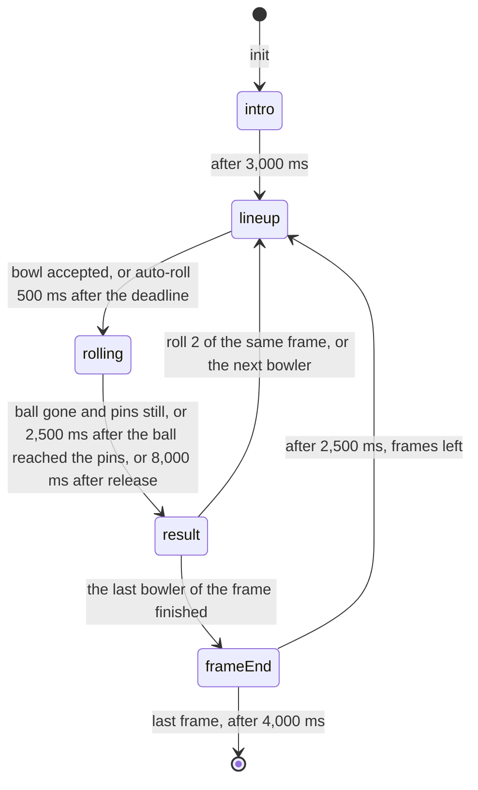

# Strike Night 🎳

**Hold the ball, swing your arm, let go. Twist your wrist to hook it into the pins.**

Couchcade's first swing game. The group takes turns on one warm wooden lane. The phone is the ball: pick a spot on the approach, hold the big button, swing your arm and let go. How hard you swing sets the speed, which way you swing sets the line, and a twist of the wrist hooks the ball late, like a real one. Up to 4 players bowl a full 10-frame game each: about 4 minutes alone, 14 minutes with 4 players.

**For the owner.** Read [At a glance](#at-a-glance) and [Owner decisions](#owner-decisions-2026-09-17) at the end. That takes about 5 minutes.

**For agents.** Everything below is binding for CC-12.2 to CC-12.7. [platform.md](../architecture/platform.md), [motion.md](../architecture/motion.md), [session-flow.md](../architecture/session-flow.md), [HOUSE_STYLE.md](../HOUSE_STYLE.md) and [platform-screens.md](../design/platform-screens.md) still apply. Where this spec and a story disagree, stop and flag it.

Status: approved by the owner on 2026-09-17 (CC-12.1), with the three decisions at the end.

---

## Contents

- [At a glance](#at-a-glance)
- [Inspiration](#inspiration)
- [Rules and scoring](#rules-and-scoring)
- [Turn flow and timings](#turn-flow-and-timings)
- [Ball and pins](#ball-and-pins)
- [Phone controller](#phone-controller)
- [Input message schema](#input-message-schema)
- [TV scene](#tv-scene)
- [Fairness](#fairness)
- [Edge cases](#edge-cases)
- [Budget check](#budget-check)
- [Platform modules reused](#platform-modules-reused)
- [Scene palette: alley](#scene-palette-alley)
- [CC0 asset shortlist](#cc0-asset-shortlist)
- [Found while writing this spec](#found-while-writing-this-spec)
- [Owner decisions (2026-09-17)](#owner-decisions-2026-09-17)

---

## At a glance

| | |
|---|---|
| Pitch | A cosy bowling alley at night. One lane, the whole group on the bench, one bowler at a time. Everyone watches the ball roll and the pins fly. |
| Players | 1 to 4, taking turns. One player can play alone for a high score. |
| Phone | On your turn, drag the bar to pick where you stand. Hold the big ball button, swing your arm like a bowler and let go. Twist your wrist as you let go to hook the ball. Phones without a gyroscope, or players who pick touch, swipe up the button instead: a faster swipe rolls faster, a curved swipe hooks. |
| TV | A 480×270 lane seen from behind the bowler, then a close shot of the pins as the ball arrives. Pins tumble, a pin map shows what's left, and STRIKE! or SPARE! pops when earned. |
| Match | 10 frames each, whatever the player count. Each frame is up to 2 rolls. About 4 minutes for 1 player, 7 for 2, 10.5 for 3 and 14 for 4. |
| Scoring | A strike is 30, a spare is 10 plus the first roll, any other frame is the pins knocked down. The score is final as soon as the frame ends. Most points wins, ties go to more strikes. |
| Turn timer | 20 seconds to bowl. When it runs out the game rolls a gentle straight ball for you, so a dropped phone never stalls the lane. |
| Skill | Where you stand, how straight you swing and how much you twist. Full speed comes at a firm swing, about 900 degrees a second. Swinging harder adds nothing. |
| Fairness | Nothing moves while you line up, so Wi-Fi and TV lag never matter. The same swing always knocks down the same pins. There's no luck. |
| Cost | About 250 requests for a 2-player match and 500 for a 4-player match. Only the bowler's phone sends anything. |
| Assets | CC0 sounds and music from Kenney and OpenGameArt, Kenney furniture for the seating area, recoloured to the existing `alley` palette. The lane, pins, ball and pinsetter are drawn from scratch. |

---

## Inspiration

Strike Night copies how these games play, not their names, characters or art.

| Game | What we take from it | Source |
|---|---|---|
| *Wii Sports*, "Bowling" (Nintendo, 2006) | The whole control idea. Move left and right with the D-pad, turn the aim with A plus the D-pad, then "Hold B, and raise the remote as shown on screen. Keep B held, swing your arm back..., then swing forward, and release B when you want to let go." "Spin can be put on the ball by tilting the controller on release." Players pass one remote around, hotseat style. | [Wikibooks](https://en.wikibooks.org/wiki/Wii_Sports/Bowling), [Wikipedia](https://en.wikipedia.org/wiki/Wii_Sports) |
| *Wii Sports Resort*, "Bowling" (Nintendo, 2009) | Spin from rotating the remote during the swing, measured by the gyroscope (MotionPlus). Hotseat multiplayer. It also adds a 100-pin and a spin-control variant, which we leave for later. | [Wikipedia](https://en.wikipedia.org/wiki/Wii_Sports_Resort) |
| *Nintendo Switch Sports*, "Bowling" (Nintendo, 2022) | Hold ZR, throw, "twist your wrist to hook the ball". Players "move/rotate your character before you bowl" and "gently rotate your wrist towards your body before the ball releases". Up to 4 local players. Its Special lanes with obstacles and moving floors are a later idea at most. | [Nintendo](https://www.nintendo.com/sg/switch/as8s/bowling/), [Nintendo tips](https://play.nintendo.com/news-tips/tips-tricks/tips-tricks-nintendo-switch-sports/), [Wikipedia](https://en.wikipedia.org/wiki/Nintendo_Switch_Sports) |
| *Kinect Sports*, "Bowling" (Rare, 2010) | No buttons at all: reach for the ball, swing forwards, exaggerate the arm motion for spin. Proof that a whole-arm swing with a late spin reads for casual players. | [Wikipedia](https://en.wikipedia.org/wiki/Kinect_Sports) |
| Ten-pin bowling | The lane (18.29 m from foul line to head pin, 1.05 m and 39 boards wide), pins 30 cm apart in a triangle, the dry back end where the ball hooks, and World Bowling's current frame scoring: "strike is 30 pins, regardless of ensuing rolls' results", a spare is "10 pins, plus the pinfall on first roll of the current frame". | [Wikipedia: Ten-pin bowling](https://en.wikipedia.org/wiki/Ten-pin_bowling), [Bowling pin](https://en.wikipedia.org/wiki/Bowling_pin), [Bowling ball](https://en.wikipedia.org/wiki/Bowling_ball) |

What we don't take from the Nintendo games, and why:

- **A separate aim-turning step.** Wii Sports turns the aim with A plus the D-pad. We have one big action per phone screen, so direction comes from the swing itself. See [owner decision 3](#owner-decisions-2026-09-17).
- **Timing the release for spin.** On the Wii, letting go early adds spin. Our spin is only the wrist twist, which `@couchcade/motion` already measures (motion.md, [Swing](../architecture/motion.md#swing-cc-54)). One rule is easier to learn.
- **Traditional scoring with strike bonuses carried into later frames.** Party players can't follow pending bonuses, and the last frame would need up to 2 bonus rolls. See [owner decision 1](#owner-decisions-2026-09-17).

Research on controls and physics:

- **Phone as the ball.** [web-bowling](https://github.com/tvalletta/web-bowling) is an HTML5 bowling game that uses the phone as the controller: pressing the ball on screen starts recording `devicemotion`, releasing sends the swing over a WebSocket, and the display rolls the ball into 10 circular pins in a top-down Box2D world. Strike Night uses the same split, with `@couchcade/motion` doing the maths on the phone and `@couchcade/physics` (Planck.js, a Box2D port) on the TV.
- **Fast balls and bullets.** Box2D says "fast moving objects … can be configured as bullets" and bullets do continuous collision "with all body types, but not other bullets" ([Box2D docs](https://box2d.org/documentation/md_simulation.html)). Only the ball is a bullet, the pins are not.
- **Speed and hook.** A USBC study puts the best ball speed at "21 mph at release (17 mph at the pins)" and the hook happens in "the last ≈20 feet" where the lane is dry ([Wikipedia: Bowling ball](https://en.wikipedia.org/wiki/Bowling_ball)). Our full-speed ball leaves the hand at 9 m/s (20 mph), reaches the pins at about 7.4 m/s (17 mph), and hooks only after 12.2 m (40 ft).
- **Pins that fall in 2D.** A top-down pin is a disc that slides but can't tip over, so it knocks down fewer neighbours than a real pin. A throwaway prototype on `@couchcade/physics` (not committed) got strikes on only 5% of throws across a sweep of lines through the pins. Growing a hit pin's radius from 6 to 8 cm, as if it were falling over, brought that to 19%. That's the "falling pin" rule in [Ball and pins](#ball-and-pins).

---

## Rules and scoring

1. **Players.** 1 to 4 seated players (`players: { min: 1, max: 4 }`), as in Switch Sports local play ([owner decision 2](#owner-decisions-2026-09-17)). The game gets them at `init` and nobody joins mid-match.
2. **Frames.** Every player bowls 10 frames, whatever the player count ([owner decision 2](#owner-decisions-2026-09-17)):

   | Players | Typical match | Wait between your turns | Longest match |
   |---|---|---|---|
   | 1 | about 3.8 min | none | about 11 min |
   | 2 | about 7.2 min | about 20 s | about 21 min |
   | 3 | about 10.5 min | about 40 s | about 32 min |
   | 4 | about 14 min | about 1 min | about 42 min |

   The times come from [Turn flow and timings](#turn-flow-and-timings): about 20 seconds per player per frame, plus 3 s of intro and the scorecard between frames (9 × 2.5 s and 4 s at the end). For 4 players that's 40 × 20 + 22.5 + 4 + 3 = 830 s. The longest match assumes every roll uses the whole timer, 62 s per player per frame.
3. **Turn order.** Seat order. Frame 1 goes through every player, then frame 2, and so on. A frame is the bowler's roll 1 and, unless it was a strike, roll 2.
4. **Rolls.** Roll 1 is at all 10 pins. After it, fallen pins are swept and the standing pins go back to their spots. Roll 2 is at the standing pins. A ball in the gutter knocks down nothing.
5. **Frame score** (current frame scoring, [owner decision 1](#owner-decisions-2026-09-17)):

   | Frame | When | Score | Mark on the TV |
   |---|---|---|---|
   | Strike | Roll 1 knocks down all 10 | 30 | `X` |
   | Spare | Roll 2 knocks down every pin roll 1 left | 10 + roll 1's pins | `7 /` |
   | Open | Pins left after roll 2 | roll 1 + roll 2 | `7 2`, a gutter is `-` |

   The score is final when the frame ends. There are no bonus rolls in the last frame. A perfect game is 10 strikes, 300 points.
6. **Turn timer.** Every roll has 20,000 ms from the start of `lineup`. A `bowl` counts if its `atMs` is at or before the deadline. If nothing counts by 500 ms after the deadline, the game bowls for the player: their current position, `speed` 0.3, `angle` 0, `spin` 0. That's an auto-roll. It scores like any roll.
7. **Away players.** A player whose last 2 rolls were auto-rolls is away. Their next rolls get 5,000 ms instead of 20,000. Any accepted input from them (`move`, `grip` or `bowl`) clears away, and that lineup's deadline moves to 15,000 ms after the input, never earlier than it was. A dropped phone then holds up each roll for about 5.5 s of lining up instead of 20.5 s.
8. **Match end.** After the last player's last frame, or when no seated players remain.
9. **Placements** (`outcome`). Sort by total points, most first. Break ties with more strikes, then more spares. Players still tied share a place. `score` is the points total.
10. **Players leaving.** When a seat expires (`onPlayerLeft`), the player keeps their points and bowls no more frames. If they were in `lineup`, the turn passes at once. If their ball is rolling, the roll finishes and counts, then the turn passes.
11. **No randomness.** Nothing in Strike Night is random. The seed is unused, so replays and restores are exact by construction.

## Turn flow and timings



| Phase | Length | TV | Phone |
|---|---|---|---|
| `intro` | 3,000 ms | Approach shot. Title chip "Strike Night · 10 frames". Bottom panel: "Hold the ball, swing, let go". | Everyone `sn-watch`. The first bowler gets `sn-next`. |
| `lineup` | Until a `bowl` is accepted. At most 20,000 ms plus the 500 ms wait (5,000 ms for an away player). | Approach shot. On roll 1, "Noor is up" in the bottom panel and the bowler's chip lifts. The bowler's Pip slides to each `move` and lifts the ball on `grip`. On roll 2, the pin map shows the standing pins. A clock chip counts down the last 5 seconds with a tick each second. | Bowler `sn-bowl`, next bowler `sn-next`, everyone else `sn-watch` |
| `rolling` | From release until the pins settle. About 2 to 8 seconds, typically 4.5. | The ball rolls up the lane. When it passes 16 m the TV cuts to the pin shot. Pins tumble. | Bowler on the local "Ball away!" state, everyone else unchanged |
| `result` | 1,500 ms, or 2,500 ms with a callout | The pin count pops over the deck ("9"). STRIKE!, SPARE! or TURKEY! when earned. After roll 1, the sweep bar clears the fallen pins. When the frame is over, its score pops on the bowler's chip. | Bowler `sn-result` |
| `frameEnd` | 2,500 ms, 4,000 ms after the last frame | Scorecard overlay with every player's frame marks and totals. Bottom panel: "Noor leads with 72". | Unchanged. The next `lineup` batch brings the new totals. |

A typical roll 1 is about 6 s of lining up, 4.5 s of rolling and 1.5 s of result: 12 s. Roll 2 has about 4 s of lining up: 10 s. With a strike on 1 roll in 5, a frame is about 12 + 0.8 × 10 = 20 s per player. The longest possible roll is 20.5 + 8 + 2.5 = 31 s, so a player who uses every second takes 62 s per frame.

---

## Ball and pins

The rules own the physics: `onTick` steps `@couchcade/physics` during `rolling`, and `TState` holds the ball and pin `BodyState`s, as the game contract (rule 5) and session-flow.md's [physics rules](../architecture/session-flow.md#physics-package) say. Planck never reaches phones (session-flow.md owner decision 4). Units are metres. The lane runs along `y`, from the foul line at `y = 0` to the head pin at `y = 18.29`. `x = 0` is the left edge of the lane, `x = 1.054` the right edge, so the centre is `x = 0.527`. Every number below is a named constant CC-12.2 may tune once, with the tuning targets at the end.

### The world

| Part | Spec | Why |
|---|---|---|
| Ball | `circleBody({ radius: 0.108, density: 191, friction: 0.2, restitution: 0.1, damping: floorFriction(8000), bullet: true })`, 7.0 kg | 21.6 cm ball, 16 lb. The 8 s half-life slows a full-speed ball from 9 to 7.4 m/s by the pins. |
| Pin | `circleBody({ radius: 0.06, density: 141, friction: 0.2, restitution: 0.5, damping: floorFriction(600) })`, 1.6 kg | 12 cm wide at the belly, 3.5 lb. A 600 ms half-life lets hit pins slide into their neighbours. |
| Falling pin | Once a pin's speed passes 0.5 m/s, it is falling for the rest of the roll. Its spec becomes radius 0.08 with density 79, the same mass. | A falling pin sweeps more floor than a standing one. The world spec is built from `TState` every step, so this stays pure. |
| Pin spots | Head pin at (0.527, 18.29). Row `r` (0 to 3), pin `c` (0 to `r`) at `x = 0.527 + (c − r/2) × 0.3048`, `y = 18.29 + r × 0.264` | Real spacing: 30.48 cm between neighbours |
| Kickbacks | `wallSegment([−0.235, 17], [−0.235, 19.6])` and `wallSegment([1.289, 17], [1.289, 19.6])`, restitution 0.4 | The side walls beyond the gutters, which bounce pins back into the deck |
| Pit | A body whose `y` passes 19.4 leaves the world | The pins and ball drop out of sight |

### Throwing

When a `bowl` is accepted (or an auto-roll fires), with `x`, `speed`, `angle` and `spin` from the payload:

| Step | Formula | Range |
|---|---|---|
| Start | `(0.527 + x × 0.41, 0.3)` | The ball's edge can reach the lane edge |
| Speed | `v = 4.5 + 4.5 × speed` m/s | 4.5 to 9 m/s (10 to 20 mph) |
| Direction | `θ = clamp(angle, −30, 30) × 0.05` degrees from straight, positive to the right | ±1.5°. A swing 10° off moves the ball 16 cm (6 boards) at the pins. |
| Velocity | `vx = v × sin θ`, `vy = v × cos θ` | |
| Hook | Every step while the ball's `y` is at least 12.2 and it isn't in the gutter: a push at right angles to its velocity, `F = m × 0.02 × spin × |v|²`, to the right for positive spin | A curve of radius 50 m at full spin: about 33 cm (12 boards) of hook by the pins, whatever the speed. Speed and hook are separate skills. |

What that means for a player:

- **Speed doesn't change the hook.** A full-speed ball reaches the pins in 2.2 s, a slow one in 4.8 s. Both hook the same distance, so the line only depends on where you stand, how straight you swing and how much you twist.
- **The pocket.** Hitting between the head pin and the pin behind it on either side, 6 to 10 cm from the centre, strikes about half the time. Straight into the head pin usually leaves 3 or 4 pins.
- **Hook from the edge.** Standing near the right edge and twisting left brings the ball back into the pocket, like a real hook. Left-handers mirror it.

### Gutters, settling and counting

1. **Gutter.** If the ball's centre leaves the lane (`x < 0` or `x > 1.054`) while `y < 17.9`, it's a gutter ball. It leaves the world, so it can't touch a pin. The scene rolls it on down the gutter at its speed, and `rolling` lasts until it would reach the pit: `(19.4 − y) / v` more.
2. **Settled.** `rolling` ends at the first of: the ball has left the world or rolls slower than 0.1 m/s, and every pin is slower than 0.05 m/s; 2,500 ms after the ball first reached `y = 17.9`; 8,000 ms after release.
3. **Down.** At the end of the roll a pin is down if it fell into the pit, is falling, or its centre is more than 0.04 m from its spot. Anything else stands. A pin that only wobbled a few centimetres stays up.
4. **Sweep.** After roll 1, down pins leave the state and standing pins go back to their exact spots with zero velocity, as a pinsetter does.
5. **Contacts** from `stepWorld` only drive sound cues ([TV scene](#tv-scene)), never the score.

### Prototype and tuning targets

The prototype ran the rules above on `@couchcade/physics` in Node:

| Measure | Result |
|---|---|
| Strikes across 246 throws aimed from 40 cm left to 40 cm right of the head pin, straight and hooked, at speed 0.3 and 0.8 | 19%, 7.3 pins on average |
| Pocket hits, 6 to 10 cm either side, 3 speeds | 53% strikes, the rest 8 or 9 |
| Straight into the head pin | 6 or 7 pins |
| Release to pins | 2.15 s at full speed, 4.78 s at speed 0 |
| Release to settled | 4.2 s on average over 567 throws, 7.3 s at most |
| Cost | About 5.5 ms of CPU per roll, 0.02 ms per step |

CC-12.2 keeps unit tests for these targets, with the numbers as ranges: a pocket hit at speed 0.8 strikes, a head-on hit leaves pins standing, a ball from `x = ±1` with no spin and angle 0 stays on the lane, a ball with `angle` 30 from the centre doesn't reach the gutter before the pins, and no ball tunnels through a pin at 9 m/s.

---

## Phone controller

`needsMotion: true`. Before the match the platform runs the approved motion step (CC-5.10): "Tap to enable motion", one second of holding still, the portrait lock or iPhone hint, the wake lock and tap to resume. Phones that deny motion, have no gyroscope (owner decision 5 in motion.md) or pick "Use touch instead" get the touch controls, and the TV shows the touch icon from CC-5.10. The game treats both the same.

Only the bowler's phone has controls. Every other phone shows a watch screen and sends nothing.

### Lining up (both modes)

- **Move bar.** A Chalk strip, 85% of the screen wide and 56 px tall, shaped like the lane, above the big action. A small ball marks the position. Touching or dragging anywhere on the strip puts the ball under the finger: `x = clamp((pointerX − stripCentre) / (stripWidth / 2), −1, 1)`, rounded to 0.05. That's 41 spots about 2 cm apart.
- `x` goes out with `set({ type: "move", payload: { turn, x } })` whenever it changes, at most 4 messages a second through the input stream, and the TV Pip slides there.
- The bar starts at the player's last position (`view.data.x`), 0 on their first roll. A player who liked their line just bowls again.
- The bar is off while the grip is held, so a swing can't move the player.

### Motion controls

- **Hold.** Portrait, like holding the ball: palm under the phone, thumb on the screen, facing the TV. The first `sn-bowl` of the match says "Room to swing? Go for it" (motion.md [Safety](../architecture/motion.md#safety) rule 3).
- **Grip.** The big action in the Hold state (Sunny, "Hold the ball"). `pointerdown` calls `swing.mark({ type: "grip-down", t })` and sends `set({ type: "grip", payload: { turn, held: true } })`. The label changes to "Swing, then let go".
- **Swing and release.** The player swings back and forward and lets go. `pointerup` calls `swing.mark({ type: "grip-up", t })`. The detector is `createSwingDetector({ emitOn: "release" })` with the default `minPeak` 240 and `fullPeak` 900 deg/s (owner decision 3 in motion.md). It emits only if a swing peaked in the 300 ms before the release.
- **Bowl.** On the detector's event the controller calls `fire({ type: "bowl", payload: { turn, x, speed, angle, spin } }, localPeakT)` and shows the local "Ball away!" state at once. `peakAt` stays on the phone: the input's `at` already carries the same moment.
- **No swing.** A release without a swing sends `set({ type: "grip", payload: { turn, held: false } })` and the hint "Swing before you let go". The player can grip again.
- **Cancel.** `pointercancel` resets the detector and sends `grip` with `held: false`. Nothing is bowled.
- `angle` is measured from where the phone faced at grip-down, so it doesn't matter where on the couch the player stands. Twisting clockwise, as the player sees it, gives positive spin and hooks right.

### Touch controls

- **Swipe pad.** The big action becomes the pad, same size and colour, labelled "Swipe up to bowl". `createSwingSwipe({ emitOn: "release" })` from `@couchcade/motion/fallbacks` reads it. Touching the pad is the grip (`grip` with `held: true`), lifting is the release.
- A swipe of at least 60 px up the pad bowls on lift: finger speed gives `speed` (300 to 2,400 px/s), the last 80 px give `angle`, and a curved path gives `spin`. A shorter or downward swipe sends `grip` with `held: false` and the hint "Swipe further up".
- **Why swipe, not tap.** The tap fallback emits a fixed speed of 0.7, spin 0 and an angle of ±60 by pad half. For bowling that throws away speed and hook, the two skills besides position, and ±60 would be a fixed diagonal. The swipe keeps all three numbers, so a touch player can hook with a curved swipe the way a motion player twists.
- The move bar works the same. The swipe pad ignores touches that start on the bar.

### Screens

| Screen | Big action | Status line | Hint | Cue |
|---|---|---|---|---|
| `sn-watch` | Chalk, "Watch the TV" | "Noor is bowling" | "Frame 2 of 10 · you have 34" | none |
| `sn-next` | Chalk, "Watch the TV" | "You're up next" | "Get ready to bowl" | none |
| `sn-bowl`, roll 1 | Sunny, "Hold the ball" (touch: "Swipe up to bowl") | "Frame 2 of 10 · your turn" | "Drag the bar to move" ("Room to swing? Go for it" on the first turn of the match) | `your-turn` |
| `sn-bowl`, roll 2 | Sunny, as above | "3 pins left" | "Drag the bar to move" | none |
| gripping (local) | Sunny, pressed, "Swing, then let go" (touch: "Swipe up") | "Swing your arm" | "Twist to hook" | `press` |
| no swing (local) | Sunny, "Hold the ball" | "Swing before you let go" (touch: "Swipe further up") | "Drag the bar to move" | none |
| ball away (local) | Disabled, "—" | "Ball away!" | "Watch the TV" | `press` |
| `sn-result` | Chalk, "Watch the TV" | "Strike!", "Spare!", "9 pins", "Gutter ball" or "Time's up, we rolled for you" | "Frame 30 · total 64" or "Roll again soon" after roll 1 | `celebrate` on a strike |

- Every line stays under 40 characters. Names are at most 12 characters, so "Noor is bowling" is at most 24.
- The ball away state is local and immediate. After a `bowl` the big action is off until the next `sn-bowl`, so nobody bowls twice.
- The grip stays off until the clock module has a sample, as in Quick Draw.
- The host sends views only when they change: one batch when a `lineup` starts (the bowler's `sn-bowl`, the next bowler's `sn-next`, everyone's `sn-watch` with the bowler's name and fresh totals), and one when `result` starts (the bowler's `sn-result`). Each batch is one `controller:state` message.
- View data (`TView`), well under 1 KB:

```ts
type StrikeNightView = {
  frame: number;              // 1 to frames: the frame being bowled
  frames: number;             // always 10
  turn: number;               // echoed in move, grip and bowl
  roll: 1 | 2;                // the bowler's roll within the frame
  x: number;                  // this player's last position, −1 to 1
  total: number;              // this player's points
  bowler: string | null;      // the name of the player bowling now
  standing: number;           // pins standing for the current roll, 0 to 10
  first: boolean;             // this player's first turn of the match
  last: {                     // this player's last roll, null before it
    pins: number;             // knocked down by that roll
    mark: "strike" | "spare" | "open" | "gutter";
    auto: boolean;            // the turn timer rolled it
    frame: number | null;     // the frame score once the frame is over
  } | null;
};
```

## Input message schema

Three input types, all through one CC-3.6 input stream. `move` and `grip` are continuous values sent with `set`. `bowl` is an event sent with `fire`, so it goes before any waiting `move` or `grip`, and it carries the position itself (motion.md "Fitting the input budget", rule 3).

```ts
import { z } from "zod/mini";

const turn = z.int().check(z.gte(1), z.lte(80));
const position = z.number().check(z.gte(-1), z.lte(1));

export const inputSchema = z.discriminatedUnion("type", [
  // Where the bowler stands on the approach, 0.05 steps.
  z.object({ type: z.literal("move"), payload: z.object({ turn, x: position }) }),
  // The grip went down or came up without a bowl. Only moves the Pip on the TV.
  z.object({ type: z.literal("grip"), payload: z.object({ turn, held: z.boolean() }) }),
  // The swing from createSwingDetector or createSwingSwipe, without peakAt, plus the position.
  z.object({
    type: z.literal("bowl"),
    payload: z.object({
      turn,
      x: position,
      speed: z.number().check(z.gte(0), z.lte(1)),
      angle: z.int().check(z.gte(-180), z.lte(180)),
      spin: z.number().check(z.gte(-1), z.lte(1)),
    }),
  }),
]);
export type StrikeNightInput = z.infer<typeof inputSchema>;
```

`turn` counts rolls from 1 for the whole match. The most rolls in a match are 4 players × 10 frames × 2 = 80, the cap.

On the wire, with `at` added by the send helper and `from` by the relay:

```json
{ "t": "input", "d": { "type": "bowl", "payload": { "turn": 17, "x": 0.35, "speed": 0.82, "angle": -4, "spin": -0.4 }, "at": 1789571234567 } }
```

About 120 bytes, well inside the 1 KB cap.

What `onPlayerInput` does:

| Input | Accepted when | Effect |
|---|---|---|
| `move` | Phase `lineup`, the player is the bowler, `payload.turn` is the current turn | Sets the bowler's position. Clears away. |
| `grip` | Same | Sets whether the Pip holds the ball up. Clears away. |
| `bowl` | Same, and `ctx.atMs` is at or before the deadline | Throws the ball from `payload.x` ([Throwing](#throwing)) and moves to `rolling`. Clears away. |

Anything else is ignored, including a `bowl` that arrives after the auto-roll.

---

## TV scene

| | |
|---|---|
| World | 480×270, integer scaled, pixel art. A wooden lane under a dusky ceiling with warm lights, two neighbouring lanes half visible at the sides. |
| Scene palette | `alley`, which already exists. See [Scene palette: alley](#scene-palette-alley). |
| Approach shot | For `intro`, `lineup` and the start of `rolling`. The lane in perspective from behind the foul line, with `z = y + 6.1`, `s = 925 / z` px per metre, `sx = 240 + (x − 0.527) × s`, `sy = 48 + 1171 / z`. The foul line is at y = 240 with the lane 160 px wide. The head pin is at y = 96 with the lane 40 px wide. Seven Ink target arrows sit 4.57 m (15 ft) down the lane. |
| Pin shot | Cut to it when the ball passes `y = 16`, until `result` ends. The last few metres and the deck from above and behind, with `z = y − 7.56`, `s = 1832 / z` px per metre across the lane, `sx = 240 + (x − 0.527) × s`, and a flat depth scale `sy = 170 − (y − 18.29) × 45`. The head pin stands at (240, 170), the back row at y = 134, pins are about 20 px wide and pin rows are 12 px apart, so the tops of the back pins stay below y = 95. The ball enters from the bottom edge at `y ≈ 16.1`. |
| Players | World Pips. The bowler stands on the approach beside the ball's position, holding the ball at their side, and lifts it on `grip`. The Pip spec has no back view, so Pips face the couch as in Target Range. The other players sit on a bench at the lower left in seat order, and the next bowler stands at the end of the bench. |
| Pins | Drawn upright: an 8×16 frame in the approach shot, 24×40 in the pin shot. A falling pin plays 3 tumble frames in the direction it's moving, then lies flat. Down pins stay on the deck until the sweep. |
| Ball | Sky with a Chalk shine and an Ink outline, in 32×32, 16×16, 8×8 and 4×4 frames, the nearest to `0.216 × s`, with 4 roll frames at a rate that follows the speed. In the approach shot the ball is capped at 16×16, so a ball near the foul line never looks bigger than the 16×24 bowler. In the pin shot it is 32×32 against 20 px pins, the real size ratio. |
| Overlays | From `@couchcade/stage`: scoreboard with player chips and totals, the round counter chip showing "Frame 2/10", callouts, room code panel. The bottom instruction panel and the clock chip follow Quick Draw's game-local panel until the stage package has one. The pin map and scorecard are game-local overlay drawings with stage helpers. |
| Callouts | `STRIKE!` for 10 on roll 1, `TURKEY!` instead for a player's third strike in a row, `SPARE!` for a spare. No callout for a gutter or a split, so nobody is singled out. |
| Expressions | On `result`, the bowler's Pip looks happy after a strike or spare and surprised after a gutter. The bench is neutral. Nobody looks sad. |
| Motion | Smooth ball movement, pin tumbles at 12 fps. `STRIKE!` and `TURKEY!` use the `celebrate` token with its 4 px shake, `SPARE!` the `ui` pop. Reduced motion: no shake, pins switch straight to lying without tumbling, callouts appear without scaling. |
| Sound | Music loop, quieter during `rolling`. A rolling loop while the ball is on the lane or in the gutter. On the first ball-to-pin contact a crash sized by how many pins end up falling (heavy for 7 or more, medium for 3 to 6, light for 1 or 2), and a short clatter for pin-to-pin contacts, at most 4 per roll. A thud when a pin hits a kickback. The sweep bar's clunk. A tick per second in the last 5 seconds. A jingle on STRIKE! or TURKEY!, a ding on SPARE!. Every sound has a visual cue: the rolling ball, the tumbling pins, the sweep bar, the clock, the callout. |

### Readability from the couch

Strike Night follows the CC-4.11 rule in platform.md, [TV rendering](../architecture/platform.md#tv-rendering-cc-411): pixel-art world at 480×270, text and overlays at the TV's own resolution.

1. **No text in the world.** Names, pin counts, frame marks, scores, the clock and callouts are overlay text in 1080p overlay pixels. The pin count over the deck converts its spot with `worldToOverlay`. No sprite has letters or digits baked in.
2. **Room code on screen all game.** The scene calls `addRoomCode` with `roomCode` and `joinUrl` from `HostSceneData`, bottom right, and places the instruction panel to its left, as Quick Draw does (CC-10.9).
3. **Who's bowling.** The bowler's scoreboard chip lifts 8 px with the Sunny outline (HOUSE_STYLE scoreboard), their name is in the bottom panel, and their player shape (`drawPlayerShape`, 9×9) floats over their Pip. Colour is never the only cue.
4. **Pin map.** A triangle of 10 circles, each 32 px across with a 3 px Ink outline, top right under the scoreboard. Standing pins are Chalk, down pins Ink at 20%. It shows during roll 2's `lineup` and during `result`. In the approach shot real pins are only 5 px wide (20 px at 1080p, under the 24 px minimum), so the map carries that information.
5. **One focus at a time.** Only one ball moves. Callouts sit above the pin deck, between y = 40 and y = 95 in the world, never over the pins. The pin count and the callout never show together: the count comes first, the callout 400 ms later.
6. **Scorecard.** At `frameEnd`, a Chalk panel lists players in seat order: shape, name (`body`), one cell per frame with its mark and score (`score` size digits), and the total. With 4 players and 10 frames it fits inside the safe area without shrinking text below `small`.
7. **Clear space.** The lane's approach and the bench stay above the bottom panel, and the pin deck in both shots stays below the scoreboard's 14%.

---

## Fairness

1. **The phone decides.** `bowl` carries the swing and the position at the moment of release. The TV never looks up a pending `move`.
2. **Room clock for the deadline.** The bowl's `at` comes from the swing's peak through `toHostTime`. The host judges it against the deadline with `ctx.atMs` and waits 500 ms after the deadline for late messages, the most the platform lets `atMs` lag.
3. **TV lag doesn't matter.** Nothing moves while a player lines up, and the result depends only on the payload. Strike Night ignores `ctx.displayLagMs` and doesn't use rewind (CC-3.7).
4. **Same swing, same pins.** `stepWorld` is deterministic in one JavaScript engine (session-flow.md physics rule 7), and nothing is random. The replay test in CC-12.2 checks a whole recorded match.
5. **Turns are equal.** Everyone gets the same frames, the same timer and the same lane.
6. **Touch versus motion.** A thumb swipe is steadier than an arm swing, but a swipe's angle and bend are harder to control than they look. For friends on a couch that's accepted, as motion.md says. The playtest (CC-12.7) watches it, and `AIM_GAIN` or the swipe's `fastPxPerS` can be tuned per mode in a follow-up.
7. **Known limit.** The swing angle on real phones isn't verified yet (motion.md, [Testing with recorded traces](../architecture/motion.md#testing-with-recorded-traces)). CC-12.3 records one bowling swing trace per platform. If the angle turns out too noisy, CC-12.2's `AIM_GAIN` goes down, and at 0 the ball always starts straight and players steer with position and hook only.

## Edge cases

| Case | What happens |
|---|---|
| Bowler's phone locks or drops in `lineup` | No input arrives. The auto-roll fires 500 ms after the deadline. After 2 auto-rolls the player is away and gets 5 s turns. The seat is kept for 2 minutes. On rejoin the phone gets its current view, and "Tap to resume" restarts the sensors. |
| Phone drops while gripping | The TV Pip keeps the ball lifted until the auto-roll. A `grip` with `held: false` that never arrives changes nothing. |
| Seat expires mid-match | `onPlayerLeft` keeps the player's points and skips their remaining frames. With no seated players left, the match ends with placements. |
| Late joiner | Gets a seat and waits on the platform `next-game` screen. They play from the next match. |
| Audience | Sees the platform `audience` screen and can't send input. |
| TV refresh or deploy mid-frame | The frame in progress is lost. `snapshot` stores `{ f, pts, st, sp, fr }` at each `frameEnd`: completed frames, totals, strikes, spares and frame scores, about 200 bytes for 4 players. It holds no positions (session-flow.md snapshot rule 4). `restore` resumes at the first bowler of the next frame, with every player back at `x = 0`. |
| Bowl released just before the deadline | Counts if `atMs` is at or before the deadline. It arrives within the 500 ms wait. |
| `bowl` from an earlier turn arrives late | Dropped, because `payload.turn` doesn't match. |
| `move` or `grip` still pending when `bowl` goes out | `fire` goes first. The late `set` values arrive during `rolling` and are ignored. |
| Grip released without a swing | Nothing is bowled. The timer keeps running and the player can grip again. |
| A swipe too short or downwards | Same as no swing. |
| Two fingers on the pad or the grip | Only the first pointer counts until it lifts. |
| Motion stops mid-match (no samples for 2 s) | CC-5.10 switches the player to touch. The next roll uses the swipe pad. |
| Page rotates on an iPhone without orientation lock | Motion maths uses the device frame (motion.md flow rule 8). The move bar and big action stay centred. |
| Very slow ball | Speed 0 is still 4.5 m/s and reaches the pins in 4.8 s. A ball that somehow stops under 0.1 m/s ends the roll. |
| Every pin down on roll 2 after a gutter on roll 1 | A spare: 10 + 0 = 10. |
| 1 player | 10 frames, the same rules. Results show their score out of 300. |

---

## Budget check

Caps from [platform.md](../architecture/platform.md#the-caps): phones at most 4 messages per second, host `controller:state` at most 1.5 per second. Every message that reaches the room costs 1 request. Only the bowler's phone ever sends input, so the whole room sends at most 4 phone messages per second.

**Per roll.** A bowler drags the bar for about a second on roll 1, 4 `move` messages at the stream cap, then 1 `grip` and 1 `bowl`: 6. On roll 2 most players don't move much: about 1 `move`, 1 `grip`, 1 `bowl`: 3. The swing itself is always 1 message. The host sends 2 `controller:state` per roll, one at `lineup` and one at `result`, at least 1,500 ms apart.

**Per player per frame.** With a strike on 1 roll in 5: 6 + 0.8 × 3 = 8.4 phone messages and 1.8 rolls, so 3.6 `controller:state`.

| Per match, 10 frames each | 2 players = 20 player-frames | 4 players = 40 player-frames |
|---|---|---|
| Phone input: 8.4 per player-frame | 168 | 336 |
| `controller:state`: 2 per roll + 1 at the start | 2 × 36 + 1 = 73 | 2 × 72 + 1 = 145 |
| `room:snapshot`: 1 at the start + 1 per frame | 11 | 11 |
| `room:phase` in and out | 2 | 2 |
| `motion:status`: 1 per phone | 2 | 4 |
| **Total** | **about 250 in about 7.2 min** | **about 500 in about 14 min** |

| Check | Strike Night | Cap | Fits |
|---|---|---|---|
| Messages per phone | At most 4 per second, and only while dragging the bar. A 4-player match averages 336 / 4 / 830 s = 0.1 per second per phone. | 4 per second | Yes. The input stream enforces it. |
| Host `controller:state` | 145 in 830 s, about 0.17 per second. Sends are at least 1,500 ms apart. | 1.5 per second, 667 ms apart | Yes |
| One hour of only Strike Night, 4 players, typical | 3,600 s / 830 s ≈ 4.3 matches, say 4 with menus. 4 × 500 = about 2,000 | platform.md plans 4 × 720 + 1,800 = 4,680 per hour for 4 phones in turn-based games | Yes, under half |
| One hour, worst case: every bowler drags the whole 20 s of every roll | A roll then takes 31 s and sends 20.5 × 4 + 2 = 84 messages. 3,600 / 31 ≈ 116 rolls × (84 + 2) = about 10,000 | One real-time phone for an hour is 14,400. platform.md's 4-phone real-time hour is about 64,000. | Yes |

`realtime` is `true` because `onTick` drives the physics and the turn timer. For the budget Strike Night is a turn-based game, like Quick Draw.

---

## Platform modules reused

Strike Night adds no new platform code. Anything missing below belongs to the owning story, not to this game.

| Module | Used for | Story |
|---|---|---|
| `@couchcade/game-sdk/contract` | `defineGame`, `defineController`, `InputContext.atMs`, `outcome`, `snapshot`/`restore`, `onPlayerLeft`, `HostSceneData.roomCode` | CC-1.13 |
| `@couchcade/game-sdk/clock` | `toHostTime` inside `send`, the synced check before the grip turns on | CC-1.14 |
| `@couchcade/game-sdk/input` | `createInputStream`: `move` and `grip` with `set`, `bowl` with `fire` | CC-3.6 |
| `@couchcade/game-sdk/testing` | `testGameContract`, `createFakeRoom`, `replay` with one recorded match | CC-1.13 |
| `@couchcade/physics` | `stepWorld`, `circleBody` (ball with `bullet`, pins), `wallSegment` (kickbacks), `floorFriction` (lane and deck), contacts for sound cues. Host and rules only. | CC-3.9 |
| `@couchcade/motion/calibration` | `createPoseTracker` from the motion step's calibration | CC-5.3 |
| `@couchcade/motion/gestures` | `createSwingDetector({ emitOn: "release" })` with default thresholds | CC-5.4 |
| `@couchcade/motion/fallbacks` | `createSwingSwipe({ emitOn: "release" })` for the swipe pad | CC-5.4 |
| Controller motion step | Permission, calibration, `motion:status`, touch icon, wake lock, tap to resume, portrait lock and iPhone hint, fake adapter for E2E | CC-5.2, CC-5.10, CC-1.17 |
| `@couchcade/protocol` | `PlayerInfo`, `ControllerView`, `JsonValue` types | CC-1.8 |
| `@couchcade/ui` | Big action (Hold, Waiting and Disabled states), player chip, `press` haptic | CC-4.4, CC-7.5 |
| `@couchcade/stage` | `StageScene` with world and overlay cameras, scoreboard, round counter, callouts, room code panel, `drawPlayerShape`, `worldToOverlay`, World Pips | CC-4.6, CC-4.11, CC-6.4 |
| `@couchcade/audio` | `celebrate` and `your-turn` tokens, music ducking | CC-7.2 |
| `@couchcade/theme` | `alley` scene palette, motion tokens | CC-4.2 |
| `@couchcade/utils` | Not used. Strike Night has no randomness. | |
| Rewind (`withRewind`) | Not used. See [Fairness](#fairness) rule 3. | CC-3.7 |
| TV lag (`displayLagMs`) | Not used. See [Fairness](#fairness) rule 3. | CC-3.8 |

The phone loads only `games/strike-night/src/controller/index.ts`. It imports `@couchcade/motion`, never `@couchcade/physics`, and dependency-cruiser checks that.

---

## Scene palette: alley

`alley` already exists in HOUSE_STYLE and in `packages/theme/src/scenes/strike-night.ts`. Strike Night uses it unchanged:

```ts
/** Strike Night: warm wood lanes under a dusk ceiling. */
export default {
  id: "alley",
  colors: ["#E0A15E", "#B8743F", "#33397A", "#F4E3C1"],
} satisfies ScenePalette;
```

| Colour | Hex | Used for |
|---|---|---|
| Maple | `#E0A15E` | Lane boards, bench seats |
| Walnut | `#B8743F` | Board lines, gutters, kickbacks, ball return, furniture shade |
| Dusk | `#33397A` | Ceiling, back wall above the pins, the pins' neck stripes, the pit |
| Cream | `#F4E3C1` | Pin shading, lane lights and their reflections |

The rest comes from the core colours: Chalk pins, the Sky ball, Ink outlines and target arrows, Sunny ceiling lights. With the 6 core colours that's 10 of the 16 allowed. Signal and Turf aren't used as decoration. Player colours only appear through `@couchcade/stage` drawing and World Pips, never in the game's own sprites. The ceiling is a band above a warmly lit lane, so the scene stays a warm indoor one, as HOUSE_STYLE's Game worlds rule asks.

---

## CC0 asset shortlist

Every sprite is recoloured with `pnpm assets:recolour <input> alley` and credited in `games/strike-night/CREDITS.md` (CC-12.5). Sprite frames sit on the 8 px world grid. The CC0 deed: [creativecommons.org/publicdomain/zero/1.0](https://creativecommons.org/publicdomain/zero/1.0/). Each licence below was checked on 17 September 2026, on its source page and, for Kenney packs and the rolling sound, in the download. The contents were checked in the downloads too.

| Need | Candidate | Author | Licence |
|---|---|---|---|
| Bench, chairs, small tables, framed pictures and potted plants for the seating area (16×16 tiles) | [Roguelike Indoors](https://kenney.nl/assets/roguelike-indoors) (one tilesheet) | Kenney | [CC0](https://kenney.nl/assets/roguelike-indoors) |
| Ball rolling on the lane and in the gutter | [Bowling Ball Rolling](https://opengameart.org/content/bowling-ball-rolling) `qubodup-bowling_roll.ogg` and a no-fade-out version (4.1 s each) | qubodup | [CC0](https://opengameart.org/content/bowling-ball-rolling) |
| Ball into pins, pin clatter | [Impact Sounds](https://kenney.nl/assets/impact-sounds) `impactWood_heavy_*`, `impactWood_medium_*`, `impactWood_light_*` (5 each) | Kenney | [CC0](https://kenney.nl/assets/impact-sounds) |
| Pin into a kickback, sweep bar clunk | [Impact Sounds](https://kenney.nl/assets/impact-sounds) `impactPlank_medium_*`, `impactMetal_light_*` | Kenney | [CC0](https://kenney.nl/assets/impact-sounds) |
| Clock tick for the last 5 seconds, spare ding | [Interface Sounds](https://kenney.nl/assets/interface-sounds) `tick_001`, `glass_001`. Quick Draw and Target Range already ship them. | Kenney | [CC0](https://kenney.nl/assets/interface-sounds) |
| Strike and turkey jingle, match end jingle | [Music Jingles](https://kenney.nl/assets/music-jingles) "8-Bit jingles" `jingles_NES*` and "Hit jingles" | Kenney | [CC0](https://kenney.nl/assets/music-jingles) |
| Game music loop | [Funky Menu Loop](https://opengameart.org/content/funky-menu-loop): funky and looped, 18.5 s, 741 KB MP3 at 320 kbps | iamoneabe | [CC0](https://opengameart.org/content/funky-menu-loop) |
| Music backup | [Happy Adventure (Loop)](https://opengameart.org/content/happy-adventure-loop), Target Range's backup too | TinyWorlds | [CC0](https://opengameart.org/content/happy-adventure-loop) |

Drawn from scratch (small, no CC0 source fits): the lane in both shots with its gutters, target arrows and kickbacks, the back wall and ceiling lights, pins in 2 sizes with 3 tumble frames and a lying frame, the ball in 3 sizes with 4 roll frames, the sweep bar, the ball return and the Pip's ball-holding prop. None of the CC0 packs we checked has pixel-art pins or a lane from behind.

For CC-12.5, from Quick Draw's experience: check the music loop is 110 to 130 BPM and re-encode it smaller (a 320 kbps MP3 is 4 times what the TV bundle needs).

Rejected:

- OpenGameArt [Bowling Strike Hit](https://opengameart.org/content/bowling-strike-hit). CC-BY-SA 3.0, not allowed.
- OpenGameArt [Announcer Voice Pack (Sports, Female)](https://opengameart.org/content/announcer-voice-pack-sports-female). CC-BY 4.0, and the TV never speaks.
- OpenGameArt [Free Crowd Cheering Sounds](https://opengameart.org/content/free-crowd-cheering-sounds). CC-BY 4.0. The `celebrate` token's crowd comes from `@couchcade/audio`.
- OpenGameArt [Bowling Game GUI Elements](https://opengameart.org/content/bowling-game-gui-elements). CC-BY 3.0, and it's taken from a PlayStation 2 bowling game, the kind of copying HOUSE_STYLE forbids.
- OpenGameArt [Bowling Alley Model](https://opengameart.org/content/bowling-alley-model) (CC-BY 3.0) and [Bowling Pin](https://opengameart.org/content/bowling-pin) (CC0). Both are 3D models, not pixel art.
- Kenney [Sports Pack](https://kenney.nl/assets/sports-pack) (CC0). Its bowling balls are 18×18 smooth top-down sprites, off the 8 px grid, and it has no pins.

---

## Found while writing this spec

None of these changes an approved decision.

| # | Where | Finding | Action |
|---|---|---|---|
| 1 | CC-12.5 criterion 1 | `packages/theme/src/scenes/strike-night.ts` already defines `alley`. | None. CC-12.5 keeps the file and checks the sprites against it. |
| 2 | `@couchcade/stage` | No bottom instruction panel or clock chip yet. Quick Draw and Target Range built game-local ones. | CC-12.4 follows their pattern. A shared panel belongs in a stage story. |
| 3 | CC-6.4 World Pips | Still To Do, and pips.md has no back view. | CC-12.4 uses a game-local `world-pip.ts` as pips.md fix 5 allows, and Pips face the couch |
| 4 | session-flow.md physics rule 4 | Says contacts are pairs "touching after the step". CC-3.9 returns pairs that touched during the step, so a quick bounce isn't missed. | None for this game: contacts only drive sounds. The wording is a docs fix for whoever next edits session-flow.md. |
| 5 | Top-down pins | A disc can't tip over, so plain circles gave 5% strikes in the prototype. | The falling pin rule in [Ball and pins](#ball-and-pins). CC-12.2 owns the tuning. |
| 6 | Swing angle on real phones | Unverified until real traces exist (CC-5.9). | CC-12.3 records one bowling trace per platform before CC-12.7, and CC-12.2's `AIM_GAIN` is the knob |

---

## Owner decisions (2026-09-17)

The owner approved the spec on 2026-09-17 and settled the three open questions. The spec above follows these answers.

1. **Current frame scoring.** A strike is 30, a spare is 10 plus the first roll, an open frame is the pins knocked down, as World Bowling scores it. The score on the TV is final the moment a frame ends, there are no bonus rolls in the last frame, and a perfect game is still 300. Traditional scoring, with strike and spare bonuses carried into later rolls, was rejected: party players can't follow scores that stay blank until later rolls land.
2. **1 to 4 players, always 10 frames.** A full game of bowling, as the README says and as Switch Sports plays locally. A match takes about 4 minutes alone and 14 minutes with 4 players, and you wait about a minute between turns. Scaling frames down (3 to 10) to fit 8 players was rejected, and so was a two-lane TV layout for 5 to 8 players.
3. **Aim with position plus the swing.** Drag the bar to pick a spot, then the swing's direction nudges the line (±1.5°) and the twist hooks it. One control before the throw, and the phone keeps one big action. A Wii-style aim arrow set before each throw was rejected because it adds a second control and time to every roll. If CC-12.3's real traces show the swing angle is too noisy, `AIM_GAIN` drops to 0 and the ball starts straight, with no redesign.
