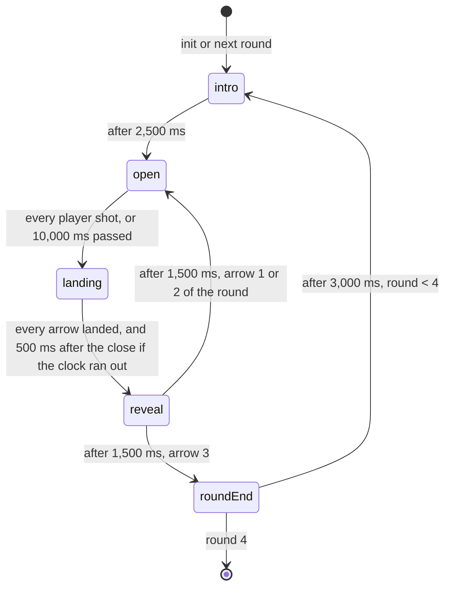

# Target Range 🎯

**Point your phone at the TV like a bow, pull down to draw, let go to shoot.**

Couchcade's first gyroscope game. Everyone stands on a sunny archery range and shoots at the same target at the same time. The phone is the bow: move it to aim, pull a thumb down the screen to draw, let go to loose the arrow. Wind and distance change as the match goes on. A match is 12 arrows and lasts about 2 minutes.

**For the owner.** Read [At a glance](#at-a-glance) and [Owner decisions](#owner-decisions-2026-09-17). That takes about 5 minutes.

**For agents.** Everything below is binding for CC-11.2 to CC-11.7. [platform.md](../architecture/platform.md), [motion.md](../architecture/motion.md), [session-flow.md](../architecture/session-flow.md), [HOUSE_STYLE.md](../HOUSE_STYLE.md) and [platform-screens.md](../design/platform-screens.md) still apply. Where this spec and a story disagree, stop and flag it.

Status: approved by the owner on 2026-09-17 (CC-11.1), with the four decisions below. Amended by CC-3.14 for the real-time link (docs/architecture/realtime-link.md, approved by the owner on 17 September 2026): aim speed, sending, playback delay and the budget check.

---

## Contents

- [At a glance](#at-a-glance)
- [Owner decisions](#owner-decisions-2026-09-17)
- [Inspiration](#inspiration)
- [Rules and scoring](#rules-and-scoring)
- [Round flow and timings](#round-flow-and-timings)
- [Arrow flight](#arrow-flight)
- [Phone controller](#phone-controller)
- [Input message schema](#input-message-schema)
- [TV scene](#tv-scene)
- [Fairness](#fairness)
- [Edge cases](#edge-cases)
- [Budget check](#budget-check)
- [Platform modules reused](#platform-modules-reused)
- [Scene palette: range](#scene-palette-range)
- [CC0 asset shortlist](#cc0-asset-shortlist)
- [Found while writing this spec](#found-while-writing-this-spec)

---

## At a glance

| | |
|---|---|
| Pitch | A sunny village archery range. One straw target, up to 8 archers, one shared wind flag. Aim with the phone, pull down, let go, and watch your arrow land. |
| Players | 1 to 8. Everyone shoots at once, so nobody waits for a turn. One player can play alone for a high score. |
| Phone | Hold it like a remote with the top edge pointing at the TV. Touch the big button and pull your thumb down to draw. Move the phone to aim. Let go to shoot. Phones without a gyroscope, or players who pick touch, drag a pad to aim instead. |
| TV | A 480×270 range seen from behind the shooting line: a target on a hay bale, a wind flag, a crosshair per player in their colour and shape, and arrows that stay in the target for the round. |
| Match | 4 rounds of 3 arrows: near, middle, far, then far with gusty wind. Each arrow is a volley: everyone gets 10 seconds to shoot it. |
| Scoring | Rings score 10 in the gold centre down to 1 at the white edge, and 0 for a miss. Highest total after 12 arrows wins. Ties go to the player with more 10s. |
| Skill | Arrows drop and drift with the wind, more at a distance and more with a weak draw. Full power comes at a firm pull. Pulling further adds nothing. |
| Fairness | A shot uses where the phone pointed at the moment of release, not where the crosshair on the TV had got to. Targets don't move, so TV lag and Wi-Fi speed never change a score. |
| Cost | About 1,300 requests for a typical 8-player match on the relay path (never more than 4 messages per second per phone), 0 on the direct link (docs/architecture/realtime-link.md). About 0.25 `controller:state` messages per second from the TV. |
| Assets | CC0 packs from Kenney and OpenGameArt, recoloured to a new `range` palette. The target, wind flag, bow and arrows are drawn from scratch. |

## Owner decisions (2026-09-17)

The owner approved the spec and took the recommendation on all four open questions.

1. **Everyone shoots each arrow together.** Each arrow is a volley that lasts up to 10 seconds and ends early once everyone has shot. Wind is the same for everyone, and the TV reveals all the arrows together. Free fire, with 3 arrows at your own pace in a 30-second round, was rejected. It would bring arrows landing at random moments, no wind change per arrow, and slow players feeling rushed.
2. **Static targets for now.** A hit depends only on the phone's aim, so TV lag and the crosshair's playback delay never change a score. No rewind and no lag calibration are needed. A sliding target is revisited after the playtest (CC-11.7) as a follow-up story. It would be judged at `atMs − displayLagMs − delay`, `delay` being the playback delay from [Fairness](#fairness) rule 1 (amended by CC-3.14; the number here was 250 ms before the real-time link).
3. **The crosshair shows where the phone points.** Players allow for drop and wind themselves and learn from the arrows that stay in the target. Round 1 has no wind and little drop, so first-timers still land arrows. A crosshair that shows the landing point was rejected, because wind and draw power would stop mattering.
4. **No hidden bonus target for now.** Scoring stays one simple rule, and nothing small competes with 8 crosshairs. Whether rounds feel samey is decided after the playtest.

---

## Inspiration

Target Range copies how these games play, not their names, characters or art.

| Game | What we take from it | Source |
|---|---|---|
| Wii Sports Resort, "Archery" (Nintendo, 2009) | The whole shape of a match: 4 targets at growing distances, 3 arrows each, rings from 10 down to 1, so a perfect match is 120. Arrows drop over distance, and wind is the only other force, shown as an arrow and a number. The remote is held upright as the bow and turned to aim. Holding a button recentres the aim, so any grip works. Pulling back the Nunchuk draws and letting go of Z shoots. | [StrategyWiki](https://strategywiki.org/wiki/Wii_Sports_Resort/Archery), [Wikipedia](https://en.wikipedia.org/wiki/Wii_Sports_Resort) |
| *Sports Champions*, "Archery" (Sony, PlayStation Move, 2010) | Draw by pulling back, fire by letting go, and a longer pull sends the arrow further. | [Wikipedia](https://en.wikipedia.org/wiki/Sports_Champions) |
| *Wii Play*, "Shooting Range" (Nintendo, 2006) | A 2-player versus mode where both players point at the same screen, and a second player can drop in to help. | [Wikipedia](https://en.wikipedia.org/wiki/Wii_Play) |
| *Nintendo Land*, "Zelda: Battle Quest" (Nintendo, 2012) | The archer aims by lifting and turning a handheld screen, the closest console precedent for aiming with a phone. | [Wikipedia](https://en.wikipedia.org/wiki/Nintendo_Land) |
| Olympic target archery | The 10-ring face in five colour bands (white, black, blue, red, gold) and breaking ties by counting the best hits. | [Wikipedia: Target archery](https://en.wikipedia.org/wiki/Target_archery) |

What we don't take from Wii Sports Resort, and why:

- **Moving targets and blocking boards.** Its Intermediate and Expert courses slide targets along a rope and put boards in front of them. Moving targets make TV lag matter. See [owner decision 2](#owner-decisions-2026-09-17).
- **The shrinking focus circle.** A circle shrinks while the player holds the draw, blinks with a chime when it's smallest, then grows and fades. With 8 crosshairs at once, 8 pulsing circles would bury the target. Our 10-second volley clock does the "don't hold forever" job.
- **Hidden bonus targets.** Each Resort area hides a far-away fruit or object worth 10 that uses up an arrow. See [owner decision 4](#owner-decisions-2026-09-17).
- **Turns.** Resort's archery is 1 to 4 players taking turns. We shoot all at once, so 8 players don't wait.

Research on controls and code:

- **Drag to draw.** Open-source browser archery games turn drag distance into power with a cap: [archery-master](https://github.com/bibhuticoder/archery-master) clamps power to 10–100 from the drag length and draws a power bar, and [ArcheryCanvasGame](https://github.com/rgliever/ArcheryCanvasGame) caps the pull at a circle's radius and adds a constant gravity each frame. The slingshot in [js_slingshot](https://github.com/pemmyz/js_slingshot) caps the pull at `maxPull` and sets a minimum speed. Target Range follows the same pattern: full power at a 150 px pull, and nothing below 0.3.
- **Wind.** [Bowman_3D](https://github.com/claytonnida/Bowman_3D) picks a random wind at the start, shows it with a weather vane, and applies it as a constant sideways push. Target Range does the same, per arrow, in closed form (see [Arrow flight](#arrow-flight)).
- **Phones as motion controllers.** AirConsole's API streams phone accelerometer and gyroscope readings to the screen at a set interval and warns that some browsers block sensors in iframes ([airconsole-api](https://github.com/AirConsole/airconsole-api)). Couchcade's own `@couchcade/motion` does the maths on the phone instead and sends aim samples through the input channel, packed only on the relay path (motion.md, docs/architecture/realtime-link.md).
- **Several pointers on one screen.** Super Mario Galaxy tells a second player's pointer apart by colour and size ([Super Mario Wiki](https://www.mariowiki.com/Star_Pointer)). The Game Accessibility Guidelines say never to use colour alone, and to add a symbol or shape ([guideline](https://gameaccessibilityguidelines.com/ensure-no-essential-information-is-conveyed-by-a-colour-alone/)). Every crosshair here carries the player's shape.

---

## Rules and scoring

1. **Players.** 1 to 8 seated players (`players: { min: 1, max: 8 }`). The game gets them at `init` and nobody joins mid-match.
2. **Match.** 4 rounds of 3 arrows, 12 arrows in total. The rounds are fixed:

   | Round | Name on the TV | Target radius | Wind | Drop at full draw |
   |---|---|---|---|---|
   | 1 | Near | 36 px | Calm, always 0 | 4 px |
   | 2 | Middle | 30 px | 0 to 2 | 8 px |
   | 3 | Far | 24 px | 1 to 3 | 14 px |
   | 4 | Far and gusty | 24 px | 2 to 4 | 14 px |

   Radii and drops are world pixels on the 480×270 TV world. Wind is a whole number, left or right.
3. **Target.** Each round the seeded RNG places the target centre at `x` 160 to 320, in steps of 2 px. `y` always reaches as far as 110 (the horizon), but how close to the couch it may land is capped by the round's radius, so the target's on-screen depth tracks the round's physics distance instead of rolling independently of it (CC-11.11): 110 to 160 for round 1 (radius 36), 110 to 152 for round 2 (radius 30), 110 to 144 for rounds 3 and 4 (radius 24). It stays there for the round's 3 arrows, so players can correct from their last arrow.
4. **Wind.** Before each arrow the seeded RNG picks the wind strength inside the round's range and a direction, left or right. A strength of 0 has no direction.
5. **Volley.** Each arrow is one volley. Every player may shoot one arrow while the volley is open: from the moment it opens until 10,000 ms later, or until every player has shot. See [Round flow](#round-flow-and-timings).
6. **Arrow score.** Where the arrow lands comes from [Arrow flight](#arrow-flight). With `d` the distance from the target centre and `R` the round's radius:

   | Result | When | Points |
   |---|---|---|
   | Ring `k` (1 to 10) | `d <= R × (11 − k) / 10`, taking the highest such `k` | `k` |
   | Miss | `d > R` | 0 |
   | Late | The shot's `atMs` is after the volley closed | 0 |
   | No arrow | No shot in the volley | 0 |

   The ring test compares squared distances, so no square roots and exact replays. A 10 is a "bullseye".
7. **Match end.** After arrow 12 lands, or when no seated players remain.
8. **Placements** (`outcome`). Sort by total points, most first. Break ties with the number of 10s, most first. Players still tied share a place. `score` is the points total, out of 120.
9. **Players leaving.** When a seat expires (`onPlayerLeft`), that player keeps their points and shoots no more arrows. Volleys stop waiting for them. The match goes on while at least 1 player is seated.

## Round flow and timings



| Phase | Length | TV | Phone |
|---|---|---|---|
| `intro` | 2,500 ms | Round chip lifts ("Round 2 · middle"), the target slides to its new spot, the flag shows the first wind. Bottom panel: "Point at the TV, pull down, let go" in round 1, the round name after that. | `tr-watch`. The draw button is off. |
| `open` | Up to 10,000 ms | Crosshairs appear for players who are aiming. Arrows fly the moment each player shoots. The bottom panel shows "Arrow 2 of 3" and the wind, for example "Wind 2 to the right". A clock counts down in whole seconds from 10, with a tick sound for the last 3. | `tr-shoot`: pull to draw, let go to shoot |
| `landing` | Until every arrow in the air has landed. When the clock ran out, also at least 500 ms after the close, for late messages. At most 1,121 ms, the slowest arrow. | Remaining arrows land. Crosshairs of players who didn't shoot disappear. | Still `tr-shoot`. A shot let go now reaches the host with `atMs` after the close and is `late`. |
| `reveal` | 1,500 ms | Each arrow's points pop on its scoreboard chip. A `BULLSEYE!` callout if anyone hit a 10. Bottom panel: the best arrow, for example "Noor hit a 9". | `tr-watch` with the arrow's result |
| `roundEnd` | 3,000 ms | Arrows are pulled from the target. Bottom panel: the leader, for example "Noor leads with 52". | `tr-watch` |

A volley takes about 7 seconds when players shoot within 5 seconds, and 12.6 seconds at most. A round takes about 27 seconds, 44 at most. A match takes about 110 seconds, just under 3 minutes at most.

---

## Arrow flight

The shot is decided the moment the host applies the `shoot` input. There's no physics engine and no simulation step. It's one closed formula, so `onPlayerInput` stores the arrow with its landing point and landing time, and `onTick` only marks it as landed.

Inputs: the shot's `aim` (`yaw`, `pitch`, −1 to 1, 2 decimals), `power` (0.3 to 1, 2 decimals), the round's constants and the volley's wind `w` (signed, right is positive).

| Step | Formula | Round 1 | Round 2 | Rounds 3 and 4 |
|---|---|---|---|---|
| Aim point | `aimX = 240 + yaw × 200`, `aimY = 140 − pitch × 90` | | | |
| Flight time at full draw, `baseMs` | constant | 350 ms | 500 ms | 650 ms |
| Flight time | `flightMs = round(baseMs / (0.4 + 0.6 × power))` | 350 to 603 ms | 500 to 862 ms | 650 to 1,121 ms |
| Stretch | `s = flightMs / baseMs` | | | |
| Drop (down) | `dropFull × s²` | 4 px at full draw | 8 px | 14 px |
| Wind drift (sideways) | `w × windPx × s` | none | `windPx` 3 px | `windPx` 4 px |
| Landing | `(aimX + drift, aimY + drop)`, rounded to 0.1 px | | | |

What that means for a player:

- **Full draw is best.** A weak draw at 30% makes the arrow fly 1.7 times longer, drop 3 times as far and drift 1.7 times as much. At full draw a far arrow drops 14 px, over half the target's radius, so players aim a little high.
- **Wind pushes across.** In round 4, wind 4 at full draw moves the arrow 16 px, two thirds of the radius.
- **The crosshair is where the phone points.** It doesn't show drop or wind. Arrows from earlier volleys stay in the target for the round, so each player sees how far off they were and corrects. See [owner decision 3](#owner-decisions-2026-09-17).
- Aim ranges use the game's own `aimPxPerDegree = 6` (`games/target-range/src/shared/constants.ts`), 6 world pixels per degree in both directions, not the `@couchcade/motion` defaults (owner decision, docs/architecture/realtime-link.md, "Tuning Target Range's aim speed"): ±33.3° of yaw is ±200 px and ±15° of pitch is ±90 px, so the near target's 10 ring (3.6 px) is 0.6° across. The touch pad matches at `padPxPerCssPx = 1.5` in both directions. The recorded-trace check against motion.md's [Manual check](../architecture/motion.md#test-layers) that set this value is CC-11.9's, not CC-11.3's.

The crosshair's home, where `yaw = 0` and `pitch = 0`, is (240, 140) in the world. A phone held still at full draw lands at (240, 140 + drop), plus wind. When the RNG puts the target centre within 6 px of that point, it rolls again, so nobody scores a 10 just by holding still.

---

## Phone controller

`needsMotion: true`. Before the match the platform runs the approved motion step (CC-5.10): "Tap to enable motion", one second of holding still, the Android portrait lock and the iPhone Portrait Orientation Lock hint, the wake lock and tap to resume. Phones that deny motion, have no gyroscope (capability `accelerometer` or `none`, owner decision 5 in motion.md), or pick "Use touch instead" get the touch controls. The TV marks those players with the touch icon from CC-5.10. The game treats both the same.

### Motion controls

- **Hold.** Portrait, top edge pointing at the TV, like a remote. One hand holds the phone. The other thumb works the draw button. The round 1 intro hint says "Hold on tight, point at the TV" (the space reminder from motion.md [Safety](../architecture/motion.md#safety)).
- **Draw.** The big action in the Hold state (Sunny, platform-screens.md). `pointerdown` on it starts a draw. At that moment the controller calls `aim.recentre(event.timeStamp)`, so the crosshair starts at its home and moves as the phone turns. It then resets the aim sender and sends the centre sample, so the crosshair shows on the TV even if the phone is perfectly still.
- **Power.** `power = clamp(pull / 150, 0, 1)`, where `pull` is how far the finger has moved down from where it touched, in CSS px, rounded to 2 decimals. Full power at 150 px, a firm pull. Pulling further adds nothing (owner decision 3 in motion.md, applied to the draw). The circle fills from the bottom as power grows and its label says "Full draw!" at 1.
- **Shoot.** `pointerup` with `power >= 0.3` sends `shoot` with `aim.aim()` at that instant and `power`, through `stream.fire(input, event.timeStamp)`. The phone switches to the shot state at once.
- **Lower.** `pointerup` below 0.3, or `pointercancel`, sends `lower`, so the TV hides the crosshair. The hint says "Pull further to shoot".
- **Aim stream.** Aim streams only while the finger is down: `createAimDetector()` fed by the pose tracker, into `createAimSender(stream)`, which sends one sample per call into the game's `InputChannel`. Over the direct link that's 30 samples a second, one per message; on the relay path the channel packs up to 8 of them into each of the at-most-4 messages a second. Nothing is sent while the phone is still (motion.md [Aim](../architecture/motion.md#aim-cc-55), docs/architecture/realtime-link.md).
- **Aim during a draw is the whole skill.** Pulling a thumb down tips the phone a little. Players learn to hold steady before letting go, like a real bow.

### Touch controls

- **Aim pad.** A pad above the big action. It works like a laptop touchpad (`createAimDrag`, 200 px across the whole yaw range, 150 px across pitch). A quiet "Centre" button under it calls `recentre()`. Aim streams while the pad is dragged or the draw button is held.
- **Draw and shoot** work exactly like motion: pull down on the big action, let go. The draw does not recentre touch aim, so a player can aim first, then draw.
- On `pointerdown` on the draw button or the pad, and whenever a volley opens, the controller resets the sender and sends the current aim, so the crosshair shows and no stale sample from an earlier volley goes out.
- CC-11.3 fits the pad, the Centre button and the circle without scrolling. The circle may shrink below 85% of the width in touch mode, but not below 200 px.

### Screens

| Screen | Big action | Status line | Hint | Cue |
|---|---|---|---|---|
| `tr-watch`, intro of round 1 | Chalk, "Watch the TV" | "Round 1 of 4 · near" | "Hold on tight, point at the TV" | none |
| `tr-watch`, intro of later rounds | Chalk, "Watch the TV" | "Round 3 of 4 · far" | "Aim a little high" | none |
| `tr-shoot` | Sunny, "Pull down to draw" | "Arrow 2 of 3" | "Last arrow: 9" (or "Point at the TV" for arrow 1) | `your-turn` on the first volley only |
| drawing (local) | Sunny, fills with power, "Draw…" then "Full draw!" | "Let go to shoot" | "Hold steady" | `press` at touch |
| too weak (local) | Sunny, "Pull down to draw" | "Pull further to shoot" | "Point at the TV" | none |
| shot (local) | Disabled, "—" | "Arrow away!" | "Watch the TV" | `press` |
| `tr-watch`, after a volley | Chalk, "Watch the TV" | "Bullseye!", "You scored 7", "Missed this time" or "Too late for that one" | "12 points so far" | `celebrate` on a 10 |
| `tr-shoot`, touch mode | as above, pad and Centre button above | as above | "Drag the pad to aim" | as above |

- Every line stays under 40 characters.
- The shot state is local and immediate. After `pointerup` the button is off until the next `tr-shoot`, so a player can't shoot twice.
- The host only sends views when they change: one `tr-shoot` batch when a volley opens, one `tr-watch` batch with every arrow's result when `reveal` starts (after the 500 ms wait, so late shots are known), and one when a round starts. If everyone shoots within 667 ms of the open, the host runtime merges the close into the next allowed send, as platform.md budget rule 5 says. Phones that already shot are on their local shot state anyway.
- View data (`TView`), kept well under 1 KB:

```ts
type TargetRangeView = {
  round: number;                 // 1 to 4
  arrow: number;                 // 1 to 3: the open arrow, or the one just shot
  volley: number;                // 1 to 12, echoed in shoot and lower
  points: number;                // the player's total
  last: number | "late" | "none" | null; // the last arrow's points (0 is a miss), null before the first
};
```

## Input message schema

Three input types, all through one `InputChannel` (docs/architecture/realtime-link.md). `aim` is a continuous value sent with `channel.stream`. `shoot` and `lower` are events sent with `channel.fire`, so they go before any waiting aim message.

```ts
import { z } from "zod/mini";

const unit = z.number().check(z.gte(-1), z.lte(1));
const volley = z.int().check(z.gte(1), z.lte(12));

export const inputSchema = z.discriminatedUnion("type", [
  // One aim sample, 3 decimals, from createAimSender. Packing into up to 8 samples per
  // message on the relay path is the InputChannel's job, not this schema's.
  z.object({
    type: z.literal("aim"),
    payload: z.object({ yaw: unit, pitch: unit }),
  }),
  // The aim the phone had at release, and the draw power.
  z.object({
    type: z.literal("shoot"),
    payload: z.object({
      volley,
      aim: z.object({ yaw: unit, pitch: unit }),
      power: z.number().check(z.gte(0.3), z.lte(1)),
    }),
  }),
  // The draw was let go too early or cancelled: hide the crosshair.
  z.object({ type: z.literal("lower"), payload: z.object({ volley }) }),
]);
export type TargetRangeInput = z.infer<typeof inputSchema>;
```

`aim` has no volley number because `createAimSender` sends `{ yaw, pitch }` only. The host ignores it outside `open`.

On the wire, with `at` added by the send helper and `from` by the relay:

```text
{ "t": "input", "d": { "type": "shoot", "payload": { "volley": 5, "aim": { "yaw": -0.12, "pitch": 0.31 }, "power": 1 }, "at": 1789571234567 } }
{ "t": "input", "d": { "type": "aim", "payload": { "yaw": 0.13, "pitch": 0.22 }, "at": 1789571234567 } }
```

Both inputs are well under 150 bytes. That is well inside the 1 KB cap. On the relay path the channel packs several `aim` samples into one message before it reaches the room; that packed frame is still under 1 KB and within motion.md's 150-byte limit for an aim input.

What `onPlayerInput` does:

| Input | Accepted when | Effect |
|---|---|---|
| `aim` | Phase `open`, and the player hasn't shot this volley | `addAimSamples` into the player's aim track in `TState`. The crosshair is visible from the first accepted sample. |
| `shoot` | Phase `open` or `landing`, `payload.volley` is the current volley, the player hasn't shot, and `ctx.atMs` is at or after the volley opened | If `ctx.atMs` is at or before the close, the arrow flies (see [Arrow flight](#arrow-flight)). Otherwise the result is `late`. The crosshair hides either way. |
| `lower` | Phase `open`, `payload.volley` is the current volley | Hides the crosshair. The player may draw again. |

Anything else is ignored.

---

## TV scene

| | |
|---|---|
| World | 480×270, integer scaled. A mown grass range seen from just behind the shooting line, horizon at about y = 80. Hedges and trees at the far end, a low wooden fence down both sides. |
| Scene palette | `range`, a new palette. See [Scene palette: range](#scene-palette-range). |
| Target | A straw boss on a wooden stand with a painted face: 10 rings in 5 colour bands, white, black, blue, red and gold from the edge in. Drawn at the round's radius, so it looks smaller further away. |
| Wind flag | A flag on a pole next to the target. 4 strengths (limp, light, stiff, flapping), mirrored for direction, 3 frames each at 8 fps. |
| Players | World Pips stand in the two front corners of the range, 4 on the left and 4 on the right, just above the bottom panel, so the middle stays clear for arrows. The Pip spec has no back view, so they face the couch like a team photo, hold a bow and lift it when they shoot. An arrow flies from its Pip to the target. |
| Arrows | In flight: a 7×3 arrow sprite that shrinks along a shallow arc over `flightMs`. In the target: a 3×3 stub with the player's shape (9×9, `drawPlayerShape`) next to it, in their colour. Arrows from earlier volleys of the round show only the stub and a 3 px dot in the player's colour, so the newest arrows stand out. |
| Overlays | From `@couchcade/stage`: scoreboard with player chips and points, round counter chip, callouts, room code panel. The bottom instruction panel follows Quick Draw's game-local panel (CC-10.8) until the stage package has one. |
| Callouts | `BULLSEYE!` once per reveal when anyone hit a 10. No callout for a miss, so nobody is singled out. |
| Expressions | On `reveal`, Pips with a 9 or 10 look happy and Pips that missed look surprised. Everyone else is neutral. Nobody looks sad. |
| Motion | Arrows fly in smooth movement. Stuck arrows wobble 2 frames on landing. `BULLSEYE!` uses the `celebrate` token. Reduced motion: no wobble, no shake, the flag doesn't flap. |
| Sound | Music loop in `intro` and `roundEnd`, quieter during `open`. Draw creak when a crosshair first appears (at most one at a time), release twang per shot, thud per landing, a ding on a 10, clock ticks for the last 3 seconds, wind loop in rounds 2 to 4. Every sound has a visual cue: the crosshair, the flying arrow, the stub, the callout, the clock. |

### Readability with 8 crosshairs

Up to 8 players aim at one target at once. The rules that keep that readable from the couch:

1. **Only aiming players have a crosshair.** A crosshair shows from the player's first aim sample in a volley until they shoot, lower or the volley closes. Most of the time fewer than 8 are on screen.
2. **Ring plus shape.** A crosshair is a 15×15 ring, 1 px of the player's colour inside 1 px of Ink, with a 3 px gap in the middle so the target shows through. The player's shape (9×9, `drawPlayerShape`) sits at the ring's top right, touching it. At 1080p that's a 60 px ring and a 36 px shape, above the 24 px minimum.
3. **Colour is never the only cue.** Every crosshair and every stuck arrow carries the player's shape, as the house style requires.
4. **Stable stacking.** Crosshairs are always drawn in seat order, so overlapping ones never swap places. A crosshair never changes size or blinks, so movement is the only thing that draws the eye.
5. **Smooth, not jumpy.** The TV plays each player's aim back behind a playback delay (owner decision 2 in motion.md, amended by CC-3.14), so crosshairs glide instead of jumping: about 180 ms on the relay path, about 40 to 50 ms on the direct link (docs/architecture/realtime-link.md).
6. **Find yourself fast.** The first time a player's crosshair appears in a match, its shape pops once with the `ui` token (no pop with reduced motion).
7. **Clear space.** The target never sits under the scoreboard or the bottom panel. Its whole face stays between y = 60 and y = 210.

---

## Fairness

1. **The phone's aim decides.** `shoot` carries the aim the TV was shown at release, not a fresh reading (motion.md, "Fitting the input budget", rule 3; realtime-link.md, "The phone decides its own shot"). The crosshair on the TV trails the hand by the playback delay (about 180 ms on the relay path, about 40 to 50 ms on the direct link, docs/architecture/realtime-link.md) plus the TV's own lag, but the hit uses the phone's own aim. A player who holds still while releasing hits where the crosshair shows.
2. **Room clock, not arrival time.** The shot's `at` comes from the `pointerup` `event.timeStamp` through `toHostTime`. The host judges "shot before the close" on `ctx.atMs`, and waits 500 ms after the clock runs out for late messages, the most the platform lets `atMs` lag behind.
3. **TV lag doesn't matter here.** Targets don't move, so a hit doesn't depend on when the player saw something. Target Range ignores `ctx.displayLagMs` and doesn't mention calibration in its intro. If moving targets come later ([owner decision 2](#owner-decisions-2026-09-17)), the target's position is judged at `atMs − displayLagMs − delay`, `delay` being the same playback delay as rule 1, what the player saw when they let go.
4. **No rewind.** One player's arrow never affects another's, and nothing in the world moves, so there's nothing to rewind. Target Range doesn't use `withRewind` (CC-3.7).
5. **Same wind for everyone.** Wind is fixed for the whole volley, so shooting early or late in a volley changes nothing.
6. **Touch versus motion.** Dragging a pad is steadier than holding a phone in the air. For friends on a couch that's accepted, as motion.md says the touch fallback is fair. The playtest (CC-11.7) watches for it. If touch players win clearly, a follow-up can add a gentle sway to touch aim.
7. **Known limit.** Gyroscopes differ between phones, and yaw drifts slowly. Recentring at every draw keeps drift to the few seconds of one draw, which is too small to see.

## Edge cases

| Case | What happens |
|---|---|
| Phone locks or drops while aiming | No more aim samples arrive. The crosshair stays where it was until the volley closes, then the result is "no arrow". The seat is kept for 2 minutes. On rejoin the phone gets the current view and "Tap to resume" restarts the sensors. |
| Seat expires mid-match | `onPlayerLeft` keeps the player's points and volleys stop waiting for them. With no seated players left, the match ends with placements. |
| Late joiner | Gets a seat and waits on the platform `next-game` screen. They play from the next match. |
| Audience | Sees the platform `audience` screen and can't send input. |
| TV refresh or deploy mid-round | The round in progress is lost. `snapshot` stores `{ r, pts, tens, rng }` at each round end, about 120 bytes for 8 players. `restore` resumes at the next round's `intro`. |
| Shot released just as the clock hits 0 | Counts if `atMs` is at or before the close. It still arrives within the 500 ms wait. |
| `shoot` from the previous volley arrives late | Dropped, because `payload.volley` doesn't match. |
| Phone still on `tr-shoot` after the volley closed | Its shot reaches the host with `atMs` after the close, so it's `late`. The `tr-watch` sent at `reveal` says "Too late for that one". |
| Phone not clock-synced yet | The controller keeps the draw button off until the clock module has a sample, as Quick Draw does. |
| Motion stops mid-match (no samples for 2 s) | CC-5.10 switches the player to touch for the rest of the game. The next draw uses the pad. |
| Page rotates on an iPhone without orientation lock | Motion maths uses the device frame, so aim keeps working (motion.md flow rule 8). The draw button stays centred. |
| Two fingers on the draw button | Only the first `pointerdown` counts until its `pointerup`. |
| Everyone misses | No points for anyone. Bottom panel: "Tricky wind, that one". |
| 1 player | The same match. Results show their score out of 120. |

---

## Budget check

Caps from [platform.md](../architecture/platform.md#the-caps): phones at most 4 messages per second on the relay path, host `controller:state` at most 1.5 per second. Every message that reaches the room costs 1 request. **These numbers are the relay-path worst case,** the one the budget must fit even if every phone's direct link fails. A seated phone whose direct WebRTC link is up (docs/architecture/realtime-link.md) streams `aim` at up to 60 a second instead, and none of it reaches the room or costs a request.

**Per volley, per phone.** A player watches the wind for a moment, then holds the draw button for about 3 seconds while aiming. A hand-held phone moves more than 0.01 all the time, so the aim sender runs at the stream cap: 3 s × 4 = 12 `aim` messages, plus 1 `shoot`. That's 13. At most, a player holds the draw for the whole 10 s window: the stream cap allows 10 × 4 = 40 messages, the shot included.

| Per match, 8 players, 12 volleys | Typical | At most |
|---|---|---|
| Phone input: 8 phones × 12 volleys × 13 or 40 | 1,248 | 3,840 |
| `controller:state`: 2 per volley (open, close) + 1 per round intro = 24 + 4 | 28 | 28 |
| `room:snapshot`: 1 at the start, 1 per round end | 5 | 5 |
| `room:phase` in and out | 2 | 2 |
| **Total** | **about 1,300 in about 110 s** | **about 3,900 in about 175 s** |

| Check | Target Range | Cap | Fits |
|---|---|---|---|
| Messages per phone | At most 4 per second while drawing, 0 otherwise. A typical match averages 12 × 13 / 110 s = 1.4 per second. | 4 per second | Yes. The input stream enforces it. |
| Host `controller:state` | 28 per match, about 0.25 per second. The host runtime spaces them at least 667 ms apart. | 1.5 per second, 667 ms apart | Yes |
| One hour of only Target Range, 8 players, typical | 3,600 s / 110 s ≈ 32 matches, say 30 with menus. 30 × 1,300 = about 39,000 | platform.md: 8 phones in real-time games the whole hour, about 123,000 | Yes, about a third |
| One hour, 8 players, everyone always holds the full 10 s | 3,600 s / 175 s ≈ 21 matches. 21 × 3,900 = about 82,000 | about 123,000 | Yes |

Target Range is a real-time game in the platform's plan: `realtime: true`, `onTick` drives the phases and aim streams. It stays inside the design night's 30% real-time share because it never exceeds the phone cap, and it usually uses a third of it, since aim only streams while a finger is on the draw button.

---

## Platform modules reused

Target Range adds no new platform code. Anything missing below belongs to the owning story, not to this game.

| Module | Used for | Story |
|---|---|---|
| `@couchcade/game-sdk/contract` | `defineGame`, `defineController`, `InputContext.atMs`, `outcome`, `snapshot`/`restore`, `onPlayerLeft` | CC-1.13 |
| `@couchcade/game-sdk/clock` | `toHostTime` inside `send`, the synced check before the draw button turns on | CC-1.14 |
| `@couchcade/game-sdk/input` | One `InputChannel` per phone (`aim` with `stream`, `shoot` and `lower` with `fire`), and `createPlayback` on the host for the crosshair, at the relay or direct playback delay per player (docs/architecture/realtime-link.md) | CC-3.6, CC-3.17, CC-3.18 |
| `@couchcade/game-sdk/testing` | `testGameContract`, `createFakeRoom`, `replay` with one recorded match | CC-1.13 |
| `@couchcade/motion/calibration` | `createPoseTracker` from the calibration the motion step took | CC-5.3 |
| `@couchcade/motion/gestures` | `createAimDetector` (defaults ±25° and ±15°, `recentre` at every draw), `createAimSender` | CC-5.5 |
| `@couchcade/motion/fallbacks` | `createAimDrag` for the touch pad and its Centre button | CC-5.5 |
| Controller motion step | Permission, calibration, `motion:status`, touch icon, wake lock, tap to resume, portrait lock and iPhone hint, fake adapter for E2E | CC-5.2, CC-5.10, CC-1.17 |
| `@couchcade/utils` | `createRng(seed)` for target spots and wind | CC-1.7 |
| `@couchcade/protocol` | `PlayerInfo`, `ControllerView`, `JsonValue` types | CC-1.8 |
| `@couchcade/ui` | Big action (Hold, Waiting and Disabled states), quiet button, player chip, `press` haptic | CC-4.4, CC-7.5 |
| `@couchcade/stage` | `StageScene`, scoreboard, callouts, room code panel, `drawPlayerShape`, World Pips | CC-4.6, CC-6.4 |
| `@couchcade/audio` | `celebrate` and `your-turn` tokens, music ducking | CC-7.2 |
| `@couchcade/theme` | `range` scene palette, motion tokens | CC-4.2, CC-11.5 |
| Rewind (`withRewind`) | Not used. See [Fairness](#fairness) rule 4. | CC-3.7 |
| TV lag (`displayLagMs`) | Not used. See [Fairness](#fairness) rule 3. | CC-3.8 |
| `@couchcade/physics` | Not used. Arrow flight is one formula. | |

---

## Scene palette: range

`range` doesn't exist yet. `packages/theme/src/scenes/` has `alley`, `desert` and `track`. CC-11.5 adds `packages/theme/src/scenes/target-range.ts`:

```ts
import type { ScenePalette } from "../tokens.ts";

/** Target Range: a mown village range with straw targets and a hedge. */
export default {
  id: "range",
  colors: ["#7FD08A", "#23805A", "#B8743F", "#F2D27A", "#E2725B"],
} satisfies ScenePalette;
```

| Colour | Hex | Used for |
|---|---|---|
| Mown grass | `#7FD08A` | Light stripes on the range, next to core Turf |
| Hedge | `#23805A` | Hedges, tree shade, far grass |
| Wood | `#B8743F` | Target stand, fence, bows, arrow shafts. Same hex as `alley`. |
| Straw | `#F2D27A` | Hay bale behind the target |
| Target red | `#E2725B` | The red ring band. Kept apart from core Signal, which carries "stop". |

The target's other bands use core colours: Chalk (white), Ink (black), Sky (blue) and Sunny (gold). With the 6 core colours that's 11 of the 16 allowed. Player colours only appear through `@couchcade/stage` drawing (crosshairs, arrow shapes) and World Pips, never in the game's own sprites, like Quick Draw's Pips. Adding a colour needs review.

---

## CC0 asset shortlist

Every sprite is recoloured with `pnpm assets:recolour <input> range` and credited in `games/target-range/CREDITS.md` (CC-11.5). The CC0 deed: [creativecommons.org/publicdomain/zero/1.0](https://creativecommons.org/publicdomain/zero/1.0/). Each licence below was checked on 17 September 2026, on its source page and, for Kenney packs, in the `License.txt` inside the download. The contents were checked in the downloads too.

| Need | Candidate | Author | Licence |
|---|---|---|---|
| Grass tiles, round and pine trees, bushes, wooden fence (16×16 pixel tiles) | [Tiny Town](https://kenney.nl/assets/tiny-town) (132 tiles) | Kenney | [CC0](https://kenney.nl/assets/tiny-town) |
| Draw creak (bow string under tension) | [RPG Audio](https://kenney.nl/assets/rpg-audio) `creak1` to `creak3` (50 files) | Kenney | [CC0](https://kenney.nl/assets/rpg-audio) |
| Release twang, arrow whoosh | [Battle Sound Effects](https://opengameart.org/content/battle-sound-effects) `Bow.wav`, `swish_2` to `swish_4` (4 files, 340 KB) | artisticdude | [CC0](https://opengameart.org/content/battle-sound-effects). The page also offers CC-BY, CC-BY-SA and GPL. We take it under CC0 and credit it that way. |
| Arrow thud into straw, arrow into the fence | [Impact Sounds](https://kenney.nl/assets/impact-sounds) `impactSoft_heavy_*`, `impactPlank_medium_*` (130 files) | Kenney | [CC0](https://kenney.nl/assets/impact-sounds) |
| Clock tick for the last 3 seconds, bullseye ding | [Interface Sounds](https://kenney.nl/assets/interface-sounds) `tick_001`, `bong_001` or `glass_001` (100 files). Quick Draw already ships `tick_001` and `bong_001`. | Kenney | [CC0](https://kenney.nl/assets/interface-sounds) |
| Round start and match end jingles | [Music Jingles](https://kenney.nl/assets/music-jingles) (85 files) | Kenney | [CC0](https://kenney.nl/assets/music-jingles) |
| Wind loop in rounds 2 to 4 | [Wind Whoosh Loop](https://opengameart.org/content/wind-whoosh-loop), already in Quick Draw | SketchMan3 | [CC0](https://opengameart.org/content/wind-whoosh-loop) |
| Game music loop | [Summer Park, 8-bit tune (loop)](https://opengameart.org/content/summer-park-8bit-tune-loop): happy chiptune, made to loop, 850 KB OGG | Scribe (Daniel Stephens) | [CC0](https://opengameart.org/content/summer-park-8bit-tune-loop) |
| Music backup | [Happy Adventure (Loop)](https://opengameart.org/content/happy-adventure-loop): light chiptune, 637 KB MP3. The MP3's silent start needs trimming before it loops cleanly. | TinyWorlds | [CC0](https://opengameart.org/content/happy-adventure-loop) |

Drawn from scratch (small, no CC0 source needed): the target face in 3 sizes, the straw boss and wooden stand, the wind flag (4 strengths × 3 frames), the bow a Pip holds, the flying arrow (7×3), the stuck arrow stub (3×3) and the hay bale. None of the CC0 pixel packs we checked has a ring target or a bow that reads well at this size.

For CC-11.5, from Quick Draw's experience (CC-10.5 found Chiploop too big to ship): check that the music loop is 110 to 130 BPM and trim it to one short loop before it goes in the TV bundle.

Rejected:

- Kenney [Shooting Gallery](https://kenney.nl/assets/shooting-gallery) (CC0). It has ring targets, wooden sticks, grass and trees, but they're smooth 128×128 art, not pixel art, and would look wrong at 480×270.
- Kenney [Crosshair Pack](https://kenney.nl/assets/crosshair-pack) (CC0). 64×64 smooth art. Crosshairs are drawn with player shapes instead.
- Kenney [Pixel Platformer](https://kenney.nl/assets/pixel-platformer) (CC0). It has a flag and grass, but on an 18×18 grid, which doesn't fit the 16 px world grid the style check wants.
- Kenney [Tiny Dungeon](https://kenney.nl/assets/tiny-dungeon) (CC0). No readable bow among its weapons at 16 px.
- OpenGameArt [Loading Screen Loop](https://opengameart.org/content/loading-screen-loop) and [Menu Music](https://opengameart.org/content/menu-music) (both CC0). Dark or ambient in mood, and 4 to 8 MB WAV files.

---

## Found while writing this spec

None of these changes an approved decision.

| # | Where | Finding | Action |
|---|---|---|---|
| 1 | HOUSE_STYLE.md, Scene palettes | The table has no Range row, and CC-11.5's References only list the theme file | Add the row in CC-11.5 (amend its References) once this spec is approved |
| 2 | `@couchcade/stage` | No bottom instruction panel yet. Quick Draw built a game-local one (CC-10.8). | CC-11.4 follows Quick Draw's pattern. A shared panel belongs in a stage story, not this game. |
| 3 | CC-6.4 World Pips | Still To Do. Quick Draw draws its Pips from a game-local `world-pip.ts`. | CC-11.4 does the same until CC-6.4 lands |
| 4 | Aim range | The `@couchcade/motion` defaults (±25° yaw, ±15° pitch) set how hard a 10 is. Superseded: the owner decided a uniform `aimPxPerDegree = 6` (±33.3° yaw, ±15° pitch) in docs/architecture/realtime-link.md, "Tuning Target Range's aim speed" | Checked against a real aim trace (motion.md manual check) and set by CC-11.9 |
